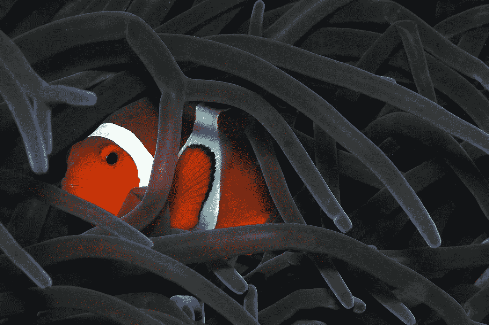
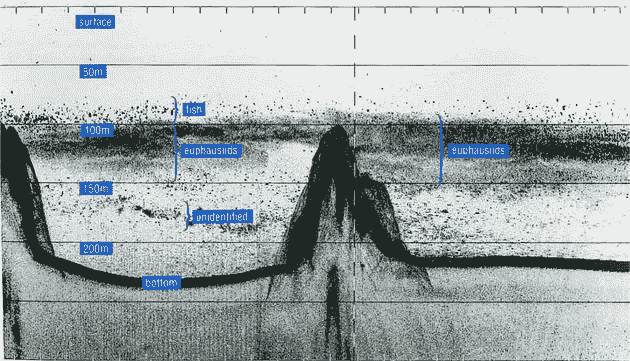

# 奇迹每天都在发生:海洋迁徙

> 原文：<https://medium.datadriveninvestor.com/miracle-happens-everyday-the-marine-migrations-2c762874a861?source=collection_archive---------11----------------------->

## 每天晚上，当太阳落到地平线后，一股生命的浪潮从深海中涌起。这里有比米粒还小的甲壳类动物、透明的水母和血红色的鱿鱼，还有在黑暗中发光的大型灯笼鱼群

Photo by [Pascal van de Vendel](https://unsplash.com/@pascalvendel?utm_source=unsplash&utm_medium=referral&utm_content=creditCopyText) on [Unsplash](https://unsplash.com/s/photos/hd-fish?utm_source=unsplash&utm_medium=referral&utm_content=creditCopyText)

他们来自寒冷的深海，对[浮游生物极其贪婪。而且，它们的时间表非常紧凑，因为当太阳再次照耀在海面上时，所有这些生物都必须再次回到黑暗中，以避免被白天在海上漫游的捕食者吞噬。](https://en.wikipedia.org/wiki/Plankton#:~:text=Plankton%20are%20the%20diverse%20collection,constituting%20plankton%20are%20called%20plankters.)

这种在光明与黑暗、温暖与寒冷、捕食者与猎物之间的“舞蹈”被称为“diel 垂直迁移”(DVM)。这被认为是地球上最大的动物运动。无论是塞伦盖蒂草原上的角马，还是北美大陆上迁徙的帝王蝶，抑或是穿越南极大陆越南的企鹅，它们都无法与每天全球同步的海洋生物大迁徙相提并论。

**当然**，大多数人仍然对这种迁徙知之甚少，尽管 DVM 在从深海吸收碳和增肥我们所吃的鱼方面发挥了巨大作用。

美国北卡罗来纳大学阿什维尔分校的海洋生物学家丽贝卡·赫尔姆(Rebecca Helm)说:“ ***当你想到一种生活在开阔海洋中的动物时，它很可能会经历某种形式的*** *垂直迁徙。*

尽管海洋生物昼夜垂直迁移模型的细节可能很复杂，并且会因物种和位置而异，但一只[桡足类动物](https://en.wikipedia.org/wiki/Copepod)可能只会移动几米，而一只凝胶状海鞘可能会移动近**1000**米。然而，这种迁移的基础似乎相当简单——主要是关于阳光和食物。

在一整天中，阳光一直为海洋顶部的微小藻类——浮游植物——提供能量基础。虽然这些生物很小，但它们数量众多，构成了食物链的基础。

它们滋养了无数的生命形式，从小到几毫米的蟹幼体到汽车大小的鲸鲨。问题是，为了维持维持生命的光合作用，浮游植物必须停留在水面 200 米以内，因为这是阳光可以穿透的最长距离。

> 丽贝卡·赫尔姆说。“你可以想想海洋的整个深度，你可以发现这层光合作用就像苹果的皮——太薄了”，“所以，为了在富饶的地区充分利用这一点，海洋中的生物必须迁徙到这里来收集所有的食物”。

**我们很难**直观地了解有多少动物参与了这种日常迁徙，但我们可以这样来思考。在第二次世界大战期间，当科学家首次尝试水下声纳探测德国 U 型潜艇时，海军的回声探测器一直显示在海面下大约 120 米至 180 米之间有一个“**固体层**。

> **起初，科学家推断声纳已经探测到海底**

但问题来了。这个**海床**一直在移动，晚上变浅，白天变深。随着时间的推移，科学家们发现他们看到的是一个“**假海床**”。这个密集的**固体层**实际上是由密密麻麻的大群虾、鱿鱼、管水母组成。

Echo detection image was taken in Saanich Bay, British Columbia, Canada. Krill is a small shrimp-like crustacean whose population forms a thick layer that looks almost like a solid seabed

> **更重要的是**

科学家发现这些生命的聚集是如此的有规律和可预测。最终，声纳研究人员将这种现象命名为“深海散射层”，这是一种生物密集的水平区域，可以散射或反射声波。这种散射层如此之厚，以至于对于敌方潜艇能否隐藏还存在一些争论。

丽贝卡·赫尔姆说

“很多科学研究都是由军方人员推动的，他们的思维是，我们必须弄清楚到底是怎么回事！，“如果不是战争时期的这些水下，我们可能都不知道这个奇怪的神秘层是什么”。

自第二次世界大战以来，科学家们掌握了大量关于海洋的知识，每一项发现都描绘了一幅更加复杂的海洋生物图景。

比如昼夜垂直迁移虽然主要是生物现象，但也受物理的影响。

**英国普利茅斯大学物理海洋学家 Philip Hosegood** 表示，浮游植物能够进行光合作用的最大深度是由水的清澈度等因素决定的。

水的透明度由一系列其他变量决定，如水温、风速、潮汐、洋流、盐度和光线。

**霍斯古德说，**

“海洋是一个三维空间”，“当然，事实上，它是四维的，因为它不仅水平和垂直变化，而且随着时间的推移而变化。”

如果对流体动力学有所了解，可以对微生物迁移的距离有更深入的了解。水獭、章鱼，甚至人类都可以在阻力相对较低的水中滑行，但是生物的体型越小，就越难克服水的天然粘性(**这就是蚂蚁被困在水面上的原因，而我们可以在水池里自由**、**游泳的原因，这一切都是由于雷诺数的差异**)。

对于颗粒大小的浮游动物来说，在水中游泳就像一个人在糖蜜中划水——而这些生物每天都要在 100 多米深的海水中来回跋涉！

尽管浮游生物生长的地方存在某种形式的昼夜垂直迁移，但仍有许多未解之谜。

例如，许多动物以昼夜相反的方向垂直移动，它们白天迁徙到有阳光的地方，晚上离开时离开水。

> **即使在一个物种内部，迁徙行为也会因地点不同而发生变化**

**美国斯坦福大学鲨鱼研究员 Sammy Andrzejczak** 于 2019 年合作发表了一篇关于大型鱼类垂直运动的综述。“珊瑚礁幽灵蝠鲼可以进行正常的昼夜垂直洄游。

 [## 解决美国问题可能很容易|数据驱动的投资者

### 美国人在选举中出现了比以前更大的分歧。民主党和共和党都声称对方…

www.datadriveninvestor.com](https://www.datadriveninvestor.com/2020/11/19/fixing-american-problems-could-be-easy/) 

例如，在查戈斯群岛这样的地方，它们白天游得深，晚上游得浅。但是在某些领域，他们的行为却相反。例如在红海和塞舌尔。"

昼夜垂直迁徙不仅对蝠鲼等滤食性动物很重要，对食物链各个层次的动物也很重要。

> 大鱼吃小鱼，小鱼吃虾米，虾米吃浮游动物

动物越大，捕食它的捕食者就越大。Anjay Zach 的团队主要研究一些鲨鱼物种如何利用横向迁徙捕食日夜垂直迁徙的鱼类，尤其是金枪鱼。

**伦敦动物学会的海洋生物学家、安杰伊·扎克的同事大卫·科尼克**说:“镰鲨似乎白天待在海山附近，晚上出去觅食。”

这意味着海洋动物不仅会上下迁徙，还会横向迁徙，从相对安全的区域迁徙到生产力更高的区域。

也许最有趣的一点是，在海洋表面的这一薄层中发生的事情会对上面和下面的世界产生影响。

**丽贝卡·赫尔姆**说，当所有这些微小的浮游植物在表面进行光合作用时，它们会消耗大量的二氧化碳，当它们被吃掉时，这些碳会被带到深海。

> **事实上，科学家在 2019 年创建了一个模型，以确定有多少碳通过昼夜垂直迁移沉积到深海中**

他们发现，这些鱿鱼、幼鱼和虾幼体每年可以将 1 皮克(**皮克，1 皮克= 10 ⁵克，或 10 亿吨**)的碳带到深海海底。

美国伍兹霍尔海洋研究所的生物海洋学家、这项研究的主要作者凯文·阿奇博尔德(Kevin Archibald)说，

"**美国道路上的所有车辆每年都会产生大约 1.5 皮克的碳。**“换句话说，海洋生物的昼夜垂直迁徙抵消了美国汽车总排放量的三分之二。

Photo by [David Clode](https://unsplash.com/@davidclode?utm_source=unsplash&utm_medium=referral&utm_content=creditCopyText) on [Unsplash](https://unsplash.com/collections/6874876/in-depth?utm_source=unsplash&utm_medium=referral&utm_content=creditCopyText)

> **阿奇博尔德说，昼夜垂直迁移仅占海洋捕获的总碳量的 16%**

其他起作用的因素包括自然的水运动、下沉的浮游植物细胞和海洋动物的粪便——这确实是海洋规模的巨大现象。

粪便的下沉也会受到昼夜垂直迁移的很大影响。昼夜垂直迁徙也加快了养分消化的速度。

有研究表明，昼夜垂直洄游向深海输送营养物质的速度比这些物质本身的下沉速度还要快。正是由于海洋生物昼夜垂直洄游，这些物质才能更快地到达深海，而不是无休止地漂流。

**昼夜垂直迁徙**也意味着很多从未接触过阳光的水下生物归根到底也要靠太阳。

其实我们和他们没多大区别。虽然我们在有生之年基本上无法目睹这些活动，但海洋生物的垂直迁徙不仅为我们提供了食物，而且在快速变化的地球气候中发挥着重要作用。

变化的气候也会影响昼夜垂直迁移，虽然影响的确切方式还不得而知。

较高的水温可能会减少热带海洋的昼夜垂直迁移活动，这些地区的活动不太活跃，而在两极等寒冷地区，昼夜垂直迁移活动将更大、更活跃。

还有很多不确定的问题，科学家们还需要进一步研究昼夜垂直迁移的机制。虽然大多数人只是知道这种现象的存在，但不得不说，我们还是应该对每天来回跋涉的海洋生物心存感激。

## 访问专家视图— [订阅 DDI 英特尔](https://datadriveninvestor.com/ddi-intel)