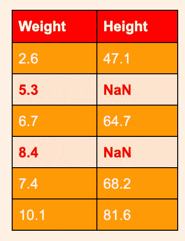
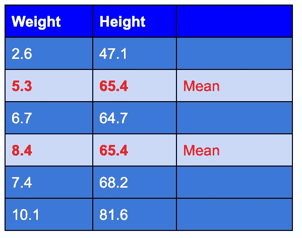
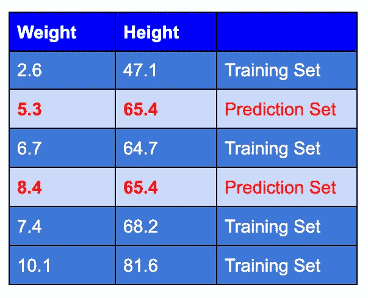
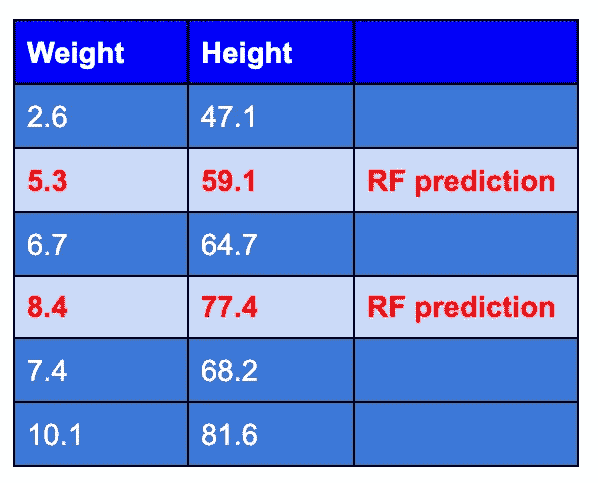
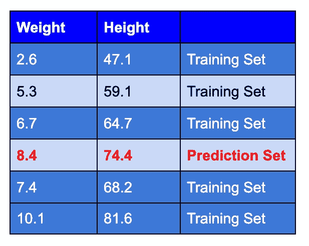
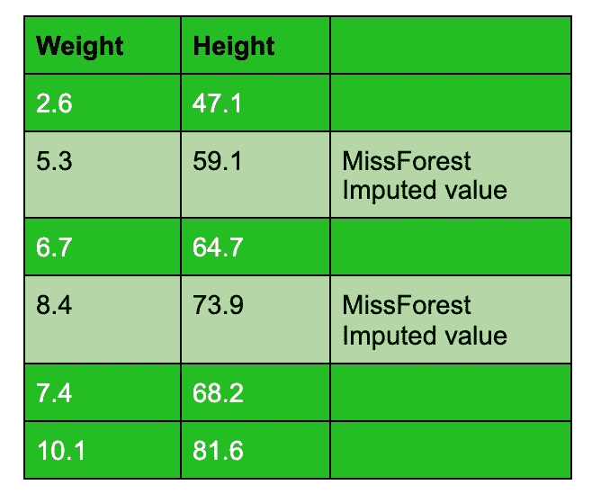

# 最佳估算方法之一。

> 原文：<https://medium.datadriveninvestor.com/missforest-one-of-the-best-imputational-methods-4a01170899c8?source=collection_archive---------3----------------------->

Photo by [Alvin Engler](https://unsplash.com/@englr?utm_source=medium&utm_medium=referral) on [Unsplash](https://unsplash.com?utm_source=medium&utm_medium=referral)

**缺失** **数据**在统计分析中非常常见，缺失值的插补是数据分析中非常重要的一步。用于分析大规模数据的许多算法通常需要没有任何缺失值的完全观察数据集。然而，这种情况很少发生，例如在医学研究领域。

因此，要处理缺失值，有很多方法，从简单的均值/中值/众数到更复杂的方法，如 KNN。那么我们选择的方法对最终结果有多大的影响呢？答案是非常多。

像均值/中值/众数插补这样的简单方法效果不好。这低估了我们数据中的方差，因为我们使许多值完全相同，而在现实生活中并非如此。

因此，如果我们采用标准插补方法，如 KNN、MICE 等，一些研究报告称，在所有这些方法中，MissForest 表现良好，MissForest 已被用作非参数插补方法的基准。在 Waljee 等人进行的一项比较研究中，发现当数据完全随机缺失时，与其他插补方法(包括 KNN 和 MICE)相比，MissForest 始终产生最低的插补误差(MCAR)。

# miss forest——它是如何工作的？

Missforest 是一种插补算法，它使用随机森林来完成这项任务。

出于研究目的，我们将获取一个简单的儿童数据集，其中包含体重(kg)和身高(cm)列。高度列中缺少值。我们将使用 MissForest 来估算数据集中缺失的值。

它的工作原理如下:

## **步骤 1-初始化:**

对于包含缺失值的变量，缺失值将替换为其平均值(对于连续变量)或其最常见的类别(对于分类变量)。

观察高度的平均值=(47.1+64.7+68.2+81.6)/4 =**65.4**

因此，65.4(平均值)将被替换为 height 列中出现的所有 NaN。

**第二步。** **插补**。对于每个变量，插补过程按 NaN 的升序顺序进行。根据变量在原始数据集中是被观察到还是缺失，数据集中的观察值被分为两部分。观察到的观察值用作训练集，缺失的观察值用作预测集。

训练集和预测集被送入随机森林模型。

这个 RF 模型被训练来根据体重预测身高。从 RF 模型中，我们得到生成的 RF 预测，然后填充这些预测来代替预测集，以产生转换的数据集。

第三步-停止。当所有缺失数据的变量都被插补后，一次插补迭代完成。插补继续进行多次迭代。

多次迭代的原因是，从迭代 2 开始，执行插补的随机森林将在质量越来越好的数据上被训练，模型使用其当前位置来进一步改进自身。

插补过程重复进行，直到当前和先前插补结果之间的相对平方差(或分类变量错误分类条目的比例)增加，MissForest 输出先前插补作为最终结果。

该模型在随后的迭代中决定调整预测或保持预测不变。在下表中，我们可以看到第二行(高度 59.1)被模型保持不变，但是第四行被再次保持为预测集。

完成训练和预测的迭代过程，直到满足停止标准，或者达到用户指定的最大迭代次数。一般来说，数据集在 4 到 5 次迭代后变得很好，这取决于缺失数据的大小和数量。因此，最大迭代次数被设置为默认值 10，以将计算时间限制在合理的水平。

## 优势:

1.它可以应用于数字和分类的混合数据类型。

2.不需要预处理(不需要标准化、规范化、缩放、数据拆分等)

3.对噪声数据具有鲁棒性，因为随机森林有效地具有内置的特征选择。

4.使用 OOB(袋外)误差估计，它评估插补的质量，而不需要费力的交叉验证。

## 缺点:

1.  如果数据集足够小，运行 MissForest 的成本可能会更高。

2.此外，它是一种算法，而不是模型对象，这意味着它必须在每次估算数据时运行，这在一些生产环境中可能会有问题。

## 结论:

能够有效地估算缺失数据对于当今处理真实世界数据的科学家来说非常重要。MissForest 是一种高度精确的缺失数据插补方法，优于 MICE 和 KNN 等其他方法。所以下次如果你在数据集中遇到缺失数据，试着使用 MissForest！

参考资料:

[1 . https://www . NCBI . NLM . NIH . gov/PMC/articles/PMC 3733317/](https://www.ncbi.nlm.nih.gov/pmc/articles/PMC3733317/)

[2 . https://academic . oup . com/生物信息学/article/28/1/112/219101](https://academic.oup.com/bioinformatics/article/28/1/112/219101)

[3 . https://www . NCBI . NLM . NIH . gov/PMC/articles/PMC 5796790/](https://www.ncbi.nlm.nih.gov/pmc/articles/PMC5796790/)

4 . https://bmcmedresmethodol . biomed central . com/articles/10.1186/s 12874-020-01080-1 # ref-CR4

*原载于 2020 年 12 月 20 日*[*【https://www.numpyninja.com】*](https://www.numpyninja.com/post/missforest-one-of-the-best-imputational-methods)*。*