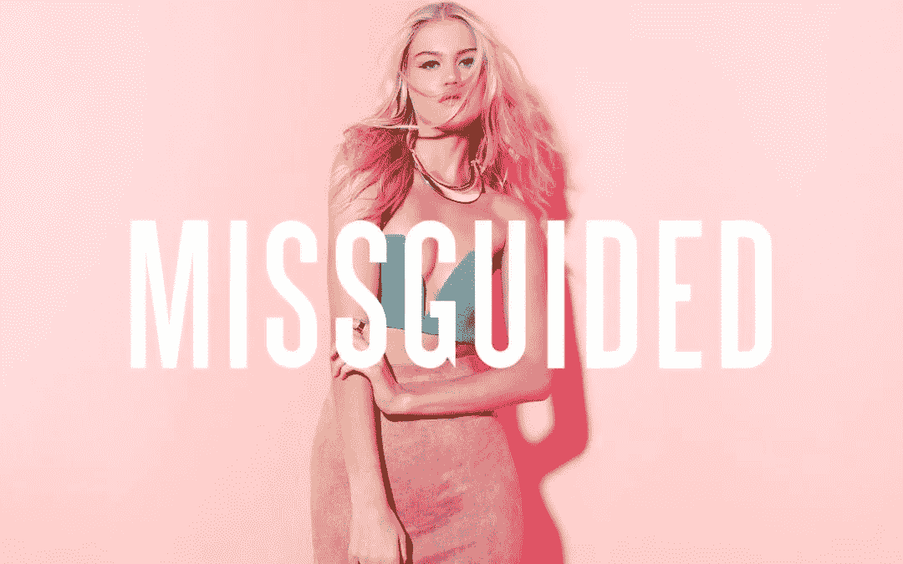

# Missguided 的 2600 万英镑损失是他们的收获

> 原文：<https://medium.datadriveninvestor.com/missguideds-26m-loss-was-a-learning-opportunity-44d1adc92e8f?source=collection_archive---------1----------------------->

## 误导几乎破产；他们没有轻易放弃

Image of Missguided Campaign. Source: Missguided

1996 年，Nitin Passi 创立了时尚品牌 miss guided——开始了一项价值 10 亿美元的业务，他们在 2018 年亏损了 2600 万英镑。是因为快时尚市场的饱和还是糟糕的财务决策差点让他们的公司破产？他是决定做点什么，还是就此永远退出？

对于那些不熟悉这个品牌的人来说，Missguided 是一家总部位于英国的多渠道服装零售商。Missguided 曾估值 7 亿(2017)。

Missguided 总部位于英国曼彻斯特索尔福德。它是时尚巨人的家，像漂亮的小东西，BooHoo，Inthestyle，我第一次看到它。他们生产和分销一系列时装、高级定制服装，并在他们的网站上独家销售。自从开业以来，它们目前是快时尚行业的知名品牌之一，有名人代言和社交媒体影响者接管快时尚行业。

嗯，在看了《内部误导》纪录片后，我对误导有了很多了解；他们的成功，他们面临的挑战，以及他们财务损失的影响。但是从他们的损失中，他们得到了什么好处吗？他们希望带来一位社交媒体影响者，帮助他们重返时尚市场版图。

他们现在使用什么策略来帮助他们摆脱损失？他们是这样做的:

## 1.管理成本和优先级

对于 Missguided:他们必须“削减成本，控制业务，把一切都投入到业务中”——miss guided 的首席商务官史蒂文。

Sam，品牌营销经理——推介会议——他们希望拥有 love Islander——每月支付她 2 万英镑，他们正在关注她的 Instagram，她的浏览量超过 40 万，他们向她提供 35 万英镑和 Missguided 的 2 英镑收藏交易(统计数据在 Missguided 内部纪录片中提到)。这笔交易可能是 Missguided 的成败，因为在 2018 年，他们损失了 2600 万英镑，他们的业务几乎不再。

Jordan Lipscombe 系列需要在社交媒体上推广，以便对交易产生最大影响。拥有高科技分析意味着维多利亚可以监控系列的成功或失败。

Jordan lips combe miss guided Collection 收到了 10.5 万份订单(每小时总计)，平均售价为 17.03 英镑，总销售额约为 53.22 万英镑，销售利润率为 56.41%。——来自《误导:曼彻斯特制造》纪录片内部的统计数据

 [## 抓住智能营销，获得巨大成果|数据驱动的投资者

### 网上的人都看过。每当人们在谷歌上搜索某样东西，他们最终都会与类似的广告互动…

www.datadriveninvestor.com](https://www.datadriveninvestor.com/2020/08/19/grab-on-to-intelligent-marketing-for-great-results/) 

## 2.营销策略

## 游击营销

*   新的营销策略-成本更低，交付更多。他们想要颠覆性。他们做的一个营销策略是一辆 Pamborgini——粉红色的兰博基尼，车上有帕米拉·安德森的形象。这是一个成功的游击营销策略，该活动在 Instagram 上有 2500 万次分享，该策略仅花费了大约 3000 英镑。他们是排队看车的人群。
*   他们用类似的策略创造了一个颠覆性的营销活动——汽车名人——移动广告——营销——使用一辆印有误导标志的劳斯莱斯汽车。这款车的价值为 330 K，它的促销工具让人们好奇，并在网上搜索品牌。他们使用了一个在媒体上具有破坏性和知名度的名人——杰玛·柯林斯，她因出现在《TOWIE》上而出名。他们将科技和时尚结合在一起。杰玛在 Instagram 上有大约 510 万名粉丝，与杰玛·柯林斯一起在社交网站上扩大了粉丝数量。他们分发误导的传单，250 张代金券，他们的营销策略在 4 家全国性报纸上获得了 27000 次浏览。
*   由于观众的投诉，Missguided 的一个活动被禁止----伊比沙岛比基尼活动。他们收到了许多投诉。虽然这听起来可能很可怕，Nitin Passi 认为任何新闻报道都会使用户搜索误入歧途，并访问他们的网站。
*   市场研究-一些设计团队-去了伊比沙岛为他们的夏季发布计划之一。在他们的访问中，作为他们研究的一部分，如果他们可以为他们的博客拍照，他们会给穿着泳衣的女性拍照(经允许)。他们想跟上潮流，逛精品店，发现类似的设计可以成为 Missguided 的畅销书。他们正在为明年的夏季系列寻找灵感。
*   # Lovethyself 活动-重塑营销信息-在 Instagram 上有 100，000 次观看。他们有各种各样的社交媒体影响者，来自不同的背景，有着鼓舞人心的情感故事。这是一场女性赋权和自爱的病毒式运动。

## 社会化媒体

对于 Jordan Lipscombe Missguided 系列，维多利亚设计了一个类似于索菲亚在 Instagram 上穿的设计:“如果这是名人的灵感，我们必须努力”。“当一个名人在 Instagram 上穿着某件衣服时，被误导的人已经获得了灵感”——采购部经理 Natalie。

Missguided 设计团队的负责人 Zee 说，设计团队每天都会讨论“名人目前穿什么，在 Instagram 上发布什么，我们认为我们需要迅速进入市场的任何重大事件”。

社交媒体已经成为一个巨大的商业平台，这才是真正改变游戏的地方。很多人想看看凯莉·詹娜或索菲亚·里奇穿的是什么。那么他们做了什么？Missguided 的高级设计师维多利亚看了索菲亚·里奇的 Instagram。她是美国有影响力的时装模特，在 Instagram 上有超过 620 万名粉丝。她注意到许多顾客喜欢她和她的风格。看 Instagram 的关注者是 Missguided 最大的营销策略之一。

Jordan Lipscombe-在 Youtube 上有 187 万用户。这意味着她是一个高度参与的优步，她的很多观众是被误导的顾客。他们与乔丹的合作不仅仅是推广误导的服装，而是反映了她的风格。因此，维多利亚，首席设计师-创造了 4 件作品的合作。他们有时会强调一些情况，比如获取样品和设定拍摄日期。当有影响者或名人加入时，会有额外的压力，因为他们需要在截止日期前完成工作。Missguided 的使命是让年轻女性在任何场合都显得自信。

Molly Mae 的合作协议很有竞争力，因为 Missguided 面对的是他们的主要竞争对手——设计团队和购买团队的负责人必须为她设置系列。“她的系列代表着……我们需要给他们选择我们系列的信心”——Nitin Passi。尽管做了一次成功的推销，Missguided 还是没有得到这笔交易，Molly 决定与他们的主要竞争对手合作。但他们没有放弃，所以他们坚持了 Jordan Lipscombe 系列。

“速度至关重要，我们必须做到最新、最新鲜”——采购员谢莉。这就是为什么 Missguided 有其合作流程:第 1 阶段-样品，第 2 阶段-试衣/测量，第 3 阶段-比赛前批量订购礼服第 4 阶段与供应商讨价还价-谈判价格和交付交易。服装成本为 7.40 英镑(来自 Missguided 内部的统计数据)

## 3.睁开眼睛很重要

> Missguided 的首席执行官 Nitin Passi 说:“我们必须让它发挥作用，使它以百万计，几乎失去了业务，这是一个谦卑的大开眼界的机会。”。

在商业中，我们都知道成功是伟大的。获得奖励，认可，甚至名声。但是睁开眼睛是至关重要的，原因如下。众所周知，在快速时尚行业，竞争非常激烈。竞争对手比其他人更早拿到衣服。衣服在社交媒体上一推广就开始销售。2018 年，Missguided 亏损了 2600 万英镑。虽然这看起来是一个小数字，但对他们来说，这是一大笔资金。他们为什么损失了 2600 万英镑？他们做了什么来改变周围的业务？从 2600 万英镑的损失中，他们将一切投入到业务中，例如利用名人/有影响力的人，展示女性赋权的信息，以及使用社交媒体。

# 摘要

那么，每个企业家或企业主到底应该从 Missguided 的 2018 年金融动荡中吸取什么？总结一下；

1.**管理成本和优先级-** 这对业务非常重要。你必须分散你的成本，节约预算，确保你不会冒太多的风险，只承担那些有可能得到回报的风险。

2.**营销策略**。尝试不同的策略来获得关注。例如，他们使用的游击战略，尤其是 pamborgini 和粉红色劳斯莱斯战略是病毒式的热门，让客户分享和张贴。

3.**大开眼界**——这太重要了。Missguided 损失了 2600 万英镑，这促使他们重新思考和设想他们的业务，在营销策略方面，使用社交媒体影响者而不是模型，并使用大量市场研究来获得对市场的更多洞察力。

“这项业务是我的一部分。我想把公司建设成最好的公司，对我来说，这就是一切”——Nitin Passi，Missguided 的首席执行官。

他想建立业务；全力以赴，确保他能登上时尚界的巅峰。他知道这很难；会有盈利和亏损，也会有企业盈亏平衡的时候。但是对他来说，他想让 Missguided 成为一个有价值的生意。

同样值得注意的是，Missguided 的行为对他们的组织既有积极的影响，也有消极的影响。这些教训可以应用于许多可能面临亏损和一些失败的企业。即使面对金融动荡，他们也能振作起来。

因此，记住这一点，开始学习这些重要的课程。虚心从大开眼界和错误中学习。永远记住他们的财务损失是他们的收益，这是他们扩大业务的机会。

亏损可能是你学习和变得更好的好机会。所以，如果你的生意亏损了，是意味着拜拜，还是意味着你可以改变现状，扩大业务规模？

## 访问专家视图— [订阅 DDI 英特尔](https://datadriveninvestor.com/ddi-intel)