# 深度神经网络的混合精度训练

> 原文：<https://medium.datadriveninvestor.com/mixed-precision-training-for-deep-neural-networks-3751f2c88883?source=collection_archive---------9----------------------->

## 详细的解释

当用大量数据训练时，eep 学习模型表现得惊人地好。此外，在大多数情况下，增加我们深度神经网络的规模可以提高准确性，但这也增加了训练模型的内存需求。这里的内存需求，我指的是在每次迭代中更新的存储的可训练参数。

> 你知道吗？
> 流行的 ResNet-50 架构(ResNet-152 的缩小版)中的可训练参数数量接近 2300 万。

想知道这些参数是如何存储在内存中的吗？我们来看看他们是如何表现的。

## [**浮点精度格式**](https://en.wikipedia.org/wiki/Floating-point_arithmetic) **及其表示法**

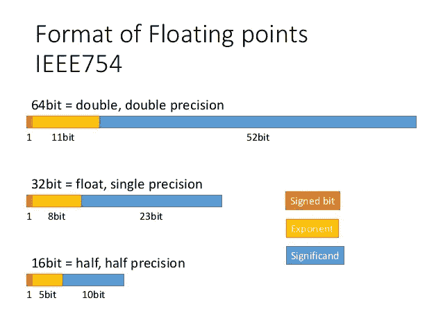

正如你在上面看到的，我们考虑了 IEEE754 半精度、单精度和双精度格式。我们可以用四个整数分量来表示任意一个有限数:
1。标志 2。基数 3。有效数字(m) 4。指数(e)。
我们取基数为 2(二进制)。有了这些组件，我们可以将任何数值评估为:

在神经网络中，不管我们使用什么框架，它都使用单精度(binary32/FP32)格式存储所有参数。让我们用一个例子更详细地看看[单精度格式](https://en.wikipedia.org/wiki/Single-precision_floating-point_format)。

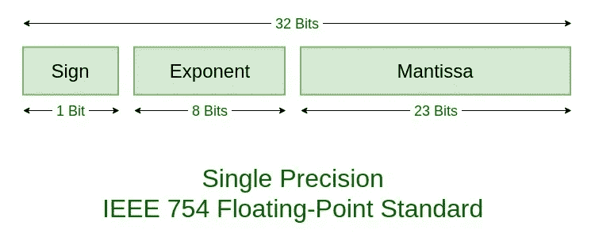

**符号位** : 0 表示正值，1 表示负值。

 [## 深度学习用 7 个步骤解释-更新|数据驱动的投资者

### 在深度学习的帮助下，自动驾驶汽车、Alexa、医学成像-小工具正在我们周围变得超级智能…

www.datadriveninvestor.com](https://www.datadriveninvestor.com/2019/01/23/deep-learning-explained-in-7-steps/) 

**指数位**:可以表示 0 到 255 个值(8 位)。指数也可以是负数，显示非常小的数值。这就是为什么指数的范围是*有符号整数* (-127 到 127)。我们给实际的指数值加上 127。

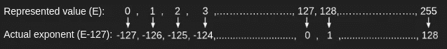

例如，如果实际的指数值是-12，则表示的值将是-12+127 = 115。类似地，对于 0，表示的值将是 127，对于-127，表示的值将是 0。值 127 是我们加上的偏差。指数的范围是-126 到 127。
因此，我们可以用单精度表示的数值范围是，

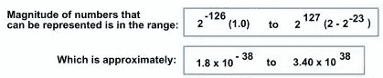

记住这一点很重要，我们将在后面引用这个值的范围。

> 你知道吗？
> 在单精度格式中，指数值-127(表示值全为 0)和 128(表示值全为 1)用于表示 NAN 和 inf 值。

**尾数位**:前 23 位，是规格化格式的小数点后的值。我们将通过一个例子来了解这一点。

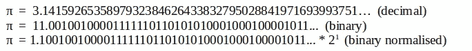

从上面归一化的值可以看出，
Sign = 0(正)
m = 1，1 < |2|
实际指数= 1
表示指数= 1 + bias = 1 + 127 = 128(十进制)= 10000000(二进制)
尾数位数= 100100100001111111010(小数点后 23 位)
因此，在单精度

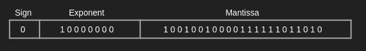

我希望这个例子已经使单精度(FP32)中的值的表示非常清楚了。
使用单精度格式给出了非常高的精度，但也增加了计算时间和存储参数所需的内存量。

混合精度训练是一种方法，其中我们以降低的精度(FP16)训练深度神经网络，而不会损失精度或必须修改超参数。我们来看看半精度格式(FP16)。

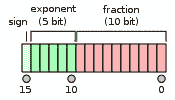

**符号位** : 0 表示正值，1 表示负值。

**指数位**:与单精度格式中的 8 位不同，这里只有 5 位。它们可以代表 0 到 31 个值。正如我们在单精度格式中看到的，指数也可以是负数。这里指数的实际范围是-14 到 15。
这里的偏差值是 15。例如，如果实际指数是-4，则表示的值将是-4+15 = 11。

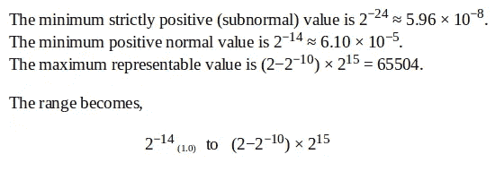

**尾数位**:我们只有 10 位半精度格式的尾数。

我们现在已经讨论了关于半精度格式的更多内容，并且可以将这种格式用于所有神经网络参数(我们可以仅使用 16 位，而不是使用 32 位来表示权重)。使用半精度格式确实减少了所需的内存量，也提高了计算速度，但是正如您所看到的，与单精度格式相比，半精度的范围非常窄，因此可能会丢失一些信息。

混合精度训练允许使用半精度形式的重量进行训练，同时克服了与较窄范围相关的问题。让我们看看可能出现的问题以及如何解决它们。

在此之前，让我们修改一下任何深度学习模型的单个训练迭代中会发生什么。首先，我们将通过将数据输入模型来执行正向传播。在进行反向传播之前，我们将测量损耗。从反向传播步骤中获得权重梯度后，我们将使用它们通过任何优化器来更新参数。

优化步骤:

> 问题 1:

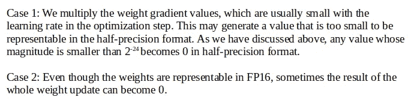

以上两种情况都会影响我们模型的性能。情况 1 将权重更新为之前的值，而情况 2 将权重更新为 0。克服这些问题的一种方法是以单精度格式保存所有权重的副本，而不是使用 FP16 中的权重，我们可以在优化步骤中使用它们来更新参数。

> 你知道吗？
> 
> 在混合精度训练中，所有张量和向前向后传播的算法都使用降低的精度(FP16)。

> 问题 2

我们知道 FP16 指数偏差使得归一化值指数的范围为[-14，15]。实际上所有的梯度值都是由小的量值决定的。

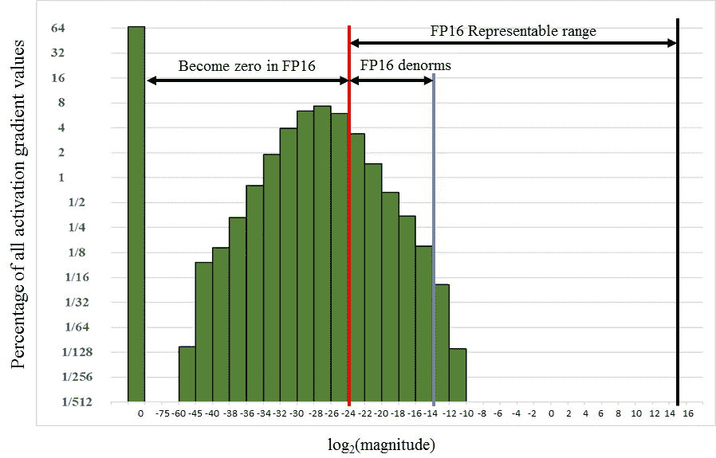

Histogram of activation gradient magnitudes throughout the FP32 training of the Multibox SSD network

在大多数情况下，FP16 可表示范围的大部分都没有使用。由于许多梯度值将低于 FP16 中的最小可表示范围，因此它们变成零。我们可以从上面的图表(贯穿多盒 SSD 网络的 FP32 训练的激活梯度幅度的直方图)中更好地理解这个问题。

克服这个问题的一个简单方法就是放大渐变值，这样就可以移动它们来占据更多的 FP16 可表示范围。这种缩放保留了之前丢失为零的渐变值。

移动梯度值的一种有效方式是通过某个因子来缩放在前向传播之后不久计算的损失值。反向传播中的链式法则只是确保所有梯度值按相同的量缩放。

一旦我们计算出梯度，它们必须在优化步骤之前按相同的系数缩小，因为权重更新是以 FP32 格式进行的。

> 你知道吗？我们必须选择比例因子，使其在梯度计算过程中不会导致溢出。当梯度超出 FP16 可表示的范围时，会发生溢出。

我相信现在很清楚为什么我们称之为“混合精度训练”。这是因为我们在训练过程中对网络权重使用了 FP32 和 FP16 浮点表示。

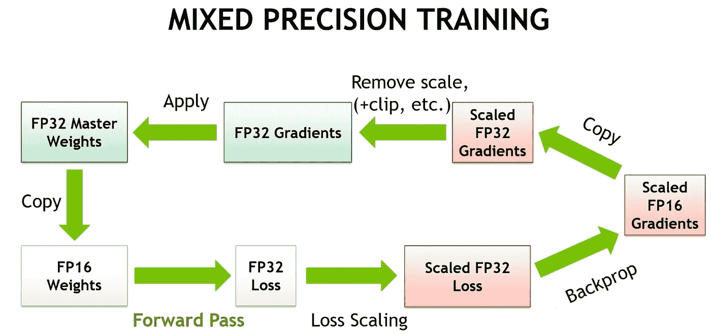

Mixed-precision training

让我们看看混合精度训练的步骤:

1.在 FP32 中维护重量的主副本。
2。对于历元中的每次迭代:
a .制作权重的 FP16 副本。
b .前向传播(使用 FP16 权重和激活)
c .损失缩放:将得到的损失乘以缩放因子 *S
d.* 后向传播(使用 FP16 权重、激活及其梯度)
e .缩小:将权重梯度乘以 1/ *S
f.* 使用主副本完成 FP32 中的权重更新。

选择合适的比例因子很重要。在上述步骤中，我们最初将比例因子 S 固定为一个值。根据动态损耗调整的概念，我们将首先为比例因子分配一个较大的值。随着训练的进行，如果比例损失值超过 NANs 指示的 FP16 可表示范围，我们将降低比例因子并重复此过程。

对于动态损耗缩放，我们将在反向传播之后向混合精度训练添加以下步骤:

如果重量梯度中存在 Inf 或 NaN(表示溢出):
1。降低比例因子 S.
2。跳过权重更新，转到下一次迭代。

我们现在已经理解了混合精度训练中涉及的概念，使用混合精度训练，我们可以使用半精度格式的权重来训练我们的模型，同时克服与之相关的问题。

感谢您的阅读。如果你觉得这篇文章有帮助，请鼓掌。欢迎任何意见和建议。查看以下参考资料。

参考:

1.  混合精度训练纸:【https://arxiv.org/pdf/1710.03740.pdf 
2.  混合精度用户指南:[http://docs . NVIDIA . com/deep learning/SDK/mixed-precision-training/index . html](http://docs.nvidia.com/deeplearning/sdk/mixed-precision-training/index.html)。