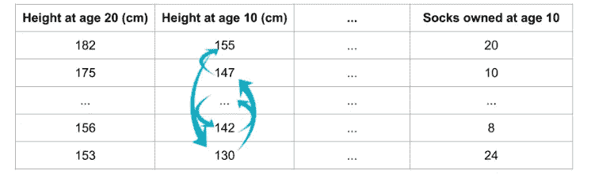
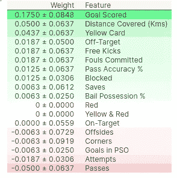
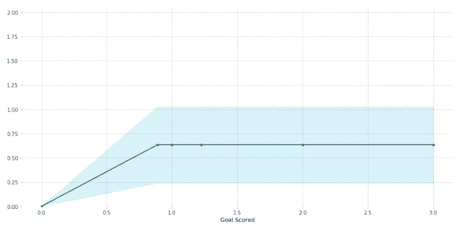
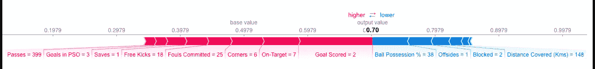
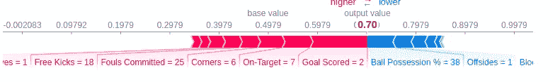
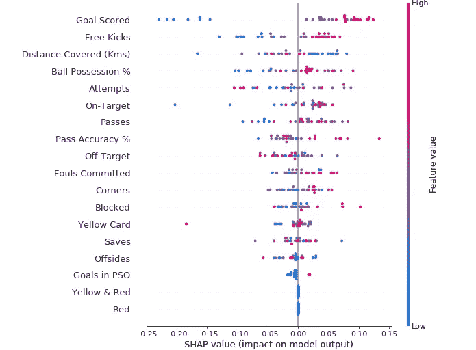
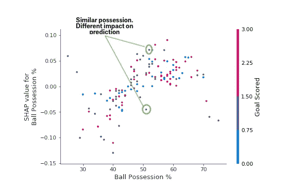

# ML 机型是黑匣子？提高 ML 模型的性能。

> 原文：<https://medium.datadriveninvestor.com/ml-models-are-black-box-lets-get-your-models-better-f43661465804?source=collection_archive---------12----------------------->

人们过去认为 ml 模型是黑盒，我们给它们一些输入数据和标签，然后训练它们。之后，它被用于预测。它的内部正在发生一些事情。什么？啊，我们很多人都不知道。这就是为什么我们过去说它是一个黑匣子。

在这个故事中，我们试图打开一点，深入 ml 模型的黑箱，看看我们是否能从中获得一些东西。


[Source](https://www.forbes.com/sites/alexanderlavin/2019/06/17/beyond-black-box-ai/#65b57bcf49c4)

我对下面的一些问题很好奇。让我们试着找到他们的答案。

哪些特性更重要？每个特征点如何对预测做出贡献？等等。

理解这一切有助于你调试，特征工程，帮助收集适当的数据，最重要的是建立对你的模型的信任。

**特征重要度:**特征重要度是用来提及每个特征在预测和确定模型中输出的重要性的术语。

为了找到特征的重要性，我们使用排列重要性，这是快速和广泛使用的。

**排列重要性:**

我将尝试用几个步骤来解释这一点。

什么？

这是一种在处理机器学习时理解每个特征的特征重要性的方法。

什么时候？

PI 将在您训练和拟合模型时使用，并用于评估特征重要性。

为什么？

这可以帮助您了解拟合模型后每个特征的重要性。以便您可以采取必要的措施来分别提高或降低精度和计算成本。

怎么会？

拿一个训练有素的模特来说。现在你在不同的列中有不同的特征，就像上面提到的图片一样。每次只随机洗牌一列，保持所有其他列(其他特征和其他目标在准确位置)并使用预测来查看新洗牌特征增加了多少损失。对每个列或特征重复此操作。这会告诉你每个特性的重要性。



[Source](https://www.kaggle.com/dansbecker/permutation-importance)

```
import eli5
from eli5.sklearn import PermutationImportance

perm = PermutationImportance(my_model, random_state=1).fit(val_X, val_y)
eli5.show_weights(perm, feature_names = val_X.columns.tolist())
```



[Source](https://www.kaggle.com/dansbecker/permutation-importance)

**见解**:

值在顶部的特性最重要。值显示了模型性能随着洗牌而降低的程度。

现在我们可以移动到下一个黑盒参数。

[](https://www.datadriveninvestor.com/2020/02/19/cognitive-computing-a-skill-set-widely-considered-to-be-the-most-vital-manifestation-of-artificial-intelligence/) [## 认知计算——一套被广泛认为是……

### 作为它的用户，我们已经习惯了科技。这些天几乎没有什么是司空见惯的…

www.datadriveninvestor.com](https://www.datadriveninvestor.com/2020/02/19/cognitive-computing-a-skill-set-widely-considered-to-be-the-most-vital-manifestation-of-artificial-intelligence/) 

## 部分相关图

什么？

当排列重要性给出哪个特征是最重要的时，部分图给出每个特征如何影响预测的估计。

什么时候？

在拟合模型之后，还评估了类似排列重要性的 PDP。

怎么会？

和圆周率差不多，不要搞混了。我们采用拟合模型，并采用单个垂直特征。现在，我们简单地将数值从较小变到较大，并可视化预测中发生的变化。因此，我们可以确定模型中每个特征的重要性。

```
from matplotlib import pyplot as plt
from pdpbox import pdp, get_dataset, info_plots

*# Create the data that we will plot*
pdp_goals = pdp.pdp_isolate(model=tree_model, dataset=val_X, model_features=feature_names, feature='Goal Scored')

*# plot it*
pdp.pdp_plot(pdp_goals, 'Goal Scored')
plt.show()
```



[Source](https://www.kaggle.com/dansbecker/partial-plots)

y 轴表示预测的变化，x 轴表示目标得分。所以在进球之后，对赢得比赛没有太大的贡献。蓝色区域给出了置信度。

**SHAP 值:**

> SHAP 值(SHapley Additive exPlanations 的首字母缩写)对预测进行分解，以显示每个特征的影响。

基本上，SHAP 值有助于您对每个单独的特征进行细分预测。

> 评估个人预测

SHAP 价值观的优势:

1.  全局可解释性:我们可以识别每个特征如何对预测器做出贡献以找到目标
2.  局部可解释性:有了这一点，我们可以解释为什么一个案例得到了它的预测，以及每个特征在其中的贡献有多大。
3.  SHAP 值可用于任何基于树的模型中的解释。

```
sum(SHAP values for all features) = pred_for_team - pred_for_baseline_values
```



[Source](https://www.kaggle.com/dansbecker/shap-values)

SHAP 值帮助我们在图表中分解这样的预测。

> 你对此如何解读？
> 
> 我们预测的是 0.7，而 base_value 是 0.4979。导致预测增加的特征值显示为粉红色，其可视大小显示了特征影响的大小。减少预测的特征值用蓝色表示。最大的影响来自于`Goal Scored`为 2。尽管控球值具有降低预测的有意义的效果。
> 
> [来源](https://www.kaggle.com/dansbecker/shap-values)

让我们看看 SHAP 是如何处理代码的。我们使用一个名为 **shap** 的库

在使用 shap 分析之前，让我们看看预测的概率。

```
row_to_show = 5
data_for_prediction = val_X.iloc[row_to_show]  *# use 1 row of data here. Could use multiple rows if desired*
data_for_prediction_array = data_for_prediction.values.reshape(1, -1)

my_model.predict_proba(data_for_prediction_array)
```

结果:数组([[0.3，0.7]])

现在使用 shap

```
import shap  *# package used to calculate Shap values*

*# Create object that can calculate shap values*
explainer = shap.TreeExplainer(my_model)

*# Calculate Shap values*
shap_values = explainer.shap_values(data_for_prediction)shap.initjs()
shap.force_plot(explainer.expected_value[1], shap_values[1], data_for_prediction)
```



[Source](https://www.kaggle.com/dansbecker/shap-values)

预测的概率给了我们 0.7，一个人赢得最佳球员。上面显示了使用 shap 分解的。

高级形状:

我们知道排列重要性便于我们计算每个特征的相对重要性，但是通过 **SHAP 汇总图**我们可以对相对重要性有一个深入的了解



[Source](https://www.kaggle.com/dansbecker/advanced-uses-of-shap-values)

见解:

垂直方向显示特征的重要性，颜色显示某一行的特征是高还是低。横坐标表示该特征导致的预测值是高还是低。

用 python 实现

```
import shap  *# package used to calculate Shap values*

*# Create object that can calculate shap values*
explainer = shap.TreeExplainer(my_model)

*# calculate shap values. This is what we will plot.*
*# Calculate shap_values for all of val_X rather than a single row, to have more data for plot.*
shap_values = explainer.shap_values(val_X)

*# Make plot. Index of [1] is explained in text below.*
shap.summary_plot(shap_values[1], val_X)
```

类似地 **SHAP 相关性贡献图**可以用来代替我们已经使用的部分相关性图，具有更多优点。



[Source](https://www.kaggle.com/dansbecker/advanced-uses-of-shap-values)

洞察力

> 从关注形状开始，我们一会儿再回到颜色。每个点代表一行数据。水平位置是数据集的实际值，垂直位置显示了该值对预测的影响。这个向上倾斜的事实表明，你拥有的球越多，模型对赢得*最佳球员*奖的预测就越高。

从所有这些，你可以很好地改善你的模型，以获得更好的准确性。

大部分笔记摘自 kaggle 微课。它们有利于实用数据科学。

感谢阅读

参考资料:

 [## 学习机器学习可解释教程

### 从任何机器学习模型中提取人类可以理解的见解。

www.kaggle.com](https://www.kaggle.com/learn/machine-learning-explainability) [](https://towardsdatascience.com/explain-your-model-with-the-shap-values-bc36aac4de3d) [## 用 SHAP 价值观解释你的模型

### 使用 SHAP 值来解释任何复杂的 ML 模型

towardsdatascience.com](https://towardsdatascience.com/explain-your-model-with-the-shap-values-bc36aac4de3d)