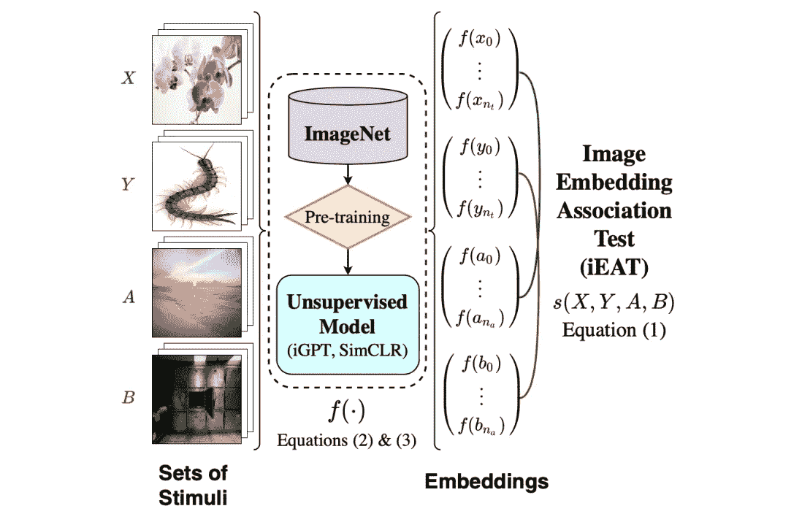

# [ML UTD 27]最新的机器学习—数据生活

> 原文：<https://medium.datadriveninvestor.com/ml-utd-27-machine-learning-up-to-date-life-with-data-e13b6b4d7433?source=collection_archive---------19----------------------->

第 27 期每周简讯来自[生活有数据](https://lifewithdata.org)

Moving data with Bulldozer [[source](https://netflixtechblog.com/bulldozer-batch-data-moving-from-data-warehouse-to-online-key-value-stores-41bac13863f8)]

这是来自 [**LifeWithData**](https://lifewithdata.org) 博客的 ML UTD #27！在当今软件工程和机器学习的繁忙前线，我们帮助您将信号与噪声分离。

[**LifeWithData**](https://lifewithdata.org) 致力于提供精心策划的机器学习&软件工程更新，为读者指出没有多余细节的关键发展。这使得整个行业能够进行频繁、简洁的更新，而不会出现信息过载。

# 应用程序

*   推土机:批量数据从数据仓库转移到在线键值存储
*   解决并解释了 130 个机器学习项目
*   数据湖与数据仓库:如何为您的堆栈选择正确的解决方案

# 学术界

*   需要时请注意
*   无监督预训练学习的图像表示包含类似人类的偏见
*   非常深的值概括了自回归模型，并能在图像上胜过它们

# 推土机:批量数据从数据仓库转移到在线键值存储

> *在网飞，我们也大力支持强调关注点分离的微服务架构。许多这样的服务经常需要对这种周期性生成的细粒度数据进行快速查找。例如，为了增强我们的用户体验，一个在线应用程序获取用户的偏好数据来推荐电影和电视节目。数据仓库不是为低延迟微服务的点请求而设计的。因此，我们必须高效地将数据从数据仓库转移到一个全局的、低延迟且高度可靠的键值存储。关于我们的机器学习推荐系统如何利用我们的键值存储，请查看本演示的更多详细信息。*
> 
> [*…继续阅读*](https://netflixtechblog.com/bulldozer-batch-data-moving-from-data-warehouse-to-online-key-value-stores-41bac13863f8)

《丛林奇兵》

*   [条](https://netflixtechblog.com/bulldozer-batch-data-moving-from-data-warehouse-to-online-key-value-stores-41bac13863f8)
*   [【演示】机器学习遇上数据库](https://conf.slac.stanford.edu/xldb2018/sites/xldb2018.conf.slac.stanford.edu/files/Tues_11.15_IoannisPapa-Netflix-2018.pdf)
*   [[博客]网飞笔记本创新](https://netflixtechblog.com/notebook-innovation-591ee3221233)
*   鸣谢:[网飞科技博客](https://medium.com/u/c3aeaf49d8a4?source=post_page-----e13b6b4d7433--------------------------------)

# 解决并解释了 130 个机器学习项目

Yep, that [[source](https://medium.com/the-innovation/130-machine-learning-projects-solved-and-explained-605d188fb392)]

> *通过学习和尝试我为你发布的所有这些动手操作的交互式项目，用 Python 实践你在数据科学项目中的技能。通过学习和尝试这些关于数据科学的项目，你将了解你实时遵循指令的实际环境。*
> 
> [*…继续阅读*](https://medium.com/the-innovation/130-machine-learning-projects-solved-and-explained-605d188fb392)

《丛林奇兵》

*   [文章](https://medium.com/the-innovation/130-machine-learning-projects-solved-and-explained-605d188fb392)
*   [构建抖音算法](https://thecleverprogrammer.com/2020/09/26/tiktok-algorithm-with-machine-learning/)
*   [检测仇恨言论](https://thecleverprogrammer.com/2020/08/19/hate-speech-detection-model/)
*   [制作有声读物](https://thecleverprogrammer.com/2020/10/22/create-an-audiobook-with-python/)
*   信用: [@amankharwal](https://amankharwal.medium.com/)

# 数据湖与数据仓库:如何为您的堆栈选择正确的解决方案

Common Data Lake Technologies & Vendors [[source](https://towardsdatascience.com/how-to-build-your-data-platform-choosing-a-cloud-data-warehouse-3de66862f41c)]

> *二十年前，你的* [*数据仓库*](https://en.wikipedia.org/wiki/Data_warehouse) *可能不会被评为最热门的技术。办公室地下室的这些堡垒长期以来与孤立的数据工作流、本地计算集群和有限的一组业务相关任务(例如，处理工资单和存储内部文档)相关联。*
> 
> *现在，随着数据驱动的分析、跨职能数据团队以及最重要的云的兴起，“云数据仓库”一词几乎与敏捷性和创新相类似。在许多方面，云使数据更容易管理，更容易被更多的用户访问，处理速度也快得多。不利用云数据仓库解决方案(或者两个、三个……或者更多)，公司就无法以有意义的方式使用数据。*
> 
> [*…继续阅读*](https://towardsdatascience.com/how-to-build-your-data-platform-choosing-a-cloud-data-warehouse-3de66862f41c)

《丛林奇兵》

*   [条](https://towardsdatascience.com/how-to-build-your-data-platform-choosing-a-cloud-data-warehouse-3de66862f41c)
*   [【博客】数据平台系列](https://www.montecarlodata.com/how-to-build-your-data-platform-like-a-product/)
*   信用: [@barrmoses on Medium](https://barrmoses.medium.com/)

# 需要时请注意

Caption in Image [[source](https://arxiv.org/pdf/2009.04534.pdf)]

> *基于 Transformer 的模型由交错的前馈块(捕捉内容意义)和相对更昂贵的自我关注块(捕捉上下文意义)组成。在本文中，我们探讨了模块的权衡和排序，以改进电流互感器架构，并提出了 PAR 变压器。它需要的计算时间比 Transformer-XL 少 35%,这是通过用前馈块替换约 63%的自关注块实现的，并且保留了 WikiText-103 语言建模基准上的困惑。我们在 text8 和 enwiki8 数据集以及 BERT 模型上进一步验证了我们的结果。*
> 
> [*…继续阅读*](https://arxiv.org/pdf/2009.04534.pdf)

《丛林奇兵》

*   [条](https://arxiv.org/pdf/2009.04534.pdf)
*   信用: [@nvidia](https://twitter.com/nvidia)

 [## 机器学习和人工智能如何改变电子商务的面貌？|数据驱动…

### 电子商务开发公司，现在，整合先进的客户体验到一个新的水平…

www.datadriveninvestor.com](https://www.datadriveninvestor.com/2020/11/19/how-machine-learning-and-artificial-intelligence-changing-the-face-of-ecommerce/) 

# 无监督预训练学习的图像表示包含类似人类的偏见

Example […] which measures the differential association between flowers vs. insects and pleasantness vs. unpleasantness [[source](https://arxiv.org/pdf/2010.15052.pdf)]

> *机器学习的最新进展利用来自网络的大量未标记图像数据集来学习从图像分类到人脸识别等任务的通用图像表示。但是，无监督的计算机视觉模型会自动学习隐含的模式并嵌入可能产生有害下游影响的社会偏见吗？第一次，我们开发了一种新的方法，用于量化图像中社会概念和属性的表示之间的有偏关联。我们发现，在 ImageNet 上训练的最先进的无监督模型可以自动学习种族、性别和交叉偏见，ImageNet 是一个从互联网图像中筛选出来的流行基准图像数据集。我们从社会心理学中复制了 15 个有记录的人类偏见中的 8 个，从无害的，如昆虫和花卉，到潜在的有害的，如种族和性别。在图像领域，我们第一次复制了人类对肤色和体重的偏见。我们的结果也非常符合社会心理学关于交叉偏见的三个假设。当与在线图像数据集中的统计模式进行比较时，我们的研究结果表明，机器学习模型可以从人们在网络上的刻板印象中自动学习偏见。*
> 
> [*……继续阅读*](https://arxiv.org/pdf/2010.15052.pdf)

《丛林奇兵》

*   [文章](https://arxiv.org/pdf/2010.15052.pdf)
*   [【Github】ryansteed/ieat](https://github.com/ryansteed/ieat)
*   鸣谢:[@ ryanbstied](https://twitter.com/ryanbsteed)[@ aylin _ CIM](https://twitter.com/aylin_cim)

# 非常深的值概括了自回归模型，并能在图像上胜过它们

Some model samples and a viz of the generation [[source](https://github.com/openai/vdvae)]

> *我们提出了一种分级 VAE，它首次在所有自然图像基准上的对数似然性方面优于 PixelCNN。我们首先观察到，如果做得足够深入，VAEs 实际上可以实现自回归模型和其他更有效的生成模型。尽管如此，自回归模型传统上优于 VAEs。我们通过将 VAE 扩展到比先前探索的更大的随机深度，并在 CIFAR-10、ImageNet 和 FFHQ 上对其进行评估，来测试深度不足是否解释了性能差距。我们发现，与 PixelCNN 相比，这些非常深的值实现了更高的可能性，使用了更少的参数，生成样本的速度快了数千倍，并且更容易应用于高分辨率图像。我们可视化的生成过程，并显示了 VAEs 学习有效的层次视觉表示。*
> 
> [*…继续阅读*](https://arxiv.org/pdf/2011.10650v1.pdf)

《丛林奇兵》

*   [条](https://arxiv.org/pdf/2011.10650v1.pdf)
*   [【Github】open ai/vdvae](https://github.com/openai/vdvae)
*   信用: [@openai](https://twitter.com/openai)

# 保持最新状态

ML UTD #27 到此为止。然而，在学术界和工业界，事情发生得很快！除了 ML UTD，让自己在 [LifeWithData](https://lifewithdata.org/) 博客、[Medium 上的文章](https://medium.com/@anthonyagnone)和 [Twitter](https://twitter.com/@anthonyagnone) 上保持更新。

# 不断学习

 [## 在远程优先的数据工作人员中生存和发展的技巧

### 提示:它不仅仅是 Zoom 和 Github

towardsdatascience.com](https://towardsdatascience.com/tips-to-survive-and-thrive-in-the-remote-first-data-workforce-34944abddd29)  [## 亚马逊想让你免费成为一名人工智能从业者

### 这家科技巨头计划通过公开其长期的内部材料来提高 ML 的熟练度

towardsdatascience.com](https://towardsdatascience.com/amazon-wants-to-make-you-an-ml-practitioner-for-free-552c46cea9ba)  [## 用 fast.ai 和 Deepnote 打击旧金山犯罪

### 有了正确的 ML 框架和笔记本平台，您就在快车道上了

towardsdatascience.com](https://towardsdatascience.com/fight-san-francisco-crime-with-fast-ai-and-deepnote-6db2b96d2a83) 

*原载于 2020 年 12 月 16 日*[*【https://www.lifewithdata.org】*](http://www.lifewithdata.org/newsletter/mlutd27)*。*

**访问专家视图—** [**订阅 DDI 英特尔**](https://datadriveninvestor.com/ddi-intel)