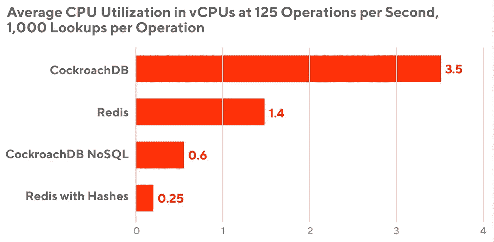
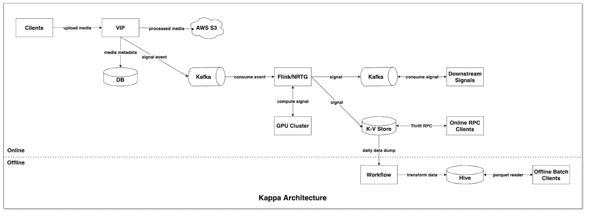
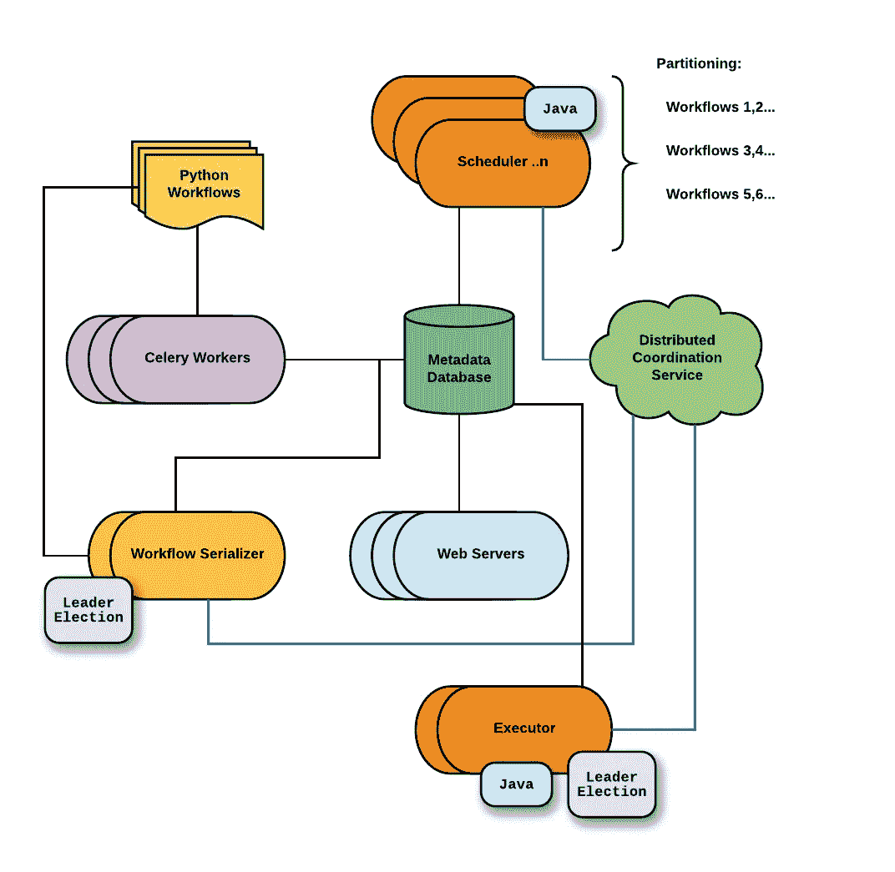
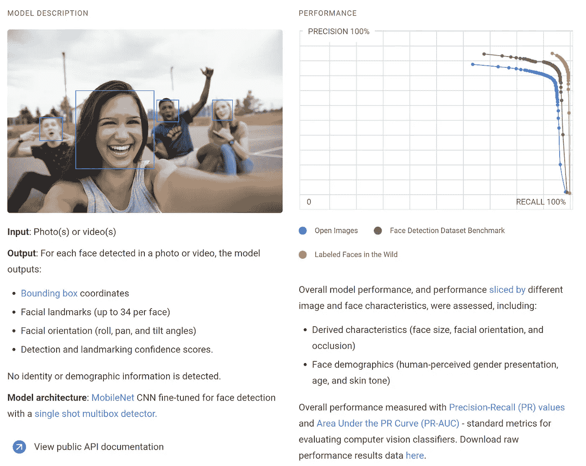
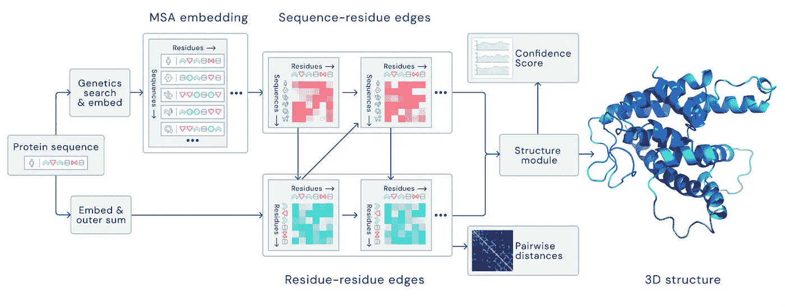
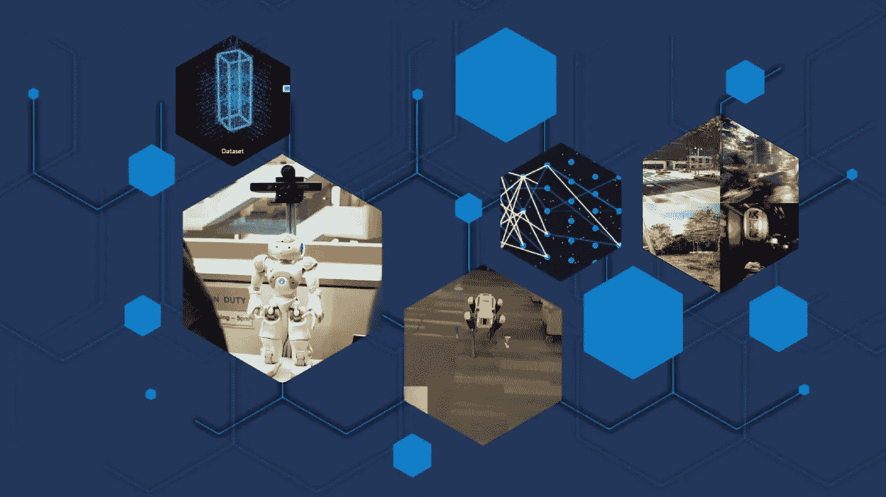

# [ML UTD 28]机器学习最新—数据生活

> 原文：<https://medium.datadriveninvestor.com/ml-utd-28-machine-learning-up-to-date-life-with-data-b7b9fcc7ad3a?source=collection_archive---------42----------------------->

## 第 28 期每周简讯来自[生活有数据](https://lifewithdata.org)

The main NN model architecture for AlphaFold [[source](https://deepmind.com/blog/article/alphafold-a-solution-to-a-50-year-old-grand-challenge-in-biology)]

这是来自 [**LifeWithData**](https://lifewithdata.org) 博客的 ML UTD #28！在当今软件工程和机器学习的繁忙前线，我们帮助您将信号从噪声中分离出来。

[**LifeWithData**](https://lifewithdata.org) 致力于提供精心策划的机器学习&软件工程更新，为读者指出没有多余细节的关键发展。这使得整个行业能够进行频繁、简洁的更新，而不会出现信息过载。

# 应用程序

*   构建千兆级 ML 要素库
*   Pinterest 视觉信号基础设施:从 Lambda 到 Kappa 架构的演变
*   大规模管理优步的数据工作流

# 学术界

*   蒂姆尼特·格布鲁博士的深远影响
*   AlphaFold:生物学 50 年来最大挑战的解决方案
*   微软 2020 研究:着眼未来，解决当前问题

# 构建千兆级 ML 要素库

Using Redis hashes on benchmarks results in a five times improvement in CPU efficiency. [[source](https://doordash.engineering/2020/11/19/building-a-gigascale-ml-feature-store-with-redis/)]

> *当像 DoorDash 这样拥有数百万消费者的公司构建机器学习(ML)模型时，特征数据的量可以增长到数十亿条记录，其中数百万条是在低延迟约束下的模型推断期间主动检索的。这些挑战要求我们更深入地研究特征库(负责存储和提供特征数据的系统)的选择和设计。这里所做的决策可以防止超出成本预算，在模型推断过程中损害运行时性能，并抑制模型部署速度。*
> 
> *[…]下面，我们将解释运营大型特色商店的任务中所面临的挑战。然后，我们将回顾我们如何能够快速地将 Redis 识别为这个任务的正确的键值存储。然后，我们将深入研究我们在 Redis 上进行的优化，使其容量增加两倍，同时通过选择一个围绕字符串、协议缓冲区和 Snappy 压缩算法的自定义序列化方案来提升读取性能。*
> 
> [*…继续阅读*](https://doordash.engineering/2020/11/19/building-a-gigascale-ml-feature-store-with-redis/)

《丛林奇兵》

*   [条](https://doordash.engineering/2020/11/19/building-a-gigascale-ml-feature-store-with-redis/)
*   [协议缓冲区](https://developers.google.com/protocol-buffers)
*   [爽快压缩](https://github.com/google/snappy)
*   [xxHash 字符串哈希](http://cyan4973.github.io/xxHash/)
*   鸣谢: [@DoorDashEng](https://twitter.com/doordasheng)

# Pinterest 视觉信号基础设施:从 Lambda 到 Kappa 架构的演变

The stream-focused “Kappa Architecture” adopted [[source](https://medium.com/pinterest-engineering/pinterest-visual-signals-infrastructure-evolution-from-lambda-to-kappa-architecture-f8f58b127d98)]

> *随着对来自 Pinterest 庞大视觉数据集的机器学习信号的需求不断增长，我们决定更仔细地研究一下我们产生和服务这些信号的基础设施。我们特别感兴趣的几个参数是信号可用性、基础设施复杂性和成本优化、技术集成、开发速度和监控。在本帖中，我们将描述我们从 Lambda 架构到受 Kappa 架构启发的新型实时信号基础设施的旅程。*
> 
> [*…继续阅读*](https://medium.com/pinterest-engineering/pinterest-visual-signals-infrastructure-evolution-from-lambda-to-kappa-architecture-f8f58b127d98)

《丛林奇兵》

*   [条](https://medium.com/pinterest-engineering/pinterest-visual-signals-infrastructure-evolution-from-lambda-to-kappa-architecture-f8f58b127d98)
*   [Lambda 架构示例](https://hazelcast.com/glossary/kappa-architecture/)
*   【Kappa 架构示例
*   信用: [@PinterestEng](https://twitter.com/PinterestEng)

# 大规模管理优步的数据工作流

The distributed “Piper” architecture designed by Uber [[source](https://eng.uber.com/managing-data-workflows-at-scale/)]

> *[……]使这些数据具有可操作性涉及摄取、转换、分散和编排，以便可以广泛应用于传统商业智能、机器学习、模型训练、可视化和报告等领域。然而，在优步快速发展的早期，我们采用了广泛的数据工作流系统，用户必须为每个用例从几个重叠的工具中进行选择。虽然这个大型工具箱允许敏捷和响应性的增长，但事实证明它很难管理和维护，需要工程师在承担不同项目时学习重复的数据工作流系统。我们需要一个能够创作、管理、调度和部署数据工作流的中央工具。*
> 
> 利用之前在优步部署的各种工具，包括基于气流的平台，我们开始开发符合优步规模的系统。这项工作促使我们开发了优步的集中式工作流管理系统 Piper，它使我们能够在优步实现数据工作流的民主化，并使从城市运营团队到机器学习工程师的每个人都能更快、更高效地开展工作。
> 
> [*……继续阅读*](https://eng.uber.com/managing-data-workflows-at-scale/)

《丛林奇兵》

*   [文章](https://eng.uber.com/managing-data-workflows-at-scale/)
*   信用: [@UberEng](https://twitter.com/UberEng)

# 蒂姆尼特·格布鲁博士的深远影响

An image from one of Google’s sample Model Cards, for a facial recognition model [[source](https://thegradient.pub/the-far-reaching-impacts-of-timnit-gebru/)]

> 她的影响远远超出了她自己的研究。她是 ACM 公平、问责和透明会议(FAccT)的创始人之一，这是与机器学习伦理相关的最负盛名和最知名的会议之一。作为 Black In AI 的联合创始人，她帮助 NeurIPS 的黑人参与者从 2016 年的 6 人增加到 2017 年的 500 人，仅一年就增加了近 100 倍。在超过一半的 Black in AI 演讲者无法获得前往加拿大参加 NeurIPS 2018 的签证后，她成功地倡导并组织了在埃塞俄比亚举行的 ICLR 2020，这将是在非洲大陆举行的第一个大型 AI 会议之一(由于 covid，它不得不切换到远程)。
> 
> *虽然 Gebru 已经被从事计算机视觉、人工智能伦理和公平研究的学者所熟知，但在过去一周，谷歌解雇了她作为人工智能伦理研究团队经理的职务后，更广泛的受众才知道了她的名字，这一举动被包括 BBC、NBC、Guardian 和纽约时报在内的媒体报道。截至本文发稿时，已有 2，278 名谷歌员工和 3，114 名学术界、工业界和民间社会支持者签署了一封信，抗议谷歌的行为并支持 Gebru。虽然她的终止引发了关于不利研究的行业审查、科技领域的种族歧视、企业多样性努力以及我们当前人工智能道德框架的失败的重要讨论，但在这里，我将主要关注 Gebru 的研究和对机器学习的贡献。*
> 
> [*…继续阅读*](https://thegradient.pub/the-far-reaching-impacts-of-timnit-gebru/)

《丛林奇兵》

*   [条](https://thegradient.pub/the-far-reaching-impacts-of-timnit-gebru/)
*   [AI 中的黑色](https://blackinai2020.vercel.app/)
*   [FAccT 会议](https://facctconference.org/)
*   [性别差异研究](http://proceedings.mlr.press/v81/buolamwini18a/buolamwini18a.pdf)
*   [抗议谷歌行为的信](https://googlewalkout.medium.com/standing-with-dr-timnit-gebru-isupporttimnit-believeblackwomen-6dadc300d382)
*   信用: [@TheGradientPub](https://twitter.com/TheGradientPub)

 [## 机器学习和人工智能如何改变电子商务的面貌？|数据驱动…

### 电子商务开发公司，现在，整合先进的客户体验到一个新的水平…

www.datadriveninvestor.com](https://www.datadriveninvestor.com/2020/11/19/how-machine-learning-and-artificial-intelligence-changing-the-face-of-ecommerce/) 

# AlphaFold:生物学 50 年来最大挑战的解决方案

The main NN model architecture for AlphaFold [[source](https://deepmind.com/blog/article/alphafold-a-solution-to-a-50-year-old-grand-challenge-in-biology)]

> *蛋白质对生命至关重要，支持着生命的所有功能。它们是由氨基酸链组成的大型复杂分子，蛋白质的作用很大程度上取决于其独特的三维结构。弄清楚蛋白质折叠成什么形状被称为“蛋白质折叠问题”，在过去 50 年里一直是生物学中的一个巨大挑战。在一项重大的科学进步中，我们的人工智能系统 AlphaFold 的最新版本被两年一度的蛋白质结构预测关键评估(CASP)的组织者视为解决这一重大挑战的解决方案。这一突破展示了人工智能对科学发现的影响，以及它在解释和塑造我们世界的一些最基本领域大幅加速进展的潜力。*
> 
> [*…继续阅读*](https://deepmind.com/blog/article/alphafold-a-solution-to-a-50-year-old-grand-challenge-in-biology)

《丛林奇兵》

*   [文章](https://deepmind.com/blog/article/alphafold-a-solution-to-a-50-year-old-grand-challenge-in-biology)
*   [蛋白质折叠](https://en.wikipedia.org/wiki/Protein_folding)
*   [AlphaFold](https://deepmind.com/research/case-studies/alphafold)
*   鸣谢: [@DeepMind](https://twitter.com/DeepMind)

# 微软 2020 研究:着眼未来，解决当前问题

Microsoft’s graphic used in the article [[source](https://www.microsoft.com/en-us/research/blog/research-at-microsoft-2020-addressing-the-present-while-looking-to-the-future/)]

> *微软的研究人员追求关于未来世界将会是什么样子以及技术将会扮演什么角色的重大问题。他们不仅要承担探索其研究的长期愿景的责任，而且还必须准备好对当前的紧迫需求做出反应。特别是今年，他们被要求利用自己作为未来学家的角色来应对紧迫的社会挑战。*
> 
> 2020 年初，随着各国开始响应新冠肺炎的在家订单和商业运作从办公室转移到家庭，研究人员开始行动起来，确定他们的技能和项目可以提供帮助的方式，同时也做出他们自己的个人和专业调整。在某些情况下，他们转向直接针对疫情。微软亚洲研究院的一个团队开发了 COVID Insights 网站，以促进对该疾病的科学分析和理解，而社交智能会议计划扩展了其在远程呈现技术方面的工作，以包括新冠肺炎项目期间的会议。根据员工志愿者提供的反馈，这些研究人员正在拼凑几乎完全通过屏幕开会的效果。
> 
> [*…继续阅读*](https://www.microsoft.com/en-us/research/blog/research-at-microsoft-2020-addressing-the-present-while-looking-to-the-future/)

《丛林奇兵》

*   [文章](https://www.microsoft.com/en-us/research/blog/research-at-microsoft-2020-addressing-the-present-while-looking-to-the-future/)
*   [工作的新未来研讨会](https://www.microsoft.com/en-us/research/event/new-future-of-work/)
*   [微软预感](https://www.microsoft.com/en-us/research/project/project-premonition/)
*   鸣谢: [@MSFTResearch](https://twitter.com/MSFTResearch)

# 保持最新状态

ML UTD #28 到此为止。然而，在学术界和工业界，事情发生得很快！除了 ML UTD，在 [LifeWithData](https://lifewithdata.org/) 博客、[Medium 上的文章](https://medium.com/@anthonyagnone)和 [Twitter](https://twitter.com/@anthonyagnone) 上保持更新。

# 不断学习

 [## 在远程优先的数据工作人员中生存和发展的技巧

### 提示:它不仅仅是 Zoom 和 Github

towardsdatascience.com](https://towardsdatascience.com/tips-to-survive-and-thrive-in-the-remote-first-data-workforce-34944abddd29)  [## 亚马逊想让你免费成为一名人工智能从业者

### 这家科技巨头计划通过公开其长期的内部材料来提高 ML 的熟练度

towardsdatascience.com](https://towardsdatascience.com/amazon-wants-to-make-you-an-ml-practitioner-for-free-552c46cea9ba)  [## 用 fast.ai 和 Deepnote 打击旧金山犯罪

### 有了正确的 ML 框架和笔记本平台，您就在快车道上了

towardsdatascience.com](https://towardsdatascience.com/fight-san-francisco-crime-with-fast-ai-and-deepnote-6db2b96d2a83) 

*原载于 2020 年 12 月 23 日 https://www.lifewithdata.org**的* [*。*](http://www.lifewithdata.org/newsletter/mlutd28)

## 访问专家视图— [订阅 DDI 英特尔](https://datadriveninvestor.com/ddi-intel)