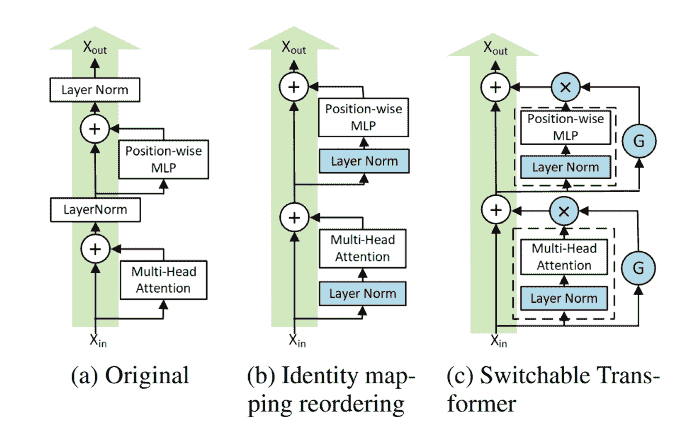
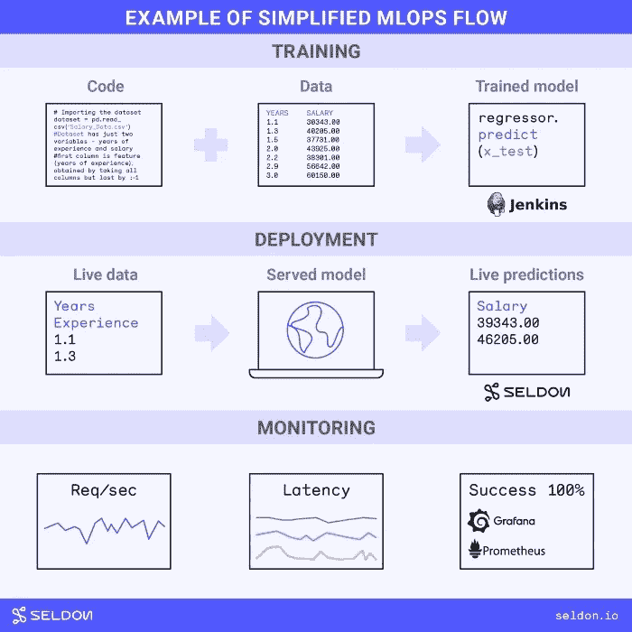
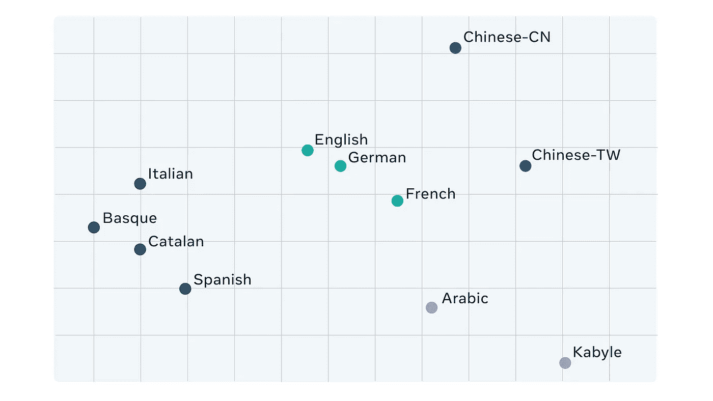
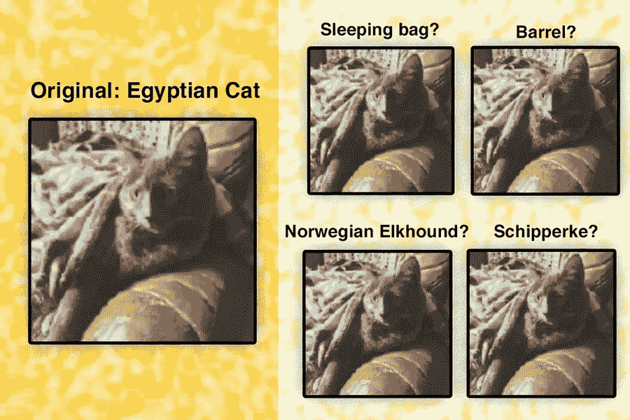

# [ML UTD 29]机器学习最新—数据生活

> 原文：<https://medium.datadriveninvestor.com/ml-utd-29-machine-learning-up-to-date-life-with-data-a176d9dcfaec?source=collection_archive---------29----------------------->

第 29 期每周简讯来自[生活有数据](https://lifewithdata.org/)

(a) Standard Transformer (b) Reordering to make it PreLN © Switchable Gates (G) to decide whether to include a layer or not. (see Applications 2)

这是来自 [**LifeWithData**](https://lifewithdata.org) 博客的 ML UTD #29！在当今软件工程和机器学习的繁忙前线，我们帮助您将信号与噪声分离。

[**LifeWithData**](https://lifewithdata.org) 致力于提供精心策划的机器学习&软件工程更新，为读者指出没有多余细节的关键发展。这使得整个行业能够进行频繁、简洁的更新，而不会出现信息过载。

# 应用程序

*   应用 MLOps 生命周期
*   NeurIPS 2020 论文:深度学习工程师的收获
*   移动机器学习:2020 年回顾

# 学术界

*   利用 JAX 加速[深度思维]研究
*   Wav2vec 2.0:从原始音频学习语音结构
*   神经科学家找到了让物体识别模型表现更好的方法

# 应用 MLOps 生命周期

Image by Seldon. Shared under CC BY-SA 4.0 [[source](https://seldon.io/)]

> 团队可能很难掌握 MLOps。这是一个新的领域，大多数负责 MLOps 项目的团队目前都是从不同的背景开始着手的。
> 
> 从另一个项目中复制一种方法是很诱人的。但是 MLOps 项目的需求可能会有很大的不同。需要的是了解每个 MLOps 项目的具体需求。这需要了解 MLOps 需求的类型以及它们是如何产生的。
> 
> [*…继续阅读*](https://towardsdatascience.com/applying-the-mlops-lifecycle-3b60033b7cbf)

《丛林奇兵》

*   [条](https://towardsdatascience.com/applying-the-mlops-lifecycle-3b60033b7cbf)
*   [【Github】制作 ML 风景](https://github.com/EthicalML/awesome-production-machine-learning)
*   信用: [@ryandawsonuk on Medium](https://medium.com/@ryandawsonuk)

# NeurIPS 2020 论文:深度学习工程师的收获

(a) Standard Transformer (b) Reordering to make it PreLN © Switchable Gates (G) to decide whether to include a layer or not. (The image is reproduced from the pdf of the paper.)

> *深度学习研究的进展对于处理现实世界问题的深度学习工程师来说非常有用，因为大多数深度学习研究都是经验性的，在与现实世界数据集/任务非常相似的数据集上验证新技术和理论(ImageNet 预训练权重仍然有用！).*
> 
> 但是，搅动大量的研究以获得与 DL 工程师相关的技术、见解和观点是耗时、有压力的，而且是最不可抗拒的。
> 
> *[..]所以，我翻遍了 NeurIPS 2020 论文的所有题目(1900 多！)并阅读了 175 篇论文的摘要，从以下论文中提取了 DL engineer 相关见解。*
> 
> [*…继续阅读*](https://towardsdatascience.com/neurips-2020-papers-a-deep-learning-engineers-takeaway-4f3066523151)

《丛林奇兵》

*   [文章](https://towardsdatascience.com/neurips-2020-papers-a-deep-learning-engineers-takeaway-4f3066523151)
*   信用:[@ prakashkagitha on Medium](https://prakashkagitha.medium.com/)&[@ neuripsconf](https://twitter.com/neuripsconf)

# 移动机器学习:2020 年回顾

Image by the article’s author [[source](https://heartbeat.fritz.ai/mobile-machine-learning-2020-year-in-review-be5d1f1052a1)]

> *不言而喻，2020 年是一个艰难的尝试，是的，在多个层面上。封面图像中的皱巴巴的 2020 让人感觉立刻就能认出来并且很合适。*
> 
> *但在这一切当中，从我们宇宙的小角落*[*Fritz AI*](http://fritz.ai/)*看到移动机器学习世界以新的令人兴奋的方式成长和发展，令人振奋和鼓舞。*
> 
> 我们看到了对设备上机器学习的大量直接投资，硬件和软件都取得了长足的进步，我们甚至在移动 ML 游戏中遇到了一个新玩家。
> 
> 为了给 2020 年划上一个圆满的句号，我们想总结一些移动机器学习领域最激动人心和最有趣的发展。2021 年大家再见！
> 
> [*……继续阅读*](https://heartbeat.fritz.ai/mobile-machine-learning-2020-year-in-review-be5d1f1052a1)

《丛林奇兵》

*   [条](https://heartbeat.fritz.ai/mobile-machine-learning-2020-year-in-review-be5d1f1052a1)
*   [弗里茨·艾网站](http://fritz.ai/)
*   信用:[@ Austin _ 32493 on Medium](https://medium.com/@austin_32493?source=post_page-----be5d1f1052a1--------------------------------)&[@ fritzlabs](https://twitter.com/fritzlabs)

# 利用 JAX 加速[深度思维]研究

Uh, it’s the JAX logo [[source](https://deepmind.com/blog/article/using-jax-to-accelerate-our-research)]

> *DeepMind 的工程师通过构建工具、扩展算法以及创建具有挑战性的虚拟和物理世界来训练和测试人工智能(AI)系统，从而加快了我们的研究。作为这项工作的一部分，我们不断评估新的机器学习库和框架。*
> 
> 最近，我们发现越来越多的项目得到了谷歌研究团队开发的机器学习框架 JAX 的良好服务。JAX 与我们的工程理念产生了很好的共鸣，并在去年被我们的研究团体广泛采用。在这里，我们分享了与 JAX 合作的经验，概述了为什么我们发现它对我们的人工智能研究有用，并概述了我们正在建立的支持各地研究人员的生态系统。
> 
> [*…继续阅读*](https://deepmind.com/blog/article/using-jax-to-accelerate-our-research)

《丛林奇兵》

*   [文章](https://deepmind.com/blog/article/using-jax-to-accelerate-our-research)
*   [【Github】JAX](https://github.com/google/jax#jax-autograd-and-xla-)
*   [【Github】俳句](https://github.com/deepmind/dm-haiku)
*   [【Github】Optax](https://github.com/deepmind/optax)
*   [【Github】Rlax](https://github.com/deepmind/rlax)
*   [【Github】Chex](https://github.com/deepmind/chex)
*   [【Github】Jraf](https://github.com/deepmind/jraph)
*   信用:[@ deep mind](https://twitter.com/DeepMind)&[@ davidmbudden](https://twitter.com/davidmbudden)&[@ matteohessel](https://twitter.com/matteohessel)

 [## 机器学习和人工智能如何改变电子商务的面貌？|数据驱动…

### 电子商务开发公司，现在，整合先进的客户体验到一个新的水平…

www.datadriveninvestor.com](https://www.datadriveninvestor.com/2020/11/19/how-machine-learning-and-artificial-intelligence-changing-the-face-of-ecommerce/) 

# Wav2vec 2.0:从原始音频学习语音结构

A 2-D PCA plot of the learned representations across languages [[source](https://ai.facebook.com/blog/wav2vec-20-learning-the-structure-of-speech-from-raw-audio/)]

> 世界上有成千上万种语言，许多语言有几种不同的方言，这对构建高质量的语音识别技术提出了巨大的挑战。跨许多可能的领域(阅读语音、电话语音等)获取每种方言和每种语言的资源是完全不可行的。).我们的新模型 wav2vec 2.0 通过从未标记的训练数据中学习，使用自我监督来推动边界，从而为更多语言、方言和领域启用语音识别系统。只有一个小时的标记训练数据，wav2vec 2.0 在 LibriSpeech 基准的 100 小时子集上优于之前的最先进水平-使用的标记数据少 100 倍。
> 
> *类似于来自变压器(BERT)的双向编码器表示，我们的模型通过预测音频屏蔽部分的语音单元来训练。一个主要的区别是，语音音频是一个连续的信号，它捕捉录音的许多方面，没有清晰的词或其他单位的分段。Wav2vec 2.0 通过学习 25 毫秒长的基本单元来解决这个问题，以便能够学习高级上下文化的表示。这些单元然后被用于描述许多不同的语音音频记录，并使 wav2vec 更加健壮。这使我们能够建立语音识别系统，它可以胜过最好的半监督方法，即使标记的训练数据少 100 倍。*
> 
> *Wav2vec 2.0 是我们对机器学习模型愿景的一部分，由于自我监督学习，它更少依赖于标记数据。自我监督帮助我们提高了图像分类、视频理解和我们的内容理解系统。我们希望该算法能够为更多的语言、方言和领域带来改进的语音技术，并导致现有系统的改进。*
> 
> [*…继续阅读*](https://ai.facebook.com/blog/wav2vec-20-learning-the-structure-of-speech-from-raw-audio/)

《丛林奇兵》

*   [文章](https://ai.facebook.com/blog/wav2vec-20-learning-the-structure-of-speech-from-raw-audio/)
*   [【论文】wav2vec-2.0](https://arxiv.org/pdf/2006.11477.pdf)
*   [CommonVoice 基准](https://commonvoice.mozilla.org/)
*   [【Github】代码和预训练模型](https://github.com/pytorch/fairseq/blob/master/examples/wav2vec/README.md)
*   [【Github】fair seq](https://github.com/pytorch/fairseq)
*   鸣谢:[@ Alex _ conneau](https://twitter.com/alex_conneau)&[阿列克谢·巴耶夫斯基](https://scholar.google.com/citations?user=i7sxIX8AAAAJ&hl=en) & [@michaelauli](https://twitter.com/michaelauli)

# 神经科学家找到了让物体识别模型表现更好的方法

> 被称为卷积神经网络的计算机视觉模型可以被训练成几乎像人类一样准确地识别物体。然而，这些模型有一个明显的缺陷:对图像的非常小的改变，人类观察者几乎察觉不到，可以欺骗他们犯下惊人的错误，例如将猫分类为树。
> 
> 来自麻省理工学院、哈佛大学和 IBM 的神经科学家团队开发出了一种缓解这种脆弱性的方法，即在这些模型中添加一个新的层，旨在模拟大脑视觉处理系统的最早期阶段。在一项新的研究中，他们表明这一层大大提高了模型对这类错误的鲁棒性。
> 
> *“仅仅通过使模型更类似于大脑的初级视觉皮层，在这个单一的处理阶段，我们就看到了许多不同类型的干扰和破坏的鲁棒性方面的显著改善，”麻省理工学院博士后 Tiago Marques 说，他是该研究的主要作者之一。*
> 
> [*…继续阅读*](https://news.mit.edu/2020/object-recognition-v1-1203)

《丛林奇兵》

*   [文章](https://news.mit.edu/2020/object-recognition-v1-1203)
*   [【YouTube】文章附带的视频](https://youtu.be/6KBkS5qeCIE)
*   [【论文】模拟中枢神经系统前部的初级视觉皮层改善了[…]](https://proceedings.neurips.cc/paper/2020/hash/98b17f068d5d9b7668e19fb8ae470841-Abstract.html)
*   致谢:[麻省理工学院新闻](https://news.mit.edu/)

# 保持最新状态

ML UTD #29 到此为止。然而，在学术界和工业界，事情发生得很快！除了 ML UTD，在 [LifeWithData](https://lifewithdata.org/) 博客、[Medium](https://medium.com/@anthonyagnone)上的文章和 [Twitter](https://twitter.com/@anthonyagnone) 上保持更新。

# 不断学习

 [## 在远程优先的数据工作人员中生存和发展的技巧

### 提示:它不仅仅是 Zoom 和 Github

towardsdatascience.com](https://towardsdatascience.com/tips-to-survive-and-thrive-in-the-remote-first-data-workforce-34944abddd29)  [## 亚马逊想让你免费成为一名人工智能从业者

### 这家科技巨头计划通过公开其长期的内部材料来提高 ML 的熟练度

towardsdatascience.com](https://towardsdatascience.com/amazon-wants-to-make-you-an-ml-practitioner-for-free-552c46cea9ba)  [## 用 fast.ai 和 Deepnote 打击旧金山犯罪

### 有了正确的 ML 框架和笔记本平台，您就在快车道上了

towardsdatascience.com](https://towardsdatascience.com/fight-san-francisco-crime-with-fast-ai-and-deepnote-6db2b96d2a83) 

*原载于 2020 年 12 月 30 日*[*https://www.lifewithdata.org*](https://www.lifewithdata.org/newsletter/mlutd29)*。*

**访问专家视图—** [**订阅 DDI 英特尔**](https://datadriveninvestor.com/ddi-intel)