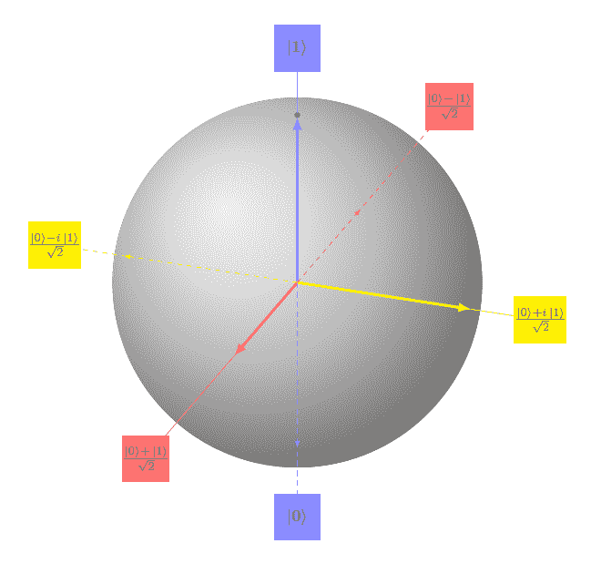
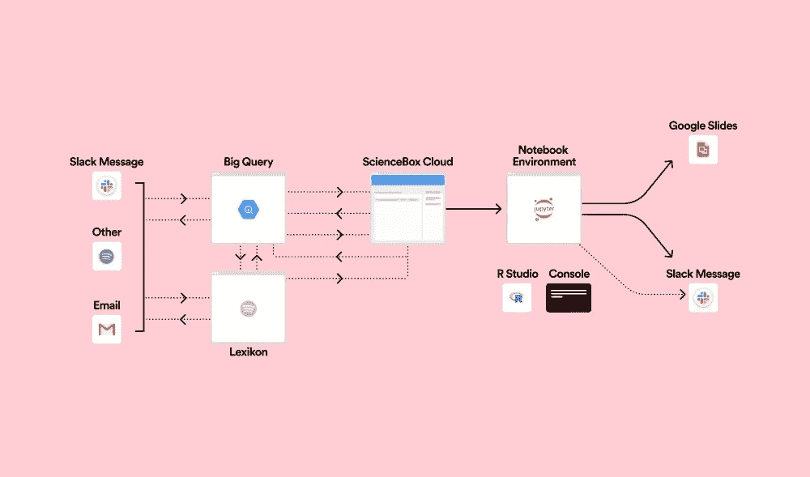
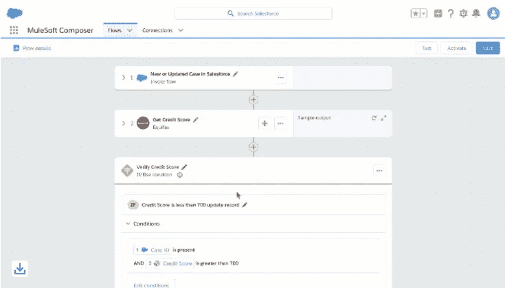
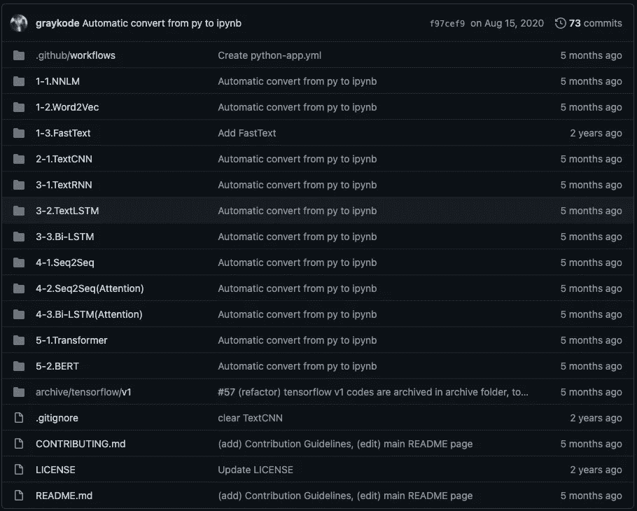
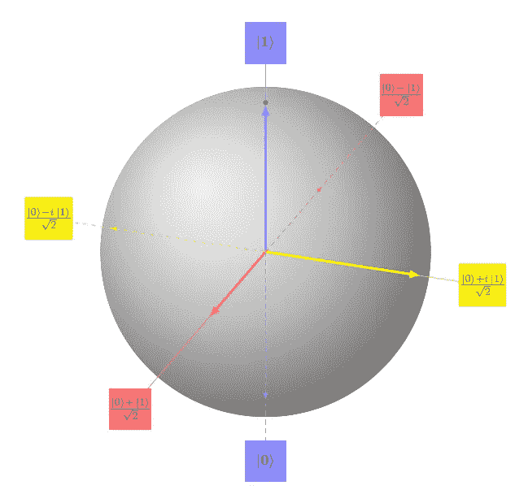
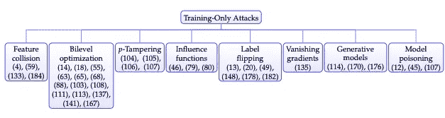

# [ML UTD 30]最新的机器学习—数据生活

> 原文：<https://medium.datadriveninvestor.com/ml-utd-30-machine-learning-up-to-date-life-with-data-721a1817033b?source=collection_archive---------36----------------------->

## 第 30 期每周简讯来自[生活与数据](https://lifewithdata.org)

The possible transformations applied on a qubit can be represented by rotations of a Bloch sphere. [[source](https://thegradient.pub/knocking-on-turings-door-quantum-computing-and-machine-learning/)]

这是来自 [**LifeWithData**](https://lifewithdata.org) 博客的 ML UTD #30！在当今软件工程和机器学习的繁忙前线，我们帮助您将信号与噪声分离。

[**LifeWithData**](https://lifewithdata.org) 致力于提供精心策划的机器学习&软件工程更新，为读者指出没有多余细节的关键发展。这使得整个行业能够进行频繁、简洁的更新，而不会出现信息过载。

# 应用程序

*   在 Spotify 设计数据科学工具
*   机器学习正在走向实时化
*   为什么我们在自动化上投资(甚至更多)

# 学术界

*   深度学习的自然语言处理教程
*   敲开图灵的门:量子计算和机器学习
*   机器学习的数据集安全:数据中毒、后门攻击和防御

# 在 Spotify 设计数据科学工具

A workflow showing how feature changes would affect the user experience. [[source](https://spotify.design/article/designing-data-science-tools-at-spotify)]

> *直到最近，Spotify 的数据科学家每天使用的工具大多是由工程师设计的。没有人致力于从整体上看待数据科学家正在经历的问题。这意味着很多时候，这些工具都是通过低效的临时解决方案组合在一起的。*
> 
> *在过去的一年中，我们组建了一个设计团队来重新思考现有的堆栈并清除这些不良做法。*
> 
> *我是 Spotify 研发社区的一名产品设计师，我在数据工具领域工作了大约一年，这使我成为团队中服务时间最长的设计师之一。我被请来与为数据科学家开发平台和体验的工程团队合作。最近，我帮助创建并推出了一个新的数据科学工具，该工具将加快见解的产生，并消除那些旧的、低效的工作方式。*
> 
> [*…继续阅读*](https://spotify.design/article/designing-data-science-tools-at-spotify)

《丛林奇兵》

*   [文章](https://spotify.design/article/designing-data-science-tools-at-spotify)
*   [【文章】人工智能需求层次](https://hackernoon.com/the-ai-hierarchy-of-needs-18f111fcc007)
*   信用:[@ siusabs](https://twitter.com/siusabs)[@ SpotifyEng](https://twitter.com/SpotifyEng)

# 机器学习正在走向实时化

A diagram showing the fundamental differences that EDAs have from request-response [[source](https://huyenchip.com/2020/12/27/real-time-machine-learning.html)]

> *在与美国、欧洲和中国主要互联网公司的机器学习和基础设施工程师交谈后，我注意到了两组公司。一个小组已经对基础设施进行了大量投资(数亿美元)，以实现实时机器学习，并已经看到了投资回报。另一组仍然怀疑实时 ML 是否有价值。*
> 
> *对于实时 ML 意味着什么，似乎还没有达成共识，对于行业内如何实现它，也没有太多深入的讨论。在这篇文章中，我想分享我在和十几家正在这么做的公司交谈后所学到的东西。*
> 
> [*…继续阅读*](https://huyenchip.com/2020/12/27/real-time-machine-learning.html)

《丛林奇兵》

*   [文章](https://huyenchip.com/2020/12/27/real-time-machine-learning.html)
*   [【文章】超越微服务:流，状态，&可扩展性](https://www.infoq.com/presentations/microservices-streams-state-scalability/)
*   [【小标题】中美之间的 MLOps 竞赛](https://huyenchip.com/2020/12/27/real-time-machine-learning.html#mlops_china_vs_us)
*   信用: [@chipro](https://twitter.com/chipro)

# Salesforce:为什么我们在自动化上投资(甚至更多)

MuleSoft Composer for Salesforce automatically brings in data from disparate apps […] [[source](https://www.salesforce.com/news/stories/why-were-investing-in-automation/)]

> *问题是:企业没有准备好以这种极快的速度前进。他们能否适应，能否快速适应，将决定成功与否。*
> 
> *为了快速实现数字化转型目标，他们需要提高员工的工作速度，让客户满意。这需要智能自动化。*
> 
> 如果自动化做得好，它会提高生产力，增强员工的能力。库切拉说，它还通过消除“乏味的、重复的步骤，这些步骤是吸取灵魂的，人们不喜欢做的”，解放了人类，让他们做他们唯一应该做的工作。“自动化为人们提供了带宽和喘息空间，让他们可以做更有趣、更鼓舞人心、更有价值的工作，推动业务向前发展，例如建立客户关系或做出下一步该做什么的艰难决定。”
> 
> [*……继续阅读*](https://www.salesforce.com/news/stories/why-were-investing-in-automation/)

《丛林奇兵》

*   [条](https://www.salesforce.com/news/stories/why-were-investing-in-automation/)
*   [【文章】为什么自动化的未来是人类](https://www.salesforce.com/blog/human-automation-future-employee-experience/)
*   信用:[@ sammyspiegs](https://twitter.com/sammyspiegs)[@ sales force](https://twitter.com/salesforce)

# 深度学习的自然语言处理教程

A snapshot of the current contents of the repo [[source](https://github.com/graykode/nlp-tutorial)]

> `*nlp-tutorial*` *是一个教程库，面向使用 Pytorch 或 Tensorflow 学习 NLP(自然语言处理)的人。NLP 中的大多数模型都是用不到 100 行代码实现的。*
> 
> [*…继续阅读*](https://github.com/graykode/nlp-tutorial)

《丛林奇兵》

*   [条](https://github.com/graykode/nlp-tutorial)
*   鸣谢:[@ Github 上的 gray kode](https://github.com/graykode)

# 敲开图灵的门:量子计算和机器学习

The possible transformations applied on a qubit can be represented by rotations of a Bloch sphere. [[source](https://thegradient.pub/knocking-on-turings-door-quantum-computing-and-machine-learning/)]

> *零和一。零零碎碎。积极和消极。最重要的是，开关，有些开，有些关。我们都已经习惯于看到和使用现代计算机。每年，像英特尔、AMD、ARM 和 NVIDIA 这样的行业巨头都会发布他们的下一代顶级芯片，锁定犄角，推动我们今天所知的传统计算机的发展。*
> 
> *如果我们严格评估云上托管的众多新多核 CPU、GPU 和庞大的计算集群，我们将很快意识到更快的处理器不一定会带来更高的计算能力。诚然，在过去几十年中，计算速度呈指数级增长，我们可以处理的数据量也是如此。我们可以在互联网上存储和分析数十亿字节的数据，训练像 OpenAI 的 GPT-3 这样的深度学习模型，并实现在围棋和国际象棋等复杂游戏中击败冠军和大师所需的计算智能。但是，所有这些技术进步是否已经扩展了我们使用计算机的基本功能，超出了我们最初的起点？或者简单地说，我们改变了传统的计算模式了吗？*
> 
> [*……继续阅读*](https://thegradient.pub/knocking-on-turings-door-quantum-computing-and-machine-learning/)

《丛林奇兵》

*   [条](https://thegradient.pub/knocking-on-turings-door-quantum-computing-and-machine-learning/)
*   信用:[@ AtherFawaz](https://twitter.com/atherfawaz?lang=en)@ @ gradientpub

# 机器学习的数据集安全性:数据中毒、后门攻击和防御

A taxonomy of training-only data poisoning attacks [[source](https://arxiv.org/abs/2012.10544)]

> *随着机器学习系统规模的增长，他们的培训数据需求也在增长，迫使从业者将培训数据的管理自动化和外包，以实现最先进的绩效。对数据收集过程缺乏可信的人工监督使组织面临安全漏洞；可以操纵训练数据以控制和降低所学习的模型的下游行为。这项工作的目标是系统地分类和讨论大量数据集漏洞和利用、防御这些威胁的方法以及该领域的一系列开放问题。除了描述各种中毒和后门威胁模型以及它们之间的关系之外，我们还开发了它们的统一分类法。*
> 
> [*……继续阅读*](https://arxiv.org/pdf/2012.10544.pdf)

《丛林奇兵》

*   [第](https://arxiv.org/abs/2012.10544)条
*   信用:本论文[多位作者](https://arxiv.org/pdf/2012.10544.pdf)

**访问专家视图—** [**订阅 DDI 英特尔**](https://datadriveninvestor.com/ddi-intel)

# 保持最新

ML UTD #30 到此为止。然而，在学术界和工业界，事情发生得很快！除了本时事通讯之外，请在[生活数据](https://lifewithdata.org/)博客、[媒体文章](https://medium.com/@anthonyagnone)和[推特](https://twitter.com/@anthonyagnone)上保持更新。

# 继续学习

 [## 在远程第一数据员工队伍中生存和发展的秘诀

### 提示:它不仅仅是缩放和 Github

towardsdatascience.com](https://towardsdatascience.com/tips-to-survive-and-thrive-in-the-remote-first-data-workforce-34944abddd29)  [## 亚马逊希望让您成为一名 ML 从业者——免费

### 这家科技巨头计划通过公开其长期内部材料来提高其语言水平

towardsdatascience.com](https://towardsdatascience.com/amazon-wants-to-make-you-an-ml-practitioner-for-free-552c46cea9ba)  [## 使用 fast.ai 和 Deepnote 打击旧金山犯罪

### 有了正确的 ML 框架和笔记本平台，您就走上了快车道

towardsdatascience.com](https://towardsdatascience.com/fight-san-francisco-crime-with-fast-ai-and-deepnote-6db2b96d2a83) 

*原载于 2021 年 1 月 6 日*[*【https://www.lifewithdata.org】*](http://www.lifewithdata.org/newsletter/mlutd30)*。*