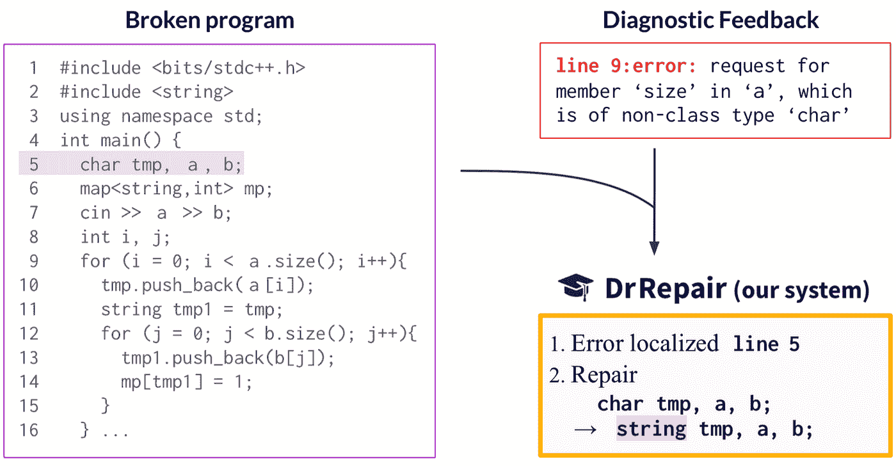
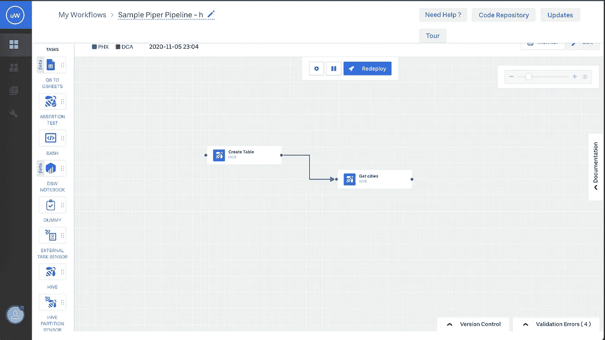
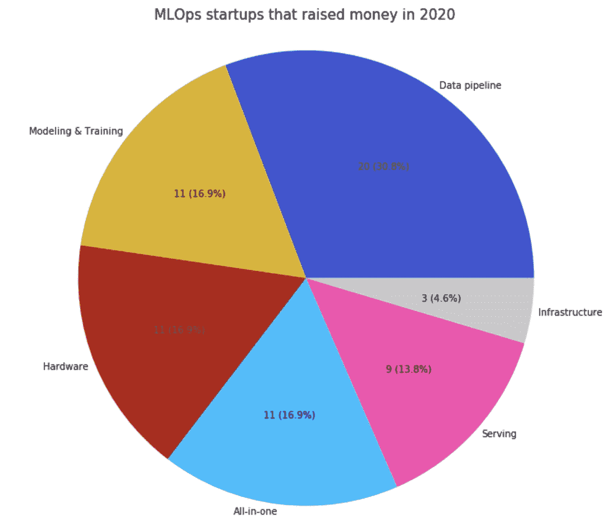
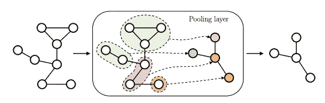

# [ML UTD 31]机器学习最新—数据生活

> 原文：<https://medium.datadriveninvestor.com/ml-utd-31-machine-learning-up-to-date-life-with-data-b077bd2c14bd?source=collection_archive---------35----------------------->

## 第 31 期每周简讯来自[生活有数据](https://lifewithdata.org)

A diagram of the functionality of the DrRepair system [[source](https://ai.stanford.edu/blog/DrRepair/)]

这是来自 [**LifeWithData**](https://lifewithdata.org) 博客的 ML UTD #31！在当今软件工程和机器学习的繁忙前线，我们帮助您将信号与噪声分离。

[**LifeWithData**](https://lifewithdata.org) 致力于提供精心策划的机器学习&软件工程更新，为读者指出没有多余细节的关键发展。这使得整个行业能够进行频繁、简洁的更新，而不会出现信息过载。

# 应用程序

*   无代码工作流编制器，可大规模构建批处理和流管道
*   18 个机器学习最佳实践
*   Chip Huyen: MLOps 工具前景 v2

# 理论

*   当机器在听时如何说话:人工智能时代的公司信息披露
*   图形深度学习的温和介绍
*   从错误信息中学习修复程序

# 无代码工作流编制器，可大规模构建批处理和流管道

uWorc’s drag-and-drop workflow editor [[source](https://eng.uber.com/no-code-workflow-orchestrator/)]

> *在优步，每天有数 Pb 的数据在各种平台之间和平台内部移动。我们通过强大的数据管道主干推动这种数据移动。无论是从数百万次优步旅行中摄取数据，还是为分析和机器学习模型转换摄取的数据，都是通过这些管道进行的。客观地说，优步的数据平台运行着超过 15，000 条数据管道！*
> 
> *但是随着时间的推移，现有的基于 Python 框架的方法开始对管道创建者征收生产力税。优步越来越多的数据分析师和城市运营用户依赖少数数据工程师来创建他们的管道。几个小时的工作往往变成几天或几周。除此之外，优步内部对实时数据和见解的需求也在快速增长。但是，由于完全不同的技术堆栈和构建实时管道的复杂性，我们无法像我们希望的那样快速采用实时洞察力。获得正确的代码更加困难。*
> 
> *构建数据工作流需要更简单、统一和直观的用户体验，这是统一工作流编制器 uWorc 的主要推动力。*
> 
> [*…继续阅读*](https://eng.uber.com/no-code-workflow-orchestrator/)

《丛林奇兵》

*   [文章](https://eng.uber.com/no-code-workflow-orchestrator/)
*   [AWS 数据管道](https://aws.amazon.com/datapipeline/)
*   [Azure 数据工厂](https://azure.microsoft.com/en-us/services/data-factory/)
*   [阿帕奇气流](https://airflow.apache.org/)
*   [阿帕奇弗林克](https://flink.apache.org/)
*   鸣谢: [@d3fmacro](https://twitter.com/d3fmacro)

# 18 个机器学习最佳实践

Non-model components to consider in the ML development process [[source](https://rubikscode.net/2020/11/30/18-machine-learning-best-practices/)]

> *机器学习和深度学习(一般来说是 AI)不再只是时髦的词汇。他们成为了我们企业和初创公司不可或缺的一部分。这也影响了软件开发，事实上，它走得更远。我们不能仅仅将机器学习组件视为生态系统的另一部分，因为它们是做出决策的系统的一部分。这些组件也将我们的关注点转移到了数据上，这给基础架构带来了不同的思维模式。因为所有这些事情，构建基于机器学习的应用程序并不是一件容易的事情。数据科学家、软件开发人员和 DevOps 工程师需要在几个领域通力合作，才能开发出高质量的产品。*
> 
> [*…继续阅读*](https://rubikscode.net/2020/11/30/18-machine-learning-best-practices/)

《丛林奇兵》

*   [条](https://rubikscode.net/2020/11/30/18-machine-learning-best-practices/)
*   [Rubikscode.net 关于 TDD 的文章](https://rubikscode.net/2019/03/11/test-driven-development-tdd-with-python-mock-objects/)
*   信用: [@NMZivkovic](https://twitter.com/NMZivkovic)

# Chip Huyen: MLOps 工具前景 v2

MLOps startups that raised money in 2020 [[source](https://huyenchip.com/2020/12/30/mlops-v2.html)]

> 去年 6 月，我发表了《我从查看 200 个机器学习工具中学到了什么》这篇文章。这个帖子引起了一些关注，我收到了很多人的消息，告诉我一些新工具。我更新了旧列表，现在包含了 284 个工具。当我发现新工具时，我会继续更新列表。任何线索将不胜感激！
> 
> *在寻找这些 MLOps 工具时，我发现了一些关于 MLOps 领域的有趣之处:*
> 
> *1。越来越关注部署*
> 
> *2。湾区仍然是机器学习的中心，但不是唯一的枢纽*
> 
> *3。美国和中国的移动运营商基础设施正在分化*
> 
> *4。学术界对机器学习生产越来越感兴趣*
> 
> [*…继续读*](https://huyenchip.com/2020/12/30/mlops-v2.html)

《丛林奇兵》

*   [条](https://huyenchip.com/2020/12/30/mlops-v2.html)
*   [谷歌地图的 MLOps 景观](https://docs.google.com/spreadsheets/d/1i8BzE4puGQ3dmQueu4LQCcwaqrulgK1Vb-xeFwhy6gY/edit?usp=sharing)
*   鸣谢: [@chipro](https://twitter.com/chipro)

# 当机器在听时如何说话:人工智能时代的公司信息披露

Photo by [Austin Distel](https://unsplash.com/@austindistel?utm_source=unsplash&utm_medium=referral&utm_content=creditCopyText) on [Unsplash](https://unsplash.com/s/photos/money-data?utm_source=unsplash&utm_medium=referral&utm_content=creditCopyText)

> 本文分析了公司信息披露是如何被算法交易员、机器人投资顾问和定量分析师雇佣的机器处理器重塑的。我们的发现表明，以机器下载为代表的不断增长的机器和人工智能读者群，促使企业准备对机器解析和处理更友好的文件。此外，具有高预期机器下载的公司以迎合机器和人工智能读者的方式管理文本情感和音频情感，例如通过有区别地避免被计算算法感知为与人类读者相比是负面的词，以及通过展示机器学习软件处理器喜欢的语音情感。Loughran 和 McDonald (2011)的出版物有助于将测量情绪的变化归因于机器和人工智能读者群。虽然现有的研究已经探索了投资者和研究人员如何应用机器学习和计算工具来量化来自披露和新闻的定性信息，但这项研究首次确定并分析了对企业披露决策的反馈效应，即企业如何在知道机器在听的情况下调整他们的说话方式。
> 
> [*…继续阅读*](https://papers.ssrn.com/sol3/papers.cfm?abstract_id=3683802)

《丛林奇兵》

*   [条](https://papers.ssrn.com/sol3/papers.cfm?abstract_id=3683802)
*   [论文作者](https://papers.ssrn.com/sol3/papers.cfm?abstract_id=3683802)

# 图形深度学习的温和介绍

An example of pooling in GNNs [[source](https://arxiv.org/pdf/1912.12693.pdf)]

> *图形数据的自适应处理是一个长期的研究主题，最近已被巩固为深度学习社区的主要兴趣主题。相关研究的数量和广度的快速增长是以知识的系统化和对早期文献的关注为代价的。这项工作旨在作为图形深度学习领域的教程介绍。它倾向于对主要概念和建筑方面的一致和渐进的介绍，而不是对最新文献的阐述，读者可以参考可用的调查。本文采用自上而下的观点，介绍了基于结构化信息处理的局部迭代方法的图形表示学习的一般公式。它介绍了可以结合起来设计新颖和有效的图形神经模型的基本构件。方法论的阐述被在领域的有趣的研究挑战和应用的讨论补充。*
> 
> [*…继续阅读*](https://arxiv.org/pdf/1912.12693.pdf)

《丛林奇兵》

*   [文章](https://arxiv.org/pdf/1912.12693.pdf)
*   鸣谢:[论文作者](https://arxiv.org/abs/1912.12693)

# 从错误信息中学习修复程序

A diagram of the functionality of the DrRepair system [[source](https://ai.stanford.edu/blog/DrRepair/)]

> *编写程序时，无论是对初学者(想象一下你上过的入门编程课)还是对专业开发人员(例如来自 Google 的* [*这个案例研究*](https://static.googleusercontent.com/media/research.google.com/en//pubs/archive/42184.pdf) *)来说，都要花费大量的时间来调试或修复源代码错误。自动化程序修复可以极大地提高编程和学习编程的效率。在我们最近在 ICML 2020 上发表的工作中，我们研究了如何使用机器学习来自动修复程序。*
> 
> [*……继续阅读*](https://ai.stanford.edu/blog/DrRepair/)

《丛林奇兵》

*   [条](https://ai.stanford.edu/blog/DrRepair/)
*   [arXiv 白皮书](https://arxiv.org/pdf/2005.10636.pdf)
*   [谷歌关于构建错误的案例研究](https://static.googleusercontent.com/media/research.google.com/en//pubs/archive/42184.pdf)
*   鸣谢:[@ michiayasunaga](https://twitter.com/michiyasunaga)

# 保持最新状态

ML UTD #31 到此为止。然而，在学术界和工业界，事情发生得很快！除了[这篇时事通讯](https://www.lifewithdata.org/newsletter)，让自己在 [LifeWithData](https://lifewithdata.org/) 博客、[Medium 上的文章](https://medium.com/@anthonyagnone)和 [Twitter](https://twitter.com/@anthonyagnone) 上保持更新。

# 不断学习

 [## 在远程优先的数据工作人员中生存和发展的技巧

### 提示:它不仅仅是 Zoom 和 Github

towardsdatascience.com](https://towardsdatascience.com/tips-to-survive-and-thrive-in-the-remote-first-data-workforce-34944abddd29)  [## 亚马逊想让你免费成为一名人工智能从业者

### 这家科技巨头计划通过公开其长期的内部材料来提高 ML 的熟练度

towardsdatascience.com](https://towardsdatascience.com/amazon-wants-to-make-you-an-ml-practitioner-for-free-552c46cea9ba)  [## 用 fast.ai 和 Deepnote 打击旧金山犯罪

### 有了正确的 ML 框架和笔记本平台，您就在快车道上了

towardsdatascience.com](https://towardsdatascience.com/fight-san-francisco-crime-with-fast-ai-and-deepnote-6db2b96d2a83) 

*原载于 2021 年 1 月 13 日 https://www.lifewithdata.org**的* [*。*](http://www.lifewithdata.org/newsletter/mlutd31)