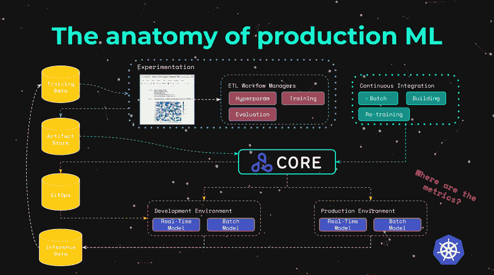
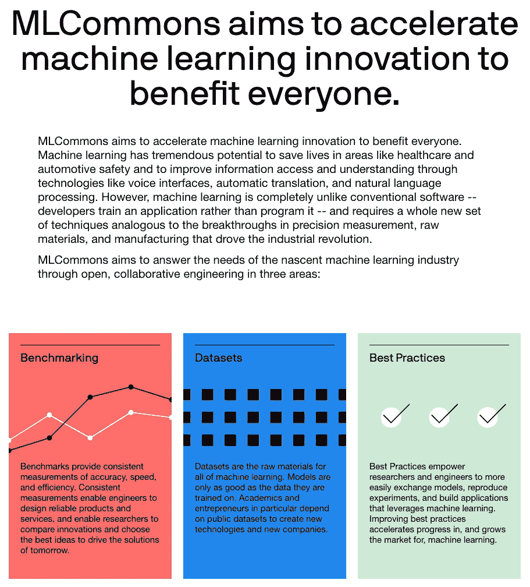
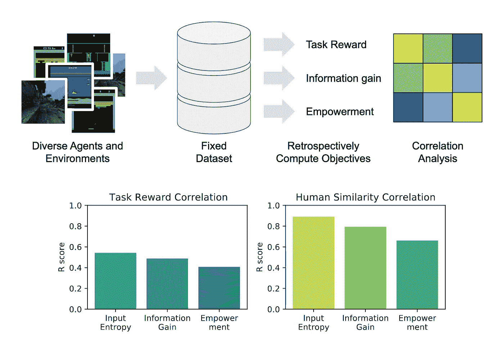
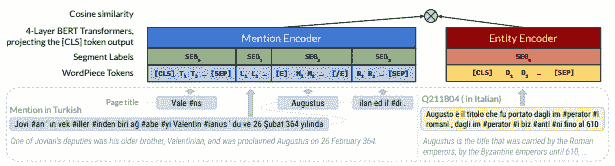

# [ML UTD 32]最新的机器学习—数据生活

> 原文：<https://medium.datadriveninvestor.com/ml-utd-32-machine-learning-up-to-date-life-with-data-3921d18a1669?source=collection_archive---------29----------------------->

## 第 32 期每周简讯来自[生活有数据](https://lifewithdata.org)

这是来自 [**LifeWithData**](https://lifewithdata.org) 博客的 ML UTD #32！在当今软件工程和机器学习的繁忙前线，我们帮助您将信号与噪声分离。

[**LifeWithData**](https://lifewithdata.org) 致力于提供精心策划的机器学习&软件工程更新，为读者指出没有多余细节的关键发展。这使得整个行业能够进行频繁、简洁的更新，而不会出现信息过载。

# 应用程序

*   生产机器学习监控:异常值、漂移、解释者和统计性能
*   MLCommons 发起并联合了 50 多位全球技术和学术领袖
*   OpenLineage 简介

# 理论

*   无奖励评估代理
*   100 种语言的实体链接
*   谷歌发布其 Objectron 数据集

# 生产机器学习监控:异常值、漂移、解释者和统计性能

The anatomy of production ML [[source](https://towardsdatascience.com/production-machine-learning-monitoring-outliers-drift-explainers-statistical-performance-d9b1d02ac158)]

> *在本文中，我们展示了一个端到端示例，展示了在生产中监控机器学习模型的最佳实践、原则、模式和技术。我们将展示如何使标准微服务监控技术适应已部署的机器学习模型，以及更高级的范式，包括概念漂移、离群点检测和人工智能可解释性。*
> 
> *我们将从零开始训练图像分类机器学习模型，将其作为微服务部署在 Kubernetes 中，并引入广泛的高级监控组件。监控组件将包括离群检测器、漂移检测器、人工智能解释器和度量服务器——我们将涵盖用于每一个的底层架构模式，这些模式是在考虑规模的情况下开发的，旨在跨数百或数千个异构机器学习模型有效工作。*
> 
> [*…继续阅读*](https://towardsdatascience.com/production-machine-learning-monitoring-outliers-drift-explainers-statistical-performance-d9b1d02ac158)

《丛林奇兵》

*   [条](https://towardsdatascience.com/production-machine-learning-monitoring-outliers-drift-explainers-statistical-performance-d9b1d02ac158)
*   [视频演示](https://youtu.be/QcevzK9ZuDg)
*   [Jupyter 笔记本代号](https://github.com/axsaucedo/seldon_experiments/blob/master/monitoring-talk/cifar10_example.ipynb)
*   [谢顿核心](https://github.com/SeldonIO/seldon-core/)
*   信用: [@AxSaucedo](https://twitter.com/AxSaucedo) | [亚历杭德罗·绍切多](https://medium.com/u/32de426f7278?source=post_page-----3921d18a1669--------------------------------)

# MLCommons 发起并联合了 50 多位全球技术和学术领袖

Snippet from the front page of the MLCommons website [[source](https://mlcommons.org/)]

> *今天，开放工程联盟 MLCommons 启动了其行业-学术合作伙伴关系，以加速机器学习创新，并为公众利益拓宽对这一关键技术的访问。这家非营利组织最初以 MLPerf 的名义成立，现在拥有一个创始董事会，包括来自阿里巴巴、脸书人工智能、谷歌、英特尔和英伟达的代表，以及哈佛大学的 Vijay Janapa Reddi 教授；和 50 多个创始成员。创始成员包括全球超过 15 家专注于半导体、系统和软件的初创公司和小公司，以及来自加州大学伯克利分校、斯坦福大学和多伦多大学等大学的研究人员。*
> 
> *MLCommons 将推进最新人工智能和机器学习数据集和模型、最佳实践、基准和指标的开发和获取。目的是让尽可能多的人尽可能快地访问机器学习解决方案，如计算机视觉、自然语言处理和语音识别。*
> 
> [*…继续阅读*](https://mlcommons.org/en/news/mlcommons-launch)

《丛林奇兵》

*   [条](https://mlcommons.org/en/news/mlcommons-launch)
*   [MLPerf](http://www.mlperf.org/)
*   [人的语音数据集](https://mlcommons.org/en/peoples-speech/)
*   MLCube
*   信用: [@commons_ml](https://twitter.com/commons_ml)

# OpenLineage 简介

[Source](https://datakin.com/introducing-openlineage/)

> 对于任何关注这一领域的人来说，过去几年数据革命的加速已经非常令人兴奋。Hadoop 早期的“大数据”项目的试验性部署现在已经演变为新数据工具整个生态系统的全面生产和任务关键型部署，不仅在领先的技术公司中，而且越来越多地在每个行业中进行。
> 
> 然而，随着数据技术征服世界，赌注也越来越高。
> 
> 特别是，当需要时，数据总是可用的、最新的和正确的变得非常重要。换句话说，需要信任数据来支持任务关键型活动。
> 
> *不幸的是，数据技术日益增长的重要性也伴随着整体复杂性的相应增加[…]*
> 
> *在与每天操作这些数据生态系统的从业者交谈时，一方面，数据技术的重要性日益增加，另一方面，作为任务关键型系统来管理它们的可用工具之间存在明显的矛盾，导致许多效率低下，无法提供强有力的保证，从而对所使用的数据缺乏信任。*
> 
> [*…继续阅读*](https://datakin.com/introducing-openlineage/)

《丛林奇兵》

*   [条](https://datakin.com/introducing-openlineage/)
*   [数据金](https://datakin.com/)
*   [OpenLineage Github](https://github.com/OpenLineage/OpenLineage)
*   [马尔克斯开源元数据项目](http://marquezproject.ai/)
*   信用: [@DatakinHQ](https://twitter.com/datakinhq) |

# 无奖励评估代理

A flow of analyzing correlations between intrinsic and supervised objectives [[source](https://danijar.com/project/agenteval/)]

> 强化学习使智能体能够在未知的环境中解决具有挑战性的任务。然而，手工制作奖励函数可能耗时、昂贵，并且容易出现人为错误。竞争目标已经被提出，让代理人在没有外部监督的情况下学习，但还不清楚它们在多大程度上反映了任务奖励或人类行为。为了加速内在目标的开发，我们在预先收集的代理行为数据集上追溯计算潜在目标，而不是在线优化它们，并通过分析它们的相关性来比较它们。我们研究了七个代理人、三个雅达利游戏和 3D 游戏《我的世界》的输入熵、信息增益和授权。我们发现，所有三个内在目标与人类行为相似性度量的相关性比与任务奖励的相关性更强。此外，输入熵和信息增益与人类相似性的相关性比任务回报更强，这表明使用内在目标来设计行为类似于人类玩家的代理。
> 
> [*……继续阅读*](https://arxiv.org/pdf/2012.11538.pdf)

*   [论文](https://arxiv.org/pdf/2012.11538.pdf)
*   [工程地点](https://danijar.com/project/agenteval/)
*   [密涅尔](https://minerl.io/)
*   [Github open ai/大型-好奇号](https://github.com/openai/large-scale-curiosity)
*   [Github open ai/随机网络蒸馏](https://github.com/openai/random-network-distillation)
*   [Github 希尔-a/稳定基线](https://github.com/hill-a/stable-baselines)
*   鸣谢: [@danijarh](https://twitter.com/danijarh) 等论文作者

# 100 种语言的实体链接

Diagram of the Dual Encoder Model F [[source](https://arxiv.org/pdf/2011.02690.pdf)]

> *我们提出了一种新的多语言实体链接公式，其中特定语言的提及解析为语言不可知的知识库。我们在这个新的设置中训练了一个双编码器，基于先前的工作，改进了特征表示、负挖掘和辅助实体配对任务，以获得覆盖 100 多种语言和 2000 万个实体的单个实体检索模型。该模型优于来自更有限的跨语言链接任务的最先进的结果。罕见的实体和低资源语言在这种大规模上构成了挑战，所以我们提倡更加关注零次和少数几次评估。为此，我们提供了 Mewsli-9，这是一个新的大型多语言数据集(*[*【http://goo.gle/mewsli-dataset】*](http://goo.gle/mewsli-dataset)*)，与我们的设置相匹配，并展示了基于频率的分析如何为我们的模型和训练增强提供关键见解。*
> 
> [*……继续阅读*](https://arxiv.org/pdf/2011.02690.pdf)

《丛林奇兵》

*   [条](https://arxiv.org/pdf/2011.02690.pdf)
*   [Github 上的数据集](https://github.com/google-research/google-research/tree/master/dense_representations_for_entity_retrieval/mel)
*   鸣谢:论文作者

# 谷歌发布其 Objectron 数据集

Visualizations of annotations in the Objectron data set [[source](http://www.google.com/)]

> *object Ron 数据集是以对象为中心的短视频剪辑的集合，伴随着 AR 会话元数据，包括相机姿态、稀疏点云和周围环境中平面表面的特征。在每个视频中，摄像机围绕物体移动，从不同的角度捕捉它。数据还包含每个对象的手动注释的 3D 边界框，这些框描述了对象的位置、方向和尺寸。该数据集由 15K 个带注释的视频剪辑组成，辅以超过 400 万个带注释的图像，分类如下:自行车、书籍、瓶子、相机、麦片盒、椅子、杯子、笔记本电脑和鞋子。此外，为了确保地理多样性，我们的数据集收集自五大洲的 10 个国家。除了数据集，我们还分享了针对四类物体(鞋子、椅子、杯子和相机)的 3D 物体检测解决方案。这些模型使用该数据集进行训练，并在 MediaPipe 中发布，media pipe 是谷歌为直播和流媒体提供跨平台可定制 ML 解决方案的开源框架。*
> 
> [*…继续阅读*](http://www.google.com)

《丛林奇兵》

*   github[Google-research-datasets/Objectron](https://github.com/google-research-datasets/Objectron)
*   [数据集格式](https://github.com/google-research-datasets/Objectron#dataset-format)
*   [教程](https://github.com/google-research-datasets/Objectron#tutorials)
*   [媒体管道](https://mediapipe.dev/)
*   信用: [@GoogleAI](https://twitter.com/GoogleAI)

# 保持最新状态

ML UTD #32 到此为止。然而，在学术界和工业界，事情发生得很快！除了[这份时事通讯](https://www.lifewithdata.org/newsletter)之外，让自己在 [LifeWithData](https://lifewithdata.org/) 博客、[Medium](https://medium.com/@anthonyagnone)上的文章和 [Twitter](https://twitter.com/@anthonyagnone) 上保持更新。

# 不断学习

 [## [ML UTD 31]机器学习最新—数据生活

### 《生活与数据》周刊第 31 期

medium.com](https://medium.com/datadriveninvestor/ml-utd-31-machine-learning-up-to-date-life-with-data-b077bd2c14bd)  [## [CheckThisOut] Python 丰富的终端文本格式化库

### Rich 是一个 Python 库，用于终端中丰富的文本和漂亮的格式。

medium.com](https://medium.com/datadriveninvestor/checkthisout-pythons-rich-library-for-terminal-text-formatting-e4da97a0beda)  [## 在远程优先的数据工作人员中生存和发展的技巧

### 提示:它不仅仅是 Zoom 和 Github

towardsdatascience.com](https://towardsdatascience.com/tips-to-survive-and-thrive-in-the-remote-first-data-workforce-34944abddd29) 

*原载于 2021 年 1 月 20 日*[*【https://www.lifewithdata.org】*](http://www.lifewithdata.org/newsletter/mlutd32)*。*