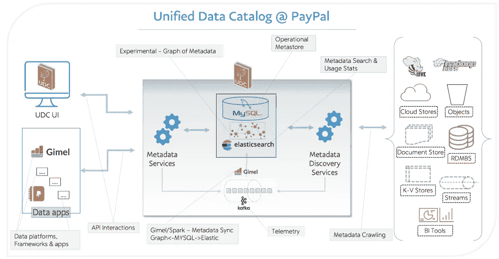
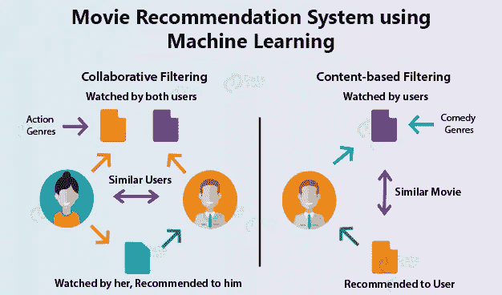
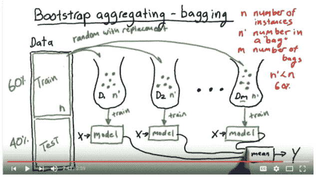
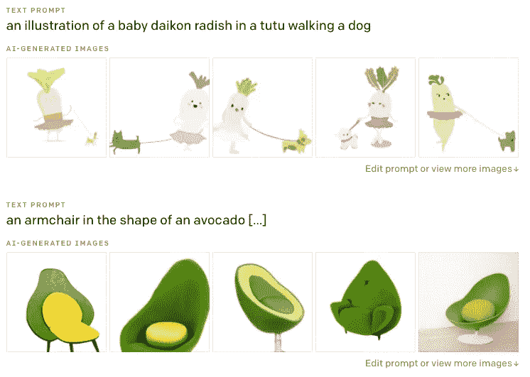

# [ML UTD 34]最新的机器学习—数据生活

> 原文：<https://medium.datadriveninvestor.com/ml-utd-34-machine-learning-up-to-date-life-with-data-ebe1f44057d0?source=collection_archive---------34----------------------->

第 34 期每周简讯来自[生活有数据](https://lifewithdata.org)

[Source](https://developers.googleblog.com/2020/12/announcing-the-newest-addition-to-mlkit-entity-extraction.html)

这是来自 [**LifeWithData**](https://lifewithdata.org) 博客的 ML UTD #34！在当今软件工程和机器学习的繁忙前线，我们帮助您将信号与噪声分离。

[**LifeWithData**](https://lifewithdata.org) 致力于提供精心策划的机器学习&软件工程更新，为读者指出没有多余细节的关键发展。这使得整个行业能够进行频繁、简洁的更新，而不会出现信息过载。

# 应用程序

*   Paypal 的元数据之旅
*   Google MLKit 增加了实体提取和自拍分割
*   2021 年前 47 个机器学习项目

# 理论

*   学习自然语言处理的实用方法
*   机器和深度学习纲要
*   OpenAI DALL E:从文本中创建图像

# Paypal 的元数据之旅

Unified Data Catalog — High-Level Architecture [[Source](https://medium.com/paypal-engineering/the-journey-of-metadata-at-paypal-c374ac66e2e6)]

> *元数据对 PayPal 来说并不陌生。在 PayPal 的统一数据目录(UDC)之前，人们就试图创建一个全面的元数据系统，UDC 就是今天 PayPal 的企业数据目录。*
> 
> *如今，UDC 是 PayPal 处理数据的核心部分。下面是我们如何从零开始构思、培育和发展企业数据目录的:*
> 
> *经过多年的努力，我们在使 UDC 成为 PayPal 官方企业数据目录方面取得了巨大的进步。我们吸收并推迟了传统上存在的重复产品和功能的责任。我们做出的决定可能不会反映在路线图或产品的可用功能上。因此，回顾一下我们如何将生态系统和组织动态导航到今天的位置是很有意义的。*
> 
> [*…继续阅读*](https://medium.com/paypal-engineering/the-journey-of-metadata-at-paypal-c374ac66e2e6)

《丛林奇兵》

*   [文章](https://medium.com/paypal-engineering/the-journey-of-metadata-at-paypal-c374ac66e2e6)
*   [Github paypal/gimel](https://github.com/paypal/gimel/tree/master/udc)
*   信用:[迪帕克·钱德拉穆利](https://medium.com/u/96a5a5bf4f1d?source=post_page-----ebe1f44057d0--------------------------------)

# Google MLKit 增加了实体提取和自拍分割

[Source](https://developers.googleblog.com/2020/12/announcing-the-newest-addition-to-mlkit-entity-extraction.html)

> 随着当今世界自拍相机和网络摄像头的使用越来越多，能够快速轻松地为相机体验添加效果已经成为许多应用程序开发人员的必需品。
> 
> ML Kit 的自拍分割 API 允许开发人员轻松地将背景从场景中分离出来，并专注于重要的事情。给自拍添加酷炫效果或将用户插入有趣的背景环境从未如此简单。这个 API 在 Android 和 iOS 设备上都产生了低延迟的良好结果。
> 
> *关键功能:
> -方便开发者替换或模糊用户背景
> -适用于单人或多人
> -跨平台支持(iOS 和 Android)
> -在大多数现代手机上实时运行*
> 
> [*…继续阅读*](https://developers.googleblog.com/2020/12/announcing-the-newest-addition-to-mlkit-entity-extraction.html)

《丛林奇兵》

*   [条](https://developers.googleblog.com/2020/12/announcing-the-newest-addition-to-mlkit-entity-extraction.html)
*   [数字墨水识别 API](https://developers.google.com/ml-kit/vision/digital-ink-recognition)
*   [后期检测 API](https://developers.google.com/ml-kit/vision/pose-detection)
*   [实体提取 API](https://developers.google.com/ml-kit/language/entity-extraction)
*   [自拍分段 API](https://developers.google.com/ml-kit/early-access/selfie-segmentation)
*   信用: [@googledevs](https://twitter.com/googledevs)

# 2021 年前 47 个机器学习项目

[Source](https://data-flair.training/blogs/machine-learning-project-ideas)

> 对你正在研究的任何技术有一个实用的洞察力总是好的。
> 
> 虽然教科书和其他学习材料会给你提供所有你需要知道的关于任何技术的知识，但是除非你从事实时项目，否则你无法真正掌握那项技术。
> 
> 在本教程中，您将找到 21 个机器学习项目想法，供初学者、中间用户和专家在 2021 年获得这一不断发展的技术的真实体验。
> 
> *这些机器学习项目的想法将帮助你学习在职业生涯中取得成功所需的所有实用知识，并让你在这个行业中就业。*
> 
> *这些机器学习项目可以用 Python、R 或者其他任何工具开发。*
> 
> 你所要做的就是把这篇文章收藏起来，你永远不会发现自己缺少好的项目想法。
> 
> [*……继续读*](https://data-flair.training/blogs/machine-learning-project-ideas)

《丛林奇兵》

*   [条](https://data-flair.training/blogs/machine-learning-project-ideas)
*   信用: [@DataFlairWS](https://twitter.com/DataFlairWS)

# 学习自然语言处理的实用方法

[Source](https://towardsdatascience.com/learn-nlp-the-practical-way-b854ce1035c4)

> *我喜欢写作，至少到目前为止，它是我职业生涯的核心。但是，在未来几十年的工作中，我觉得忽视自然语言处理(NLP)的进展是危险的。2017 年末，我决定是时候提升技能了。*
> 
> 在这样做的过程中，我遇到了许多“学习指南”,它们本质上是免费课程和书籍的汇编。问题是，仅仅一门课就要占用你数周的时间。同样，消化一本技术书籍也是极其困难的——更不用说一大堆了。
> 
> 对于想学习如何应用 NLP 工具和技术的人来说，这似乎不太现实。这篇文章追溯了我最终铺设的实际学习路径。
> 
> [*…继续阅读*](https://towardsdatascience.com/learn-nlp-the-practical-way-b854ce1035c4)

《丛林奇兵》

*   [条](https://towardsdatascience.com/learn-nlp-the-practical-way-b854ce1035c4)
*   [Fast.ai 的 NLP 课程](https://www.fast.ai/2019/07/08/fastai-nlp/)
*   [伯特和 GPT 的终极 ABBA 解说-2](https://towardsdatascience.com/the-abba-explainer-to-bert-and-gpt-2-ada8ff4d1eca)
*   信用: [Vered Zimmerman](https://medium.com/u/35c722c596d3?source=post_page-----ebe1f44057d0--------------------------------)

# 机器和深度学习纲要

[Source](https://docs.google.com/document/d/1wvtcwc8LOb3PZI9huQOD7UjqUoY98N5r3aQsWKNAlzk/edit#heading=h.mgsvvhp3mmyz)

> *以下是我个人的简编，包括统计学、机器学习、深度学习、计算机科学、数据科学、深度视觉、NLP、云计算、产品管理等领域的许多主题、链接、摘要。*
> 
> 我把这份简编看作是一个门户，是熟练水平的人、行业数据科学家和学者经常访问的资源。
> 
> *下面的* [*链接*](https://docs.google.com/document/d/e/2PACX-1vRE8XQ7y6ovbjWVkf4-Wn4ftXEqRW1a1Zxi6FF1kHsa4zrF4olPRxSwd721zZD5MBiNQtymm4eePAKv/pub) *是本文档自动生成的 HTML 版本，每 5 分钟更新一次。比起你在这里看到的可编辑版本，你们中的一些人可能更喜欢它。*
> 
> 请记住，这是一部持续进行中的作品，约 397 页，涉及各种主题。如果你觉得有些东西应该改变，请使用评论选项，让我知道。
> 
> [*…继续阅读*](https://towardsdatascience.com/the-last-machine-deep-learning-compendium-youll-ever-need-dc973643c4e1)

《丛林奇兵》

*   [文章](https://towardsdatascience.com/the-last-machine-deep-learning-compendium-youll-ever-need-dc973643c4e1)
*   [实际文件](https://docs.google.com/document/d/1wvtcwc8LOb3PZI9huQOD7UjqUoY98N5r3aQsWKNAlzk/edit#heading=h.mgsvvhp3mmyz)
*   鸣谢: [@cohenori](https://cohenori.medium.com/)

# OpenAI DALL E:从文本中创建图像

[Source](https://openai.com/blog/dall-e/)

> *DALL E 是 GPT-3 的 120 亿参数版本，使用文本-图像对的数据集，经过训练从文本描述中生成图像。我们发现它具有多种多样的功能，包括创建动物和物体的拟人化版本，以看似合理的方式组合不相关的概念，渲染文本，以及对现有图像进行转换。*
> 
> [*…继续阅读*](https://openai.com/blog/dall-e/)

《丛林奇兵》

*   [条](http://www.google.com/)
*   [夹子](https://openai.com/blog/clip/)
*   [VQVAE-2](https://arxiv.org/abs/1906.00446)
*   信用: [@OpenAI](https://twitter.com/openai)

# 保持最新状态

ML UTD #34 到此为止。然而，在学术界和工业界，事情发生得很快！除了[这份时事通讯](https://www.lifewithdata.org/newsletter)之外，随时关注 [LifeWithData](https://lifewithdata.org/) 博客、[Medium 上的文章](https://medium.com/@anthonyagnone)和 [Twitter](https://twitter.com/@anthonyagnone) 。

# 不断学习

 [## [ML UTD 33]最新的机器学习—数据生活

### 《生活与数据》周刊第 33 期

medium.com](https://medium.com/datadriveninvestor/ml-utd-33-machine-learning-up-to-date-life-with-data-12af85b4634f)  [## [CheckThisOut] Python 丰富的终端文本格式化库

### Rich 是一个 Python 库，用于终端中丰富的文本和漂亮的格式。

medium.com](https://medium.com/datadriveninvestor/checkthisout-pythons-rich-library-for-terminal-text-formatting-e4da97a0beda)  [## 在远程优先的数据工作人员中生存和发展的技巧

### 提示:它不仅仅是 Zoom 和 Github

towardsdatascience.com](https://towardsdatascience.com/tips-to-survive-and-thrive-in-the-remote-first-data-workforce-34944abddd29) 

*原载于 2021 年 2 月 3 日*[*【https://www.lifewithdata.org】*](http://www.lifewithdata.org/newsletter/mlutd34)*。*