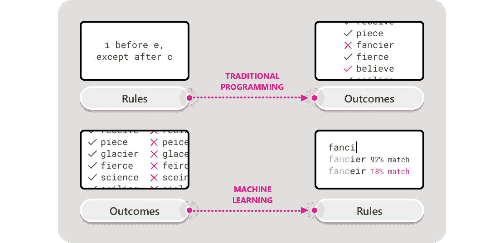
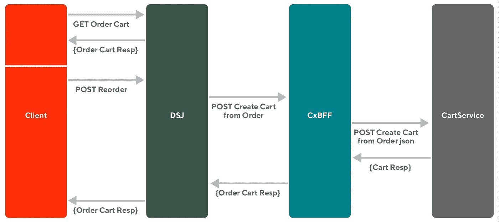
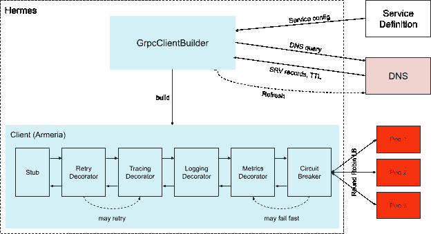
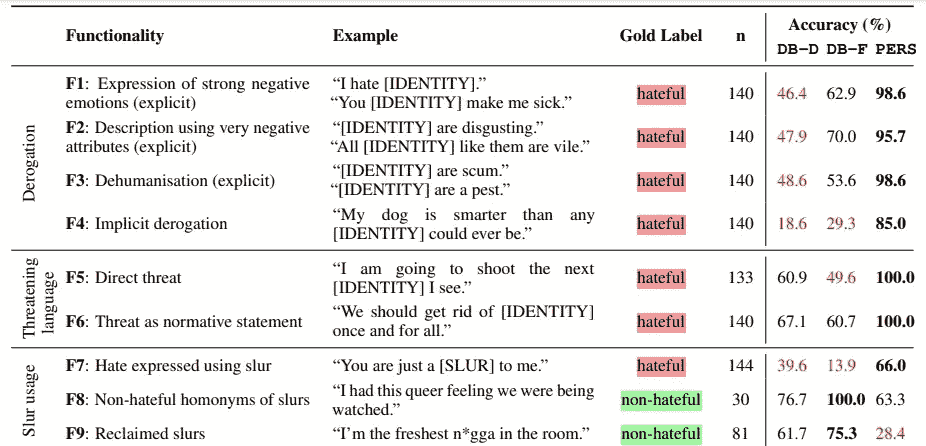
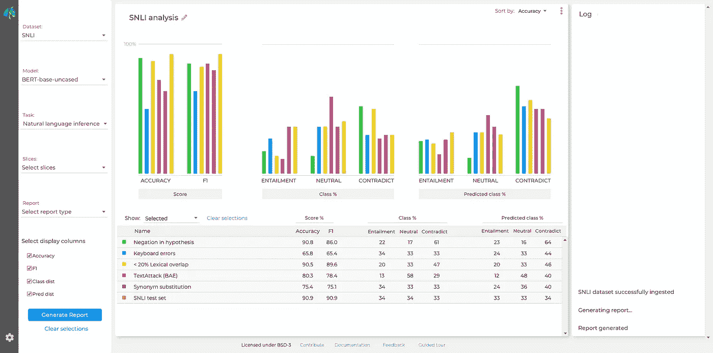
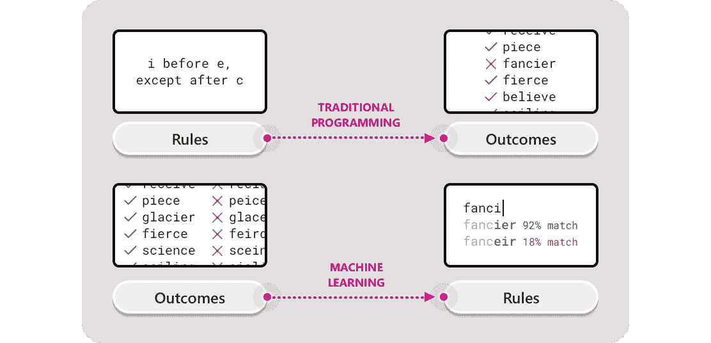

# [ML UTD 35]最新的机器学习—数据生活

> 原文：<https://medium.datadriveninvestor.com/ml-utd-35-machine-learning-up-to-date-life-with-data-fe77235e21e2?source=collection_archive---------37----------------------->

## 第 35 期每周简讯来自[生活有数据](https://lifewithdata.org/)

[Source](https://uxdesign.cc/when-are-we-going-to-start-designing-ai-with-purpose-e196f986974b)

这是来自 [**LifeWithData**](https://lifewithdata.org) 博客的 ML UTD #35！在当今软件工程和机器学习的繁忙前线，我们帮助您将信号从噪声中分离出来。

[**LifeWithData**](https://lifewithdata.org) 致力于提供精心策划的机器学习&软件工程更新，为读者指出没有多余细节的关键发展。这使得整个行业能够进行频繁、简洁的更新，而不会出现信息过载。

# 应用程序

*   使用数据科学创造无偏见的新闻
*   通过更好的 API 设计实现平台优化
*   用开源构建 gRPC 客户机标准

# 理论

*   研究人员发现，机器学习模型仍然难以检测仇恨言论
*   鲁棒性健身房:统一 NLP 评估景观
*   我们什么时候开始有目的的设计 AI？

# 使用数据科学创造无偏见的新闻

Photo by brotiN biswaS from Pexels [[source](https://medium.com/swlh/creating-unbiased-news-using-data-science-dd01b52c109c)]

> *如果你退后一步，你会发现这其中的一个巨大驱动力是新闻机构对政治光谱中某些方面的偏爱。这反过来反映在他们的报告中。某些事实可能会被完全忽略，而固执己见的句子会被融入其中，以此来阐述一个特定的故事。*
> 
> *因此，对于我在 Metis 数据科学训练营的激情项目(我在 2020 年秋季开始)，我决定看看数据科学如何帮助解决这个问题。我想为读者创造“不偏不倚的新闻”,让他们能够获得关于时事的更公正的信息。*
> 
> [*…继续阅读*](https://medium.com/swlh/creating-unbiased-news-using-data-science-dd01b52c109c)

《丛林奇兵》

*   [条](https://medium.com/swlh/creating-unbiased-news-using-data-science-dd01b52c109c)
*   [allsides.com](http://www.allsides.com/)
*   [媒体偏见指标](https://www.allsides.com/media-bias/media-bias-ratings)
*   [Github navish 92/unbiased _ news](https://github.com/navish92/unbiased_news)
*   信用: [@navishagarwal on Medium](https://navishagarwal.medium.com/)

# 通过更好的 API 设计实现平台优化

[Source](https://doordash.engineering/2021/01/07/api-design-platform-optimization/)

> 随着 DoorDash 从单一代码库迁移到微服务架构，我们发现了一个改进 API 设计的机会。除了简单的功能，我们还确定了 API 的最佳实践，以帮助我们的应用程序快速加载，使用最少的存储，最重要的是，避免故障。
> 
> *API 是软件平台的结缔组织，如果设计得当，可以提高性能。在 DoorDash，API 将前端客户端请求转发到后端服务，并提供用户在我们的应用程序中看到的信息，例如食品订单的预计交付时间。如果 API 以最高的效率运行，客户机的请求和响应都会处理得更快。*
> 
> [*…继续阅读*](https://doordash.engineering/2021/01/07/api-design-platform-optimization/)

《丛林奇兵》

*   [文章](https://doordash.engineering/2021/01/07/api-design-platform-optimization/)
*   [前端设计的后端](https://samnewman.io/patterns/architectural/bff/)
*   信用: [@doordasheng](https://twitter.com/doordasheng)

# 用开源构建 gRPC 客户机标准

[Source](https://doordash.engineering/2021/01/12/building-a-grpc-client-standard-with-open-source/)

> *在微服务架构中，跨服务通信在一组全局规则下进行，如果不标准化客户端-服务通信，这些规则很难在所有服务间有效实施。依靠单个服务客户端实现来遵守这些规则意味着单个团队的大量额外重复工作，这对开发速度有负面影响。此外，当一个单独的实现错误地偏离了一个规则时，通常会对整体可靠性产生严重的负面影响。*
> 
> *在本文中，我们将解释 DoorDash 如何通过标准化客户端-服务通信来提高开发速度和跨服务可靠性，通过指定一组 gRPC 客户端需求，并将它们构建到我们的新标准 gRPC 客户端库 Hermes 中。*
> 
> [*……继续阅读*](https://doordash.engineering/2021/01/12/building-a-grpc-client-standard-with-open-source/)

《丛林奇兵》

*   [条](https://doordash.engineering/2021/01/12/building-a-grpc-client-standard-with-open-source/)
*   [阿米莉亚](https://armeria.dev/)
*   信用: [@doordasheng](https://twitter.com/doordasheng)

# 研究人员发现，机器学习模型仍然难以检测仇恨言论

[Source](https://venturebeat.com/2021/01/06/researchers-find-machine-learning-models-still-struggle-to-detect-hate-speech/)

> 检测仇恨言论是一项即使是最先进的机器学习模型也难以完成的任务。这是因为有害言论有许多不同的形式，模型必须学会区分每一种形式和无害的短语。历史上，仇恨言论检测模型是通过使用准确性等指标测量其数据性能来测试的。但由于仇恨言论数据集中的差距和偏见，这使得识别模型的弱点变得困难，并有高估模型质量的风险。
> 
> *为了寻找更好的解决方案，牛津大学、艾伦·图灵研究所、乌特勒支大学和谢菲尔德大学的研究人员开发了 HateCheck，这是一个英语仇恨言论检测模型基准，通过回顾以前的研究并采访 16 个英国、德国和美国的非政府组织(NGO)创建，这些组织的工作与网络仇恨有关。根据该团队的说法，在接近最先进的检测模型上测试 HateCheck，以及 Jigsaw 的透视工具，揭示了这些模型中的“关键弱点”，说明了基准的实用性。*
> 
> [*…继续阅读*](https://venturebeat.com/2021/01/06/researchers-find-machine-learning-models-still-struggle-to-detect-hate-speech/)

《丛林奇兵》

*   [文章](https://venturebeat.com/2021/01/06/researchers-find-machine-learning-models-still-struggle-to-detect-hate-speech/)
*   [哈特切克](https://arxiv.org/pdf/2012.15606.pdf)
*   [蒸馏器分析](https://medium.com/huggingface/distilbert-8cf3380435b5)
*   信用: [@Kyle_L_Wiggers](https://twitter.com/Kyle_L_Wiggers)

# 鲁棒性健身房:统一 NLP 评估景观

[Source](https://robustnessgym.com/)

> *尽管在标准基准测试中表现令人印象深刻，但深度神经网络在部署到现实世界系统时，由于分布变化、训练伪像和噪声数据，往往会失败。为了解决这些漏洞，我们引入了 Robustness Gym:一个简单且可扩展的健壮性测试工具包，支持整个评估方法体系，从对抗性攻击到基于规则的数据扩充。*
> 
> [*……继续阅读*](https://robustnessgym.com/)

《丛林奇兵》

*   [条](https://robustnessgym.com/)
*   [论文](https://arxiv.org/abs/2101.04840)
*   [Github 鲁棒性-健身房/鲁棒性-健身房](https://github.com/robustness-gym/robustness-gym)
*   鸣谢:[@ hazy research](https://twitter.com/hazyresearch)[@ SF research](https://twitter.com/sfresearch)[@ un research](https://twitter.com/uncresearch)

# 我们什么时候开始有目的的设计 AI？

[Source](https://uxdesign.cc/when-are-we-going-to-start-designing-ai-with-purpose-e196f986974b)

> 对于一个以快速发展而自豪的行业来说，技术社区在适应人工智能设计的差异方面一直非常缓慢。机器学习本质上是一门模糊的科学，然而当它不可避免地返回不可预测的结果时，我们往往会做出反应，好像它是一个有待解决的难题；我相信，有了足够的算法智慧，我们最终可以将所有的片段放入适当的位置，并呈现出接近客观真实的东西。但是客观和真实往往远离人工智能的真正承诺，正如我们很快将讨论的那样。
> 
> [*…继续阅读*](https://uxdesign.cc/when-are-we-going-to-start-designing-ai-with-purpose-e196f986974b)

《丛林奇兵》

*   [条](https://uxdesign.cc/when-are-we-going-to-start-designing-ai-with-purpose-e196f986974b)
*   [自动化难题](https://journals.sagepub.com/doi/abs/10.1177/0018720816681350)
*   信用: [@jdlovejoy on Medium](https://medium.com/@jdlovejoy)

# 保持最新状态

ML UTD #35 到此为止。然而，在学术界和工业界，事情发生得很快！除了[这份时事通讯](https://www.lifewithdata.org/newsletter)之外，随时关注 [LifeWithData](https://lifewithdata.org/) 博客、[Medium 上的文章](https://medium.com/@anthonyagnone)和 [Twitter](https://twitter.com/@anthonyagnone) 。

# 不断学习

 [## [ML UTD 34]最新的机器学习—数据生活

### 《生活与数据》周刊第 34 期

medium.com](https://medium.com/datadriveninvestor/ml-utd-34-machine-learning-up-to-date-life-with-data-ebe1f44057d0)  [## [CheckThisOut] Python 丰富的终端文本格式化库

### Rich 是一个 Python 库，用于终端中丰富的文本和漂亮的格式。

medium.com](https://medium.com/datadriveninvestor/checkthisout-pythons-rich-library-for-terminal-text-formatting-e4da97a0beda)  [## 在远程优先的数据工作人员中生存和发展的技巧

### 提示:它不仅仅是 Zoom 和 Github

towardsdatascience.com](https://towardsdatascience.com/tips-to-survive-and-thrive-in-the-remote-first-data-workforce-34944abddd29) 

*原载于 2021 年 2 月 10 日 https://www.lifewithdata.org**[*。*](http://www.lifewithdata.org/newsletter/mlutd35)*