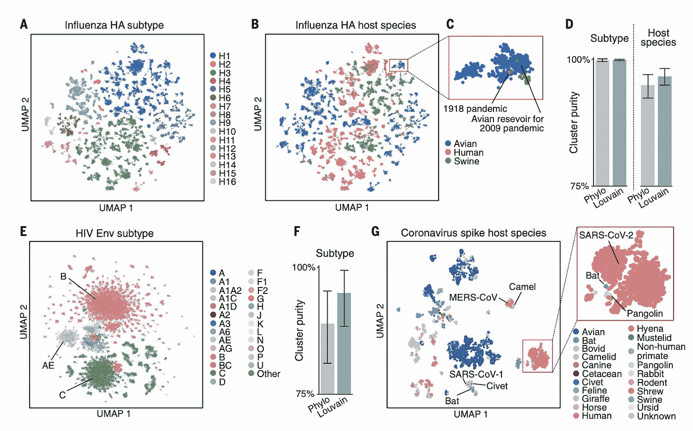
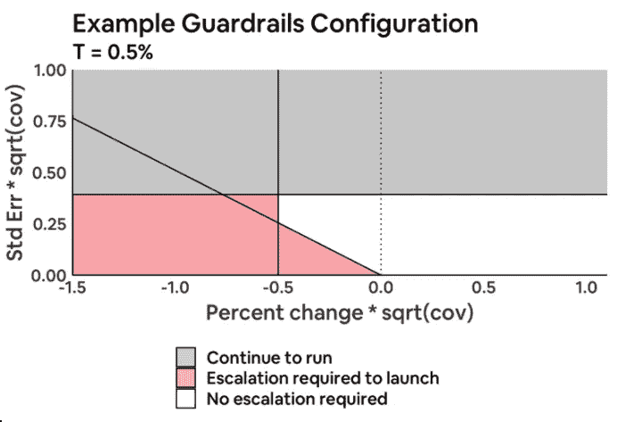
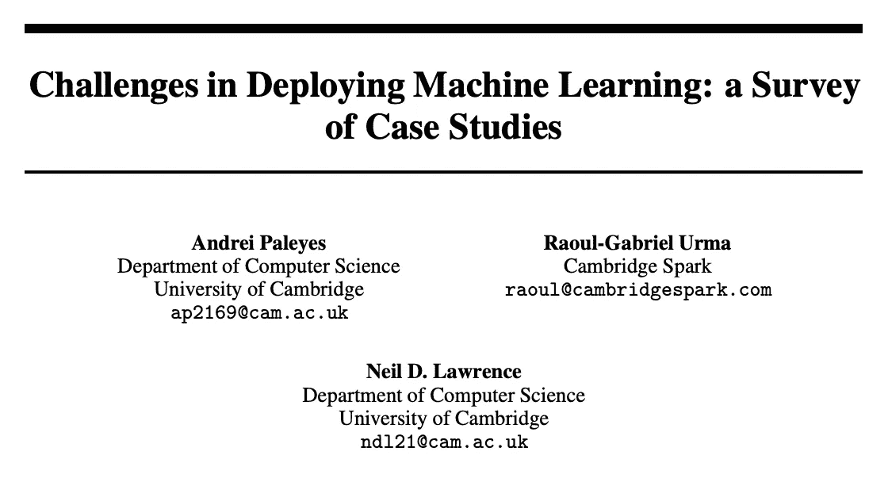
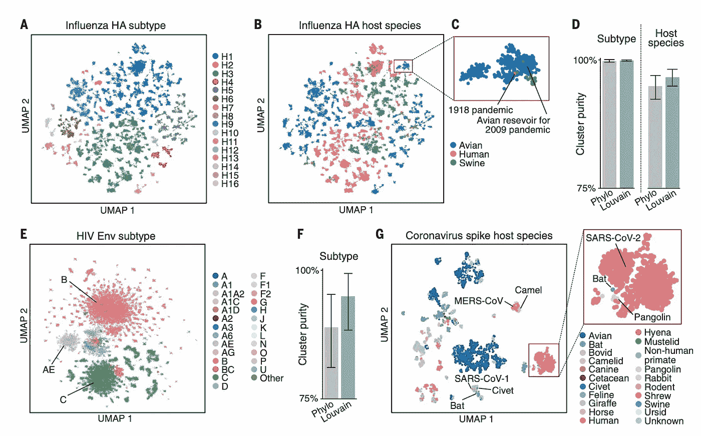
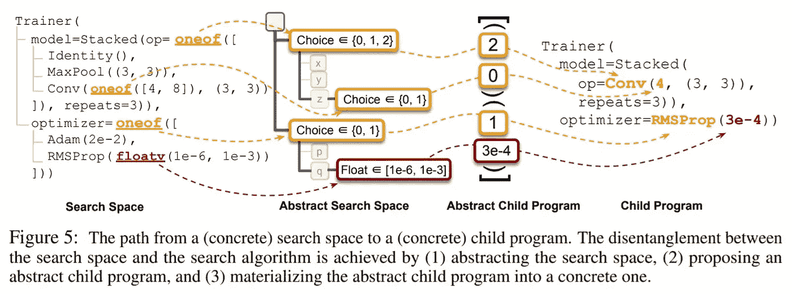

# [ML UTD 36]最新的机器学习—数据生活

> 原文：<https://medium.datadriveninvestor.com/ml-utd-36-machine-learning-up-to-date-life-with-data-498466502bed?source=collection_archive---------37----------------------->

## 第 36 期每周简讯来自[生活有数据](https://lifewithdata.org)

[Source](https://science.sciencemag.org/content/sci/371/6526/284.full.pdf)

这是来自 [**LifeWithData**](https://lifewithdata.org) 博客的 ML UTD #36！在当今软件工程和机器学习的繁忙前线，我们帮助您将信号从噪声中分离出来。

[**LifeWithData**](https://lifewithdata.org) 致力于提供精心策划的机器学习&软件工程更新，为读者指出没有多余细节的关键发展。这使得整个行业能够进行频繁、简洁的更新，而不会出现信息过载。

# 应用程序

*   设计实验护栏
*   如何为高容量可靠地扩展您的数据平台
*   大规模协同过滤预测 OkCupid 上谁会喜欢你，和 JAX

# 理论

*   部署机器学习的挑战:案例研究调查
*   学习病毒进化和逃逸的语言
*   Google Brain 引入符号编程+ PyGlove 库重构 AutoML

# 设计实验护栏

> *每周，成千上万的在线实验在 Airbnb 平台上同时运行，以测量潜在产品变化的影响，每个实验监控大约几十个指标。在做出发布决定时，每个团队通常关注不同的评估标准，例如，信任团队优先考虑欺诈识别，而体验团队可能优先考虑在我们的主页中发现在线体验产品。积极影响一个团队的指标的实验也可能损害另一个团队的指标，如何权衡这些权衡并不总是显而易见的——例如，如果结账时没有显示房规，我们可能会看到预订量增加但评分降低。在最坏的情况下，一个团队可能会发现另一个团队最近在没有对权衡进行适当分析的情况下启动了对他们的一个关键指标造成重大损害的处理，这需要回滚新的更改。*
> 
> [*…继续阅读*](https://medium.com/airbnb-engineering/designing-experimentation-guardrails-ed6a976ec669)

《丛林奇兵》

*   [条](https://medium.com/airbnb-engineering/designing-experimentation-guardrails-ed6a976ec669)
*   [AirBnb Eng &数据科学](https://medium.com/airbnb-engineering?source=follow_footer-------------------------------------)
*   信用:[@ Tatiana . xifara on Medium](https://medium.com/@tatiana.xifara)

# 如何为高容量可靠地扩展您的数据平台

[Source](https://doordash.engineering/2021/01/07/api-design-platform-optimization/)

> 黑色星期五和网络星期一——或者我们喜欢称之为 BFCM——是一年中最大的销售事件之一。对于 Shopify 和我们的商家来说，这也是最重要的时刻之一。客观地说，今年我们在超过 175 个国家的商家在销售周末销售了创纪录的 51 多亿美元。
> 
> *销量很大。这也是大量的数据。*
> 
> *今年的 BFCM，Shopify 数据平台的平均吞吐量增长了 150%。作为 Shopify 数据平台工程(DPE)团队，我们的使命是确保我们的商家、合作伙伴和内部团队能够快速可靠地访问数据。不管一个商人是每小时卖出一件还是一百万件商品；他们需要不间断地访问与其业务相关的最重要的信息。虽然这是一年四季都必须做的事情，但在 BFCM 期间，赌注更大了。*
> 
> *创建一个能够经受住年度最大销售活动的数据平台意味着我们的平台服务需要做好应对负载增长的准备。在本帖中，我们将概述我们采取的方法，以可靠地扩展我们的数据平台，为这一高容量事件做准备。*
> 
> [*…继续阅读*](https://shopify.engineering/reliably-scale-data-platform)

《丛林奇兵》

*   [条](https://shopify.engineering/reliably-scale-data-platform)
*   [Shopify 产能规划](https://shopify.engineering/capacity-planning-shopify)
*   信用: [@ShopifyEng](https://twitter.com/ShopifyEng)

# 大规模协同过滤预测 OkCupid 上谁会喜欢你，和 JAX

[Source](https://tech.okcupid.com/large-scale-collaborative-filtering-to-predict-who-on-okcupid-will-like-you-with-jax/)

> 在 OkCupid 上，当你告诉我们谁是你喜欢的，谁是你不喜欢的，我们会在后台记录为“投票”。接下来，我们将讨论“选民”和“投票者”，分别指你和你喜欢(不喜欢)的人。每一个赞或通过都是一次‘投票’。
> 
> 我们记录了很多投票！
> 
> 鉴于你过去和喜欢的历史，我们希望能够告诉你，你可能喜欢谁，但你还没有见过？如果我们有这个，我们可以利用它向你展示你更可能喜欢的人，这意味着你喜欢他们，他们会喜欢你，也许他们会喜欢你，希望从那里开始一切都会很好！
> 
> 理解我们将如何处理这件事的第一步是将所有这些投票放入一个“交互矩阵”中。本质上，这个矩阵的行是“投票者”，列是“投票者”。当一个投票者喜欢一个投票者时，我们在对应于那个(投票者，投票者)对的坐标上放置 1，如果投票者通过一个投票者，我们放置 0。
> 
> [*……继续阅读*](https://tech.okcupid.com/large-scale-collaborative-filtering-to-predict-who-on-okcupid-will-like-you-with-jax/)

《丛林奇兵》

*   [文章](https://tech.okcupid.com/large-scale-collaborative-filtering-to-predict-who-on-okcupid-will-like-you-with-jax/)
*   [Vespa vs Elasticsearch](https://tech.okcupid.com/vespa-vs-elasticsearch/)
*   [Github Nicola shug/惊喜](https://github.com/NicolasHug/Surprise)
*   [Github google/jax](https://github.com/google/jax)
*   信用: [@okcupid](https://twitter.com/okcupid)

# 部署机器学习的挑战:案例研究调查

[Source](https://arxiv.org/pdf/2011.09926.pdf)

> *近年来，无论是作为学术研究领域还是作为现实世界商业问题的解决方案，机器学习都受到了越来越多的关注。然而，在生产系统中部署机器学习模型会带来许多问题和顾虑。这项调查回顾了在各种用例、行业和应用中部署机器学习解决方案的已发布报告，并提取了与机器学习部署工作流的各个阶段相对应的实际考虑因素。我们的调查显示，从业者在部署的每个阶段都面临挑战。本文的目标是设计一个研究议程，探索解决这些挑战的方法。*
> 
> [*…继续阅读*](https://arxiv.org/pdf/2011.09926.pdf)

《丛林奇兵》

*   [文章](https://arxiv.org/pdf/2011.09926.pdf)
*   [现代面向数据编程](http://inverseprobability.com/talks/notes/modern-data-oriented-programming.html)
*   信用: [@Cambridge_CL](https://twitter.com/Cambridge_CL)

# 学习病毒进化和逃脱的语言

[Source](https://science.sciencemag.org/content/sci/371/6526/284.full.pdf)

> 病毒变异和逃避人类免疫系统并导致感染的能力，称为病毒逃逸，仍然是抗病毒和疫苗开发的障碍。理解控制逃脱的复杂规则可以为治疗设计提供信息。我们用最初为人类自然语言开发的机器学习算法来模拟病毒逃逸。我们将逃逸突变定义为那些保留病毒传染性但导致病毒在免疫系统看来不同的突变，类似于保留句子语法但改变其含义的单词变化。通过这种方法，流感血凝素、HIV-1 包膜糖蛋白(HIV Env)和严重急性呼吸综合征冠状病毒 2 型(新型冠状病毒)刺突病毒蛋白的语言模型可以仅使用序列数据准确预测结构逃逸模式。我们的研究代表了自然语言和病毒进化之间有希望的概念桥梁。
> 
> [*…继续阅读*](https://science.sciencemag.org/content/sci/371/6526/284.full.pdf)

《丛林奇兵》

*   [文章](https://science.sciencemag.org/content/sci/371/6526/284.full.pdf)
*   鸣谢:[科学杂志](https://science.sciencemag.org/content/371/6526/284/tab-pdf)

# Google Brain 引入符号编程+ PyGlove 库重构 AutoML

[Source](https://syncedreview.com/2021/02/01/google-brain-introduces-symbolic-programming-pyglove-library-to-reformulate-automl/)

> *谷歌大脑团队最近的一项研究提出了一种基于符号编程的自动机器学习(AutoML)编程新方法。研究人员还介绍了 PyGlove，这是一个 Python 库，展示了新范式的有希望的结果。*
> 
> *神经网络架构正变得越来越复杂，为一项任务找到正确的架构既费时又耗资源。自 2017 年 5 月谷歌为其神经架构搜索(NAS)解决方案创造了 AutoML 一词以来，该方法在 ML 研究社区中获得了自动化网络超参数和架构选择的牵引力。*
> 
> 然而，当前的软件限制阻碍了汽车的发展。例如，流行的 NAS 算法需要实现耦合 AutoML 搜索空间和搜索算法，并且实现复杂的搜索流来处理这种 AutoML 组件之间的动态交互仍然是困难的。
> 
> [*…继续阅读*](https://syncedreview.com/2021/02/01/google-brain-introduces-symbolic-programming-pyglove-library-to-reformulate-automl/)

《丛林奇兵》

*   [文章](https://syncedreview.com/2021/02/01/google-brain-introduces-symbolic-programming-pyglove-library-to-reformulate-automl/)
*   信用: [@Synced_Global](https://twitter.com/Synced_Global)

# 保持最新状态

ML UTD #36 到此为止。然而，在学术界和工业界，事情发生得很快！除了[这个时事通讯](https://www.lifewithdata.org/newsletter)，让自己在 [LifeWithData](https://lifewithdata.org/) 博客、[媒体文章](https://medium.com/@anthonyagnone)和 [Twitter](https://twitter.com/@anthonyagnone) 上保持更新。

# 不断学习

 [## [ML UTD 35]最新的机器学习—数据生活

### 《生活与数据》周刊第 35 期

medium.com](https://medium.com/datadriveninvestor/ml-utd-35-machine-learning-up-to-date-life-with-data-fe77235e21e2)  [## [CheckThisOut] Python 丰富的终端文本格式化库

### Rich 是一个 Python 库，用于终端中丰富的文本和漂亮的格式。

medium.com](https://medium.com/datadriveninvestor/checkthisout-pythons-rich-library-for-terminal-text-formatting-e4da97a0beda)  [## 在远程优先的数据工作人员中生存和发展的技巧

### 提示:它不仅仅是 Zoom 和 Github

towardsdatascience.com](https://towardsdatascience.com/tips-to-survive-and-thrive-in-the-remote-first-data-workforce-34944abddd29) 

*原载于 2021 年 2 月 17 日 https://www.lifewithdata.org***。**