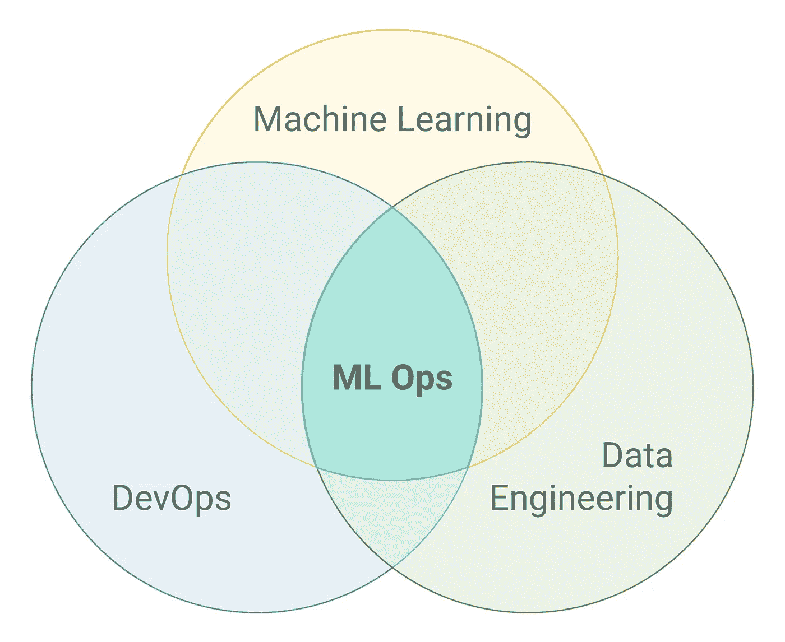
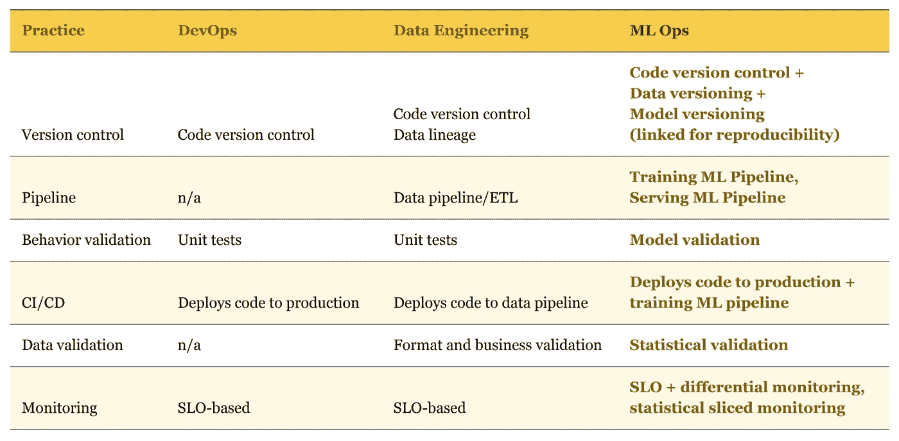

# AIMLOps 实践及其优势

> 原文：<https://medium.datadriveninvestor.com/mlops-practices-and-its-benefits-c52b49af38c9?source=collection_archive---------14----------------------->

MLOps 是一套结合了数据工程、机器学习和 DevOps 的实践。该联盟的主要目标是在生产中可靠有效地部署和维护 ML 系统。

在本文中，我们将回顾自动执行和缩短机器学习周期的机器学习功能。

# MLOps 优势。

*   **通过强大的机器学习生命周期管理实现快速创新。**

机器学习的 MLOps 或 DevOps 允许数据处理、分析专业人员和 IT 专业人员的团队进行协作，并通过机器学习模型的监控、验证和管理系统来加快模型开发和部署的步伐。

*   **创建可重复的工作流和模型。**

减少模型迭代中的变化，并通过可重复的学习和模型为企业级场景提供弹性。使用数据集注册表和高级模型注册表来跟踪资源。通过在执行日志中跟踪代码、数据和指标，提供改进的可追溯性。创建机器学习管道来设计、部署和管理可重复的模型工作流，以实现一致的模型交付。

*   **可在任何地点轻松部署高精度模型。**

快速自信地部署。通过云中的分布式学习，使用自动扩展、托管的 CPU 和 GPU 集群。快速打包模型，通过使用概要分析和模型验证确保每一步的高质量。使用托管部署将模型迁移到生产环境中。

*   **整个机器学习生命周期的有效管理。**

使用与 Azure DevOps 和 GitHub 操作的内置集成来高效地规划、自动化和管理工作流。简化培训和模型部署流程，使用 CI / CD 简化再培训，并将机器学习轻松集成到现有发布流程中。随着时间的推移，使用高级数据偏差分析来提高模型性能。

*   **机器学习资源管理系统与控制。**

跟踪版本历史和模型来源，以便进行审计。模型的透明性将允许您使用统一分布度量来评估功能的重要性，并以最小的偏差创建更高级的模型。为资源设置计算配额并实施策略，以确保符合安全性、隐私和合规性标准。在标记机器学习资源和自动跟踪实验时，创建审计跟踪以满足监管要求。

# MLOps 实践。

*   **ML 管道。**

数据工程的主要概念之一是数据管道。数据管道是应用于其源和最终目的地之间的数据的转换循环。它们通常被解释为一个图，其中每个节点是一个转换，边代表依赖关系或执行顺序。

*   **混合团队**

我们已经确定，为了取得成功，我们需要一个拥有该技能组合的混合团队。最有可能的是，它将包括一个数据科学家(ML 工程师)，数据工程师和 DevOps 工程师。

重要的是要明白，单靠数据科学家无法实现 MLOps 的目标。

*   **模型和数据版本**

在传统的软件世界中，你只需要版本控制代码，因为所有的行为都是由它决定的。在 ML 中，事情有点不同。除了熟悉的版本控制代码之外，我们还需要跟踪模型版本、用于训练它的数据以及一些元信息，比如训练超参数。

*   **模型验证**

ML 模型比 DevOps one 更难测试，因为没有模型给出绝对准确的结果。这意味着模型验证测试在本质上必须是统计的，而不是二元的通过/失败状态。

跟踪整个验证集的一个度量也是不够的。

*   **数据验证**

一个好的数据管道通常从验证输入数据开始。除了任何数据管道执行的基本验证之外，ML 管道还需要对输入的统计属性进行更高级别的验证。例如，如果要素的平均分流从一个训练数据集到另一个训练数据集变化很大，则可能会影响训练模型及其预测。

*   **监控**

对于 ML 系统，监控变得比监控生产系统更加重要。这是因为它们的性能不仅取决于我们可以控制的因素，如基础设施和我们自己的软件，还取决于我们无法控制的数据。因此，除了监控延迟、流量、错误和饱和度等标准指标，我们还需要监控模型预测性能。

# 摘要

随着 ML 从研究走向应用商业解决方案的成熟，我们也需要提高对其运作过程的理解。

 [## 认知计算——一套被广泛认为是……

### 作为它的用户，我们已经习惯了科技。这些天几乎没有什么是司空见惯的…

www.datadriveninvestor.com](https://www.datadriveninvestor.com/2020/02/19/cognitive-computing-a-skill-set-widely-considered-to-be-the-most-vital-manifestation-of-artificial-intelligence/) 

下表总结了 MLOps 的主要实践以及它们与开发运维及数据工程实践的关系:

*原载于 2020 年 4 月 1 日 https://geniusee.com***。**