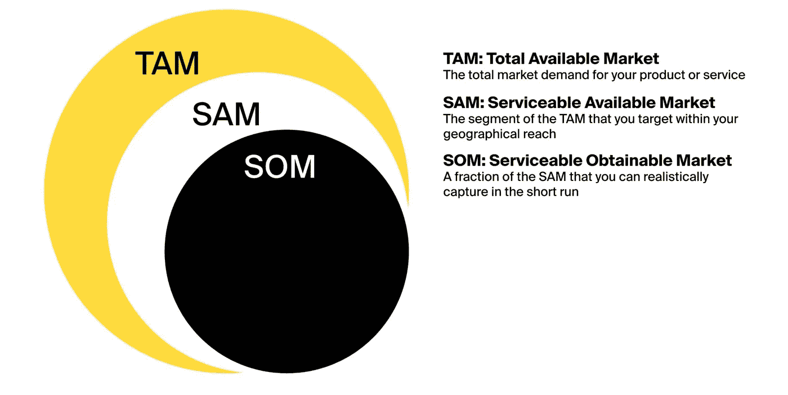
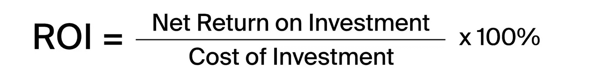

# 手机应用商业计划:写还是不写，怎么写？

> 原文：<https://medium.datadriveninvestor.com/mobile-app-business-plan-to-write-or-not-to-write-and-how-b70666999308?source=collection_archive---------31----------------------->

那么，你已经有了一个关于移动应用创业的绝妙想法——祝贺你！据市场分析师称，消费者在移动应用上的支出正在飙升，下载量和移动在在线销售中的份额也在飙升。如果你正考虑在远程工作/通信、医疗、教育、社交媒体或网上购物等行业尝试一下，再次恭喜你！在一个冠状病毒加速了我们向移动优先过渡的世界里，这些将是显而易见的赢家。现在怎么办？在寻求资金或[雇佣移动应用开发者或自己开发软件之前，你似乎需要一份可靠的商业计划，对吗？嗯…是也不是。详情如下。但是快速的回答是，你绝对应该做一些计划。](https://itrexgroup.com/services/mobile-application-development/)

# 简短的启动文件指南

你可能听说过，创业者在规划创业时可能需要准备一些文件:

*   一份传统的商业计划，一份长达几十页的大文件，详细描述了你的整个商业战略。这包括你的产品概述、营销计划、竞争对手分析和基本财务状况。重要的是，你最初可以在所谓的[精益画布](https://leanstack.com/leancanvas)上做，一页纸的计划，事实上它可以成为你的最终蓝图(许多投资者会认可)
*   一个演示文稿，一个 PowerPoint 类型的演示文稿，10-15 张幻灯片，以简洁直观的方式传达您的移动应用业务计划。它的目的是抓住投资者的注意力，让你有后续会议。
*   一份执行摘要，一份 1-3 页的文件，以类似于推介材料的方式概述你的创业想法，但用文字代替视觉效果。再说一遍，这是你展示给一屋子投资者的工具。

如果你正在筹集资金，一份令人印象深刻的推介材料和执行摘要是必不可少的。

然而，你需要一份正式的、全面的书面商业宣言吗？…关于这一点有很多争议。当然，从你开始创业的那一刻起，事情就会发生变化。事实上，早期准备的创业计划可能永远不会实现，也不太可能被任何人阅读。但是……你确实需要为一个应用的商业计划做所有的头脑风暴和研究——比如客户、市场、渠道、你正在解决的问题和财务。因为这项研究将用于制作您的推介材料和执行摘要。创建一个应用商业计划是你的家庭作业，也是一个很好的练习，让你思考如何执行你的创业想法。你至少可以使用精益画布写下关键问题的答案——这将帮助你制定商业战略，并帮助投资者了解你的移动应用程序将如何获得牵引力。综上所述，创业计划书不是必须的，但绝对有用。

# 让我们来看看手头的事情——你的应用程序开发商业计划

假设你正在为住校的大学生构建一个送餐应用。如何攻击这个想法？

# 行动纲要

这是商业计划的第一部分，投资者总是会阅读它。你可以写下你的整个计划，然后将其提炼到你的执行摘要中，或者使用创业计划模板作为你的指南，尝试总结要点。

在这里，你应该快速传达一些事情:你解决的问题，你提供的解决方案，以及你为之努力的受众(呃…如果你不能解决世界上的任何问题，你可能会和你的公司一起面临一个艰难的爬坡)。

*   问题:食堂的食物可能很糟糕，而学生通常没有太多时间做饭。因此，许多学生有不良的饮食习惯或不规律的饮食行为，导致肥胖率高。市场上充斥着应用程序，但你的竞争对手瞄准了更广泛或不同的受众，或者很少关注推广健康饮食。

亮点:概述问题的范围和规模，并描述它如何对许多人有害。明确定义你的受众也很重要。

*   解决方案:你可以用你的新送餐应用来拯救我们。你想做家常菜，并通过时尚的 iOS/Android 应用以非常合理的价格出售。你也不想使用 GrubHub 这样的第三方送货服务，它的佣金可能会很高。相反，你想有自己的交付。

推荐理由:展示你的解决方案，这是你的应用，这是你独特的价值主张。解释它与竞争的不同之处，以及它将如何解决问题或满足需求。对于一个食品配送应用程序，你的价值主张可能听起来像这样:“我们在 60 分钟内提供廉价健康的家常菜！”

*   商业模式:你的创业商业模式应该告诉投资者你将如何赚钱，以及你的其他商业目标是什么。确定具有关键里程碑的应用路线图，并确保您的目标符合投资者的期望。

推荐理由:撒几个数字。您打算在 12、24、36 个月内获得多少用户？你的预计收入是多少？你希望几年后在全国范围内开展业务，还是想与一家更大的公司合并？投资者会对你的移动应用创业之旅提出一堆问题，所以手头要有答案。

# 市场分析

你可能会被要求更详细地介绍你的目标市场，以展示你的移动应用的可行性。再次准备数字作为你的家庭作业:

*   谭:住在校园里并在网上订餐的美国学生人数
*   SAM:在发布会上，您可以通过销售渠道接触到的学生人数；它可能仅限于特定的学院或大学
*   SOM:早期采用者的数量

做市场调查当然不会容易:根据这个[赫芬顿邮报的信息图](https://www.huffingtonpost.com/2014/08/19/college-students-food_n_5691296.html)，不同大学的学生点餐习惯都不一样！另外，你应该准备好做一个市场预测:

*   预计在短期内瞄准您的受众的公司数量
*   对其短期增长率的估计
*   对他们短期收入的估计

引用知名资源(Gartner、Cisco、Forrester 等。)以避免无根据的指控。下一步是什么？确保研究你在竞争格局中的位置。如果你使用的是 [Gartner 的魔力象限](https://www.gartner.com/technology/research/methodologies/research_mq.jsp)，不要把你的公司放在右上角:毕竟，它是你的无名初创公司，与 UberEats 等知名品牌竞争！不要忘记分析你的优势、劣势、机会和威胁(SWOT ):承认是进步的第一步。

# 营销和销售策略

在一个你需要至少有[3 万美元](http://customerthink.com/how-much-does-it-cost-to-market-an-app/)营销预算来推动有机应用下载的世界里，你不可能跳过营销部分。您应该涵盖的战略要点是:

客户获取:定义你的 KPI，确定你将要使用的渠道，评估客户获取成本

不要只依赖广告；探索替代促销策略，包括影响者营销、博客、传单分发和应用商店优化(ASO)。无论如何，客户获取渠道的选择在很大程度上取决于你的发布策略:如果你计划一个软发布(一所大学，只有周六)，你真的不需要在付费广告上花一分钱。相反，你应该考虑在校园里做海报广告，或者联系大学里最受欢迎的女孩，让她在她的 Instagram 上推广你的应用。一句忠告:成功的移动应用有什么共同点？没错，它们都会在某个时候疯传！实现应用病毒式传播的最简单方法是通过推荐和忠诚度计划元素来增强它，如奖励积分、促销代码和轻松的社交分享。

# 金融

最后但并非最不重要的，这里是金融部分。应该真的很好。投资者希望看到你至少未来三年的销售预测、损益表或现金流预测，并了解基本假设。你还应该能够告诉他们:

*   盈利策略:除了从送餐中获得收入，你还可以通过与健康食品餐厅、体育用品制造商、酒吧或夜总会合作，在横幅广告上赚几美元，从而将你的免费移动应用程序盈利
*   启动成本:包括一次性付款，如开发一个移动应用程序的价格，以及运营费用，如办公室租金和员工工资
*   资金:在这里你应该写下你希望获得多少资金，如何花费，以什么样的速度花费。
*   ROI:这是投资者在做决定时考虑的最重要的因素之一。你的投资回报(ROI)预测应该基于你的商业模式

只要有可能，用图形表示你的数据，尤其是数字。事实证明它更有效。

# 结尾注释

由于新冠肺炎疫情，移动应用已经加速了两到三年。越来越多的消费者将应用用于工作、教育、娱乐和购物，导致下载量、移动时间和消费者支出增加。换句话说，似乎没有比这更好的时机来启动送餐服务——或者任何其他应用业务了！—比现在。是的，结果是，我们可能会看到比以往更多的公司进入移动应用市场。为了挤掉竞争对手，只要记住在进行应用程序开发之前做真正全面的商业规划。它将帮助你为你的团队和投资者找出你的“秘方”和执行之旅。

*原载于 2021 年 2 月 4 日*[*【https://itrexgroup.com】*](https://itrexgroup.com/blog/how-to-write-mobile-app-business-plan-for-startup/)*。*