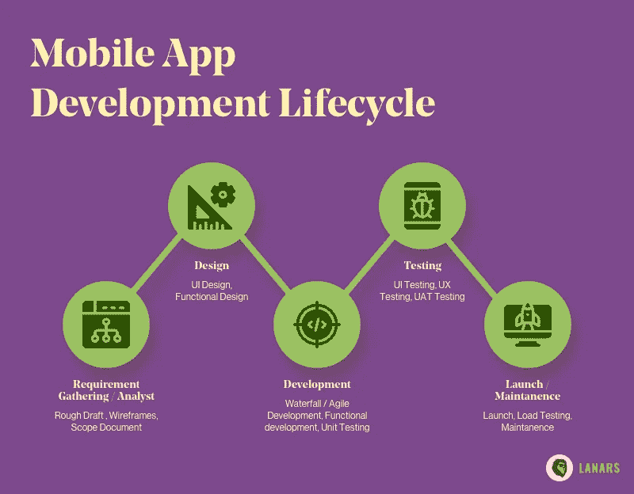
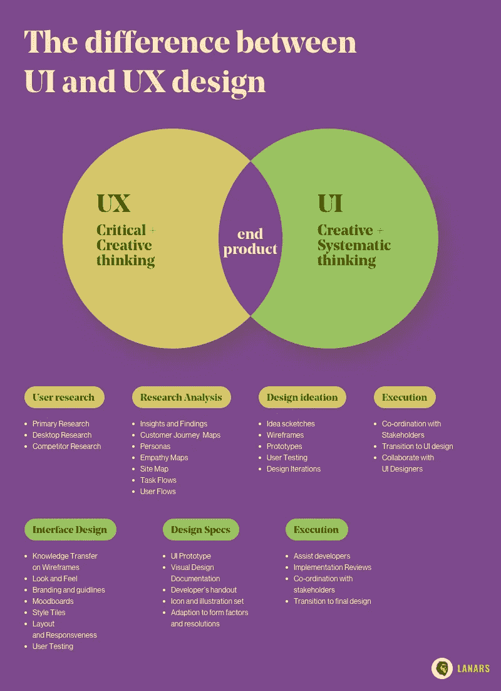
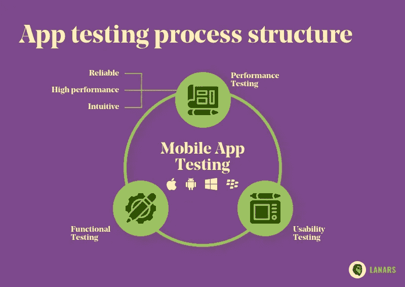
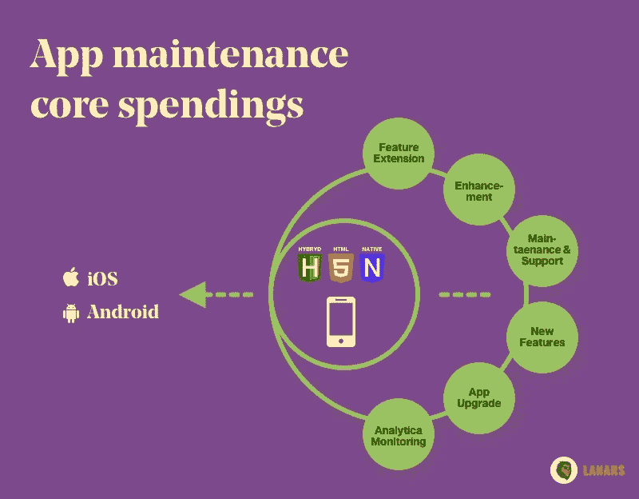

# 移动应用开发流程:从创意到应用维护

> 原文：<https://medium.datadriveninvestor.com/mobile-app-development-process-from-idea-to-app-maintenance-34e950264582?source=collection_archive---------9----------------------->

到 2020 年底，预计全球移动应用市场将产生超过 1890 亿美元的收入，这使得应用开发成为最赚钱的技术相关业务领域之一。

想知道现在开始开发应用程序对你来说是否合理？尽管 App Store 上有 220 万个应用程序，并且有多达 280 万个应用程序可以从 Google Play 市场下载，但新的移动应用程序创业公司总是有一席之地的。

像 Snapchat 或 Tinder 这样的应用程序是一个例子，说明一个以 MVP 形式出现的好主意如何能够在过度拥挤的市场上把竞争对手甩在身后。

但是不管你的创业想法看起来有多好，应用程序开发过程仍然很棘手。在这篇文章中，我们将引导你跨越移动应用开发的生命周期，并给出一些重要的提示。

# 开始移动应用程序开发流程之前

移动应用程序开发生命周期基于软件开发生命周期原则。由*(或研究) ***设计******开发******稳定******部署******维护*** 几个阶段组成。*

* [## 2019 年移动应用开发之路|数据驱动的投资者

### 任何在移动应用程序开发行业工作的人，无论他们是专注于在伦敦开发 iOS 应用程序还是…

www.datadriveninvestor.com](https://www.datadriveninvestor.com/2019/01/15/the-path-of-mobile-app-development-in-2019/) 

通常，应用程序开发流程从发现未来产品理念的优缺点、市场调查、目标群体研究以及项目评估开始。

> 你要做的第一件事就是把你的创业想法转化为产品想法。

这将有助于你了解你的团队应该有什么样的专家，以及需要多少钱。

 [## 2020 年移动应用发展趋势|数据驱动的投资者

### 不可否认的事实是，智能手机正在改变运营模式、商业模式和市场…

www.datadriveninvestor.com](https://www.datadriveninvestor.com/2020/01/15/mobile-app-development-trends-to-follow-in-2020/) 

在初始阶段开发应用的第二步是完善你的应用概念。想一想你的产品能给用户带来什么好处，并发现你的目标受众可能会找到类似解决方案的利基市场(那么你的独特价值和竞争优势应该是什么？).研究竞争环境，了解你的目标市场区域对新来者是否有利可图。

> 另外，试着描述你的目标用户——性别、年龄、职业、职位、家庭状况和地理位置。想想他们的问题、恐惧和需求。

最后，再走一步 app 开发，深入 app 特性。列出您希望在应用中包含的关键功能，指定可用于实现所有期望功能的技术(摄像头集成、GPS、指纹扫描)。

有了产品的技术描述，就去评估。决定你需要在什么平台上开发你的应用(iOS，Android，或者两者都有)，评估你的团队发布应用的潜力。

选择编程语言，设定项目时间表，决定货币化策略和推广，想出一个 ***PRD(产品需求文档)*** 。

从我们的文章[如何雇佣专门的开发团队](https://lanars.com/../blog/how-to-hire-dedicated-developers)中了解更多关于应用程序开发团队的信息。

# 移动应用程序开发流程:检验您的设计

这个阶段不仅是关于应用程序接口，也是关于产品用户流、数据架构和功能。UX 和用户界面设计师，项目经理，数据分析师，以及开发人员和焦点小组代表可能会参与到这个过程中。

应用程序设计和开发过程可以分为原型设计、应用程序功能和设计线框、故事板创建和设计本身。最终，你将拥有反映应用程序数据和功能结构的产品和文档的每个屏幕的设计。

请记住，设计阶段从快速创建的原型开始，在原型中可以反映出应用程序的概念。设计阶段的想法是将 PRD 转换为开发人员可以理解的全方位视觉详细文档。

为了避免可能让你付出双倍设计预算的错误，尽可能地与焦点小组互动。展示它的原型和版本，展示 UX(应用流程和交互)和 UI(应用前景)的不同方法，然后获得反馈，并根据需要为您的设计团队指定任务。

请记住，设计是移动应用开发过程中必不可少的步骤，因为它是影响用户体验的核心因素。一个好主意是在设计师开始工作之前，除了标准的 app flow 文档之外，创建一个情绪板或参考板。

# 应用程序开发周期:开发阶段

开发被认为是移动应用开发周期中最昂贵和最活跃的阶段。你从技术需求和设计开始，最终拥有一个现成的产品。开发可以分为两个阶段——应用原型和编码。

设计阶段的原型和这里的有什么区别？设计原型通常是关于 UX 或用户界面。它可以为焦点小组或投资者创建，向他们展示应用程序外观的关键功能，并选择正确的方式继续前进。

在这里，我们谈论的是技术原型，如果技术需求避免了进一步的工程方法搜索，就可以跳过。

> 称为编码的应用程序开发阶段包括前端和后端开发。想法是启用接口功能。

为此，需要数据工程师和 Android (iOS 或跨平台)开发者。

当应用程序代码框架准备好了(Alpha 阶段)，就到了为产品添加功能、bug 预测试和持续改进(Beta 阶段)的时候了。您的应用程序也可能会提交给您的焦点小组，以获得早期反馈。

移动应用程序开发过程可以被认为是在所有错误都被修复并且产品准备好被实现(发布阶段)之后完成的。

注意 iOS、Android 和跨平台开发的预算不同！根据我们的文章选择您的选项 [Android 与 iOS:首先为哪个平台构建您的应用程序更好](https://lanars.com/blog/android-vs-ios-which-platform-to-build-your-app-for-first)。

# 应用程序开发阶段:应用程序稳定和部署

如您所见，开发和稳定应用程序开发阶段紧密相连。开发过程通常由 app 元素来执行，这意味着 QA 从一个元素到另一个元素进行测试。这种方法被称为回归测试，并且可以自动化。

应用程序稳定化的应用程序开发流程步骤包括前一篇文章中描述的 alpha、beta 和发布阶段的一般产品测试(想法是识别应用程序缺陷并删除 bug)。

收集焦点小组反馈(用户接受度测试)也是产品稳定性的一部分，因为在早期开发阶段，除了 QA 团队解决问题之外，通过用户反馈来改进应用程序总是更省钱。

应用稳定阶段的移动应用开发流程包括:

*   功能和安全性测试(如果应用功能按预期运行)
*   可用性和设计测试(如果应用程序设计表现良好，导航方便)
*   生产力测试(如果数据库稳定并且你的应用运行速度快)
*   使用目标设备进行测试(如果应用在 Android 和 iOS 智能手机和平板电脑上运行良好)
*   回归测试(在 alpha 和 beta 阶段测试所有应用功能)
*   用户接受度测试(从焦点小组收集反馈)

当测试结束时，一个好主意是用一个分析工具来加强你的应用程序，以继续获得用户反馈，研究他们的行为和保留率。

在发布前后不断改进你的产品。从我们的博客文章[如何构建最小可行产品](https://lanars.com/blog/how-to-build-a-minimum-viable-product)中了解更多关于 MVP(最小可行产品)和构建-学习-测量循环的信息。

# 产品维护

如果你没有向市场发布你的产品，移动应用程序开发过程就没有完成。产品发布是你创业的一个重要阶段。

> 在你的应用程序上传到 App Store 和 Google Play market 后不久，你需要研究用户的反馈，进行必要的改进和更新，为你的产品提供技术支持，并根据用户的请求解决问题。

在部署和维护阶段应该设定什么目标？首先，你应该尽可能多地下载你的应用程序。你的应用程序中的用户越多，你获得的进一步改进的信息就越多。

促销策略是你的主要工具。你打算使用什么样的盈利模式？潜在用户如何了解你的产品？在移动应用开发流程的探索阶段回答这些问题，并在应用发布前 6 个月开始促销活动。

使用搜索引擎优化，推广登陆页面和广告。有关应用货币化模式的详细信息，请阅读我们的文章[如何将你的应用创意货币化](https://lanars.com/blog/how-you-can-monetize-your-app-idea)。

产品维护包括以下类型的活动:

*   规划和开发新的应用功能
*   研究用户的反馈和分析，并得出结论以指导进一步的产品开发
*   直接促销和公关
*   持续的技术支持
*   上传新内容
*   服务客户(如果您的产品提供服务或用户有机会从您的支持团队获得直接帮助)

关于你的 app 创意，你可能需要一个小型、中型或大型的维护团队。不要忘记在预算规划阶段(研究)考虑你需要什么类型的专家来支持你的产品，并在预算中包括维护费用。

阅读[做一个 app 需要多少钱](https://lanars.com/blog/how-you-can-monetize-your-app-idea)文章仔细估算你的项目。

# 结论

如今，移动应用已经成为我们日常生活的一部分。根据全球统计数据，智能手机用户花在查看应用程序上的时间[高达 90%。然而，应用程序市场通常是一个高度竞争的环境，这意味着现代创业公司应该非常仔细地规划他们的项目，进行应用程序开发过程并维护最终产品。每一个错误都会让你失去市场地位！](https://www.mobiloud.com/blog/mobile-apps-vs-the-mobile-web/)

为了避免错误，预见应用程序开发过程的步骤，并准备犯这些错误。

初始(研究)、设计、开发、稳定、部署和维护——所有这些项目创意实施阶段都需要专家、资金和时间。从将你的创业想法转化为产品技术需求和概念文档开始。然后，进行预算。

也要注意你的营销。选择合适的货币化模式。在正式发布日之前计划并开始你的促销活动。请记住，移动应用程序开发流程步骤只是项目故事的开始。要在当前的移动应用市场上竞争，你的产品必须灵活并经常更新。

遵循用户反馈和他们的行为，永远不要停止努力让产品变得更酷！*