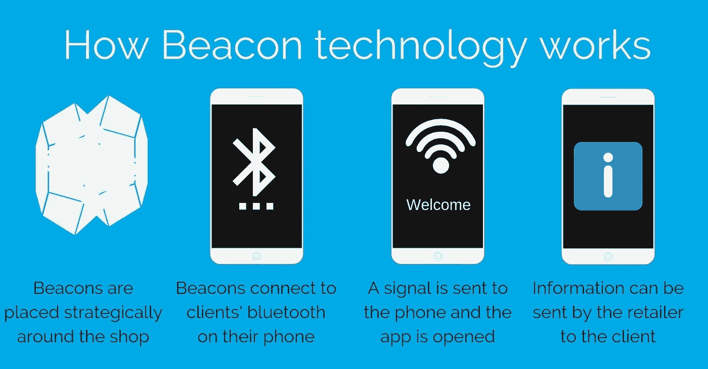
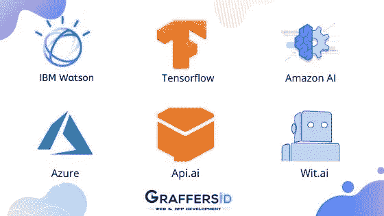
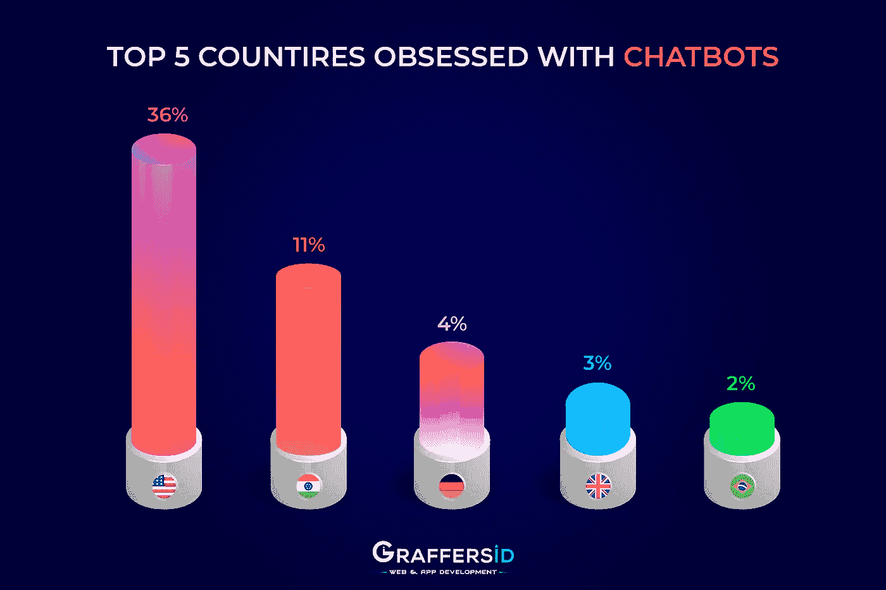
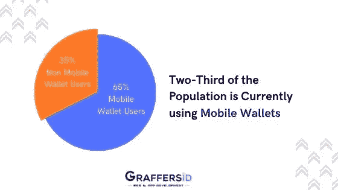

# 2020 年移动应用发展趋势|数据驱动的投资者

> 原文：<https://medium.datadriveninvestor.com/mobile-app-development-trends-to-follow-in-2020-data-driven-investor-7cb8036a8421?source=collection_archive---------8----------------------->

不可否认的事实是，智能手机正在以惊人的速度改变运营模式、商业模式和市场。**预计未来两年，移动应用市场收入将达到 6930 亿美元。**

然而，并不是每一个出现的应用程序都是用户眼中的苹果。根据 Gartner 的预测，1 万个移动应用中有 9999 个失败。这清楚地表明，在这个每天都有数以千计的类似应用程序被开发的世纪，拥有一个移动存在是不够的。

2018-19 年开发的应用程序可能不具备在 2020 年成功工作的潜力。仅仅凭借正确的移动应用开发策略，你无法在这个每天都在变化的市场中保持地位。因此，如果你想在自己的领域保持竞争力，跟上移动应用的发展趋势是至关重要的。

现在问题来了，将统治这十年的移动应用开发趋势是什么？让我们来看看:

# 信标技术

移动应用技术的最新趋势表明，beacon 将在 2020 年得到发展。该技术是第一个被酒店、博物馆、医疗保健行业等完全接受的移动应用趋势。beacon 技术的最大优点是普通用户可以很容易地习惯它的功能。

**首先，让我们看看什么是信标？**

信标是小型无线发射器，使用低能耗蓝牙技术向附近的智能设备发送信号。他们发现了定位技术和邻近营销的应用。开发信标是为了将信息连接和传输到智能设备，这使得基于位置的搜索和交互更加容易。信标，当与[物联网](https://www.datadriveninvestor.com/glossary/internet-of-things/)合并时，在零售领域找到应用。

How Beacon Technology works

**图片来源:** [**视力保健**](https://www.sightcare.co.uk/wp-content/uploads/2018/10/Beacons-1.jpg)

**根据 GeoMarketing 的数据，到 2020 年底，全球部署的信标数量预计将增加到 4 亿个。**智能手机的普及使各种垂直行业处于边缘地位，以满足 Beacons 提供的基于位置的营销解决方案的需求。如今，信标应用于广泛的行业，从零售、银行、电影院、医疗保健、机场、物流等等。

# 可折叠应用

凭借三星的可折叠有机发光二极管显示屏，操作系统正准备利用这项技术来改善智能手机的体验。据三星称，亚马逊 Prime Video、脸书、VSCO、Twitter、Spotify 和微软 Office 等移动应用已经针对 Galaxy Fold 进行了优化。

由于可折叠手机肯定会成为 2020 年的流行语，因此以在可折叠设备上无缝运行的方式规划移动开发策略变得非常重要。

 [## 人工智能与创造力:梦想成真|数据驱动的投资者

### 人工智能总是让我着迷。不仅作为一套有用的工具，不断发展，而且作为一个…

www.datadriveninvestor.com](https://www.datadriveninvestor.com/2019/01/28/ai-creativity-deep-dream-comes-true/) 

当在可折叠设备上运行应用程序时，应用程序应该会自动从一个屏幕转换到另一个屏幕。为了获得更好的用户体验，当前任务的无缝继续以及应用程序以相同的状态恢复是非常重要的。应用程序应该保存 UI 状态并支持配置更改，以适当地响应转换期间触发的配置。

这里需要注意的是，Android 10 ( [API](https://www.datadriveninvestor.com/glossary/application-programming-interface/) level 29)及更高版本支持相当多的长宽比。有了可折叠屏幕，外形规格可以从 21:9 到 1:1 的细长屏幕。

**在设计可折叠显示屏的应用程序时，屏幕连续性、多简历和多显示是应该记住的一些因素。**

# 机器学习和人工智能

当谈到智能手机上的[人工智能](https://www.datadriveninvestor.com/glossary/artificial-intelligence/)时，谷歌助手、Siri 等虚拟助手以及 FaceApp 和 Prisma 等基于 AI 的照片过滤应用程序会浮现在脑海中。

但在 2020 年，我们肯定会看到现有应用程序和许多其他工具的增强，如基于人工智能的相机、用户预测、语音翻译和用户预测将在智能手机中找到一席之地。

人工智能和人工智能的结合肯定会给应用程序开发带来广泛的好处。有了人工智能和人工智能，就有可能跟踪以前的数据，发现问题并实时解决它们。这两种技术可以结合起来，通过常规的使用模式来理解行为和动作，并实现必要的动作。

App Development Platform for AI and Machine Learning

展示 AI 和 MI 在应用程序开发中的使用的一些流行示例是:

*   聊天机器人和虚拟个人助理
*   用于娱乐和游戏的语音识别应用
*   诊断医疗状况并提出治疗建议的医疗软件
*   运动和面部检测应用程序，在监控系统中得到应用
*   财务预测解决方案

今年，能够识别语音命令、分析文本数据和预测用户行为的移动应用数量肯定会大幅增加。

# 聊天机器人

如今，用户在寻找能够减少网上购物麻烦的 DIY 客户服务工具。聊天机器人是帮助你管理客户关系的最佳选择。

预计在 2020 年，聊天机器人与移动应用的集成将从相当初级的水平上升到激烈的水平。**根据 Gartner 最近的统计，到 2022 年，聊天机器人将节省 80 亿美元的成本。**

Countries Obsessed with Chatbots

截至目前，Apple Play 商店中的应用程序数量约为 180 万，谷歌 Play 商店的应用程序数量为 250 万。然而，仍然有许多应用程序没有利用聊天机器人来提升用户体验。

随着用户欣赏快速而精确的答案，将[聊天机器人](https://www.datadriveninvestor.com/glossary/chatbot/)集成到你的移动应用程序中是一个极好的商机。

# 手机钱包

考虑到智能手机的普及和智能手表的普及，谷歌支付和苹果钱包等移动钱包肯定会在 2020 年推动购买。因此，对手机钱包应用的需求在今年和明年肯定会上升。

**根据最近的统计数据，2018 年通过移动钱包的交易达到 42960 亿美元。到 2022 年，这一数值预计将达到 139，790 亿美元。**

Ratio of Mobile Wallet Users

移动钱包在年轻人群中更受欢迎，因为与老年人相比，移动钱包处理和定制技术解决方案的能力更强。

不可否认的事实是，移动钱包消除了在网上下单时延长结账过程的障碍。因此，对于供应商来说，要消除转换中的障碍，就必须将他们的应用程序与移动钱包相集成。

甚至像 Ticketmaster、安德玛、Wayfair 和 Avis 这样的大品牌也加入了移动钱包的行列。所以，如果你想确保你不落后于你的竞争对手，那么就要确保你正在将移动钱包与你的应用程序集成在一起。

# 结论

Google Play、Apple App Store、Amazon App Store 和 Window Store 上有大量的应用程序。随着所有这些移动应用趋势，移动行业肯定会以闪电般的速度扩张。

移动应用开发技术、微服务和新兴后端平台的新兴趋势，加上不断变化的硬件功能，将继续推动移动应用的发展。

因此，为了确保在这个竞争激烈的应用程序开发领域不落后于竞争对手，企业领导者跟上最新趋势和技术至关重要。

Graffersid.com 的创始人兼首席执行官，这是一个网站和移动应用程序开发工作室，帮助企业自动化他们的流程，帮助企业家从构思到为投资者做好准备来构建他们的产品。在渴望产生影响之前，Sidharth 作为一名熟练的开发人员在顶级跨国公司工作了 7 年，在那里他为财富 500 强企业客户和独角兽初创公司管理系统。这时，Sidharth 看到了“客户想要什么”和“客户需要什么”之间的差距。很少有人能真正倾听客户的意见，理解客户的需求，并像对待自己的产品一样提供建议。这导致了 Graffersid 的成立，它现在以其独特的方法和以客户为中心的设计原则而闻名。Sidharth 对技术和初创企业充满热情，他还管理着一个由熟练开发人员和成功企业家组成的社区。Sidharth 和他的团队与来自不同领域的客户以及像 Infosys 这样的 IT 巨头合作过。凭借他们的战略方法和最先进的产品，他们已经成功交付了被 Y Combinator、Google Incubation USA、BlueChilli Australia、Coca Cola Ventures Australia 等选中的产品。

*原载于 2020 年 1 月 15 日*[*【https://www.datadriveninvestor.com】*](https://www.datadriveninvestor.com/2020/01/15/mobile-app-development-trends-to-follow-in-2020/)*。*