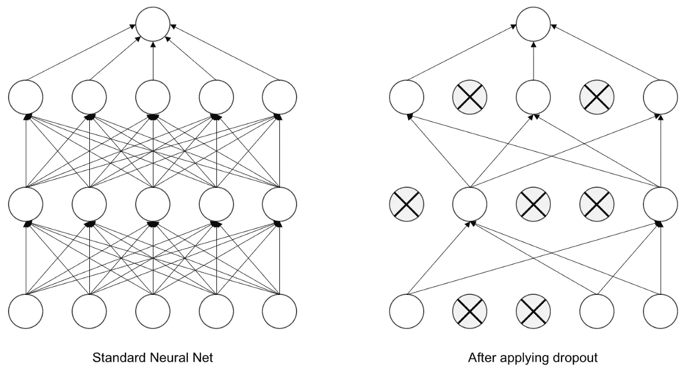

# 模型过度拟合？使用辍学！

> 原文：<https://medium.datadriveninvestor.com/model-overfitting-use-dropout-a32010f0afd0?source=collection_archive---------8----------------------->

## [深度学习](/topic/machine-learning)

## 最好的正规化技术。


Photo by [Alina Grubnyak](https://unsplash.com/@alinnnaaaa?utm_source=medium&utm_medium=referral) on [Unsplash](https://unsplash.com?utm_source=medium&utm_medium=referral)

被困在付费墙后面？点击[这里](https://medium.com/@D3nii/model-overfitting-use-dropout-a32010f0afd0?source=friends_link&sk=933812164d01ba9ccd5e238faf4bfb4a)阅读完整故事与我的朋友链接！

我们都知道 ***的数据是有限的*** 。是的，今天的数据非常丰富，比以往任何时候都多，但仍然有一个因素，那就是它并不是任何事情都有无限的数据。

而且，这常常会导致机器学习实践者出现一些问题，如[](https://www.google.com/url?sa=t&rct=j&q=&esrc=s&source=web&cd=&ved=2ahUKEwjgk7_5yfrrAhVJqxoKHfxmAYoQFjAXegQIBRAB&url=https%3A%2F%2Fen.wikipedia.org%2Fwiki%2FOverfitting&usg=AOvVaw15Bea2nVsUGiMjDU4IUG8D)*&[***过拟合***](https://www.google.com/url?sa=t&rct=j&q=&esrc=s&source=web&cd=&cad=rja&uact=8&ved=2ahUKEwjMzMSQyvrrAhUyyoUKHUgdB2cQFjAHegQIERAG&url=https%3A%2F%2Fwww.investopedia.com%2Fterms%2Fo%2Foverfitting.asp&usg=AOvVaw1i0SFcaDex4kvH5SXrnowr) 。我们将讨论*欠配*以及如何处理，但今天让我们讨论一种处理*过配*的方法。*

# *什么是退学？*

*ML 从业者使用许多技术来避免他们的模型的过度拟合行为。其中应用最广泛的是 ***辍学*** 。*

**辍学*的定义很简单！*

> ***Dropout** 是一种随机选择的神经元在训练时被忽略的技术。[1]*

*随机选择要关闭的神经元。通过“关闭”，我的意思是它们在向前运行和向后传播中起 0%的作用，因此，模型必须使用其他神经元来继续学习。*

> *Dropout 做了一件看似疯狂的事情，在你的网络中随机淘汰一些单位。*

*直觉 I: *这样更好，因为你在用一个更小的神经网络工作。因此，使用一个较小的神经网络似乎应该有一个正则化的效果。**

***直觉二:** *一个神经元不会依赖于一个特征，会分散权重。这样，它类似于 L2 正则化。它缩小了重量。**

**

*Image from this [website](https://towardsdatascience.com/an-intuitive-explanation-to-dropout-749c7fb5395c)*

# *为什么退学？*

*让我们提醒一下这些神经元实际上在做什么。神经元在开始时被设置为随机值，随着时间的推移，它们会犯错误并相应地改变它们的权重。*

****过度拟合是什么样子的？****

*我给你举个例子。假设，你在一个 5 人小组，A1，A2，A3，A4，A5。现在，你们的导师要求你们准备一份演讲稿，并在全校面前发表。现在你，A1，是小组的领头人，A3 是你最好的朋友。你会偏向于把大部分发言给 A3，对吧？因此，与 A2、A4 和 A5 相比，A3 将具有更高的影响语音结果的比率。 ***这是超配！*** *如何？因此，如果 A3 在演示当天感觉不舒服，那么每个人都要面对后果，尽管其他成员都很健康。*你看到了吗？*一个成员的行动对整体结果起着重要作用。**

**

*Photo by [Chang Duong](https://unsplash.com/@iamchang?utm_source=medium&utm_medium=referral) on [Unsplash](https://unsplash.com?utm_source=medium&utm_medium=referral)*

****现在，就神经网络而言？****

*当我们提到*模型过度拟合*时，我们的意思是特定层中的一些神经元比它们的相邻神经元产生更大的影响，这使得预测*有偏差*，因此*错误*。*

## *如何避免？*

*我们用 ***辍*** 。现在，你应该对退学能有什么帮助有一些直觉了。我们基本上做的是在每个时期随机关闭一些神经元，让其他神经元学习和适应。这样，我们:*

*   *更好地概括模型。*
*   *避免过度拟合。*
*   *获得独立的神经元表示。*
*   *获得更好的效果。(*大部分时候。*😅)*

# *效果？*

*你可以想象，如果一个层中的一些神经元被删除，那么其他神经元将不得不努力学习丢失神经元的表示。*

*想想看，如果我们取出一些神经元，让其他神经元学习更多的东西。这难道不会使神经元对神经元的个体权重不那么敏感吗？因为没有哪个神经元会自己做出决定。唯一的缺点是*成本函数*没有被很好地定义。*

# *在 Keras 实施*

*在[***Keras***](https://keras.io)中实现 ***辍学*** 是相当容易和直接的。*

*在制作*模型的架构*时，我们只是在[全连接](https://www.google.com/url?sa=t&rct=j&q=&esrc=s&source=web&cd=&cad=rja&uact=8&ved=2ahUKEwiSn9qvy_rrAhVGyxoKHb4BCrQQFjAFegQIERAF&url=https%3A%2F%2Fiq.opengenus.org%2Ffully-connected-layer%2F&usg=AOvVaw2ryRE9NTUgepA0LOAnsA70)层或[卷积](https://cs231n.github.io/convolutional-networks/)层之间添加了脱落层。*

```
*from keras.layers import Dropout, ..., ...model = Sequential()model.add(Dense(.......))
model.add(Dropout(0.25))
model.add(Dense(.......))
model.add(Dropout(0.25))
model.add(Dense(.......))*
```

****传入的 0.25 是什么函数？****

*我们传递一个神经元被丢弃的概率。在这种情况下，每个神经元都有大约 *25%* 被忽略的概率。*

# *利用辍学？接受这些建议。*

*   *辍学概率的正确选择很难做到完美，但 20%通常是一个很好的起点。然后，将其作为超参数进行调整。*
*   *对于在哪个层上使用辍学没有限制。可以用在多层感知器，卷积层，递归层等。*
*   *使用 Dropout 时，尝试使用更大的网络。因为更大的网络更容易超载，所以使用 Dropout 会有更多的好处。*

*好吧，我希望这篇文章能帮助你。我们上 [*Linkedin*](https://www.linkedin.com/in/d3ni/) 连线吧！*

# *参考*

*[1]深度学习模型中的辍学正则化与 Keras， [**杰森·布朗利**](https://machinelearningmastery.com/author/jasonb/) **，**2016 年 6 月 20 日，[https://machine Learning mastery . com/Dropout-regulation-Deep-Learning-Models-Keras/](https://machinelearningmastery.com/dropout-regularization-deep-learning-models-keras/)*

# *进一步阅读*

*[](https://medium.com/@D3nii/deep-learning-for-cats-vs-dogs-classification-309463f3fc46) [## 针对猫 vs 狗分类的深度学习！

### 区分猫狗的循序渐进指南！

medium.com](https://medium.com/@D3nii/deep-learning-for-cats-vs-dogs-classification-309463f3fc46) [](https://medium.com/dev-genius/deep-learning-for-weather-classification-fe877cdc721c) [## 用于天气分类的深度学习

### 在不同的天气状态之间分类！

medium.com](https://medium.com/dev-genius/deep-learning-for-weather-classification-fe877cdc721c) [](https://medium.com/@D3nii/tackling-common-neural-network-problems-e08b30775100) [## 解决常见的神经网络问题

### 大家好！这是我开始攻读纳米学位并成功完成第一个学位后的第四篇文章

medium.com](https://medium.com/@D3nii/tackling-common-neural-network-problems-e08b30775100) 

# 联系人

如果你想了解我最新的文章和项目[，请关注我的媒体](/@D3nii)。以下是我的一些联系人详细信息:

*   [领英](https://www.linkedin.com/in/d3ni/)
*   [GitHub](https://github.com/D3nii?tab=repositories)
*   [推特](https://twitter.com/danyal0_o)

> *快乐学习。:)**