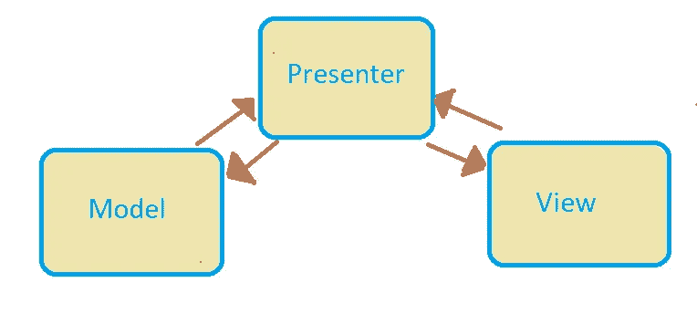
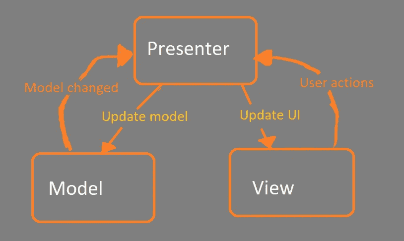

# 模型视图演示者(MVP)

> 原文：<https://medium.datadriveninvestor.com/model-view-presenter-mvp-5c3439227f83?source=collection_archive---------2----------------------->

模型视图展示者架构的详细解释可能是开发人员寻求的答案。

MVP 是一个缩写，你可能经常听到，它代表“最有价值的球员”，大多数时候它代表那个，但不是在这种情况下，所以让我们把笑话放在一边，专注于我想在这篇文章中阐述的 MVP 模式。MVP 模式代表模型视图演示者模式。MVP 是最流行的架构模式之一，它将应用程序分为三层:模型、视图和展示者。
注:MVP 只是 MVC 架构的衍生。

MVP

## 历史

Taligent 是一家软件公司，也是 MVP 的起源。所以 MVP 是一种软件模式，最初是由 Taligent 在 1990 年使用的。在基于 C++的公共点环境中，它被用作应用程序开发的底层编程模型。过了一段时间，模型从 Taligent 转移到 Java。

Dolphin Smalltalk 的安迪·鲍尔和布莱尔·麦格拉申在 1998 年采用了 MVP 模式来构成他们 Smalltalk 用户界面框架的基础。MVP 在 2006 年被合并到微软的用户界面编程文档中。Net 框架。

 [## 多平台 SaaS 应用的 2020 年发展选择|数据驱动的投资者

### 我目前正在为公司做一个新项目。该项目包括一个移动应用程序，由一个…

www.datadriveninvestor.com](https://www.datadriveninvestor.com/2020/07/13/2020-development-choices-for-multi-platform-saas-application/) 

# MVP 架构模式

MVP 模式与 MVC 模式非常相似。在这个架构模式中,“p”代表表示者。所以它有三个部分，就像 MVC 一样，但是这里的控制器由演示者代替，尽管它们执行的功能不同。演示者可以代表视图处理所有的 UI 事件。它接受来自用户的输入，处理模型中的数据，然后将结果转换回视图。

MVP 也被称为复合模式。MVP 模式通常使用 windows 窗体应用程序和 ASP.NET web 窗体来执行。

A visual representation of MVP

**模型-** 用于处理数据。模型可以是负责访问 API 和本地数据库或缓存的接口，因此模型的主要角色是管理数据。

**视图-** 实现数据显示。它只应该负责显示东西，不应该包含任何业务逻辑。因此视图只管理和显示页面。

Presenter- 它被称为中间人，因为它实现了模型和视图之间的交互。由于模型和视图不直接通信，所以演示者被用作桥梁，它从模型中检索数据，然后以视图可以理解的方式格式化。

## MVP 的利与弊

根据使用环境的不同，每种模式都有其优点和缺点。
**MVP 用法优点:**
1 .代码重用——关注点分离原则将提供代码的可重用性。设计在其逻辑单元中将有一个适当的领域模型和业务逻辑。
2。测试驱动的方法——隔离的应用允许组件被单独测试。视图的逻辑部分(呈现者)与可视视图(实际视图)的分离使得单元测试变得容易。
3。适应性强的设计——如果设计好的话，修改和增加会容易得多。独立代码提供了选择多个视图和数据源的自由。
4。分层——MVP 将视图逻辑与业务逻辑分离开来。MVP 使用的
C**ons:**
-更高的复杂性
-经验和知识在正确的实现中起着重要作用
-不适合简单和小型的解决方案

## MVP vs MVC

我在上面提到过，MVP 只不过是 MVC 的派生，所以它有相似之处，但也有根本的不同。这是关于每一层对其他层的依赖，或者更准确地说，哪一层对其他层有主要的控制。在 MVP 中，视图是负责的，而在 MVC 中，控制器是负责的
总而言之，MVC 中的控制器对 UI 有更多的控制并处理事件，而 MVP 中的演示者更被动，只是通过 UI 来演示信息。所以 MVP 和 MVC 之间没有太大的区别，只有一条很细的分界线。

## 结论

MVP 是 MVC 的衍生。它非常灵活，允许以低得多的成本添加新的功能和想法，从而实现高质量的产品。许多环境支持 MVP 模式，如。Net，Java，Kotlin，Php。
表示层和业务逻辑是分离的，确保代码易于测试和理解。应该注意的是，它不优选用于小型应用中。

**访问专家视图—** [**订阅 DDI 英特尔**](https://datadriveninvestor.com/ddi-intel)