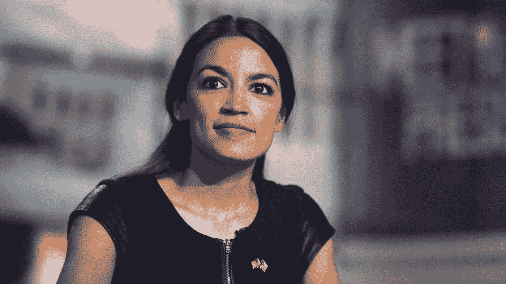
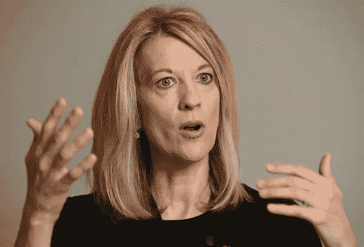
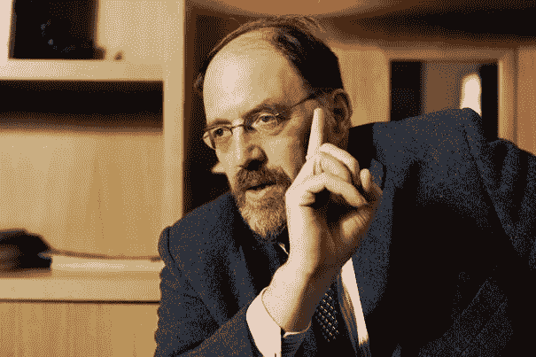

# 现代货币理论

> 原文：<https://medium.datadriveninvestor.com/modern-monetary-theory-8973cd74ad6b?source=collection_archive---------0----------------------->

## *写为* [*RealTimeCEO*](https://realtimeceo.com/)

Congresswoman Alexandria Ocasio-Cortez is an advocate for Modern Monetary Theory.

在新冠肺炎崩盘后，当我们的领导人寻求修复我们的经济时，一种全新的经济学思维方式脱颖而出:现代货币理论，简称 MMT。MMT 关于货币创造和政府支出的激进想法已经引起了恐惧和困惑。“这很危险，”我们听说。我们会像津巴布韦一样完蛋的！我们被告知。债务危机，金融崩溃——或者，更好未来的机会。所有这些焦虑都很有趣。所以，让我们仔细看看 MMT。

## **(I)通向 MMT 的路径**

MMT 的兴起始于 2008 年全球金融危机之后。正如网飞的电影《大空头》所展示的，糟糕的金融模型、系统性弊端和低估风险导致了银行系统的崩溃。金融部门中明显而严重的问题不受控制地增长，最终，整个事情爆发了。值得注意的是，几乎没有人预见到崩溃的到来。前美联储主席、“世界历史上最伟大的央行行长”艾伦·格林斯潘(Alan Greenspan)感到沮丧。他说，支撑我们金融市场的“整个知识大厦”已经倒塌。由于无法理解自身的缺陷，当代经济和金融模型在危机中失去了可信度:危机让它与贝尔斯登和雷曼兄弟一起破产。

GFC 之后，我们需要一种新的方式来思考经济学。我们迫切需要一种新的范式来避免旧思维方式的致命缺陷。在过去的十年里，全世界的人们都在努力满足这种需求，他们的一些想法已经变得突出。他们中的一些人胆小怕事，另一些人平淡无奇，但有几个很有前途。

现代货币理论是这些观点中最成功也是最有争议的。直到最近，它还是一个学术上的默默无闻，但现在它已经成为主流。像伯尼·桑德斯和亚历山大·奥卡西奥-科尔特斯这样的政治家已经采纳了 MMT 启发的政策。著名理论家斯蒂芬妮·凯尔顿的新书《赤字神话》也广受好评。这些数字在媒体上非常显眼，他们经常出人意料地呼吁政策变革。他们说我们需要“全民就业保障”和“绿色新政”,两者都由——什么资助？— *印钞票*。没错。印钞票。

Alan Greenspan, before the collapse of his intellectual edifice.

## **(二)什么是 MMT？**

目前，还没有关于 MMT 的共识。根据我们的消息来源，毫米要么是江湖骗子，要么是专家；他们非常务实，或者说是危险的乌托邦。有人说凯尔顿的工作“与达芬奇和哥白尼的天才不相上下”。其他人只是告诉我们 MMT 是“绝对错误的”。对安格斯·迪顿和德隆·阿西莫格鲁等主要经济学家的民意调查显示，美国科学院压倒性地反对这种做法。那么，MMT 就遭到了一些强有力的反对。但是，如果我们读了米特自己所说的，就很难理解为什么它会激发这些极端的反应。

根据经济学家詹姆斯·加尔布雷斯(James K. Galbraith)的说法，MMT 只是“对现代信用经济实际运作方式的描述”。⁴尽管它的观点可能令人惊讶，但并非不合逻辑。本质上，该理论告诉我们，拥有自己货币的政府在支出之前不需要货币储备或税收。毕竟，政府永远是经济中的资金来源。逻辑上，税收不可能发生在货币创造之前。相反，政府必须“从无到有”地创造货币，并在收到税收之前花掉。否则，整个货币体系就说不通了。

“从无到有，”，你说。是的:从无到有。MMT 说钱的存在只是因为政府从无到有创造了它。“这是怎么回事，”你问。嗯，这很简单。首先，国家利用其权力向人民征税。然后，它要求用它发行的货币支付这些税款。然后，工人和生产者发现他们需要政府货币，他们通过政府支出和私人借贷的组合来获得。一旦他们有了钱，他们就为他们的一部分产出纳税，并保留其余部分。政府得到税收，工人用剩余的钱进行投资、消费等。⁵

所有这些让我们对政府赤字有了新的看法。由于税收永远不会等于产出的 100%，政府最初会陷入预算赤字。他们不能把没有先花掉的钱征税。因此，只有在私人部门出现赤字的情况下，政府才能实现预算盈余。为了实现盈余，政府必须减少货币创造，通过增税将现有货币从体系中抽离出来，或者从私营部门寻求贷款。相应地，⁶政府不需要通过借贷来为他们的赤字融资。对他们来说，合理的长期赤字是健康经济的标志。另一方面，预算盈余会从私人投资中抽走资源，从而阻碍经济增长。更糟糕的是，盈余经常会催生危机时期，因为私人部门会从事高风险贷款来为政府融资。⁷

如果这一切都是真的，它对政府政策有一些重要的影响。MMTers 告诉我们，那些国家:

a)持有一种*主权货币*(用 MMT 的话说，是一种法定货币，不能兑换成政府可以用完的东西，比如黄金或外币)，以及

b)只在 currency⁸借款人

能够也应该发行货币来创造“充分就业的经济”。⁹根据 MMT 的说法，一个政府可以花钱使经济达到其生产能力。它还说，使用主权货币的国家不能违约。正如加尔布雷斯告诉我们的，像澳大利亚和美国这样的国家“不是希腊，也不可能成为委内瑞拉和津巴布韦”。顺便提一下，沃伦巴菲特和艾伦格林斯潘都同意:⁰一个拥有主权货币的国家总是可以通过创造货币来为其赤字融资。我们不能花光自己的钱。

Leading Modern Monetary Theorist, Prof. Stephanie Kelton

## **(三)MMT 案**

对于那些脱离了货币主义的人来说——几乎所有阅读这篇文章的人，包括我自己——这听起来像是纯粹的诅咒。“通货膨胀不是随时随地都是一种货币现象”吗？印钞票来为我们的赤字融资不会让我们走向阿根廷式的毁灭吗？主流经济学家——顺便说一句，他们中没有人预见到 2008 年的 GFC——似乎是这样认为的。

对哈佛大学经济学家肯尼斯·罗格夫来说，这些关于赤字的想法“简直是疯了”。在他看来，这种“现代货币废话”忘记了“印钞机不是万能的”，因为它的使用会导致债务偿还和货币需求的问题。诺贝尔奖获得者保罗·克鲁格曼告诉我们，他“根本不理解(MMT 的)论点”。在其他地方，他对 MMT 的状况表示了“轻微的担忧”，“因为我们有印钞机，赤字并不重要”。最后，对于拉里·萨默斯——亚尼斯·瓦鲁法基斯的《黑暗王子》——来说，MMT 是“巫毒经济学”和“灾难的处方”。他说，这提供了“众所周知的免费午餐”，即政府能够在不给任何人带来任何负担的情况下增加支出。'

可怕的免费午餐，人们:害怕吧。

经济学家讨厌免费午餐。我们知道这一点。我们都同意免费午餐是最糟糕的午餐。今天，没有一个严肃的经济学家支持那些试图不劳而获的政策。历史告诉我们，这通常是灾难性的。我们知道，印刷钞票来为支出融资会导致通货膨胀。政府的公信力会下降。借贷成本将会增加，货币价值将会下降。我们知道，印刷无止境的钞票没有什么可取之处——正如米特所说，是用电脑“敲键”让它存在的。我们知道，世界各国都因奉行这一战略而毁了自己。

## **(四)MMT 案**

幸运的是，MMT 没有提出这样的建议。斯蒂芬妮·凯尔顿(Stephanie Kelton)煞费苦心地向我们保证:“MMT 不是免费的午餐”，她在自己的赤字神话中如是说。Galbraith 还告诉我们，他不知道有哪个 MMT 倡导者如此 naïve，以至于说“赤字无关紧要”。与 MMT 社区一样，Kelton 和 Galbraith 明白，政府在寻求支出时，必须对我们经济的实际资源约束保持敏感。

 [## 对有商业头脑的投资者有用的行为经济学概念|数据驱动的投资者

### 在美国企业界，高斯统计，对我们周围世界的确定性解释，以及理性…

www.datadriveninvestor.com](https://www.datadriveninvestor.com/2020/07/09/helpful-behavioral-economics-concepts-for-the-business-minded/) 

MMT 的支持者并不主张无限印钞。相反，他们认为政府可以花钱，直到经济的所有真正资源都用于生产活动。经济有真正的限制，这一点凯尔顿在她的书中至少提到了七次。她还强调，未能识别和尊重这些限制可能会以通胀的形式给我们的经济带来巨大伤害。像所有的经济学家一样，MMTers 说政府可以花钱将经济推向其生产极限。然而和其他人不同的是，他们也认为政府应该这样做。这是他们的责任，直到我们达到充分就业。

Another leading modern monetary theorist, Prof. James K. Galbraith.

## **(五)洞察力**

正如我们所见，MMT 声称为我们的经济问题提供了一个令人信服的解决方案。但是它的论点站得住脚吗？这行得通吗？

当我想到 MMT 的可行性时，我不得不提醒自己一些事实。自从我 1994 年出生以来，我们的社会经历了 2000 年网络泡沫的破裂。接下来，我们目睹了 2008 年全球金融体系的崩溃。然后，欧元区危机持续了 2010 年。现在，我们正处于 2020 年新冠肺炎停摆导致的经济衰退中。在这段危机时期，许多国家的利率和资本投资占 GDP 的比重已经跌至历史低点，拖累了经济增长。⁴在我的一生中，世界范围内的经济变得越来越低效，部分原因是我们对经济的思考方式。我们需要改变。也许，MMT 是获胜的想法。

事实上，我对是否完全支持 MMT 犹豫不决。对我来说，MMT 似乎提供了与以往一样的故事，尽管有一些小的调整。它给了我们一些关于货币来源和政府运作方式的好主意。这也让紧缩政治的核心变得岌岌可危。但事实仍然是:政府只能在一定程度上印刷钞票来为支出融资*。如果支出没有增加实际生产率，超过这个限度的扩张将导致通货膨胀。一旦他们达到这种资源限制，政府只能通过——你猜对了——向私营部门征税来花更多的钱。如果他们不加税，政府会发现他们在与私营部门竞争，价格就会上涨。*

在没有增税的情况下，我怀疑基于 MMT 的支出能否在没有通胀的情况下为绿色新政(Green New Deal)等项目融资。毕竟，高技能工人通常从事其他重要活动。我对他们的“工作保障”的想法感到困惑。当然，他们对充分就业的愿景很有吸引力。但我怀疑工人们将完成的项目的真正价值。它的设计和管理必须深思熟虑，否则它可能会像苏联的全民就业计划一样结束，在那里“他们假装付钱给我们，我们假装工作”。简而言之，人们担心政府将无法正确运用这一理论。如果不小心，议员们可能会无意中证明他们的批评是对的。

尽管有这些保留，总的来说，我对 MMT 持开放态度。目前，通货膨胀不是风险。利率很低，我们的经济资源没有得到充分利用。近二十年来，我们的知识范式并没有确保经济稳定。那么，也许我们的政府应该关注 MMT。毕竟，激发我们的想法通常会告诉我们一些重要的事情。也许是时候倾听了。

# 推荐阅读

詹姆斯·加尔布雷斯(James K. Galbraith)的文章《现代货币现实主义》(Modern monetary realistic)是对 MMT 的一个很好的介绍。斯蒂芬妮·凯尔顿的《赤字神话》是一部非常通俗易懂的介绍这个话题的书。L. Randall Wray 在他的*现代货币理论*中提供了一个更全面的解释。道格·亨伍德(Doug Henwood)的文章《现代货币理论于事无补》(Modern Monetary Theory is not Helping)从左翼角度对 MMT 进行了深思熟虑的批评。对于一个关键的“自由市场”的观点，见彼得·史密斯的文章，“揭露现代货币理论”。

# 尾注

1 菲尔·格拉姆对这些词负责。参见:[https://www . economist . com/United States/2000/01/06/全能艾伦-格林斯潘](https://www.economist.com/united-states/2000/01/06/almighty-alan-greenspan)

2 见[https://oversight . house . gov/sites/Democrats . oversight . house . gov/files/migrated/20081023100438 . pdf](https://oversight.house.gov/sites/democrats.oversight.house.gov/files/migrated/20081023100438.pdf)

3 这些言论分别属于戴维·凯·约翰斯顿和罗伯特·p·墨菲。关于对主要经济学家的调查，见[http://www.igmchicago.org/surveys/modern-monetary-theory/](http://www.igmchicago.org/surveys/modern-monetary-theory/)

4 参见[https://www . Japan times . co . jp/opinion/2019/03/18/commentation/world-commentation/modern-monetary-realistic/](https://www.japantimes.co.jp/opinion/2019/03/18/commentary/world-commentary/modern-monetary-realism/)

因此，对富人来说，金钱是国家权力的一种表现——一种通过纳税义务迫使人们还债的手段。根据 l .兰德尔·雷的说法，“所有的钱都是债务”是正确的。(Wray，2015 年，第 58 页)。

6 请注意，私营部门的货币创造也是从零开始的。当客户获得银行贷款时，客户向银行出售一种金融证券——他们承诺付款——银行为他们创建一个账户，而无需从其他地方提款。银行预期债务人将通过出售其金融证券获得足够的回报。关于这一点，请参阅雷的《现代货币理论》第三章，以及理查德沃纳教授的有趣论文《银行能凭空创造货币吗？——理论和经验证据。可用[https://www . science direct . com/science/article/pii/s 1057521914001070](https://www.sciencedirect.com/science/article/pii/S1057521914001070)

参见凯尔顿的*赤字神话的第三章。*

8 如果他们持有另一种货币的债务，那么以本币计算的政府支出将使汇率贬值，从而增加债务负担和违约的可能性。出于这个原因，MMT 的支持者建议不要持有以外币计价的债务。因此，他们的理论不是普遍适用的。

9 凯尔顿，2020 年，第 38 页。

10 凯尔顿，2020 年，第 147-148 页。参见 https://www.youtube.com/watch?v=Q2om5yvXgLE[的](https://www.youtube.com/watch?v=Q2om5yvXgLE)

11 米尔顿·弗里德曼的话，斯蒂芬妮·凯尔顿在第 161 页的*赤字神话*中引用。

12 Wray 告诉我们，恶性通货膨胀通常需要印钞以外的额外环境。如果政府支出的增加伴随着:生产能力的崩溃、社会政治动荡、以外币计价的沉重债务负担的存在以及出于政治原因无法提高税收，或者政府征税能力的削弱，那么实际资源约束就会缩小，通货膨胀就会加剧。

13 凯尔顿，2020 年，第 70 页。

14 根据世界银行的数据，自 2006 年以来，除了一年之外，美国的 GDP 增长不到 3%，而德国和澳大利亚等国家的表现也好不到哪里去。参见[https://data.worldbank.org/indicator/NY.GDP.MKTP.KD.ZG？locations=US-DE-AU](https://data.worldbank.org/indicator/NY.GDP.MKTP.KD.ZG?locations=US-DE-AU)

## 访问专家视图— [订阅 DDI 英特尔](https://datadriveninvestor.com/ddi-intel)