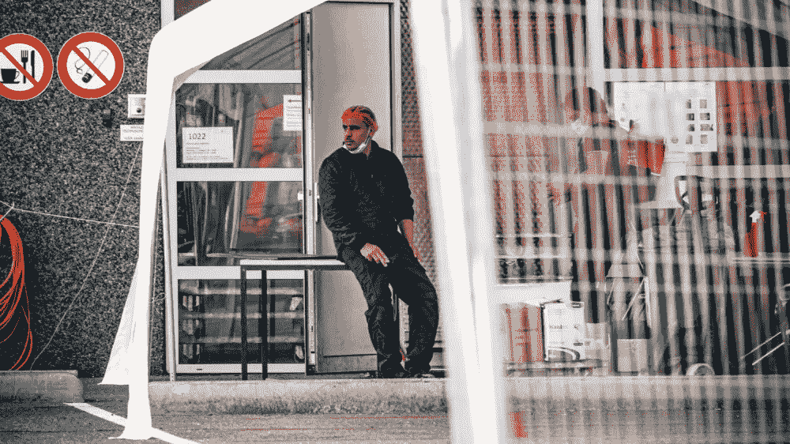
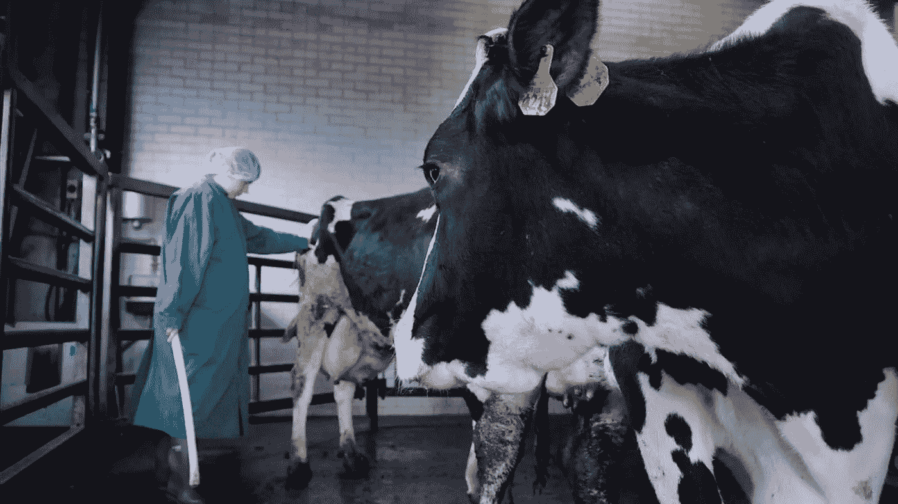
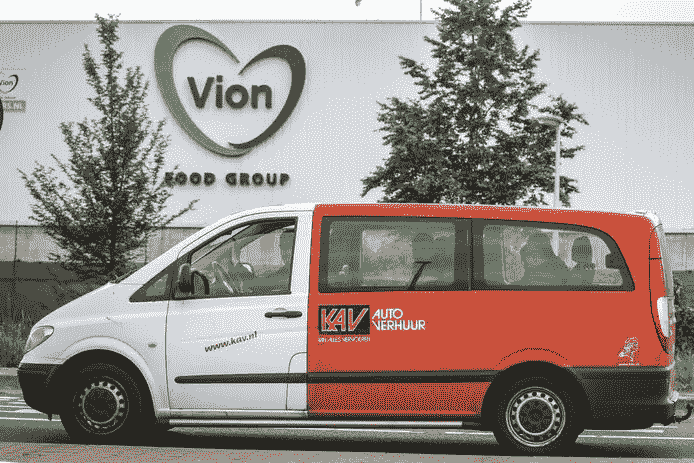

# 现代奴隶制:电晕病毒如何揭露荷兰屠宰场的真实本质

> 原文：<https://medium.datadriveninvestor.com/modern-slavery-how-the-corona-virus-unmasks-the-true-nature-of-dutch-slaughterhouses-3e63e6c0e0d3?source=collection_archive---------6----------------------->

Slaughterhouse workers on break.

我们消费肉类的方式极大地改变了我们生产肉类的方式。20 世纪 60 年代，科学家发明了工厂化农业，以最大限度地提高效率和产量。所有这些都是为了维持不断增长和需求不断增加的世界人口。现在，一周中的每一天都可以吃肉，而且被视为一种廉价的购买，消费者很难减少肉类消费，或在优质蛋白质上花费更多。这导致肉类行业尽可能地削减成本，同时牺牲动物福利和工作条件。肉类加工和屠宰行业的内部人士称这个行业为“封闭的据点”。屠宰场不希望外人窥探，这是一个灾难的配方。

# 疏忽

为了监控肉类行业和屠宰场，荷兰食品和消费品安全管理局负责监控屠宰场，以确保按照规则开展业务。不幸的是，事实并非如此:在一份由荷兰农业部长卡洛拉·斯豪滕委托的报告中，安全局并没有“实现改善动物福利和防止虐待的目标”。检查员通常对农民和屠宰场老板过于友好，不开罚单或写报告。这些视察员的行为方式也有很大差异，有些人一贯而精确，而另一些人甚至从未写过一份报告。这很令人担忧，因为所有的检查员都是有执照的兽医。实际上正在做他们应该做的事情的核查人员小组，这是一个小的小组，得到了一个绰号:“严格的核查人员”。使他们在同事中被抛弃。

A veterinarian inspecting cattle.

根据各种非政府组织和非营利组织，有很多东西可以写。激进组织获得的秘密录像显示，猪和牛在清醒时被屠杀，猪在接近沸腾的水中被淹死，但仍然活着。这些例子正是安全机构复活的原因。对廉价肉类的持续需求和肆虐的疫情已经痛苦地表明，我们屠宰和加工牲畜的方式远非规范、不可持续和致命的。不仅仅是为了动物，也是为了在屠宰场工作的人。

 [## 金钱:冠状病毒疫情期间的投资|数据驱动的投资者

### 在我将近 20 年的金融服务生涯中，我曾经负责监督整个…

www.datadriveninvestor.com](https://www.datadriveninvestor.com/2020/07/29/money-investing-during-the-coronavirus-pandemic/) 

# 冠状病毒病

但是，即使检查员对屠宰场的条件提出批评，安全部门也不予理睬。甚至在大爆发之前，检查人员就表达了他们对在荷兰发现的一些屠宰场的安全和健康的担忧。声称 1.5 米的距离规则没有得到遵守，没有足够的保护措施，一些员工已经生病了。然而，安全当局声称，屠宰场正在尽一切努力阻止冠状病毒的传播。直到多个屠宰场被证明是大规模的感染池，安全当局才采取行动，暂时关闭受感染的屠宰场。

研究人员正在调查是什么导致了屠宰场的疫情爆发，以及对最终消费者的影响。屠宰场的湿度非常高，这意味着动物蛋白又冷又湿。这导致含有病毒的飞沫存活更长时间，COVID 在潮湿的环境中生长旺盛，在干燥的气候中死亡更快。这增加了病毒从人类传播到正在加工的肉类的风险。特别是如果生病的员工躺在产品上，或者徒手处理肉。但是，如果在这些环境中坚持电晕测量，交叉污染的机会非常小。

# 使用条件

在这些屠宰场工作的绝大多数人是东欧工人，他们来到西欧国家并在那里找到了工作。据估计，罗马尼亚、波兰和保加利亚工人占劳动力的 80%。由于害怕失去工作和收入，这些工人被迫继续工作，尽管他们有体温升高或呼吸困难等症状。

所有这些外国工人都是通过职业介绍所雇用的，这意味着他们被归类为临时工，与直接受雇于屠宰场的工人相比，他们的工作保障更少。这些劳工的责任在于职业介绍所，而不在于他们工作的屠宰场。据工人协会食品工业主任丽莎·范·努森伯格说，如果一名雇员对工作环境过于挑剔或对自己的健康不诚实，雇用他们的屠宰场可以让他们离开，而不用承担任何后果。这只会增加这些工人的不安全感。导致他们谎称有症状，并对漫长而艰苦的工作时间闭口不谈。

Workers leaving one of the infected slaughterhouses.

屠宰场的少数荷兰本地工人在描述东欧工人的工作条件时经常使用现代奴隶制这个词。毫无怨言地长时间从事高强度的劳动。

由于这些劳动者工作的环境不安全，收入又低，他们常常合住职业介绍所提供给他们的住房。工人们租一张床，与同胞和妇女们共用房间。再一次，房屋的成本被控制在最低水平，这导致了糟糕的建筑，充斥着大量的劳动力。让隔离成为一场噩梦。

安全局在随机选择的屠宰场进行突击检查，其中包括雇员必须填写一份关于他们健康和可能电晕症状的表格。大多数劳工被迫躺在这些表格上，受到解雇的威胁。对他们来说，这意味着失去他们的房子、收入和健康保险。如果安全部门真的出现，屠宰场也会上演一幕幕。保持距离，戴口罩，穿防护服。

# 变化

在罗马尼亚外交部长的压力和屠宰场的疫情下，德国政府正在采取措施打击这种不当行为，打击工人恶劣的生活条件，并限制临时工的数量。从明年起，雇员少于 50 人的德国屠宰场将不得雇用临时工。迫使较小的屠宰场给员工永久合同。这将给他们更多的权利和更多的安全。另一方面，这可能意味着较大的工厂式屠宰场将能够继续享受极其廉价的劳动力，而较小的企业将不得不向客户收取额外的费用，因为雇佣成本较高。

荷兰人也在呼吁变革。除了永久合同，他们还呼吁制定更好的法规来约束职业介绍所，使其更加透明。除了对工人住房进行更好的监管和检查，荷兰政府还应该增加真正独立兽医的数量。最好每个屠宰场都有一个。检查员应该能够远程访问屠宰场的视频监控，以监视任何对动物和劳工的不当行为。

在这种情况下，所有罪恶的根源是对低价动物蛋白的高需求。底线是，作为消费者，我们必须习惯于减少吃肉的频率，为我们消费的蛋白质付出更多。如果我们希望肉类加工业得到更好的监管，并为人们提供一个安全健康的工作环境，这些额外的成本将会增加到超市和肉店的价格中。我们准备好开始多付钱少吃饭了吗？真正的根本性改变从你的盘子开始。

**进入专家视图—** [**订阅 DDI 英特尔**](https://datadriveninvestor.com/ddi-intel)