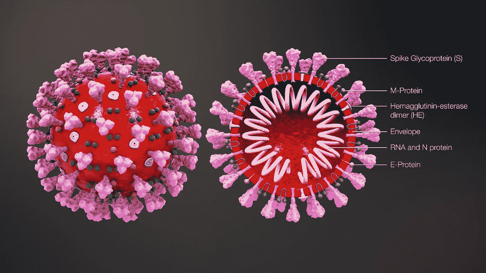

# Moderna 的新冠肺炎疫苗结果很有希望——但是…

> 原文：<https://medium.datadriveninvestor.com/modernas-covid-19-vaccine-results-are-promising-but-5ffe7ff42c7f?source=collection_archive---------7----------------------->

## 公司宣布了良好的临床结果——但是谁是 Moderna，其基于 rna 的冠状病毒疫苗是什么？

Illustration of Coronavirus ([Scientific Animations](https://www.scientificanimations.com/), Wikimedia Commons)

# **1。** **Moderna 的临床研究结果…**

总部位于马萨诸塞州剑桥的生物技术公司 [Moderna](https://investors.modernatx.com/news-releases/news-release-details/modernas-covid-19-vaccine-candidate-meets-its-primary-efficacy) 今天(2020 年 11 月 16 日，星期一)宣布，其名为 mRNA-1273 的新型冠状病毒疫苗在 3 期试验中预防成人新冠肺炎的有效率为 94.5%。

Moderna 的这项名为 COVE 的研究招募了 3 万名参与者，他们被随机分为两组。一组接受 mRNA-1273 疫苗，另一组接受安慰剂(一种像盐水一样的惰性物质)。

COVE 的目标是观察疫苗是否能预防新冠肺炎。该研究统计了在第二剂疫苗注射后两周，每组中有多少参与者被诊断患有该疾病。COVE 还记录了新冠肺炎病例的严重程度。

该研究报告了 30，000 名参与者中的总共 95 个病例。安慰剂组有 90 例新冠肺炎，而 mRNA-1273 疫苗组有 5 例。这些结果被认为具有高度的统计学意义(意味着这个结果不可能是随机的结果)。

有 11 例严重的新冠肺炎病例，全部发生在安慰剂组，在 mRNA-1273 组中没有一例。

# **2。** **谁是莫德娜……**

Moderna 是一家年轻的生物技术公司，成立于 2010 年 9 月，旨在将哈佛干细胞生物学家德里克·罗西(Derrick Rossi)开发的修饰信使 RNA (mRNA)商业化。如今，该公司对疫苗的关注与将心血管疾病和癌症等“高价值目标”的治疗商业化的初衷截然不同。虽然改良 mRNAs 的核心技术依然存在，但 Rossi 已经不在公司了。

针对高利润慢性病的大多数临床试验都失败了。这些研究是与老牌制药巨头阿斯利康合作完成的。到目前为止，Moderna 或其他任何人都没有批准基于 mRNA 的药物用于人类。

这些挑战促使 Moderna 在 2014 年改变路线，专注于疫苗。疫苗是一个众所周知的低利润行业，许多制药公司都不愿涉足。

Moderna 自 2011 年以来的首席执行官是夏羽·班塞尔，他是一名法国药品销售主管，以强硬和神秘著称。这种保密性已经远远超出了普通制药公司的范围，尽管这个行业竞争激烈，但它们还是会分享和发布重要的临床数据，供其他人审查。Bancel 和 Moderna 的过度保密在英国著名杂志《自然》的一篇[尖刻的文章](https://www.nature.com/articles/nbt.3488)中被指出。

领导层的行为很有意义，也很有启发性，因为它为公司的其他人搭建了舞台。

除了可疑的不愿分享数据，Bancel 还是 100 多项 Moderna 专利的共同发明人，尽管 Bancel 从未与 rna 合作过，也不是博士科学家。

Moderna 的其他高管的行为方式也有问题。

在冠状病毒疫情的早期，Moderna 于 2020 年 5 月 18 日宣布了其疫苗的强劲进展。该公司的股票上涨了 30%。同一天， [Moderna 的首席财务官](https://www.cnn.com/2020/05/22/investing/moderna-coronavirus-vaccine-stock-sales/index.html) Lorence Kim 以 300 万美元买入股票，然后立即以 1980 万美元卖出。第二天，Moderna 的首席医疗官 Tal Zaks 以 150 万美元的价格买入股票，并立即以 980 万美元的价格转手。

同样，5 月 21 日和 22 日，Moderna 的最大股东、风险资本投资者旗舰先锋公司赚了 6950 万美元。旗舰先锋公司的创始人是 Noubar Afeyan，他也是 Moderna 的联合创始人和董事长。

2020 年 5 月，Moderna 董事会成员[蒙塞尔·斯拉维](https://www.businessinsider.com/moncef-slaoui-leading-trump-vaccine-push-10m-holding-moderna-conflict-2020-5?r=US&IR=T)博士辞职，成为唐纳德·特朗普“曲速行动”的首席科学家。尽管斯劳伊作为“曲速行动”的首席科学家没有薪水，但他保留了超过 1000 万美元的 Moderna 股票。利益冲突就像特朗普自己的一长串利益冲突一样令人不快。伊丽莎白·沃伦指出了 Slaoui 的冲突，尽管特朗普政府向该公司投入了 4.83 亿美元以协助其疫苗试验。

毫无疑问——在 Moderna，有许多非常优秀、心地善良的人在努力工作。但是，公司是由高管团队经营的，他们的行为和性格是对公司行为和性格的主导性影响。

# **3。** **什么是 Moderna 的 mRNA 技术……**

信使 RNA，或 mRNA，是我们细胞中的基因获得细胞核内 DNA 编码的遗传信息的方式，进入细胞，在那里它被制成蛋白质。从细菌到人类，它是所有细胞如何工作的重要和核心部分。这也是为什么 mRNA 作为一种潜在的药物如此有前途和诱人。许多病人自身 DNA 有问题的遗传病，理论上可以通过注射正确的 mRNA 来治疗。

mRNA 疫苗有希望的部分是它可以编码病毒的一部分，如刺突蛋白，这将引发免疫反应来攻击病毒。

这个想法有一个核心问题。几十亿年前，病毒很早就明白了将 RNA 注入细胞的概念。现在，地球上的每一个细胞都有检测和破坏外来 RNA 的手段，因为它知道自己属于一种病毒。对我们来说不幸的是，这包括打算作为疫苗的 RNA。

这就是德瑞克·罗西的故事，他是现代科技的创始人。

2010 年， [Rossi 发表了一篇论文](https://www.sciencedirect.com/science/article/pii/S1934590910004340)，通过引入 mRNA 来控制细胞转化为干细胞的命运。罗西使用了一种经过修饰的合成 mRNA 来克服这些古老的和“先天的抗病毒反应”。

Rossi 对 mRNA 的修改是针对碱基，即遗传密码的字母。遗传密码有四个字母，缩写为 A(腺嘌呤)、C(胞嘧啶)、G(鸟嘌呤)和 RNA 中的尿苷 DNA 中的胸腺嘧啶 T)。

罗西将 C 和 U 分别修饰成 5-甲基胞苷(5mC)和假尿苷(psi)的化合物。当 Rossi 在他的合成 mRNA 中使用 5mC 和 psi 时，他发现他能够降低细胞的先天免疫反应。

核心问题来了。尽管 Rossi 改良的 mRNA 化学抑制了细胞的免疫反应，但为了在细胞中发挥作用，Rossi 仍然需要使用干扰素抑制剂。干扰素是对病毒有反应的免疫信号蛋白。所以很明显，他的细胞仍然认为修饰的 mRNA 有问题，并做出反应，就好像它们是病毒一样。然而，修饰的 mRNA 和干扰素抑制剂的结合是成功的。

Rossi 改良碱基的变体是 Moderna 技术的核心。但没有迹象表明 Moderna 曾经将干扰素抑制剂作为其治疗的一部分，也没有迹象表明它对人类的作用与对 Rossi 细胞的作用相同。

# **4。** **这对我和莫德娜意味着什么……**

不幸的是，我们正处于一个可怕的疫情。到目前为止，病例正在加速进入冬季，接下来的几个月对我们所有人来说都将非常艰难。许多人会生病，许多人会死去。

我们必须戴口罩，我们必须保持距离，我们必须避免室内聚会——即使是现在的假期。尤其是现在。

我们现在没有疫苗，尽管特朗普和他的团队做出了所有虚假的承诺。我们很可能不会很快有一个。

我是安东尼·福奇博士的忠实粉丝，相信他的判断。然而，我仍然怀疑我们能否在 2021 年拥有有效的疫苗。

 [## 安东尼·福奇博士——真理的低语者

### 如何在罪恶的深渊中成为事实和真相的传播者

medium.com](https://medium.com/illumination/dr-anthony-fauci-the-truth-whisperer-243b1b948dba) 

Moderna 可能有一种有效的疫苗。但是基于他们管理团队过去的行为，我不相信他们的声明。没有他们分享和发表他们的临床结果，独立的评论者就没有什么可判断的。即使他们公布了他们的结果，我也不相信他们的数据。

我从根本上不信任任何与特朗普的项目曲速相关的东西，以及任何与该项目或总统有如此密切联系的公司或高管。

如果由拜登任命的专员领导的 FDA 在 Moderna 的方法和数据完全透明的基础上进行彻底审查，并在 2021 年晚些时候获得批准，我将更有信心认为 Moderna 的疫苗是可靠的。

如果没有这些，我会像躲避瘟疫一样躲避 Moderna 的疫苗(更不用说他们的库存了)。