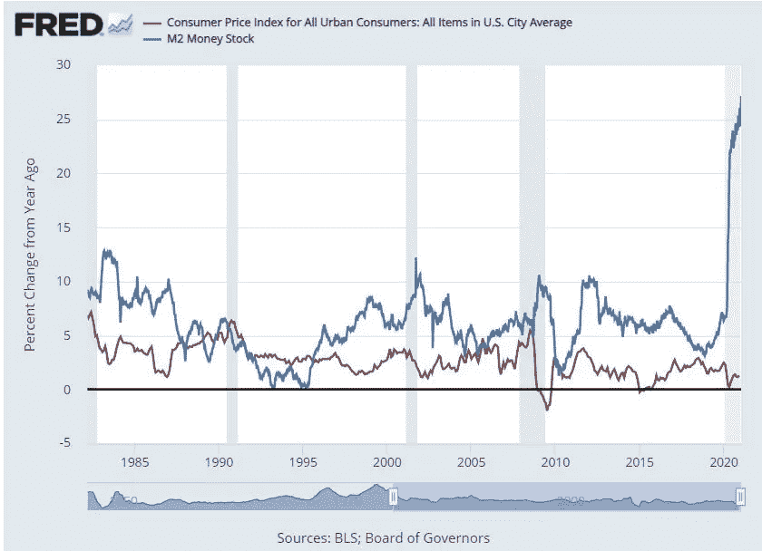
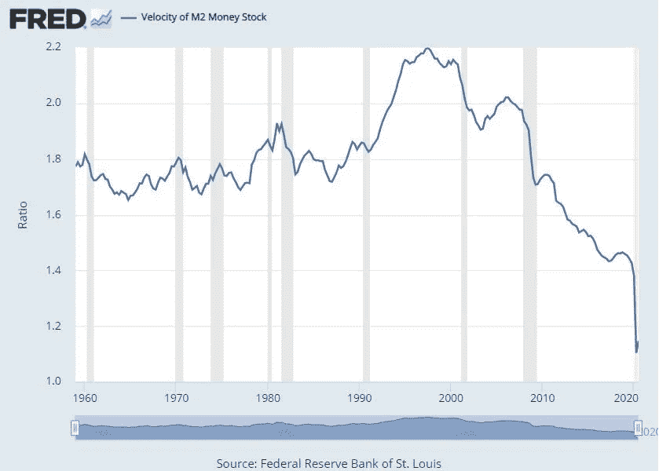
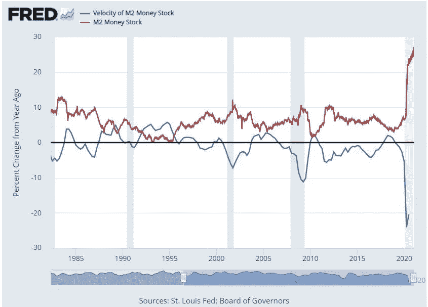
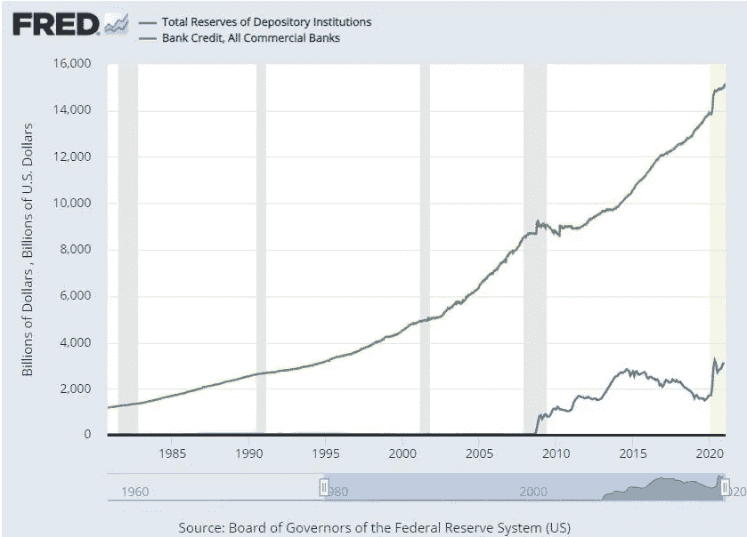
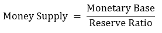
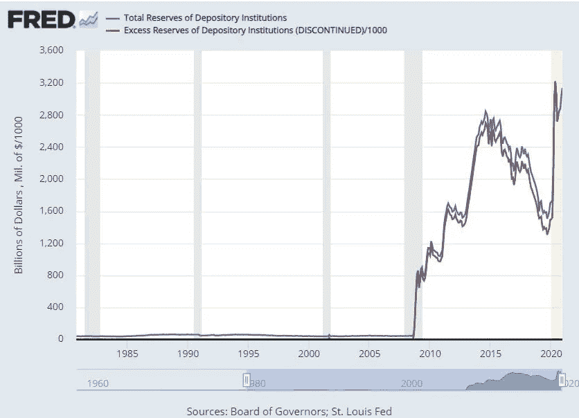
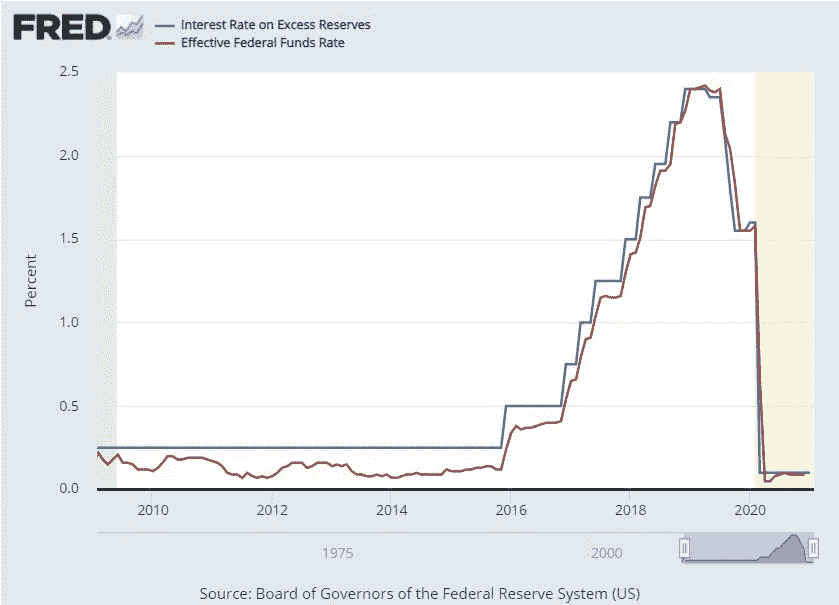

# 货币政策已死，货币政策万岁

> 原文：<https://medium.datadriveninvestor.com/monetary-policy-is-dead-long-live-monetary-policy-5c3738ae5190?source=collection_archive---------17----------------------->

最近几个月，关于美联储的报道很多。事实上，很多讨论都集中在美联储资产负债表的扩张及其对资产价格、购买力和美元的影响上。这些担忧毕竟不是没有道理的，美联储的资产负债表已经上升到 GDP 的 42%,美国预算赤字预计今年将达到 GDP 的 18%。我们确实处于未知的水域。

正如许多人敏锐地观察到的那样，这个货币政策的新时代可以被优雅地概括为:“印钞机走了:嗯！”。

尽管上述内容普遍忽略了问题，但它确实强调了一个基本点:我们所理解的**货币政策失灵了。在*研究生院*教授的货币政策模型已经完全过时，而且在许多方面完全是空想。**

在这篇文章中，我打算强调美联储政策、货币传导和银行业的一些更微妙的方面。接下来的一些事情可能会让你大吃一惊。希望到最后你能对货币政策如何运作有更好的理解，并能为任何关于“印钞”的讨论增加一些细微差别。

# 1.货币供应增长和通货膨胀之间没有联系

对“印钞”叙事的普遍描述是:“在其他条件不变的情况下，货币供应的增加必然导致通胀的上升”。这种描述是直观的，而且在米尔顿·弗里德曼的时代似乎是真实的，当时货币主义的经济学观点首次得到发展。然而，过去 10 年见证了货币政策和银行业务的巨大变化，而资产负债表扩张与通胀之间拟议的联系在实践中并未发挥作用。

下图表明，M2 增长与 CPI 的相关性很低。简而言之，货币供应量的增加不会对称地影响价格。

部分原因可以用 M2 速度的长期下降来解释。货币流通速度的定义如下:

*“货币流通速度是在给定时间内，一个货币单位被用来购买国内生产的商品和服务的频率。换句话说，就是单位时间内，一美元被用来购买商品和服务的次数。如果货币流通速度加快，那么经济体中的个人之间就会发生更多的交易。”*

*–圣路易斯美联储银行*

更简单地说，速度是衡量营业额的指标。M2 的总存量大幅增加，但其影响完全被速度的下降所抵消。

当看做一个逐年变化的百分比时，我们观察到每次 M2 增加时，它都被速度的相应降低所抵消:

对经济学家来说，速度的持续下降仍然是一种异常现象。我没有读到任何令人信服的解释来解释为什么速度持续下降，许多人质疑它作为一种衡量标准的效用。尽管如此，货币供应量的增加通过通货膨胀率的上升导致购买力下降的观点根本经不起推敲。

# 2.贷款不是基于储备

经典教科书对银行的描述是作为盈余支出单位和赤字支出单位之间的中介。在这一框架下，银行从储户那里吸收存款，并向借款人发放贷款，但须遵守准备金要求(稍后会有更多相关内容)。当美联储增加货币供应量时，其目的是缓解金融状况，刺激放贷。

不幸的是，储蓄-贷款模式忽略了信用创造的一个关键方面:**大多数银行信用是基于抵押品而不是准备金。**

下图显示了未偿还的银行信贷总额与准备金的比率。直到最近，银行还被要求保留 10%的存款准备金，以备客户取款。其余 90%的存款可以借出。然而，正如图表所示，这一声称的要求与实际创造的信贷额之间几乎没有关系。

在 2008 年金融危机之后，这种关系发生了显著变化，因此让我们专注于之前的时期进行说明。2007 年，未偿还银行信贷总额约为 8 万亿美元。与此同时，你甚至看不到 2007 年总储备的图表，但如果你将鼠标悬停在 x 轴上，你会发现储备只有 450 亿美元，甚至不到 1%。

这是怎么回事？事实是，银行信贷拨备已经远远超出了准备金要求的时代。你的信用卡是完全无担保的，你的银行不需要保留任何准备金来提供信贷。其他贷款工具，如房屋净值信用额度、抵押信用额度、保证金账户等。也不需要储备。

抵押贷款现在是王道。今天，抵押品链的长度和折减率——两者都不是由美联储决定的——决定了货币供应量的上限，而不是基础货币和准备金要求。

公平地说，抵押贷款至少部分受到巴塞尔协议规定的资本要求的调节，但事实仍然是，这种传导机制与货币供应的变化完全不同。

# 3.没有准备金要求

这一发现可能是对教科书中货币政策描述的最大打击。

在最后一节中，我描述了以前人们认为银行是如何从吸收的存款中放贷的；通常 90%的贷款要 10%的准备金。**准备金要求**形成了 [**货币乘数**](https://www.economicshelp.org/blog/67/money/money-multiplier-and-reserve-ratio-in-us/#:~:text=The%20Money%20Multiplier%20refers%20to,The%20money%20multiplier%20is%2010.) 概念的基础。货币乘数背后的想法非常简单:如果只要求银行保留 10%的现金，那么总的有效货币供应量是基础货币的 10 倍。公式化地:

这种启发是一种思考增加基础货币或改变准备金率的效果的有用方法。不幸的是，这是一部小说。

正如上一节所展示的，信用创造与储备几乎没有关系。此外，在 2019 年[6 月，美联储](https://www.federalreserve.gov/newsevents/pressreleases/monetary20200315b.htm)正式承认准备金要求的过时使用，并**将准备金率降至 0%** 。

0%的准备金率意味着无限高的货币供应量；这个概念显然很有意义，并让货币政策和存款准备金率的经济学 101 描述寿终正寝。

# 4.“超额”准备金

取消准备金率至少部分是因为我们认识到，我们生活在一个超额准备金的时代。**超额准备金被定义为银行持有的超过法定准备金的资金**。还记得第二节的总储量图表吗？我们再次绘制总储备图，但现在是针对超额储备。

2008 年之前，银行保留超额准备金是闻所未闻的。超额准备金没有利息，银行也不愿意放弃现金利息。然而，在危机之后，我们看到超额储备几乎与总储备难以区分。这意味着，银行宁愿手头持有大量现金，也不愿放贷。

对我来说，在讨论美联储政策和银行业时，这张图表是最需要理解的图表之一，因为它提出了几个问题:

问:为什么银行只是持有额外的现金而不放贷？

答:因为有人付钱让他们这么做。支付准备金利息的能力在 2006 年作为[金融服务监管救济法案](https://www.congress.gov/109/plaws/publ351/PLAW-109publ351.pdf)的一部分首次引入。[这一想法是为了让货币政策能够顺利实施。](https://www.brookings.edu/blog/ben-bernanke/2016/02/16/the-feds-interest-payments-to-banks/)通过给予美联储支付利息的自由裁量权，美联储可以将货币基础与实体经济分开，这是通过支付比银行在美国国债或联邦基金市场获得的利率更高的准备金利率来实现的。

这样做的好处是，它允许美联储通过 QE 减少未偿资产的供应，增加流动性，并且不会在银行追求收益率时引发信贷推动的通胀。只有当经济稳定下来，真正有利可图的贷款机会出现时，银行才可能选择放弃他们正在获得的无风险利率，并提取他们的超额准备金作为对个人和企业的贷款。

**问:银行的超额准备金利率是多少？**

a:看看下面的图表。一般来说，超额准备金率与联邦基金利率密切相关。你可以看到，今天这两者大致相同，因此持有储备并不比在联邦基金市场放贷有明显优势。然而，情况并非总是如此。注意到在它存在的大部分时间里，储备利率比联邦基金利率高得多；2010 年早期至中期为 25 个基点至约 10 个基点。

更高的利率允许美联储在他们认为合适的时候让资金“泄漏”到实体经济中。根据今天的利率，他们似乎对贷款没有任何担忧。

问:如果今天的利率如此之低，那么为什么银行不放贷呢？

答:这就是问题的症结所在。即使利率处于零下限，货币供应扩张，银行仍不放贷。货币政策只有进入实体经济才会有效。美联储没有提高准备金利率来减缓信贷创造，他们在鼓励这种做法，但银行仍然不同意。这告诉我们，银行要么非常厌恶风险，可用的投资回报与风险不相称，要么被排除在融资过程之外；直觉告诉我，以上都是。

# 结束语

所有这些都让我们回到“印钞机 go: brrrr！”，我个人觉得很搞笑。作为一句关于当前货币政策状况的博学的俏皮话，它基本上是准确的。我们真正进入了一个围绕经济和货币的思想新阶段；这与你在经济学教科书或一般论述中发现的完全不同。我希望这篇文章能让你更好地理解货币政策的实施和传导。

下次见，感谢阅读！

——**王高力士。**

*原载于 2021 年 1 月 24 日*[*https://light finance . blog*](https://lightfinance.blog/monetary-policy-is-dead-long-live-monetary-policy/)*。*