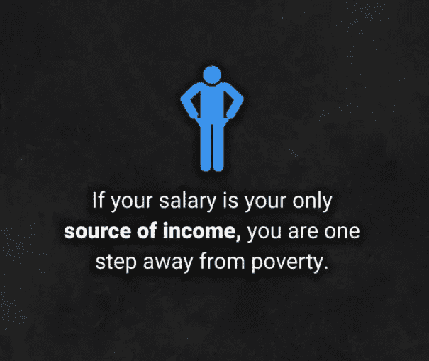
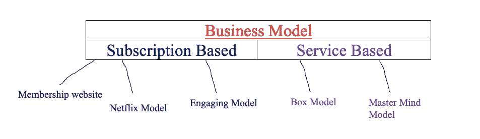

# 将你的产品货币化——你是否对应该选择哪种基于订阅的商业模式感到困惑？

> 原文：<https://medium.datadriveninvestor.com/monetise-your-videos-online-are-you-confused-about-which-subscription-based-business-model-you-84532558b98d?source=collection_archive---------43----------------------->

## “今天的人们比以往任何时候都孤独，友谊也比以往任何时候都少”。

Picture By The [Business](https://www.instagram.com/thebusinesshacks/?hl=en)

> 这不会是那种我告诉你马克·扎克伯格拥有 1000 亿美元净资产的文章，因为他每天早上 5 点醒来

我们每个人都想发展他们的业务，或者想抓住一大群客户作为他们的永久订户，或者在媒体上拍拍他们的故事。我们都知道这种有用的东西。

*考虑到这一切，我适合两种类型的企业，一种是提供内容访问的企业，另一种是提供重复服务的企业。*

**答:基于订阅的模式:**对于专门的订阅用户，如果你创建的内容是教育性的、参与性的或娱乐性的，你的订阅将专注于访问，你就有了一个独立的平台。请记住您的客户可以访问您的优质内容的区域，正如您将在本视频的后面看到的，这些内容可以以多种不同的形式出现，例如课程、文章、专题节目或研讨会。

**解释和示例— — —**

*以* ***天生时髦*** *为例:时髦(Sassy)是一个以帮助人们通过芭蕾动作实现梦想身材为使命的舞者。她在 Instagram、YouTube 和她的博客上提供了很多免费的健身建议，并在博客上建立了一大批忠实的追随者。她的大部分支持者都是真正想提高体能的人。她创建了一个在线工作室，用户不仅可以每月花 10 美元获得基于视频的课程，还可以获得他们无法免费获得的内容建议。课程也在不断更新，她的图书馆也在逐月扩大。不断为新加入的用户和已经订阅的用户增加价值，作为回报，sassy 拥有稳定可靠且可扩展的收入。虽然从想要支持她的工作的观众那里获得的收入允许 sassy 创造更多的免费内容，并为她的所有观众提供一致的价值，每个人都是赢家。*

**B .每月服务新的或重新进货的产品:**如果你是一个内容创作者，经营实体产品，订阅模式可以帮助你把你的产品变成一种服务。

解释和例子————

英国的剃须公司 cornerstone 就是一个很好的例子。他们每个月直接将剃须刀、凝胶和面霜送到顾客家中。 ***这是一种说定就忘的交易，*** *这让顾客的日子好过些。虽然这种产品即服务模式是阻止您的业务商品化的一种很好的方式，但如果您能够提供具有良好品牌效应的优质服务，这就不再是价格战，也不再是逐利竞争。然而，这种类型的模型不仅仅适用于生活中的必需品，因为我见过它适用于袜子、书籍、减肥产品，甚至是书呆子纪念品。此外，如果你的服务可以解决一个持续的问题或者定期提供一种新的价值，那么基于订阅的商业模式也很适合你。此外，如果你提供一种产品，你可以定期创造新的价值，解决一个一致的问题或补充客户已经使用的东西，那么订阅也可以为你很好地工作。*

因此，如果您认为基于订阅的业务模式是您的正确选择，那么让我们来了解一下具体的模式以及它们是如何工作的。

Designed by the author of the article- shows the types of different model system.

会员网站模式:如果你是一个行业专家，有课程要教或者有知识要分享，那么会员网站模式会适合你。会员制网站不仅可以帮助你建立一个社区，将你所在领域最活跃、最感兴趣的人聚集在一起，还可以帮助你将你的内容货币化，提供你在其他地方无法免费获得的顶级见解。Magic stream 是一个很好的例子，展示了如何创建一个神奇的会员网站，涵盖广泛的主题。人们普遍认为，每月只需 12.99 美元，初出茅庐、经验丰富的魔术师就可以加入他们的在线社区。一旦订阅，他们就可以获得广泛的教育视频，教授特定的技巧和技能，可能包括数百个技巧和一次性培训视频。此外，会员制网站模式的美妙之处在于，你的客户可以根据自己的喜好进行多或少的互动，而不像在线课程那样，你可以边走边学，从各种各样的网站中进行选择。然而，你可以在我们的讨论中闲逛。根据我们的经验，最成功的会员网站都集中在一个主题上，比如神奇减肥、健身瑜伽、编码等等。但是，他们会将内容分解成小块策略来解决具体问题，而且在会员模式下，您还可以包含会员独有的优势。例如 Q &与你的会议，或者你可以有自己的会员区，就像一个脸书小组或一个在线论坛，在那里你的所有社区可以聚集在一个中心位置，这有助于为选择参与的会员提供更多的价值。

 [## 去公关还是不去公关？初创公司的 5 个关键问题|数据驱动的投资者

### 在 2015 年发表了一篇发人深省的观点文章，将围绕创业公司的新闻周期比作 12 小时的时钟…

www.datadriveninvestor.com](https://www.datadriveninvestor.com/2020/12/21/to-pr-or-not-to-pr-5-key-questions-for-startups/) 

**ii)** **盒子模型**:订阅盒将你的产品或你的好主意送到你客户的门前。他们提供了巨大的收入潜力和大量的定制服务，这取决于你能提供什么。虽然最初的超级订阅盒已经过时；然而，服务于较小受众的利基服务市场仍在不断增长。客户不仅可以注册定期收到送货上门的箱子，还可以收到三个不同类别的箱子，其中客户已经预先选择了要包含的项目，这些项目包含围绕主题或要解决的问题的项目。此外，它会在客户要求的时间间隔内交付，客户知道一两件产品会装在盒子里交付。但剩下的都是创作者用神秘盒子策划的令人惊讶的临时演员。当客户收到与主题相关的各种产品时，这种混合盒模型是一个很好的起点，因为它们围绕一两个核心产品提供了很大的灵活性。这种模式不仅适用于你的业务主要围绕信息的情况，也适用于你是一名教练或课程创建者的情况。你可以制作盒子，里面装一些有帮助的实物。

> 这里有一些想法向你展示我的意思——一个减肥博主可以把蛋白粉补充剂或食谱样本。一个时尚 Instagrammer 可以把他们最喜欢的配件从过去三个月。商业教练可以把有用的规划书和生产力工具。现在，这些想法只是说说而已，但我相信你可以看到机会，你可以用订阅盒模式获得多少创意。

**iii)网飞模式:**这种网飞模式对于视频创作者来说超级有效。它允许您随时随地创建内容并让您的观众观看。基本上，你成为了你所在行业的网飞，为你的付费用户提供点播视频内容。通过分析不同的内容创建者和他们的 110 万订阅者，我发现这种特殊类型的订阅模式对企业来说是最有效的。它主要用于电子学习、健身、娱乐和瑜伽等利基市场，也适用于其他类型的行业。只要你有摄像机，而且你的内容是高质量的。如果你有这两样东西，你就有机会创造一个高利润的业务，事实上，遵循网飞商业模式的普通用户每月能赚 3800 美元。

> QUALI TV 是这种商业模式的一个很好的例子，他们创作并分享独立电影，以及来自国际黑人社区的电视节目。当用户购买流媒体平台时，他们可以在他们想要的任何设备上观看他们图书馆中的任何内容，并且每个星期三他们都有新的东西。他们还能够通过使用 OTT 流媒体应用触及大量受众，这使得他们的平台更容易访问。例如，客户可以在他们的亚马逊 fire、智能电视甚至 iPad 上下载他们的应用程序，立即开始播放。这种特殊的商业模式的伟大之处在于，它支持所有类型的视频内容。如果你想了解更多关于这种特殊商业模式的信息，我推荐你在这里阅读[这篇文章。](https://businessmodelanalyst.com/netflix-business-model/)

**iv)策划模式**:策划允许你为你社区中最致力于改变的人创造一个产品。如果你的业务提供转型，无论是金融业务、关系还是人们生活中的任何其他痛点。一个策划商业模式通常为你提供作为一个个体的定期签到、在线会议，并在一段时间内工作得更好。它有一个明确的目标和方向，这提供了一个高层次的责任与网络和辅导的好处。

> 例如， **Tony Robbins** 提供白金计划，为客户提供额外的支持和指导，每月费用从一万美元到一万美元不等。一个非常有力的例子来自一年不喝啤酒。
> 
> **另一个很好的例子是**一家致力于帮助人们改变他们与酒精的关系的公司，他们举办各种链接的挑战来帮助人们戒酒。对于他们最可实现的时间长度，客户可以以每月大约 30 美元的价格注册 28 天 90 天或 365 天。一旦注册，他们就可以获得训练有素的教练的电子邮件支持，其他参与者的在线小组每日视频音频程序中的免费电子书，这些都是在线完成的，因此没有面对面的互动，但教练和支持总是可以通过电子邮件或脸书小组获得

## 这种商业模式很容易建立，特别是如果你是一个内容创作者，它可以采取许多不同的形式，因为你让人们进入你的核心圈子，这是他们通常不会有的。

**V)保持他们参与模式:**如果你的企业与客户群的季节性接触有限，这种模式可以让他们全年都参与订阅。

例如，瑜伽节每年在 20 多个国家举办 50 场活动。虽然他们有很多人参加他们的活动，但他们希望有一种方式与他们的粉丝保持联系，这就是为什么他们创建了一个在线平台。

*另一个例子是 Wonder less 电视，人们可以从他们最喜欢的老师那里获得课程。这个模型的工作原理与列表中的其他一些相似；然而，对他们来说，这不是他们的核心业务模式。难怪电视是他们业务的收入来源，但它是他们主要业务的门户。新客户可以试用它们，并在全押活动门票之前，通过应用程序中的直播体验它们。与此同时，现有客户在活动间隙保持参与，以提醒他们有多开心。*

因此，考虑到上述商业模式，如果你使用实物产品，你可以提供一个在线平台或订阅箱模式，以帮助保持你的客户参与。

## 让我给你举几个例子，如果你卖咖啡机，你可以创建一个新咖啡的订阅箱。尝试销售健身器材，你可以创建一个在线培训课程。如果你卖相机，你可以创建教程来帮助业余摄影师。你可以低价出售订阅权限，但给你的订户带来巨大的价值，这将导致你真正关心的实物产品和服务的销售。

**Vi)仅订户模式:**无论你是内容创作者还是服务提供商，免费经营你的业务都有很多好处。让人们自由接触他们的爱之劳动是吸引人们接受你的服务或建议的绝佳方式。然而，正如世界上许多报纸已经意识到，找到一种创收的方式，尤其是如果广告或推广附属产品不是你计划的那样。这导致了我们称之为“仅订户模式”的服务激增。基本上，你像往常一样免费提供你的大部分内容，但是你把你最好的作品放在付费墙后面给你最忠实的订户。

## 博客作者马克·曼森是这种模式的先驱。

> 他每月都会发布多篇长篇自助帖子，所有这些帖子都是根据他的读者群进行研究和编辑的。完美的是，他的大部分帖子都是免费的，但其中一些帖子在付费墙后面，只有他的付费用户才能看到。不仅订阅者可以获得好处，比如下载帖子的音频版本，访问他不再公开提供的课程，而且订阅者还可以访问“向我提问”会话。

考虑到所有的商业模式，如果你提供内容，你已经建立了一个观众群，你觉得你已经准备好推出，这是一个很好的方式。不要觉得你只是为了钱而创造一个产品，但如果你能提供内容或可重复的服务，它可以帮助你的企业带来稳定的可扩展的收入。

进入专家视图— [**订阅 DDI 英特尔**](https://datadriveninvestor.com/ddi-intel)