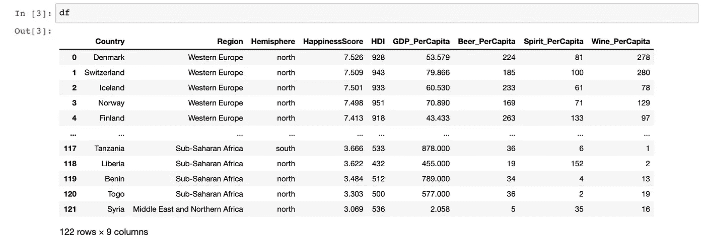
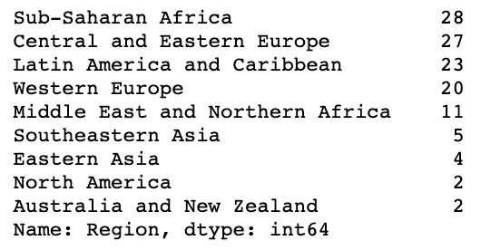
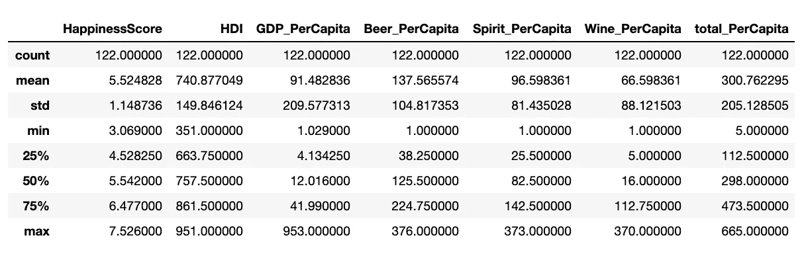
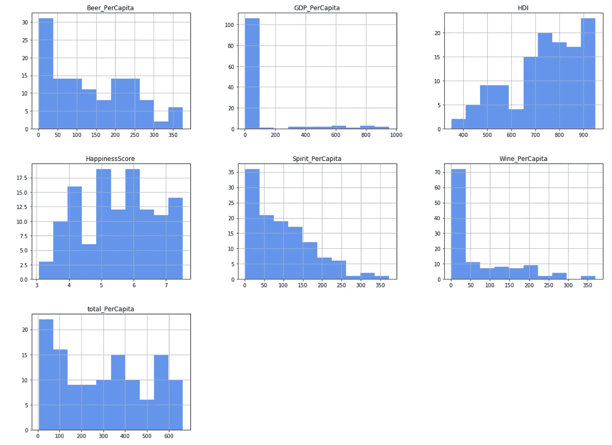
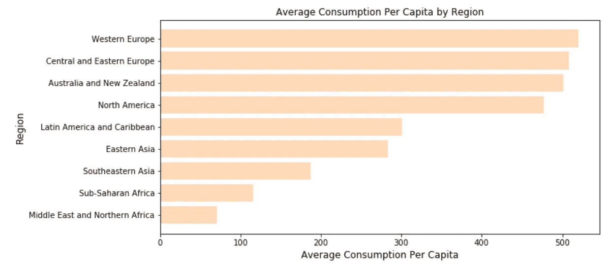
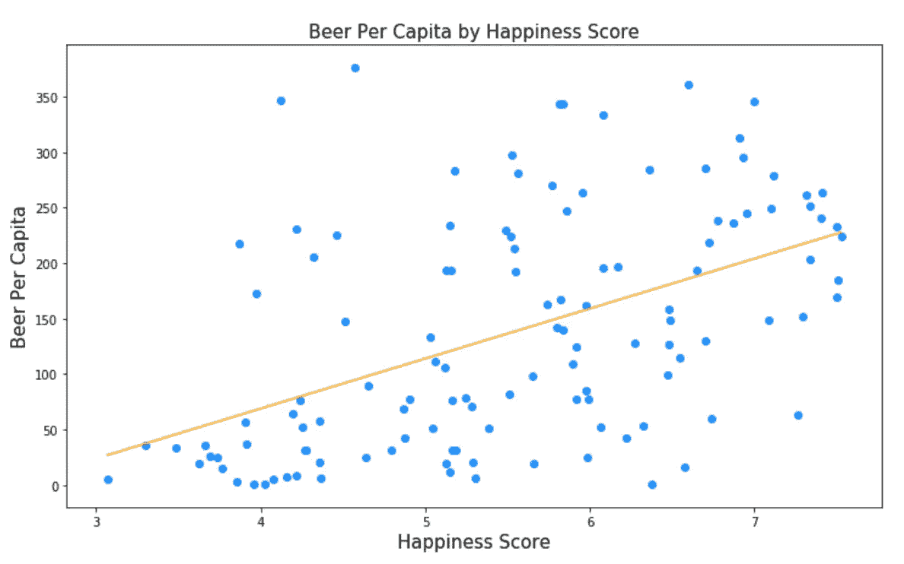
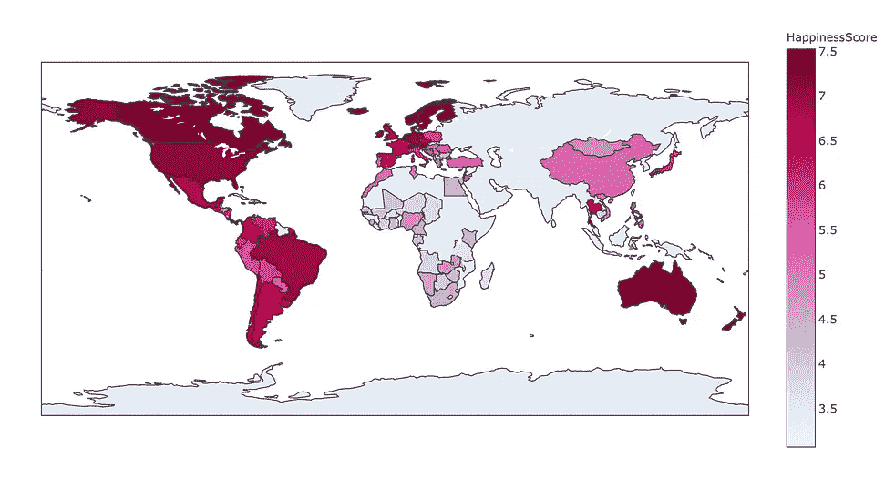
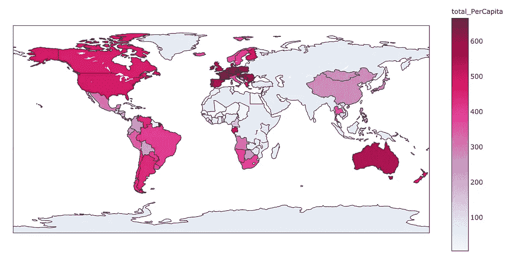

# 金钱买不到幸福——但它可以给你带来啤酒。

> 原文：<https://medium.datadriveninvestor.com/money-doesnt-buy-happiness-but-it-can-get-you-beer-e35e1c718db8?source=collection_archive---------11----------------------->

## Python 数据分析简介


Photo by [Adam Wilson](https://unsplash.com/@fourcolourblack?utm_source=medium&utm_medium=referral) on [Unsplash](https://unsplash.com?utm_source=medium&utm_medium=referral)

我们都听说过“金钱买不到幸福”，但是是什么因素让一个人过上幸福的生活呢？和这个世界上很多问题一样，答案都可以通过*分析数据找到。*

但是你能从哪里开始呢？

1.  ***寻找数据集***——为了这个项目，我在 [Kaggle](https://www.kaggle.com/marcospessotto/happiness-and-alcohol-consumption) 上找到了一个名为幸福和酒精消费的数据集。它给出了列的单位和描述。Kaggle 拥有公共数据集和资源来帮助您起步。
2.  ***安装并导入你的库*** —这里是 [Pandas](https://pandas.pydata.org/docs/) 和 [MatPlotLib](https://matplotlib.org/3.3.2/contents.html) 文档来设置你的笔记本。

```
import pandas as pd
import matplotlib.pyplot as plt
```

3. ***读入、清理、准备数据集*** *—* 这一行代码，取 CSV 文件，转换成熊猫数据帧。寻找异常值、缺失值、重复值等非常重要。

```
df = pd.read_csv('HappinessAlcoholConsumption.csv')
```

如果我们看一下数据帧，我们得到 122 行和 9 列。要查看数据类型和空值，可以运行 **df.info()** 。



4. ***数据分析***

在熊猫身上，这些柱子被称为 S 系列。要查看整列，我们可以使用: **df['column_name']。**要查看一个系列中数据的计数，可以加上**。value_counts()** 到列选择的末尾。

例如，如果我们想查看每个地区的国家数量，我们可以使用:

```
df['Region'].value_counts()
```



您可以使用其他列创建新列！例如，如果我们想将人均啤酒、葡萄酒和烈酒相加得到一个总数，我们可以运行下面一行代码。这种方法叫做*播*。

```
df['total_PerCapita'] = df['Beer_PerCapita'] + df['Spirit_PerCapita'] + df['Wine_PerCapita']
```

我们可以使用以下方法在数据集中查找特定的项目:

```
df[df['Country'] == 'United States']
# this will select the row with the USA's datadf[df['HappinessScore'] >= 6]
# this will return rows with a happiness score above 6
```

为了看一看数值列的分布，我们可以用方法*描述*。这可以帮助您深入了解正在处理的数据。

```
df.describe()
```



要查看列之间的相关性，我们可以使用以下内容:

```
df.corr()
```

## 让我们使用 Matplotlib 创建一些可视化效果！

就数据分析而言，可视化是一个非常强大工具。数据科学家最常用的 python 库之一是 Matplotlib。有了这个库，我们可以创建条形图、散点图、箱线图、饼图、直方图等等！要定制你的可视化效果，使用[这个引用](https://matplotlib.org/3.1.0/gallery/color/named_colors.html)作为颜色名称。

[](https://www.datadriveninvestor.com/2020/10/23/4-money-management-tips-for-first-time-entrepreneurs/) [## 首次创业的 4 个资金管理技巧|数据驱动的投资者

### 超过 82%的企业倒闭是由于财务管理不善和现金流问题。开始新的…

www.datadriveninvestor.com](https://www.datadriveninvestor.com/2020/10/23/4-money-management-tips-for-first-time-entrepreneurs/) 

首先，我们可以使用直方图来查看数据。我们可以使用。hist()方法来获取数据集中每个数值列的直方图。

```
df.hist(figsize=(20,15), color='cornflowerblue');
# figsize is specifying the height and width of the histograms
```



条形图是通过使用。条形(x，y)或。barh(x，y)，取决于您想要垂直还是水平条形图。

```
# Set x and y data
y = df3.groupby(['Region'])['total_PerCapita'].mean().sort_values()
x = y.indexfigure, ax = plt.subplots(figsize = (10,5))# Set Labels
ax.set_title('Average Consumption Per Capita by Region', fontsize=12)
ax.set_xlabel('Average Consumption Per Capita', fontsize=12)
ax.set_ylabel('Region', fontsize=12)# Plot
ax.barh(x, y, color='peachpuff');
```



5. ***绘制洞见—*** 使用可视化、统计等。

幸福得分和人均啤酒消费量之间的相关性是 0.5，意味着它是低正相关(使用上面的 df.corr()方法找到的！！) .



下面是按地区分组的幸福度和酒精消费量的数据。这些数据用于创建下面的热图。



总之，酒精消费量与一个国家的幸福指数相关联，但相关并不意味着因果关系！！

在数据科学项目中，有所保留是很重要的。对于这个数据集，我们不知道它是否是来自每个国家的参与者的随机样本。当人们报告他们有多快乐或者他们喝了多少酒时，他们可能是不诚实的。幸福是一个很有挑战性的概念，很难给它分配一个数字。开始一个项目时考虑数据中的偏差。

有了这些步骤，你就掌握了基础知识！学习如何编码的最好方法是学习如何足智多谋！！使用在线示例、观看视频等等。你成功的材料是无穷无尽的。

感谢您的阅读——干杯！

## 访问专家视图— [订阅 DDI 英特尔](https://datadriveninvestor.com/ddi-intel)