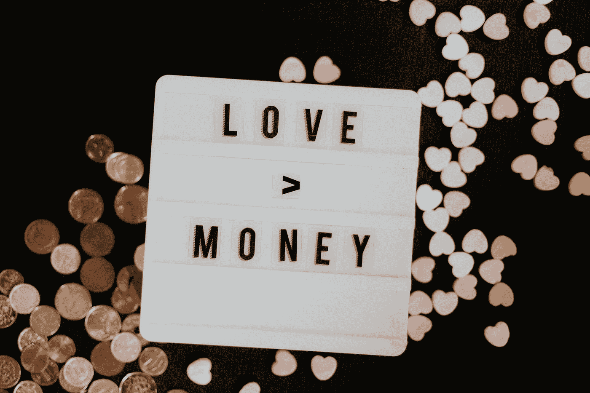

# 钱不会让你幸福…？

> 原文：<https://medium.datadriveninvestor.com/money-doesnt-make-you-happy-d4e4b2d238c8?source=collection_archive---------14----------------------->

这个问题既古老又有争议。

Photo by [Priscilla Du Preez](https://unsplash.com/@priscilladupreez?utm_source=medium&utm_medium=referral) on [Unsplash](https://unsplash.com?utm_source=medium&utm_medium=referral)

知道这一点会很好，因为毕竟，我们花了相当多的时间来赚钱、储蓄和投资。

我们理所当然地认为，我们拥有的钱越多，我们就会越幸福。

但是这种联系存在吗？为了得到更多的钱，我们所做的一切努力值得吗？

# 什么是幸福？

在蓬勃发展的幸福研究领域，数不清的心理学家、社会学家和经济学家几十年来一直在研究金钱是否能让人幸福。

问题从定义开始:到底什么是幸福？

我们是在谈论对生活的总体满意，还是谈论我们此刻感受到的幸福，这取决于各自的情况？

此外，有时对我们来说，说我们是否快乐是具有挑战性的。

毕竟这是一种稍纵即逝的情绪状态，也是被永远快乐的社会理想所覆盖的。即使我们不满意，我们至少希望我们满意。

这使得幸福难以衡量。

尽管如此，科学家们还是进行了尝试，并喜欢研究金钱和我们的幸福感之间的联系。他们的结果是矛盾的，至少乍一看是这样。

> "幸福就像玻璃:现在充满了光彩，但很快就变得支离破碎."

米歇尔·德·蒙田

# 伊斯特林悖论

1974 年，经济学家理查德·伊斯特林提出了一个论点，即一旦我们的基本需求得到满足，财富并不会带来更多的幸福。根据他的理论，超过某个阈值，更高的收入不再增加个人的快乐感。

 [## 对有商业头脑的投资者有用的行为经济学概念|数据驱动的投资者

### 在美国企业界，高斯统计，对我们周围世界的确定性解释，以及理性…

www.datadriveninvestor.com](https://www.datadriveninvestor.com/2020/07/09/helpful-behavioral-economics-concepts-for-the-business-minded/) 

另一方面，两位经济学家贾斯汀·沃尔弗斯(Justin Wolfers)和贝特西·史蒂文森(Betsey Stevenson)在 2008 年发表的论文中否认了伊斯特林悖论的存在。他们得出了以下结论:

> 富人比穷人幸福。富国比穷国幸福。
> 随着一个国家财富的增加，其居民变得更加幸福。
> 伊斯特林仅仅是弄错了吗？

# 幸福和生活满意度

心理学家丹尼尔·卡内曼和经济学家安格斯·迪顿一起表明，我们需要对金钱和幸福之间的联系采取一种更加差异化的观点。

在他们的研究中，卡尼曼和迪顿区分了基于日常经历(情绪)的幸福感和人们思考生活时的满足感。

结果:收入越高，生活满意度越大。情感健康(幸福感)也随着收入的增加而增加，但在年收入总额超过 7.5 万美元(约€6 万美元)时就会停滞不前。

卡尼曼和迪顿推断:

低收入与很少的生活满意度和低情绪幸福感相关。

高收入提供了高水平的生活满足感，但并没有比有保障的收入带来更多的幸福。

幸福和生活满意度之间的差异是如何解释的？

# 吉森定律

“如果我们不间断地继续准备快乐，同样的快乐的大小会不断减少，直到最后达到饱和。”

…1854 年赫尔曼·海因里希·戈森在他的边际效用递减定律中提出的假设。

关于情感健康(幸福)，金钱也受到饱和效应的影响。一旦一个人不再担心基本需求，可以舒适地生活，更多的支付不会增加我们的幸福——伊斯特林悖论。

用乌韦·席勒的话说:

> "你一天最多只能吃一块牛排。"

# 享乐主义跑步机

嗯，吃东西的时候还是可以感觉到饱腹感的。但是有钱人买得起其他奢侈品。一辆快速的跑车不是有助于让生活更快乐吗？

很难，因为快乐是一种短暂的状态，其持续时间受到特定习惯化效应的限制。这相对来说很快就开始了，也被称为快乐跑步机。

似乎我们很快适应了新获得的繁荣，并从此将自己定位于这个“主观零点”。

正如理查德·伊斯特林(Richard Easterlin)假设的那样，我们的幸福感甚至会随着财富的增加而下降，也就是说，当我们与他人的财富进行比较时。

这就是为什么伊斯特林认为相对收入，即我们相对于周围环境的收入，比绝对收入更重要。

> “钱确实不会让你幸福。但钱让人快乐是真的。”

乔治·萧伯纳

问题仍然是，为什么金钱能够进一步增加我们的生活满意度，即使幸福的感觉停滞不前？

# 金钱能为我们做什么

心理学家 Kathleen Vohs 说:“被视为幸运符，我们从金钱中索取一些原本不该得到的东西。”。作为独立的个体，现金主要用于实现我们的目标。

> “疼痛和痛苦的损害赔偿”

即使金钱不能让我们快乐，至少它能让我们感觉不那么不快乐。

而且能有效缓解疼痛，不管是身体上的还是情绪上的。

在她的研究中，Vohs 能够表明，当受试者之前数过钞票时，手浸入热水中的疼痛感会有效减少。

结论是:金钱通过给我们一种力量的感觉来帮助我们承受一些痛苦。

# 独立性ˌ自立性

我们的钱越多，我们就越少依赖别人的(仁慈的)支持。

直截了当地说:有钱人不需要问任何人——他们只是买他们需要的东西。他们不需要特别有能力或同情心来实现他们的目标。

似乎是摆脱金钱的束缚极大地提高了生活满意度。

当然，这种通过个人主义获得的满足感也不是没有限制的。世界上没有钱可以安慰完全的孤独。

我在每月一期的 [**简讯中分享了更多私密的想法，你可以在这里**](https://mailchi.mp/bf8f8e8ed697/keep-in-touch-with-lukas) 查看。请在评论中告诉我，并在各种社交媒体平台上加入我:

[**推特**](https://twitter.com/WiesfleckerL)●[**insta gram**](https://www.instagram.com/lukaswiesflecker/)●[**脸书**](https://www.facebook.com/lukaswiesfleckerr)●[**Snapchat**](https://www.snapchat.com/add/luggooo)**●[**LinkedIn**](https://www.linkedin.com/in/lukas-wiesflecker-1b11251a5/)**

**无论你做什么，都要带着爱和激情去做！**

****访问专家视图—** [**订阅 DDI 英特尔**](https://datadriveninvestor.com/ddi-intel)**