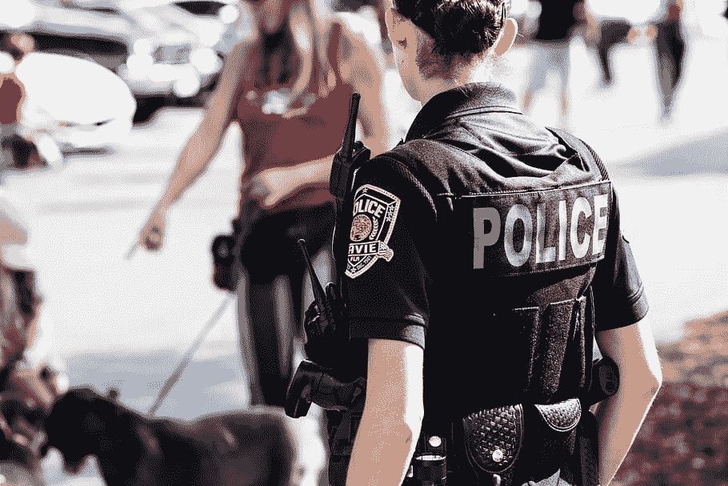
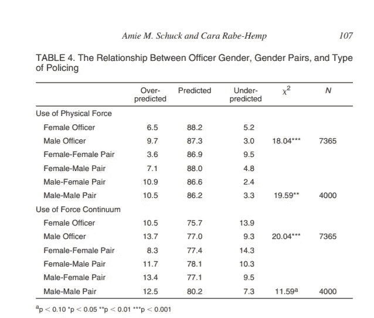
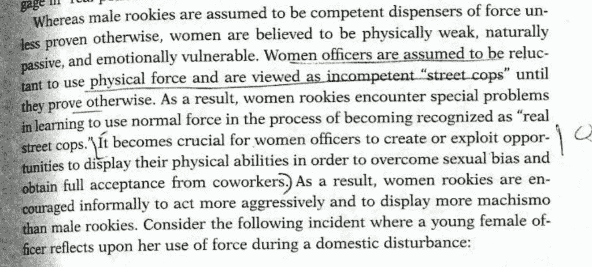
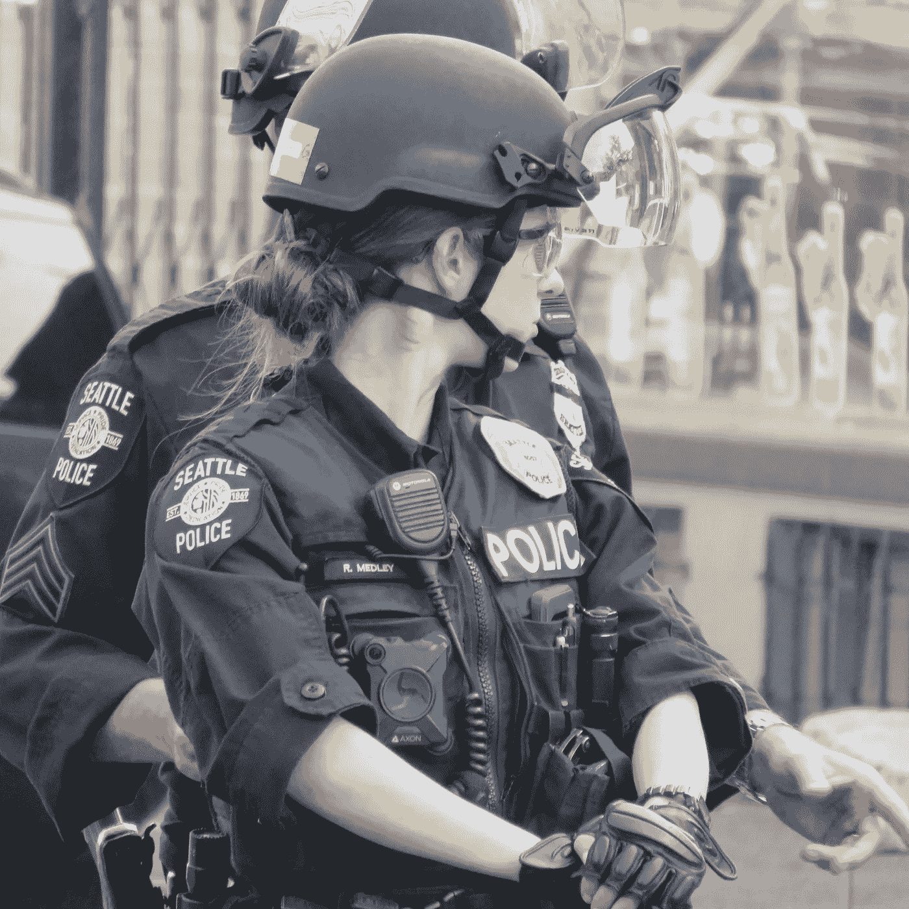

# 更多的女警察不会改变治安

> 原文：<https://medium.datadriveninvestor.com/more-women-cops-wont-fix-policing-27fe14dbe4af?source=collection_archive---------7----------------------->

(piqsels // CC0)

在对乔治·弗洛伊德之死的抗议中。本月早些时候，一名防暴警察被摄像机拍到推搡一名跪着的抗议者并向她冲去。他的同事，一个黑人妇女，介入并斥责了他。该视频在社交媒体上疯传，引发了许多猜测，即雇佣更多女警察是否可能是解决美国警察暴力问题的灵丹妙药。

美国有线电视新闻网(CNN)在一篇题为“[想改革警察？雇佣更多的女性](https://www.cnn.com/2020/06/23/us/protests-police-reform-women-policing-invs/index.html)研究表明，女性不太可能过度使用武力，而更有可能冷静下来。

从表面上看，这个论点似乎很有说服力。CNN 确实提供了大量数据来支持它的说法，但它并没有真正呈现出全貌。

这篇文章使用了三个主要来源:CNN 自己对武力使用的分析，一篇未发表的硕士论文，以及一篇来自[国家妇女和警务中心的论文，该中心由一名前警察和一名前联邦特工领导。](http://womenandpolicing.com/)

CNN 调查了四个部门，发现女警官使用武力的比率只有一半左右——相差几个百分点——这是根据她们在警察队伍中的比例预测的。例如:“奥兰多的女性官员在 2009 年至 2019 年 5 月期间使用了 8%的武力，而她们占该部门的 17%。”

这似乎很惊人，但这并没有考虑到女性官员往往被分配到女性的工作岗位，在那里她们不太可能有机会使用武力，如派遣、家庭暴力咨询、管理等。

 [## 保护主义、政治和经济动荡|数据驱动的投资者

### 美国股市昨日出现 400 多点的大幅反转，为未来的事情发出了警告信号。市场…

www.datadriveninvestor.com](https://www.datadriveninvestor.com/2018/06/28/protectionism-politics-economic-turmoil/) 

根据德州农工大学研究人员的一篇论文，当控制其他因素时，男性和女性官员使用武力的差异可以忽略不计——大约 2 个百分点。

美国有线电视新闻网注意到，根据国家女性警务中心的说法，女性很少会持续过度使用武力。解释该统计数据时必须小心谨慎。

由于强大的警察工会和“蓝色沉默墙”，[对警察暴行的投诉很少持续](https://www.washingtonpost.com/business/2020/06/10/police-unions-violence-research-george-floyd/)(工会部门为 7%，非工会部门为 15%)，当它们持续时，通常是最令人震惊和记录良好的实例。

鉴于女性在警察部门中只占很小一部分——约 12%——在巡逻岗位上所占的比例更小，人们可以预计，在一系列极其罕见的极端过度使用武力的案件中，女性的代表性不足。

接下来的问题是，女性是否对男性同伴实施的警察暴力有缓解作用。CNN 声称确实如此。这是有一些证据的——但它只限于女性是实施逮捕的警官的特定情况。

李正吉·舒克和卡拉·拉贝-汉姆[分析了使用武力](http://dx.doi.org/10.1300/J012v16n04_05)的数据，并根据性别和混合性别配对进行了细分。他们评估了一些案例，在这些案例中，武力数量超过(过度预测)或低于(不足预测)标准警察程序定义的特定情况下的“适当”武力水平。

他们发现，雌性-雌性配对是预测最不准确的一组，但很难解释这一结果，因为雌性-雌性配对很可能因为命令的性别假设而被分配到危险较小的节拍。

(Screenshot)

事实上，最有可能过度使用武力的一对是一名男性警官和一名女性伴侣。

虽然有证据表明妇女有不同的警务风格和个性，但刑事司法社会学家对更多妇女参与警务的影响并没有强烈的共识。

即使是主张增加女警官的学者也警告说，不要对让更多女性穿上制服将在多大程度上改变这个体系进行本质化的叙述或不切实际的期望。

2003 年一篇关于多样性对警察杀人的影响的论文发现，在人口超过 100，000 的城市，女性的比例和警察杀人的数量呈正相关，而在小城镇则相反。

作者的理论是，女性可能会因更大的警察部门的文化和社会化进程而感到压力，也就是说是警察部门改变了她们，而不是相反。

在 Jennifer Hunt 的研究中，她发现部门规范激励警官们超越他们的训练所推荐的力量。亨特还指出，女性新人往往比男性表现得更具攻击性，以此在男性主导的环境中证明自己。这似乎得到了经验上的证实，即男性女性比男性男性更容易过度使用武力。

Excerpt from ‘Police Accounts of Normal Force’ by Jennifer Hunt.

根据亨特的说法，女性因犹豫使用致命武力或“冷冻”而受到更多指责。他们承受着不显得“不稳定”的压力。

相反，他们因具有侵略性和“展示胆量”而受到称赞亨特讲述了一名女警官的故事，她刚刚得知自己将成为一起暴力诉讼的对象。她很羞愧，不想去上班面对同龄人。但是一进车站，她就受到了起立鼓掌，并被告知“你现在可以使用我们的小便池了。”

虽然乍一看，雇佣更多的女警察似乎是一个简单的、基于证据的解决警察过度暴力的方法，但这并不是许多人认为的万灵药。像许多温和的自由派警察改革一样，这听起来很务实，但实际上相当乌托邦。

是的，证据表明，假设，如果警察部队实现了 50-50 的性别比例，并且有更多的全女性巡逻队，过度使用武力的案件可能会大幅减少。但如果我们现实一点，在可预见的未来，警察仍将是男性占绝对优势的领域。

增加更多女警察的想法已经过时了。这是由 T2·肯纳委员会在 20 世纪 60 年代末推荐的，半个世纪过去了，警察部门仍然有将近 90%是男性。即使指针移动了几个百分点，被雇用的女警官将在家长制和暴力文化中工作，她们将被期望“像个男人”或被淘汰。

这种认为女性官员会带来更仁慈、更温和的治安的幻想是温和自由政治绝对无用的一个例子，这种政治盲目崇拜代表性，用勾划和象征性的胜利取代有意义的系统变革。

自由主义者认为这个系统已经崩溃。左派人士说，它的工作完全符合预期。

A female officer works the barricades at Cal Anderson park in Seattle during the protests earlier this month, during which crowds were teargassed and shot at with rubber bullets almost daily. (Justin Ward)

对自由派温和派来说，警察是保护公众和维持秩序的工具，尽管不完美。左派认为警察的基本职能是保护财产——维护资本主义的等级秩序和白人至上。

左派明白，警察的角色是通过暴力来管理阶级和种族不平等的负面副作用。

自由党希望让警察成为更好的工具，以更公平、更公正的方式运作，而左翼的目标是解散警察，重新分配资源，以解决犯罪的实际系统性根源。

女人不神奇。警察是一种工具，其存在的唯一目的是代表有产阶级实施暴力，而妇女的存在本身并不具有变革性。警察部门的妇女要么被这些机构的强制目的所左右，要么就辞职。

此外，这些自由改革适得其反，因为它们实际上为不断增加的警察预算提供了借口。研究表明，受过良好教育的警察不太可能使用武力。政策解决方案？警察部门需要提高工资来吸引有大学学历的警察。

一个部门可以获得数百万美元的联邦拨款来雇用更多的女性，然后让她们在政府中坐办公桌，从而在预算中腾出资金来购买防暴装备和军用武器。

在过去的 30 年里，暴力犯罪直线下降，而警察变得越来越军事化，全国警察杀人的数量保持相对稳定。与此同时，在[新自由主义紧缩](https://theintercept.com/2020/06/13/defund-police-budget-austerity/)的持续冲击下，随着[警察预算继续](https://www.nytimes.com/interactive/2020/06/12/upshot/cities-grew-safer-police-budgets-kept-growing.html)飙升，社会安全网在各个层面都被撕碎。

在全国范围内，我们已经看到了大规模警察暴力的可怕场景在理应进步的城市中展开，那里的首领是有色人种妇女，如西雅图的首领卡门·贝斯特和波特兰的丹妮尔·奥特洛。

解决警察暴力的办法不是增加女警察，而是减少任何性别的警察。句号。

## 访问专家视图— [订阅 DDI 英特尔](https://datadriveninvestor.com/ddi-intel)