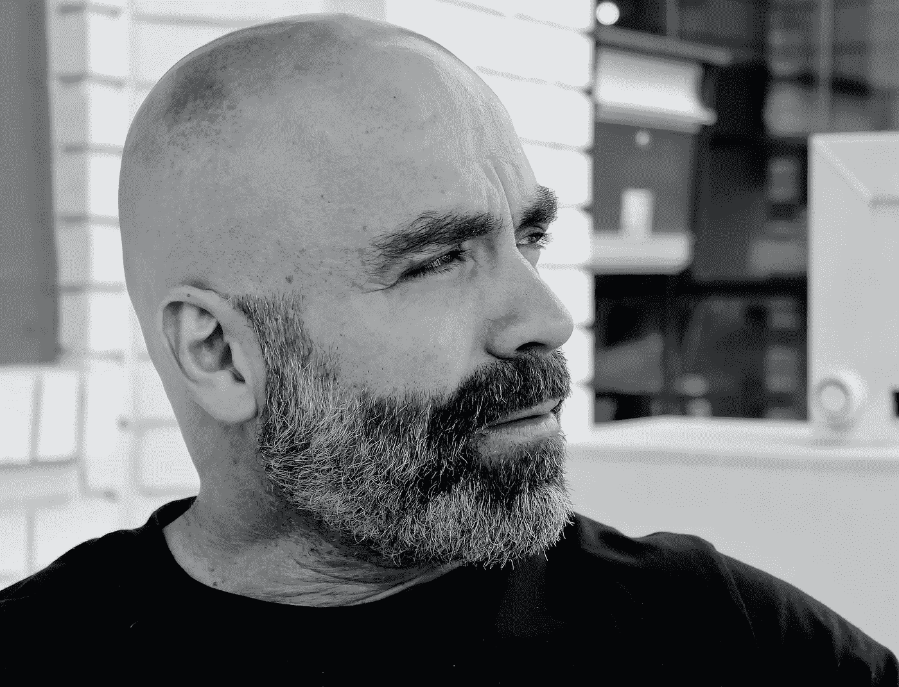

# 早晨动机

> 原文：<https://medium.datadriveninvestor.com/morning-motivation-c58488512594?source=collection_archive---------40----------------------->

## 让你准备好以正确的方式面对你的早晨。

今天我决定开始一件新的事情。随便引用一句话，大声说出来。谁知道呢，这可能会帮助到某个人。当我可以帮助那些过了糟糕的一天或者只想听到一些积极的事情的人时，为什么要把我的想法藏在心里呢？

今天的每日名言来自 18 世纪法国著名作家儒勒·列那尔。

# “不是你多大，而是你怎么老。”—儒勒·列那尔

Photo by [Chela B.](https://unsplash.com/@chela_bonky?utm_source=unsplash&utm_medium=referral&utm_content=creditCopyText) on [Unsplash](https://unsplash.com/s/photos/beard?utm_source=unsplash&utm_medium=referral&utm_content=creditCopyText)

你可能听说过这样一句话:年龄不过是一个数字。当我 45 岁左右的时候，我意识到了这一点。只要我们一直想着我们变老了，你就会注意到你会开始有这种感觉。

最近，我爸爸病得很重。他的心脏只发挥了 25%的功能。然而，通过纯粹的意志，他变得更好，今天做得更好。我提起他的原因是在拜访他的医生时，他的医生讲了一个可笑的笑话(这里不值得一提)，但本质是这样的，保持年轻的朋友。他们不抱怨疼痛，而是谈论他们未来的梦想和抱负。

我的理解是，你活得越久，忘记自己有多老，你的生活就会越好。

每当你想到年龄的时候，就想象你会活到一百岁。你看，我跟踪了几个生物黑客，包括这个领域的父亲，戴夫·阿斯普雷。他从事这个领域已经几十年了。在最近的一次播客中，他声称，按照科学进步的速度，我们只需要再活五年，就会有如此多的医学进步，我们将能够把寿命延长到 150 岁。

所以我希望你们能消化一下——150 年。把你的年龄和那个相比。你还能活多少年？现在问问你自己，“你有那么老吗？”

如果我看看那时的自己，我只度过了人生的 30%。我还有 70%的时间。当我这样想的时候，我意识到我可以为这个世界贡献很多，你也一样。

不要让你的思想控制你，而要学会控制你的思想。所以当你明天早上醒来，说我太累了，不想起床。说出你的想法；你只活了生命的 _ _ _ _ _ _ _ _ _ %(填入你的数字)。你有如此多的事情要做，如此多的事情要付出。活出你的目标，你会让你的人生有价值。