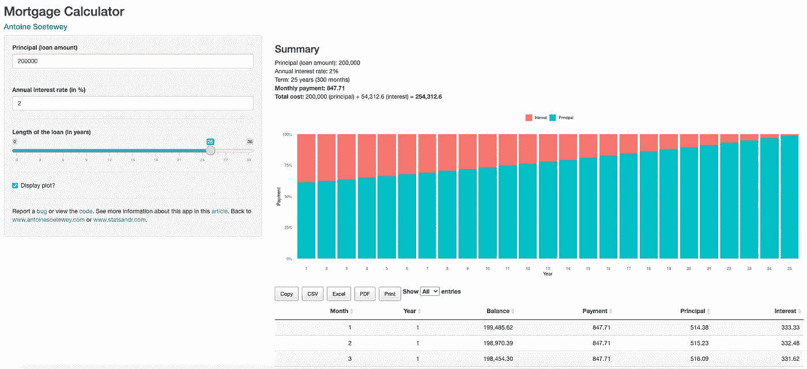

# R 闪亮的抵押贷款计算器

> 原文：<https://medium.datadriveninvestor.com/mortgage-calculator-in-r-shiny-f6fe1b1fc23b?source=collection_archive---------4----------------------->

## 一个闪亮的应用程序来计算每月贷款或抵押付款，并生成分期偿还表

Photo by [Tierra Mallorca](https://unsplash.com/@tierramallorca?utm_source=medium&utm_medium=referral)

# 介绍

我最近搬出去买了我的第一套公寓。当然，我不能完全用自己的积蓄来支付，所以我不得不从银行借钱。我拜访了几家在我的国家经营的银行，并要求抵押贷款。

如果你过去已经买了房子或公寓，你应该知道事情是怎样的:银行会分析你的财务和个人状况，并根据你向银行还款的倾向给出报价。然后，如果您对利率和条件满意，您可以接受该提议，或者如果您认为可以获得更好的提议，您可以去另一家银行。抵押和贷款当然比这更复杂，但是让我们保持简单。

由于我有点喜欢控制和密切关注我的[个人财务](https://www.statsandr.com/blog/practical-guide-on-optimal-asset-allocation/)(我必须承认，有时有点过于密切)，我准确地知道我每月可以花多少钱来偿还抵押贷款，同时还能支付我的生活费用。然而，考虑到这些住房还款，我不知道我的新公寓总共能借多少钱。

我知道我不是第一个遇到这种情况的人，所以我在网上寻找一个 R 脚本来回答我的问题(并可能给我房屋贷款的总成本，包括贷款金额和累计利息)。我终于找到了托马斯·吉尔克教授不久前创作的 R 脚本。

 [## 数据分析如何为房地产金融提供信息|数据驱动的投资者

### 数据是 21 世纪的热门商品。因为它能够推动和通知几乎所有行业…

www.datadriveninvestor.com](https://www.datadriveninvestor.com/2020/07/02/how-data-analytics-can-inform-real-estate-finance/) 

# 抵押计算器

脚本中的函数是实用的，解决了我的主要问题，但我希望能够更容易地使用不同的设置，如贷款的金额、期限和利率。

出于这个原因，我创建了一个 **R 闪亮的应用程序**，这里有**:**

*   [**抵押计算器**](https://antoinesoetewey.shinyapps.io/mortgage-calculator/)

Mortgage calculator in R Shiny

与此同时，我从一位在比利时银行工作的朋友那里收到了一份 Excel 文件，该银行做的正是同样的工作。我不是精算师，也不是抵押贷款专家，所以有了他的文件，我可以交叉检查结果，并相应地编辑代码。

这款应用程序极大地帮助我了解了我可以通过玩抵押贷款的三个主要设置从银行贷款的最大金额，因此在网上寻找公寓时，它给了我一个精确的价格限制。

注意，该应用程序当然可以用于任何贷款，而不仅仅是抵押贷款。

# 房贷计算器怎么用？

首先，你可以在这里找到抵押贷款计算器[。](https://antoinesoetewey.shinyapps.io/mortgage-calculator/)

我努力让我所有的[闪亮应用](https://www.statsandr.com/tags/shiny/)对每个人都容易使用。然而，以下是在不够直观的情况下如何使用它:

1.  输入贷款金额(即您想借的金额，不包括首付)
2.  输入年利率，单位为%
3.  输入贷款期限(年)

在右侧面板(如果您在手机上使用该应用程序，则在底部)您会看到:

*   重复您输入的设置的摘要，
*   贷款的总成本(包括本金和利息)，更重要的是
*   每月付款的金额

还显示了表示利息和资本偿还的百分比的图。你会发现(尤其是在贷款的最初几年)，利率越高，贷款期限越长，每月还款中用于偿还利息的比例就越高。

最后，在汇总和绘图后显示逐月显示剩余余额的摊销表。您可以复制、导出(PDF、CSV 或 Excel 格式)或打印此摊销表以供将来使用。

# 应用程序的代码

下面的整个代码，以防你想增强应用程序(如果你碰巧改进它，请随时发送给我你的应用程序！).

感谢阅读。我希望这个[抵押贷款计算器](https://antoinesoetewey.shinyapps.io/mortgage-calculator/)能帮助你玩转抵押贷款的不同设置，谁知道呢，能帮助你决定买哪个房子或公寓。

和往常一样，如果您有与本文主题相关的问题或建议，请将其添加为评论，以便其他读者可以从讨论中受益。

*披露:请注意，本应用程序不包括投资建议或推荐，也不包括财务分析。此应用程序仅供参考，投资风险由您自行承担。我对基于本申请中包含的信息所做的任何决定或第三方对其的使用不承担任何责任。*

# 相关文章

*   [如何发布闪亮的应用程序:以 shinyapps.io 为例](https://www.statsandr.com/blog/how-to-publish-shiny-app-example-with-shinyapps-io/)
*   [如何在 R 中一次对多个变量进行 t 检验或方差分析，并以更好的方式传达结果](https://www.statsandr.com/blog/how-to-do-a-t-test-or-anova-for-many-variables-at-once-in-r-and-communicate-the-results-in-a-better-way/)
*   [新型新冠肺炎冠状病毒 100 大资源](https://www.statsandr.com/blog/top-r-resources-on-covid-19-coronavirus/)
*   [R 中的相关图:如何突出显示数据集中最相关的变量](https://www.statsandr.com/blog/correlogram-in-r-how-to-highlight-the-most-correlated-variables-in-a-dataset/)
*   [如何在简历中创建一个时间线？](https://www.statsandr.com/blog/how-to-create-a-timeline-of-your-cv-in-r/)

*原载于 2020 年 8 月 14 日 https://statsandr.com**[*。*](https://statsandr.com/blog/mortgage-calculator-r-shiny/)*

***访问专家视图—** [**订阅 DDI 英特尔**](https://datadriveninvestor.com/ddi-intel)*