# 做出错误决策的最常见原因以及如何变得更好

> 原文：<https://medium.datadriveninvestor.com/most-common-causes-of-bad-decision-making-and-how-to-get-better-9c751729873f?source=collection_archive---------1----------------------->

在任何决定的时刻，你能做的最好的事情就是正确的事情。你能做的最糟糕的事情就是什么都不做。”—西奥多·罗斯福

数百名超级聪明的人写了数千本关于决策的书。他们中的许多人获得了诺贝尔奖和其他声望很高的奖项。

我一生中从未获得过任何奖项。甚至在学校也没有。这个世界不需要一个伪聪明的人再发表一篇关于决策的文章。但是我有一种奇怪的渴望去谈论它。我要去挠痒痒。

我们大多数人都有能力做出明智的选择。我们是这个星球上最聪明、最先进的物种。但是我们的历史表明，我们都有一些关于我们糟糕的决策技巧的好故事。

那么，为什么我们会做出糟糕的决定呢？我们不希望*我们的决定是糟糕的。我们也不会每天早上醒来，对着镜子说，“*耶！我今天要做一些非常糟糕的选择！**

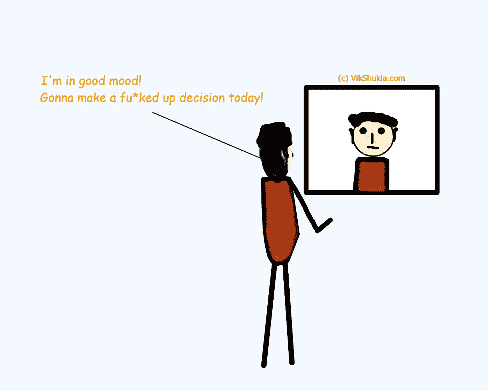

有如此多的情况和如此多的变量在起作用，以至于很难有一个单一的公式——最终的决策公式——适用于所有类型的决策。

我们每天都要做出成千上万个决定。大部分都无关紧要，不需要太多思考。但是我们的一些决定会对我们的职业生涯、人际关系、健康以及生活的其他方面产生持久的影响。

许多因素影响我们做出糟糕的决定。理解它们是如何导致我们做出错误选择的，可以帮助我们更好地做决定。

 [## 决策的艰难工作|数据驱动的投资者

### 你最近做了多少重要的决定？很难，不是吗？我们大多数人可能会低估这一点…

www.datadriveninvestor.com](https://www.datadriveninvestor.com/2020/05/21/the-difficult-job-of-making-decisions/) 

# 做出错误决策的最常见原因

我们倾向于把一件事与另一件事联系起来。如果一个人很聪明，我们认为他也很擅长做决定。如果某人很富有，我们认为她也是一个聪明人。如果有人…好吧，你明白了。

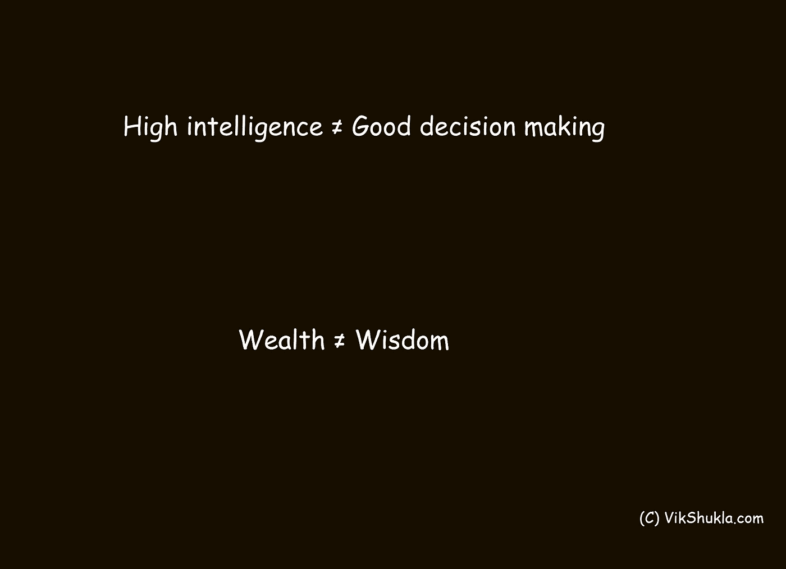

高智商不会自动让我们更擅长决策。

属于最高级物种的最聪明的个体在商业、人际关系、健康和生活的其他方面做出了可怕的决定。

如果我们如此先进，是什么导致我们做出糟糕的决定？以下是我能想到的几件事:

## 1.错位的目标

在一个不确定的世界里，我们几乎所有的决定都是基于对奖励和惩罚的感知。

我们的决定是基于如果决定是正确的，我们期望得到怎样的奖励，以及如果我们错了，我们期望受到怎样的惩罚(可能是扣发奖励)。

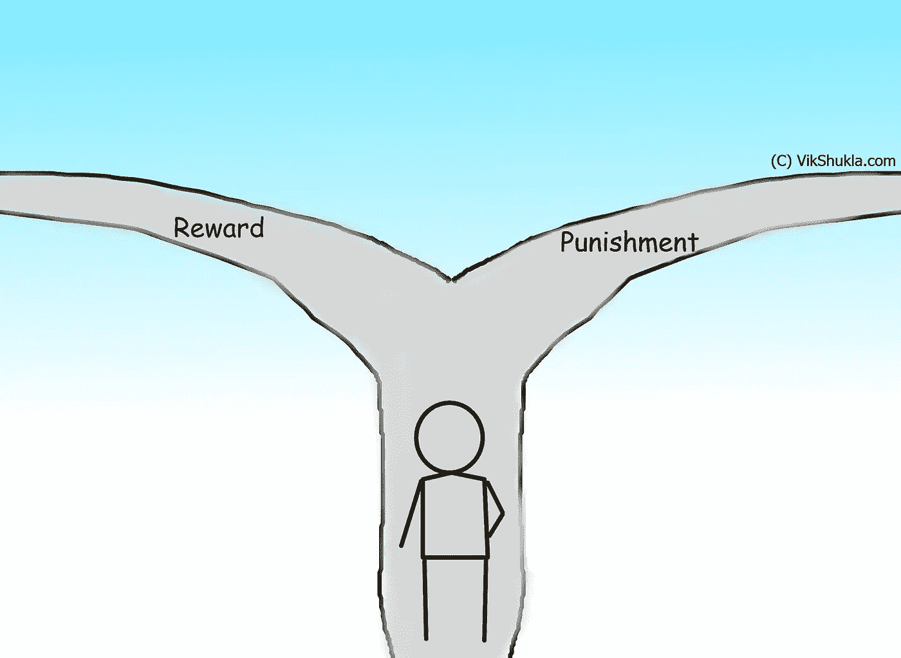

一切都很好。但是当我们为了符合我们自己的期望、自我、权威或我们所在的团体而放错目标时，事情就变得不对了。

当我们把目标放错了地方，我们就会偏离做出正确决定的轨道，而我们有一部分知道我们应该做出正确决定。

然后，我们试图证明——从逻辑上和理性上——为什么这是正确的选择。即使它给了我们一个很好的故事来讲述，它也不会让我们的决定变得更好。

## 2.分析瘫痪

分析瘫痪是指我们花太多时间过度思考或过度分析一个问题。

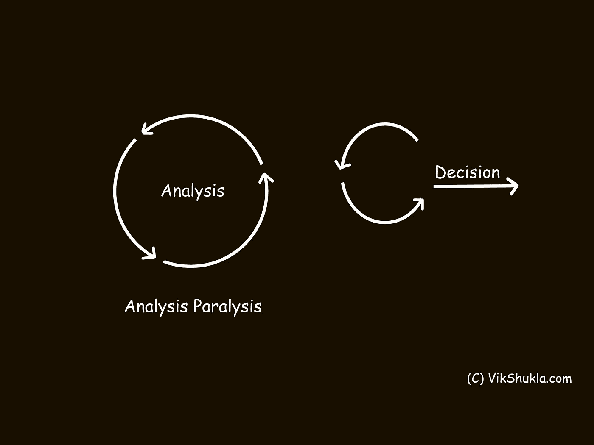

我们没有做出决定，而是陷入了一个分析循环。这种不作为可能会导致错失机会或意想不到的惩罚。

当有不确定数量的变量在起作用时，分析瘫痪经常发生。事实和数据不会让我们很有把握地列出利弊清单(或奖励与惩罚)。

## 3.等待更多信息

有时候，当我们没有做出决定所需的数据时，我们会选择等待。我们花了太多时间等待。

我们经常不得不根据不完整的数据、直觉和过去的经验来做决定。然后随着新信息的出现不断调整。当事实改变时，不要犹豫改变你的想法。

如果我们等待 100%的数据，那就太晚了。即使是 Amazon.com 创始人杰夫·贝索斯也不会等待所有的数据。他说他根据大约 70%的数据做决定。这对他来说已经足够了。

等待可能意味着错过一些好机会。

## 4.没有想清楚

重要的是收集事实和数据，并在做决定时从我们过去的经验中吸取教训。

但是研究人员发现，我们没有花足够的时间思考问题。思考不像是工作和进步，你的上级可能希望看到你*工作*。所以你工作。

据研究人员称，大多数决策者分配不超过 25%的时间来考虑一个给定的问题。相反，我们选择花额外的时间收集数据和信息。

如果没有足够的时间仔细考虑，我们就无法了解情况的来龙去脉。语境来源于广泛而深刻的理解。

一部宝莱坞电影没有主题曲是不完整的。同样，如果不提及丹尼尔·卡内曼，任何关于决策的讨论都是不完整的。所以，在这里。

他说，我们对几乎所有的事情都有一种直觉的感觉和看法。我们喜欢或不喜欢一个人，甚至没有见过面或很好地了解他们。我们觉得一个公司即使不分析也会成功。

当我们未经深思熟虑就做出决定的时候，我们是在努力满足我们现有的观点和直觉。我们需要花更多的时间来思考手头的问题，更新我们的理解。

## 5.混淆运气和技巧

比尔·盖茨曾经说过，“*成功是一个糟糕的老师。它诱使聪明人认为他们不会失去*。

我们应该评估我们过去的决定，以帮助我们减少未来犯错的可能性。但是我们根据结果而不是过程来评估我们的决定。

当我们得到想要的结果时，我们高兴地接受这是我们的技能，即使是运气或其他我们无法控制的因素。

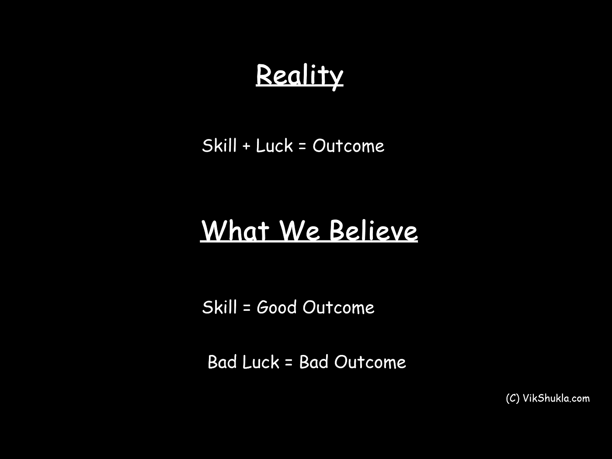

当结果与我们预期的相似时，我们不会批评我们的决定。只有当结果令人失望时，我们才会批评他们。

当我们把运气和技巧混为一谈的时候，我们给了自己一个错误但却很强的信念，认为我们可以控制一切。这让我们冒着做出会后悔的愚蠢决定的风险。

## 6.我们自己的智慧

当你花了 20 多年的时间和父母的大量金钱在教育上时，很难接受高等教育和良好的决策是两回事。有些受过教育的人善于做决定，但不是全部。

聪明的受过教育的人获得了很多知识。他们有自己的世界观。他们试图把现实世界装进他们自己的理论和解释的盒子里，而不是接受现实。

他们对出错的原因有深刻而详细的解释。他们可以拿出一份满是术语和复杂计算的 132 页文件，来说服你为什么这是一个正确的决定。我不识字的妈妈可以对同一件事给出简单、清晰、一句话的解释。

如果同样的人被要求评价其他人的决定，他们会采取更客观的观点。

这是因为当我们思考自己的决定时，我们大脑的一部分试图用复杂的故事来证明。但是当我们看别人的决定时，我们并没有意识到那个人大脑内部的对话。我们只关注数据、流程、分析和行动。

有时，即使是最复杂的问题也需要简单的解决方案。但是我们的智慧推动我们去寻找复杂的解决方案。

如果我们做一些外行也能做的简单事情，那么我们所有的知识、学位和经验又有什么用呢？这并没有把我们分开。我们需要炮制一个复杂的解决方案，向世界证明我们是多么有价值！

## 7.最近的尴尬

假设你最近遭受了挫折。也许[你被解雇了](http://vikshukla.com/job-loss-amid-coronavirus-crisis/)或者被调到一个没人想去的地方。或者也许你欠了太多的消费者债务，现在你无法按时支付 EMIs。你被迫削减开支，卖掉你的汽车，或者搬到一个更小的房子。

你过去错误决定的后果现在可以被你的朋友、熟人、同事，最重要的是亲戚看到。

现在你尴尬了。这种尴尬和最近事件的包袱会影响你的想法和决定——很可能是负面的。

## 8.对个人玩家的错误关注

在他的书*三思*中，迈克尔·莫布森揭示了在复杂的适应性系统中做出决策的方法。

一个复杂的适应系统有大量不同的主体，每个主体都有自己的规则。股票市场就是一个很好的例子。有数百万的交易者、个人投资者、机构投资者、经纪人等。他们都有自己的流程、规则和市场角色。

复杂适应系统中的主体以某种方式相互作用。他们所有的互动创造了一个更高层次的系统(在这种情况下，是股票市场本身),它有自己的属性和特征。

股票市场的行为和特征与市场中的个体玩家完全不同。

诺贝尔奖得主物理学家 Philip Anderson 在他的论文 [*中写道*](https://web2.ph.utexas.edu/~wktse/Welcome_files/More_Is_Different_Phil_Anderson.pdf) *“事实证明，基本粒子的大而复杂的聚集体的行为，并不能从几个粒子的性质的简单推断来理解。相反，在每一个复杂程度上，都会出现全新的属性*。

我们有一种与生俱来的想了解因果的愿望。当事情发生的时候，我们的大脑会迅速找到原因的解释。

我们在股票市场上经常看到这种情况。今天市场因为 x 而上涨。昨天市场因为 y 而崩溃。

但是当我们在处理复杂的适应系统时，没有办法通过研究单个部分来理解整个系统发生了什么。

有几十甚至几百个变量在起作用。我们的因果心态促使我们专注于一个单一的部分来解释这种影响。

这种对单个组件的错误关注使我们相信我们理解了是什么对整个系统造成了特定的影响。有时，即使是最好的个人行为也会给整个系统带来不良后果。

## 9.我们的环境

我们的环境会直接或间接地对我们的决策产生巨大影响。大多数时候我们甚至不知道自己是如何被影响的，因为环境在潜意识里影响着我们。

为了防止情况影响我们的决定，我们需要高度的自我意识。同伴压力只是环境影响我们做出可能对我们不利的决定的一个例子。

有一项关于商店里播放的音乐类型如何下意识地影响我们的购买决定的著名研究。研究人员将法国和德国葡萄酒与各自的国旗放在一起。这两种酒在价格和质量上相似。

一个不经意的购物者会比较它们，然后放一个在他们的购物车里。结账后，研究人员走近购物者，询问他们为什么买一种酒而不买另一种。他们会说一些他们购买的葡萄酒的优点，或者为什么它与他们即将到来的计划完美契合。

研究人员还询问他们是否注意到背景音乐的播放，以及它是否会影响他们的购买决定。几乎所有的购物者都说这不会影响他们的购买决定，尽管有些人承认听到了音乐。

现在来了个难题。研究人员随后查看了购物数据。当背景播放德国比尔克勒音乐时，73%的消费者购买了德国葡萄酒。

当超市播放法国手风琴音乐时，法国葡萄酒占销售额的比例达到惊人的 77%。

巧合吗？不，研究人员称之为“启动”但是大约 86%的购物者否认音乐对他们的购买决定有任何影响。

## 10.无所不知的态度

宾夕法尼亚大学教授菲利普·特洛克进行了一项长达 20 年的研究，以了解专家们对未来预测的准确性。

他分析了 82361 个专家预测，并得出结论，专家们“*在预测未来方面并不比一只扔飞镖的黑猩猩强多少。”*

大多数分析师本来可以通过随机猜测来显著提高他们预测的准确性。不开玩笑。

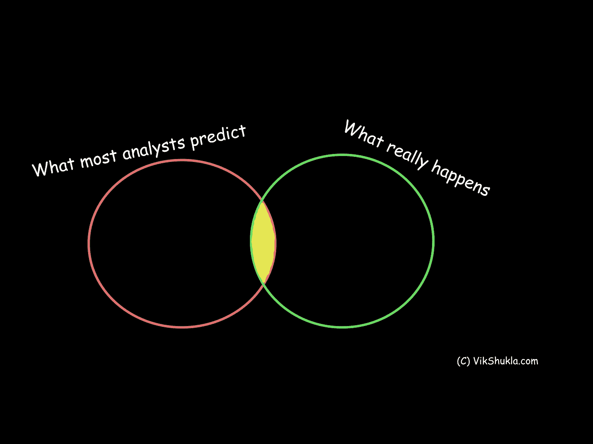

只有少数专家一直表现良好。他们没有“无所不知”的态度。他们乐于接受新的想法、信息和数据，包括那些挑战他们核心假设和信念的想法、信息和数据。

泰特洛克发现，最不可靠的专家是那些拥有最多知识和经验的人。即使数据显示[他们错了](http://vikshukla.com/analysts-are-wrong-but-we-believe-them/)，他们也会拒绝承认。

他们过于自信。他们排除了任何与他们的预测相矛盾的证据。但是他们对与他们自己的信仰相符的观点和证据持开放态度。他们对变化的适应极其缓慢。一个直接的后果是，他们的大部分预测被证明是不准确的。

# 如何更好地做决策

一个好的决定意味着什么？它是指导致预期结果的决定吗？不。我们仍然在处理概率、不确定性、过去的经验、有限的数据和我们自己的偏见。

一个好的决定不是由结果决定的，尽管它确实增加了预期结果的可能性。

一个好的决定是一个明智的，有逻辑的，有见识的人在给定的情况下做出的决定。

一些著名的商业领袖和企业家有一个直截了当的方法——对一切你不能说的事情说不。但它只在有限的情况下有效。例如，当你必须在*是*和*否*之间做出决定时。

我们生活在一个动态的世界。我们每天都在做出复杂的决定……这种决定需要更深入的头脑风暴。这里有一些方法可以帮助你更好地做决定。

## 1.是可逆的还是不可逆的？

这是 Amazon.com 创始人杰夫·贝索斯工具箱中最受欢迎的工具之一。他问自己，“这是一个可逆的还是不可逆的决定？”

如果它是可逆的，我们可以快速地制造它，而不需要大量的数据。我们不必在决策上花费太多时间。

贝佐斯用同样的技巧决定是否辞掉高薪工作去创办亚马逊。他认为，即使亚马逊倒闭了，他也可以回到以前的工作岗位，或者换一份工作。在这个过程中，他会学到一些宝贵的经验。这是一个可逆的决定。

我们不需要在这里变得完美。在一个快速发展的世界里，能够快速做出大多数决定是一种竞争优势。

如果你花太长时间做一个可逆的决定，你可能会错过一个巨大的机会，或者你的竞争对手可能会抢在你前面。

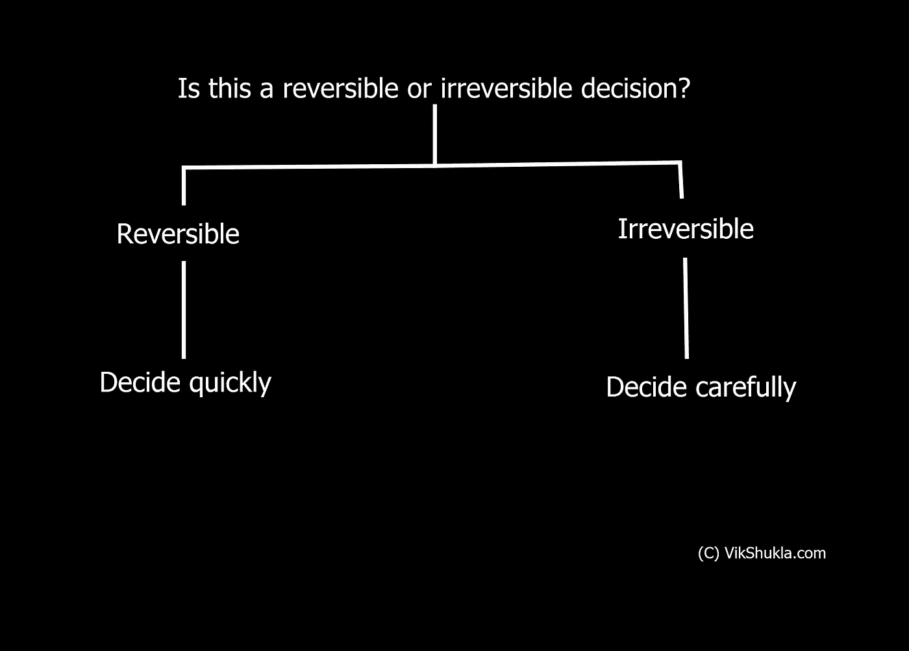

当决定不可逆转时，我们需要投入大量的时间来更彻底地理解问题。

贝佐斯将不可逆转的决定描述为单行道。如果你走过去，不喜欢你在另一边看到的，你就不能回到你之前的地方。相比之下，可逆的决定就像双向的门。

贝佐斯在一封股东信中写道，“这些(不可逆转的)决定必须有条不紊地、谨慎地、缓慢地做出，并经过深思熟虑和磋商。”

## 2.有一颗初学者的心

菲利普·泰特洛克在他长达 20 年的研究中发现，大多数专家在预测事物方面都有糟糕的记录。他们中的大多数人都错了，因为他们有专家的头脑，并且对此过于自信。

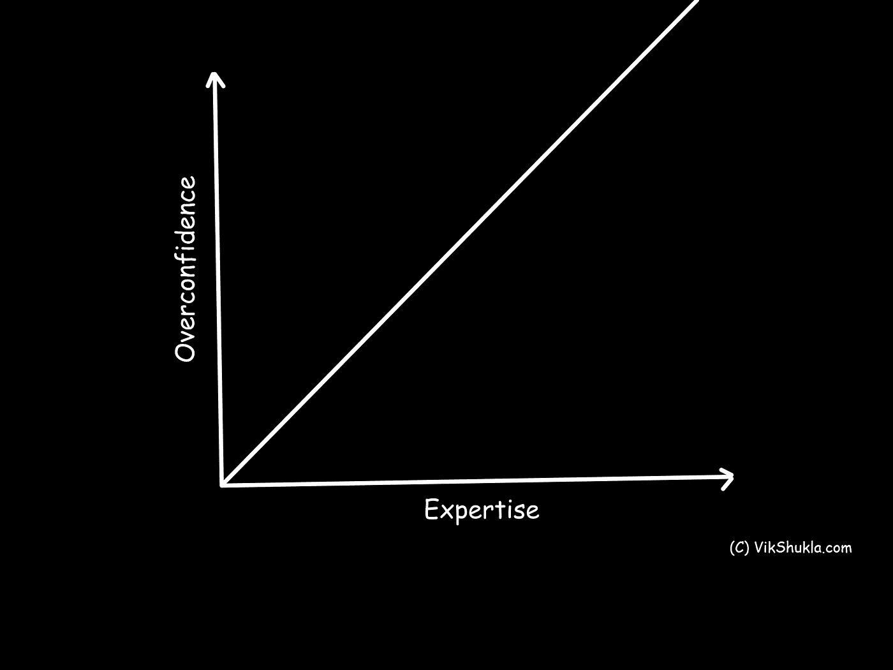

少数专家相对更擅长预测未来的趋势和事件，他们乐于接受新的观点、论点和可能性。他们没有背负过去先入为主的包袱。他们意识到，他们正在应对一个动态的环境，其中大多数事情都是不确定的。

佛教中有一个概念叫做“初心”。它说我们应该像初学者一样对待事物和想法。不被我们过去的成见所累。比如思考基本原则。

一连串过去的成功最大限度地减少了探索新想法的动力，尤其是当它与过去对我们很有效的策略相矛盾的时候。它限制了我们接受反馈和新想法，并保持在创新的最前沿。

## 3.看期望值

无论你是财富 500 强的首席执行官还是人力车夫，我们在做决定时都会权衡可能性。我们关注心理学家所说的“期望值”

我们权衡积极结果的期望值和消极结果的期望值。它告诉我们哪些风险是值得冒的，哪些项目是值得追求的，什么时候该放弃什么。

当我们在周五晚上看电影时，我们知道深夜狂看的期望值比我们周六早上要做的任何事情都高。

当我们决定周二晚上不熬夜，因为周三早上有一个重要的会议时，我们潜意识地认为周三早上会议的预期价值高于周二晚上狂看我们最喜欢的节目。

我们不需要使用复杂的数学公式来确定某事物的期望值。我们大部分时间都是下意识的去做。

但是我们大多数人有时都没有意识到期望值。

当我们掷硬币，连续三次得到“反面”时，我们认为第四次得到“正面”的可能性很大。我们忘记了每次抛硬币时正面对反面的期望值是 50:50。

我们不会得到正面，因为前三次我们得到了反面。每次抛硬币都是独立的。

我们无法控制像这样的随机事件。如果我们继续抛硬币 100 次或更多，正面和反面的比例将接近 50:50。但是在任何一次翻转中，我们都不知道结果会是什么。

## 4.关注“不要输”而不是“赢”

有时候我们赢不是因为我们做了一切去赢，而是因为对方/组织犯了错误，输了。

还记得兔子和乌龟的故事吗？乌龟赢得了比赛，不是因为它跑得更快，而是因为兔子犯了一个错误，在取得领先优势后小睡了一会儿。兔子变得自大了。

Charles Ellis 在他杰出的著作*赢得失败者的游戏*中说，在“胜利者的游戏”中，结果取决于胜利者的正确行动。但是在“失败者的游戏”中，结果是由失败者的错误决定的。这在板球比赛中经常发生。

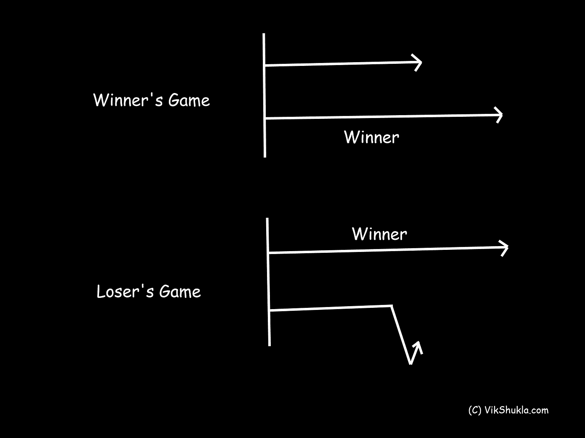

我们在生活中做的很多事情就是埃利斯所说的“失败者的游戏”。投资就是其中之一。积极的基金经理试图跑赢市场，但大多数都没有成功。他们正在努力争取胜利。

但一个专注于“不亏”的投资者，选择投资低成本的指数基金。从长期来看，指数投资者永远不会跑赢指数。但他的表现肯定会超过大多数活跃的基金经理。如果*没有输*，他就会赢。

## 5.创建一个加权利弊列表

我们大多数人使用利弊列表来做出理性的决定。简单地在一页纸的一面列出优点，在另一面列出缺点，可以让我们洞察到在特定情况下我们应该做什么。

加拿大亿万富翁 Seymour Schulich 在他的书【T2 变得更聪明:生活和商业教训】中进一步细化了利弊清单。Schulich 用它做出了他一生中一些最重要的商业决策。

它是这样工作的。拿两张纸。在一张纸上，列出所有的优点，并给他们每个人打 0 到 10 分。10 分是最高分。

在第二张纸上，列出所有负面的事情，并给它们打 0 到 10 分。在这个列表中，十分意味着最大的缺点。

你分配给每个赞成和反对意见的分数取决于该点的相对重要性。

把赞成和反对的分数加起来。如果正面得分至少是负面得分的两倍，你应该这样做。

但是如果正面分数小于负面分数的两倍，你就需要再考虑一下了……或者也许你不应该这么做。

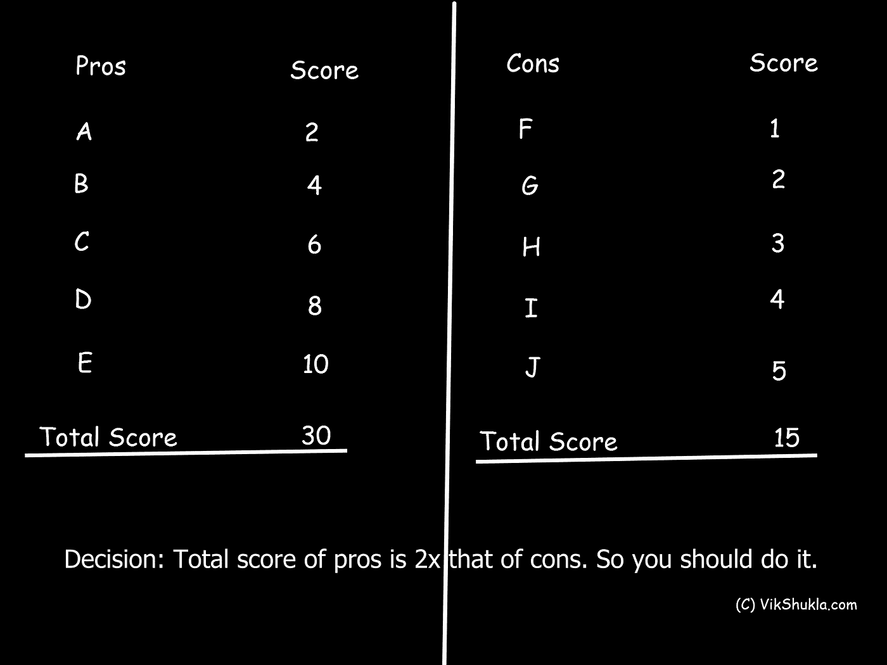

很简单，但是很有效。Seymour Schulich 和他在 Franco-Nevada 的执行团队共同制定了一份加权利弊清单，以决定是否应该将 Franco-Nevada 出售给 Newmont Mining。赞成者远远超过了反对者。Schulich 卖掉了公司。

## 6.反驳你自己

这是持续做出好决策的最有效的方法之一。

在结果揭晓后，人们通常会反驳他们的论点、决策过程或其他事情*。*

但是在做决定之前，无情地挑战和否定你自己的假设需要很大的勇气、纪律和自我意识。

当你面临一个决定时，探索与你现有的信念和假设相矛盾的想法和可能性。它会驱使你从不同的角度看待事物，并最小化错误决策的可能性。

类似的事情也发生在科学界。一位科学家将她的研究提交给一份出版物，来自世界各地的研究人员对其进行审查。他们会指出她在假设、方法论等方面的所有漏洞和瑕疵。更广泛的科学界试图反驳她的研究。如果它经得起同行评议的考验，它就有机会被广泛接受。

## 7.长期视角与短期视角

作家布莱恩·特雷西在他的书《变聪明:如何像每个领域最成功和收入最高的人一样思考和行动》中说，我们应该从长远的角度做决定。

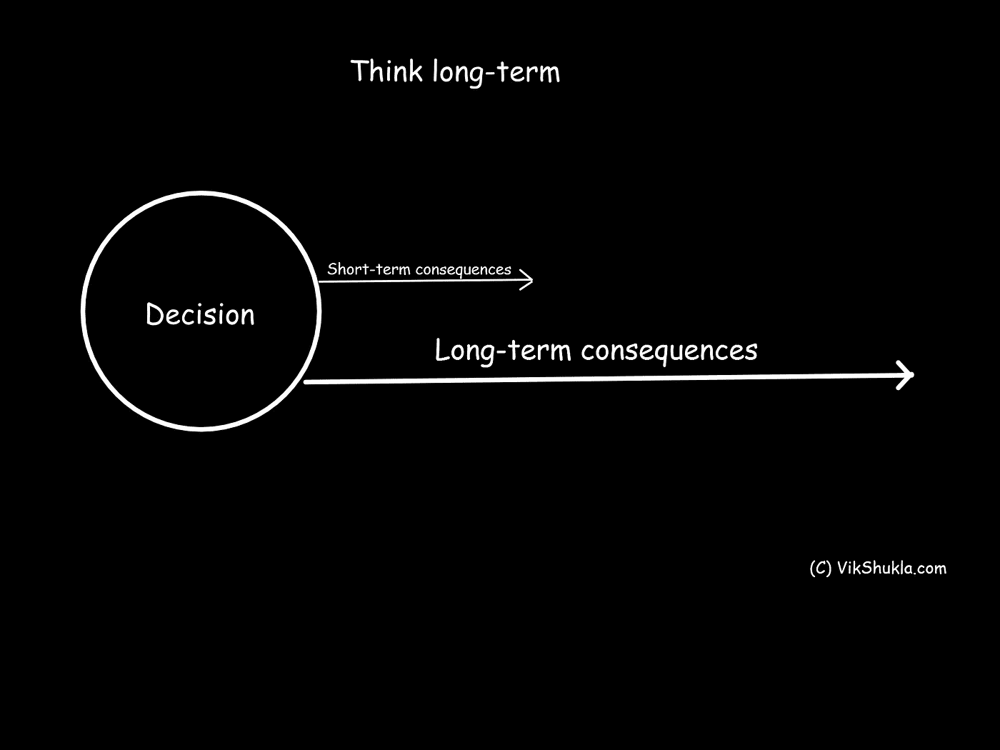

哈佛大学研究员爱德华·班菲尔德博士研究了向上的经济流动性约 50 年，以找出为什么有些人从较低的社会经济阶层上升到较高的阶层，而有些人没有。班菲尔德在他的书《罪恶之城》中说，时间观念是最大的因素。

处于较低社会经济水平的人只有几个小时或几天的时间观。

那些上升到最高社会经济水平的人以年、十年甚至几代人来思考。真正成功的人特别关注长远的未来。

如果你把你的时间观从短期转变为长期，这将极大地提高你决策的质量，即使你是在做短期决策。

## 8.慢慢想

不断地对正在发生的事件做出反应而不给予他们深刻的思考是平庸的完美配方。但是我们不断地对我们周围的事情做出反应，而没有经过任何深思熟虑。

布莱恩·特雷西写道，我们从“闹钟的第一声铃响”就开始“对环境的刺激做出反应”

我们对刺激做出快速反应的行为几乎没有留给我们深思熟虑的时间。

在你回答之前给自己一些时间思考会促使你做出深思熟虑和理性的决定。这也让你在愤怒或沮丧时三思。

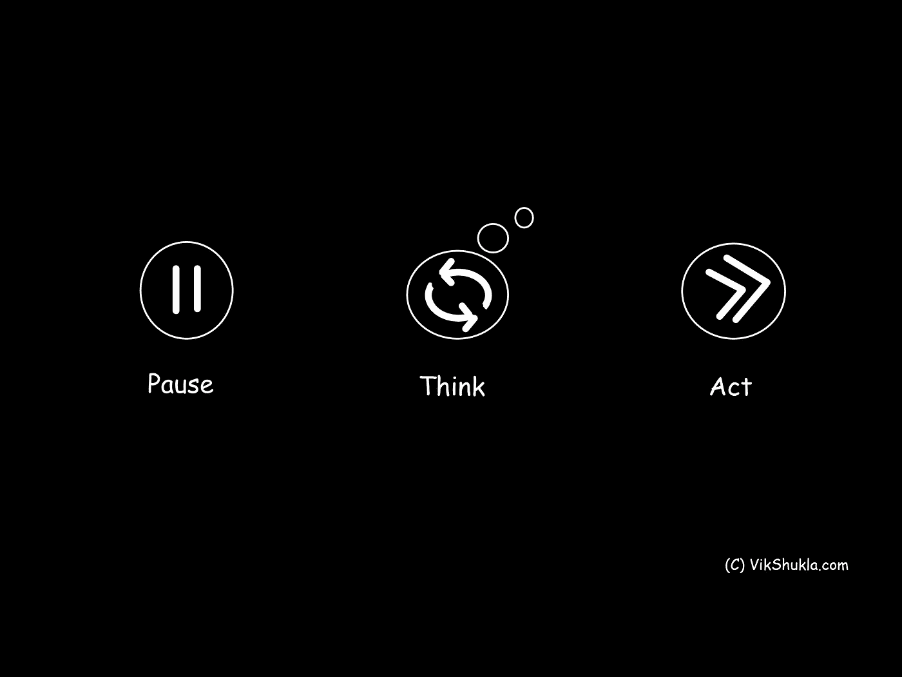

慢思考并不是每种情况下的最佳选择。对刺激的快速反应有它自己的好处。它节省了我们的时间和精力。但值得问问自己，“它需要慢思考还是快思考？”

## 9.激励措施。激励措施。激励措施。

提供正确的激励，你可以让几乎任何人做几乎任何事情。亿万富翁查理·芒格曾经说过:“*当你应该考虑激励的力量时，永远不要去想别的事情。”*

大多数人对激励有反应。因此，激励也可以帮助我们理解我们经营和决策的环境。

例如，当糖价上涨时，糖厂就有动机出售囤积了几个月的糖。如果可能的话，他们甚至会增加产量。与此同时，由于成本上升，消费者将试图削减消费。

当价格猛涨时，买方就有减少购买的动机。但是卖方有很强的动机卖出更多。

## 10.相信你的直觉

规则和过程可以帮助你做出好的决策，尤其是在处理复杂系统的时候。但是你不应该低估你自己的直觉。

德国心理学家 Gerd Gigerenzer 在他的书*中写道:风险意识:如何做出好的决定*我们的直觉通常是优越的。它不会受到采样误差的影响。

经济学家哈里·马科维茨因其在现代投资组合理论方面的研究获得了 1990 年诺贝尔经济学奖。他找到了一种在投资组合中获得“最优”资产组合的方法。但他并没有在自己的投资中遵循他获得诺贝尔奖的理论。

相反，Harry Markowitz 使用 1/N 方法，将他的钱平均分配到 N 种资产上。他为什么不遵循自己的诺贝尔获奖理论？因为他的直觉告诉他一些不同的东西。你的直觉由内省和数据支持，可能会导致一个好的决定。

Harry Markowitz 发现他的诺贝尔获奖模型不会比 1/N 策略表现得更好，除非它至少有 500 年的竞争时间。我从来没有听说过一个人能投资 500 年！

马科维茨选择了适合自己的策略，而不是为他赢得诺贝尔奖的策略。

作为旁注，它还教导我们，我们应该做在现实生活中对我们有用的事情，而不是理论上看起来很好的事情。

## 结论

一个好的计划，现在被粗暴地执行，胜过下周一个完美的计划

*——乔治·巴顿将军*

不能保证你每次都能做出正确的决定。但是我希望这个指南能帮助你最大限度地减少糟糕决定的数量。

随着时间的推移和经验的积累，我们学会了将过去的错误决定视为信息和经验，帮助我们在未来做出更好的决定。如果一个决定导致不好的结果，我们不应该对自己太苛刻。

天啊。太多的废话。我现在需要停下来。

结束。但是请订阅我的时事通讯。

–Vik

## 接下来阅读:

[**为什么中产阶级的人一辈子都是中产阶级……你能做些什么**](http://vikshukla.com/why-middle-class-people-stay-middle-class-all-their-life/)

我想你不是百万富翁。我也不是。所以我们在这里——两个中产阶级的人在讨论为什么中产阶级的人永远不会变得富有。

[**恐慌性抛售:是什么导致投资者恐慌，你能做些什么**](http://vikshukla.com/panic-selling/)

“那么，你想让我做什么？”“没什么。有时候什么都不是最难做的事。”

[**投资中的风险、回报和遗憾:寻找平衡**](http://vikshukla.com/risk-reward-and-regrets-in-investing/)

没有人能确定未来。我们充其量是在处理赔率和概率，它们不会总是对我们有利。我们无法完全避免风险和遗憾。

**访问专家视图—** [**订阅 DDI 英特尔**](https://datadriveninvestor.com/ddi-intel)