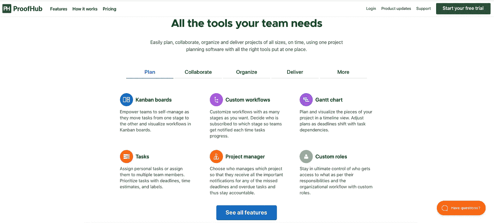
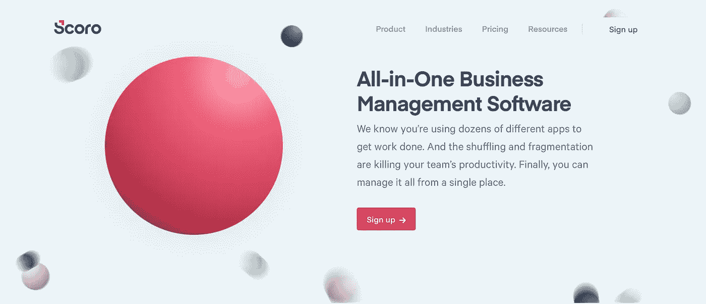
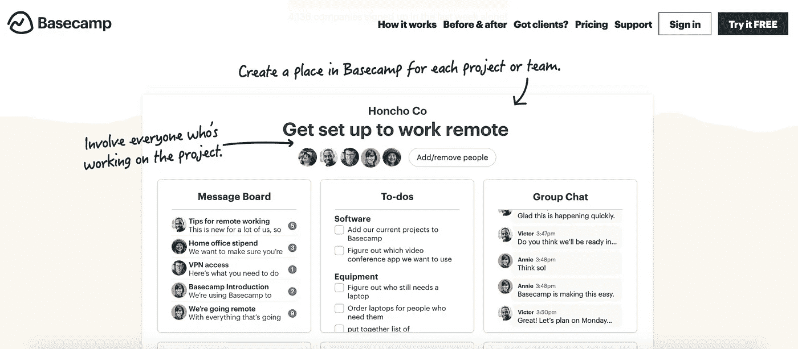
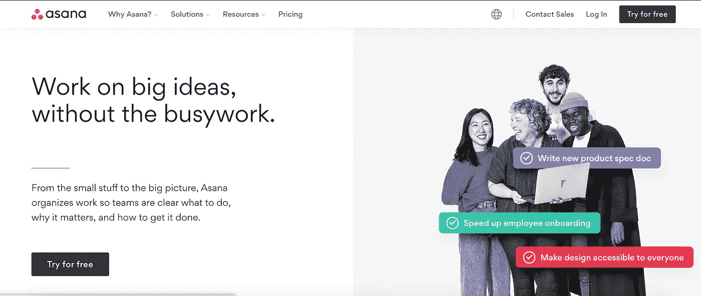
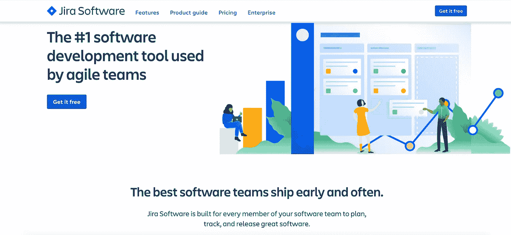
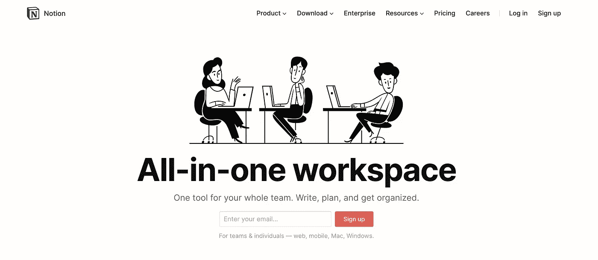
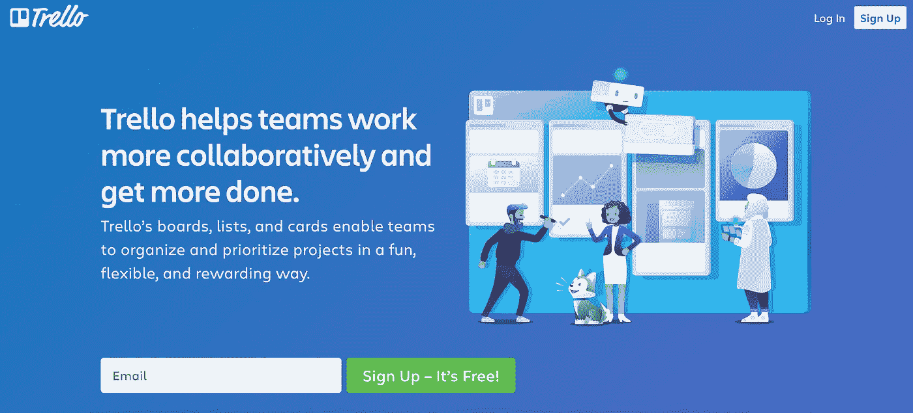
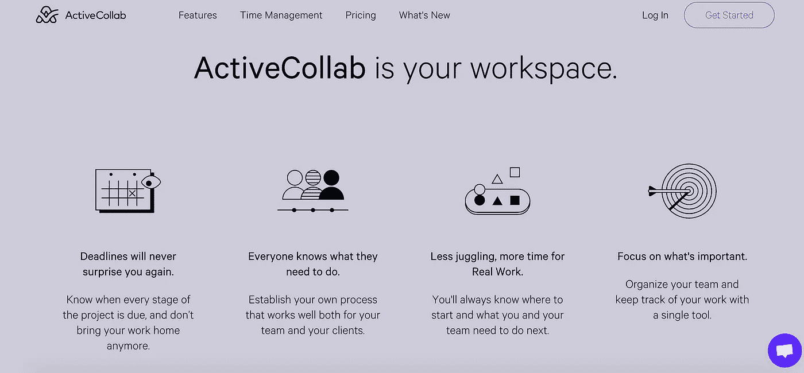

# 最有效的项目规划技术

> 原文：<https://medium.datadriveninvestor.com/most-effective-project-planning-techniques-863153dccaa?source=collection_archive---------23----------------------->

Source: Giphy

作为一名领导者，同时与不同的成员一起从事不同的项目，有时要跟上进度并有效地管理工作是一件非常具有挑战性的事情。但是感谢市场上的数字平台和工具简化了我们的工作并实现了目标。

Source: Freepik

在这篇博客中，我提出了有效项目管理的不同软件工具和技术，以及它们的特性、独特性、价格和连接它们的链接。最终，您将能够找出最适合您的应用程序的一个。

# 1.PROOFHUB

ProofHub 提供了传统电子邮件的替代品，在一个屋檐下有许多项目管理应用程序和许多其他工具。

Proofhub

**特性:**

1.  委派和执行角色
2.  免费保护数据
3.  应用程序的指定功能
4.  在线小组会议和对话，
5.  项目监控和记录的分析

**独特性:** ProofHub 有一个清晰的、设计良好的用户界面，让团队更有效地协同工作。

**价格:**从 20 美元/月(最多 10 个项目)到 150 美元/月(不限项目)

**链接:**[https://www.proofhub.com/](https://www.proofhub.com/)

# 2.斯科罗

Scoro 是一个全面的框架，包含了您可能需要的所有资源:任务和事件、联系人跟踪、访谈、团队规划、账单和监控。

Scoro

**功能:**

1.  子任务和目标的工作
2.  KPI 实时监控，
3.  共享工作议程和工作计划
4.  触摸控制
5.  跟踪时间和支付工作费用
6.  关于倡议和筹资的详细发展说明
7.  预设模板的报价和计费

**独特性:** Scoro 有助于简化您的工作进度，这意味着您不必为每项任务使用大量不同的工具。所有敏感信息都保存在一个中心位置。

**价格:**每月 26 美元起

**链接:**https://www.scoro.com

# 3.大本营

对于成千上万喜欢时尚的社交网络界面和无忧无虑的团队氛围的项目管理专业人士来说，Basecamp 是最受欢迎的网站。

Basecamp

**功能:**处理多人功能的项目，解决当前风险或建议的聊天板，与经理的应用程序内协作，计划质量监控，通过手机和笔记本电脑的通知

**唯一性:**

1.  向客户展示和添加特定数据的独立空间
2.  基地营对老师和学生都是免费的！

**价格:**$ 99/月，不限用户

**链接:**【https://basecamp.com/】T2

# 4.波迪奥

Podio 是一个模块化和完全可定制的电子工作和团队通信网络。

Podio

**功能:**

1.  分配角色、添加文件和共享解决方案的细节
2.  链接加密的大文件
3.  自动化分销渠道
4.  获取虚拟接口业务的摘要，自动化流程。

**独特性:**Podio 工作流功能帮助您将 if-then-than 推理应用到 Podio 软件中。例如，当产生一个对象时，或者当对一个对象进行特定的更改时，命令应用程序生成一个任务或消息。

**价格:**每个用户每月 24 美元起，可享受全套功能

**链接:**https://podio.com/

# 5.阿萨纳

Asana 将项目管理、文件存储和协调元素结合在一起，允许他们在没有电子邮件的情况下在团队中执行任务。

[Asana](https://asana.com/)

**功能:**

1.  将工作分成任务并委派给团队领导的简单方法
2.  在路线图和时间表项目中组织活动
3.  跟踪成就并回顾团队的成功
4.  随时了解计划的最新变化
5.  使用项目仪表板获得简短摘要

独特性: Asana 是一个非常简单易用的程序，有一个基本的界面。带着一小队不太大的任务。

**价格:**15 名会员免费，用户月费 8.33 美元起

**链接:【https://asana.com/】T22**

# 6.工作区

经验丰富的营销主管们希望帮助广告客户和设计团队让他们的作品更容易获得，他们创建了工作区。

Workzone

**功能:**

1.  个性化和个性化的成套活动
2.  构建子任务和项目相关性
3.  为所有用户(包括客户端)设置访问程序、任务和文件的密码
4.  快速查看甘特图状态
5.  指派工作人员执行一项以上的任务

独特性: Workzone 有许多重要的特性，比更复杂的软件更容易使用。工作环境应该被全体员工所利用。

价格:每月 24-44 美元

**链接:**https://asana.com/

# 7.JIRA

凭借先进的项目管理软件和功能，JIRA 是一个跨平台和错误报告应用程序。

Jira

**功能:**

1.  构建应用程序故事和问题
2.  安排短跑
3.  将职责分配给业务部门
4.  对员工的工作进行优先排序和分析
5.  集中协调员工
6.  实时查看团队进度的更新

**独特性:** JIRA 专为创建科技项目而开发，使其成为终极的 it 项目管理设备。

**价格:**10 美元/月起(最多 10 个用户)，15 个用户 75 美元/月，50 个用户 300 美元/月。

【链接:】[https://www.atlassian.com/software/jira](https://www.atlassian.com/software/jira)

# 8.概念

观念应该向你展示一种全新的项目管理方法。这将组织和协调任务，与老板讨论一切，并保持对所有建议的跟踪。

Notion

**功能:**

1.  每周持有一份具体的清单
2.  发表声明
3.  使用可定制的拖放编辑器创建工作板
4.  张贴文件
5.  将页面嵌套在一起——就像一个无穷无尽的信息库。

**独特性:**“概念就像一个协作软件乐高套装(或者《我的世界》，如果你是年轻一代的话)，让你组装最适合你的团队的工作流程，就像使用文本编辑器一样简单。”——Ivan Zhao，观念的联合创始人。

**价格:** $8 用户/月

**链接:**[https://www.notion.so/](https://www.notion.so/)

# 9.特雷罗

Trello 以在纸板般的屏幕上可视化项目任务而闻名，这是处理快速简单的日常活动的完美选择。

Trello

**功能:**

1.  在 cartboard 上轻松控制作业
2.  信息一览
3.  创建无限的活动集
4.  共享照片和数据
5.  按日期或目标组织项目
6.  讨论和协作

独特性:从企业家到财富 500 强公司，Trello 是团队在每个项目中最身临其境的工作方式。

价格:个人使用免费，企业用户每月 9.99 美元

**链接:**https://trello.com/en#

# 10.活动协作

有效的协作让团队在你外出时保持联系。

ActiveCollab

**功能:**

1.  时间监控和支付
2.  准备工作的甘特式截止日期
3.  创建多用户项目和时间表
4.  共享协作项目时间表

**独特性:** Active Collab 对于交互式文本编辑和连接的团队协作特别有用。

价格:云版本每月 25 美元起，自托管版本 499 美元起

**链接:**[https://activecollab.com/](https://activecollab.com/)

我最喜欢的是 Basecamp 和 Asana，在那里我探索了这两种工具，并在从事该行业的不同项目时学会了有效地使用它们。

享受项目管理！！！