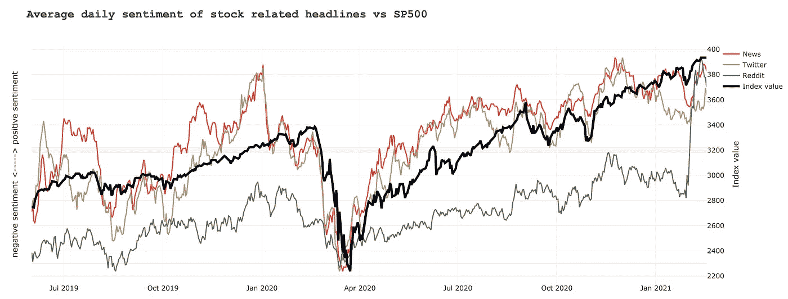
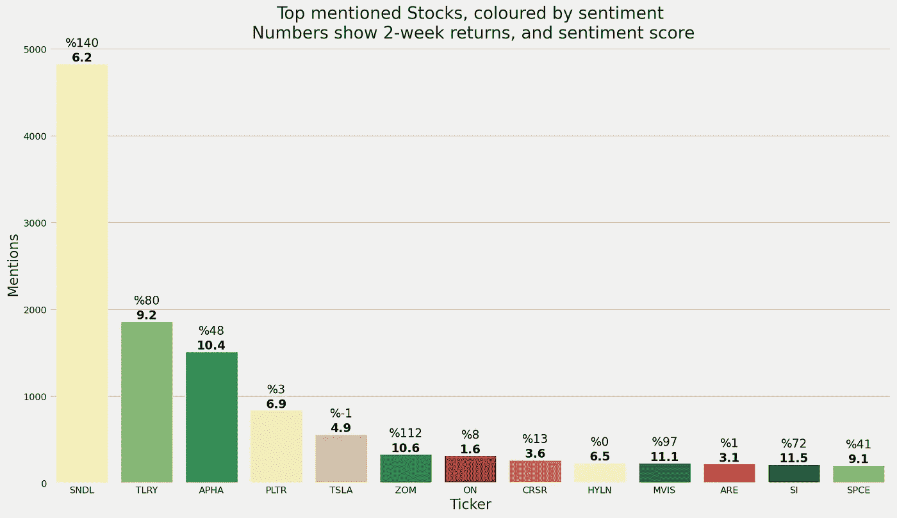
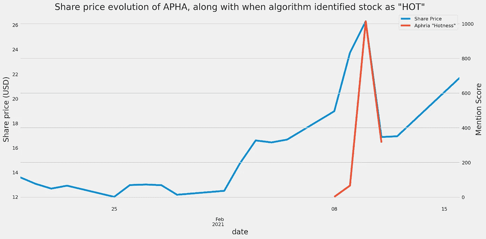
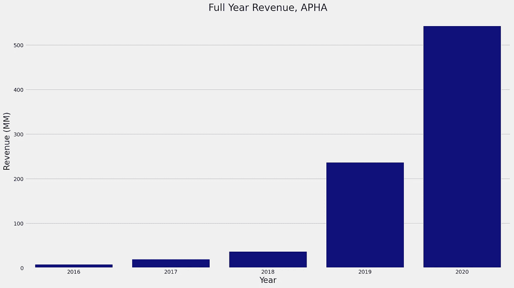

# Reddit 上最被炒作的股票

> 原文：<https://medium.datadriveninvestor.com/most-hyped-stocks-on-reddit-baea0d2be500?source=collection_archive---------1----------------------->

## 一种追踪和情绪的算法给 Reddit 上最受关注的股票打分

我创建了一个机器学习算法，定期扫描最受欢迎的交易子数据，记录尽职调查或讨论式帖子中提到的股票和报价机。

最近，由于 reddit 炒作导致 GME 或 AMC 等股票出现波动，金融机构越来越多地搜索 Reddit 和其他社交媒体网站，以帮助指导投资策略和股票发现。

在这篇文章中，我将展示算法识别出的上周被谈论最多的股票，并分享我对其中一只被炒作的股票的看法。

Average sentiment of stocks vs SP500 performance, Reddit & Twitter in particular can sometimes be early predictors of deep market changes, therefore serve as good factors to assess investment propositions by.

# 这是什么？

除了分析周围的文本和评论以了解正在讨论的股票的**情绪**和**流行度**之外，该算法还跟踪股票在所有*趋势*或*热门*帖子中的流行度，而不是简单地跟踪股票在子编辑中被提及的次数，即股票是以正面还是负面的方式被讨论，以及它在 reddit 上的覆盖程度。

# 我如何使用这个？

通常情况下，我会浏览不同的子栏目，试图了解正在形成趋势或被讨论的新股票。我会把这些股票作为未来几天尽职调查的基础。

我发现这不仅耗时，而且当我完成研究时，基于 Reddit 上正在讨论的新闻或事件，或者仅仅是因为现在每个人都知道这只即将上市的股票，这只股票的价格已经飙升。

该算法作为一个早期检测系统，允许我在 SRNE 或 PLTR 之类的股票出现重大价格变动之前挑选它们。

# 什么不是？

这是一个早期检测工具，你不应该把你的投资决定仅仅建立在这个算法的结果上。

**投资前做好自己的 DD。**

# 结果如何？

下面，我展示了过去一周各子 reddits 中讨论最多的股票，它们在过去两周的价格走势*(第一个百分比值)*，以及它们的总体看涨情绪得分(第二个值，粗体，范围从 0 ( *负*)到 100( *正*))。

Most discussed stocks on Reddit over the last week, coloured by their sentiment score (red: negatively discussed, green: positively discussed) along with 2-week returns (percentage) and actual sentiment score (bold).

在这里讨论的前三只股票中，**Aphria Inc(APHA)****+45%**是我最感兴趣的。

这实际上是我的算法已经识别了几天的股票，几天后见顶，然而鉴于持续的聊天，以及这只股票的长期前景，我认为这只股票仍有很大的上涨空间。

Aphria 公司是一家总部设在加拿大的国际娱乐和药用大麻分销公司。该公司的加拿大大麻业务包括其 Aphria One 温室设施(Aphria One)、通过其位于不列颠哥伦比亚省的全资子公司 Broken Coast 大麻有限公司(Broken Coast)持有的设施以及其位于利明顿的子公司 1974568 Ontario Limited(aph RIA Diamond)。

APHA 还生产和销售瓶装、罐装和生啤酒。该公司目前已在加拿大、德国、意大利、马耳他、哥伦比亚和阿根廷开展业务。

市值 59 亿美元，目前是全球最大的大麻公司之一，一旦与**蒂尔雷** *(这是我的算法挑选的另一只股票)* 的合并完成，它将进一步增长。

为了保持简洁，我将在本文中跳过对合并的讨论，而是专注于公司的财务和增长前景*(如果这是人们想要的东西，我可以详细介绍)*。

**收入**

APHA 的收入持续增长，从 2019 年的 2.37 亿美元增长到 2020 财年的 5.43 亿美元，增长了 **125%** 。相比之下，与其最接近的竞争对手 Canopy Growth Corporation 的收入增长了 76%。

5 Year Revenue history for APHA

虽然由于 COVID 供应问题和零售店临时关闭，今年的收入增长将略有放缓，但被压抑的需求(不仅是为了弥补失去的时间，也是为了应对人们对封锁的焦虑)和休闲大麻产品的进一步主流化只会支持长期增长。

11 月，Aphria 收购了美国最大的独立手工酿酒商之一 Sweetwater Brewing。这一点，加上 TLRY 与世界上最大的饮料生产商之一英博(InBev)签订了合同，以及对更灵活的大麻消费方式的需求不断增长，开辟了一个全新的收入来源。自从合并以来，它价格已经上涨了 311%。

**政治**

在美国，民主党现在控制了国会、参议院和白宫。与前任政府相比，他们在娱乐性毒品上更进步的立场意味着在联邦层面上更有可能合法化。查克舒默宣布将在 2021 年 H1 奥运会的某个时候推出法案草案，这突出了这一点。

美国的完全去刑罪化不仅打开了一个巨大的市场，也让欧洲国家开始关注完全去限制和监管(这已经在一些国家发生，法国目前正在进行公开咨询)。

当这种情况发生时，Aphria 的欧洲业务和规模意味着他们可以比大多数竞争对手更快地进入市场。

**可能的不利因素**

考虑到过去几天华尔街围绕该行业的炒作，大麻股票在最好的情况下也是波动性很大的股票，预计价格会波动，随着炒作的降温，还有更多潜在的下跌空间。

此外，一些分析师对娱乐性大麻市场的真实规模持怀疑态度，认为增长已经趋于平稳，指出与历史预测相比，市场表现不佳。就个人而言，我认为这都是短期的，随着市场变得更加深入和被接受，我们将会看到更多的“临时”用户进入市场。

**总结**

在所有的波动之下，APHA 有一些坚实的基本面，与业内同行相比非常突出，这还没有考虑到与 TLRY 的合并，我个人认为这将是一个游戏规则的改变。

从投资角度来说，这是一个长期持有，所以如果你有兴趣，准备购买并持有 2-3 年。围绕该股的波动很大，尤其是目前，我建议进行小规模投资组合配置，要么在合并之前进入，要么在美国合法化之前进入，如果你错过了那艘船的话。

# 下一步是什么？

如果人们觉得这些内容有用，我打算定期分享，同时提供一些我对这些股票的评论和数据，这样你就可以更好地了解这些股票。

请将此分享给可能发现此类内容有用的朋友。收到的越多，我就有越多的时间致力于大众股票教育。

编辑:时事通讯现已上线！在这里报名:【https://alikokaz.substack.com/about】