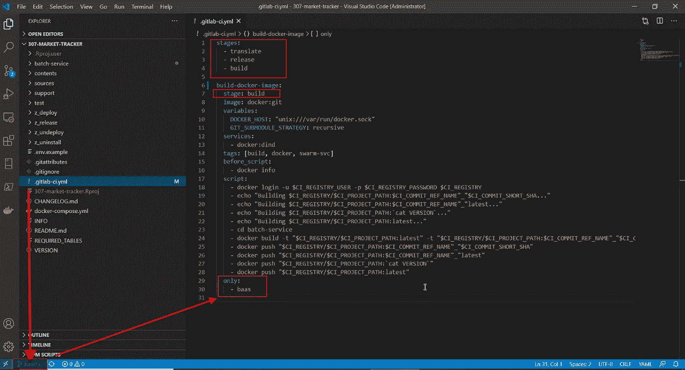
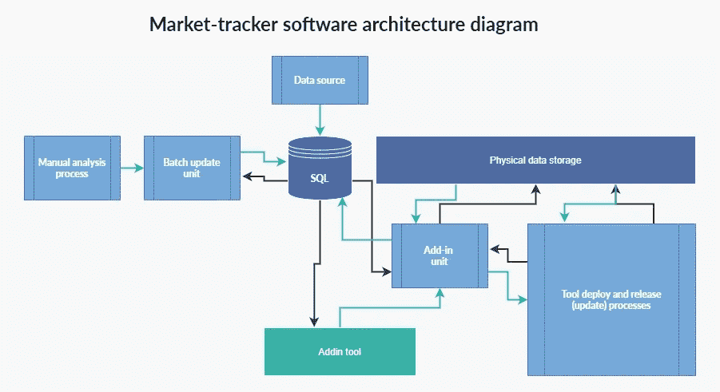
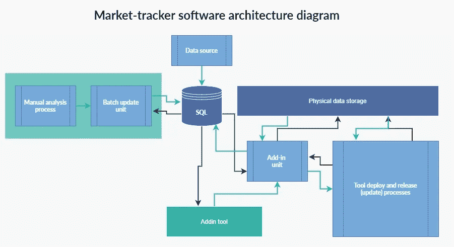
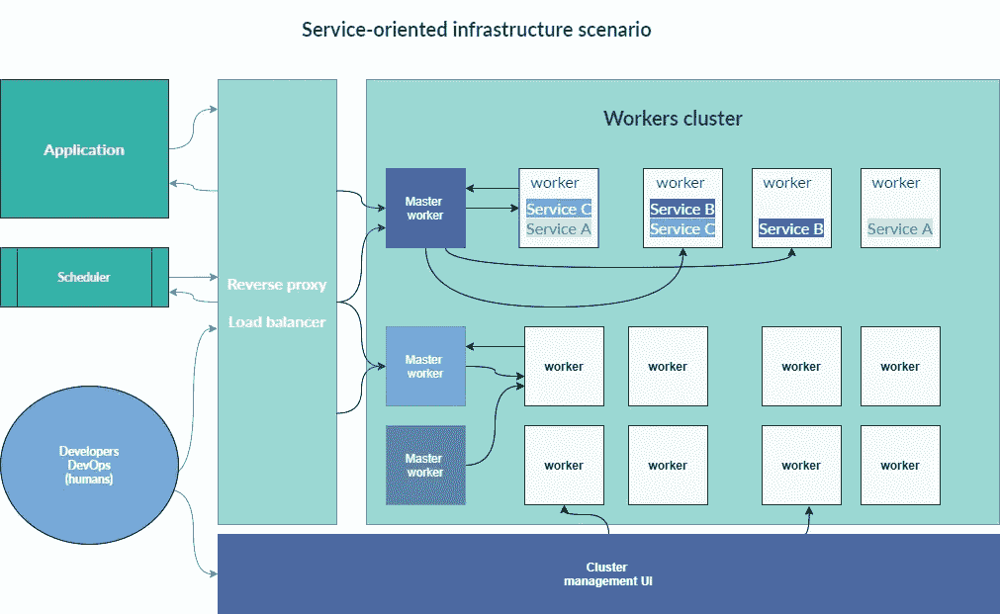

# 删除巨石:面向服务的架构

> 原文：<https://medium.datadriveninvestor.com/moving-towards-service-oriented-architecture-for-better-service-8c8aa77083a?source=collection_archive---------13----------------------->

## [商业科学](https://medium.com/tag/business-science)

## 实现 SOA 时最大化 ROI



Image by author (CC with attribution)

今天，所有的软件都由复杂的代码系统组成，这些代码系统在一系列的操作中协同工作，以完成各种各样的任务。**开发人员定义、选择、编写、集成和允许代码交互的方式形成了我们所说的*软件架构*。**架构具有重复且不同的代码模式，在一定的约束下解决特定的任务。

将完成一项任务的每组代码想象成一块砖。从历史上看，每块砖都依赖于它周围的人，尤其是那些充当其基础的人，因为你将代码构建成最终的杰作:**软件**。

# 巨石柱


Photo by [Chris Ried](https://unsplash.com/@cdr6934?utm_source=medium&utm_medium=referral) on [Unsplash](https://unsplash.com?utm_source=medium&utm_medium=referral)

这种**传统方式**被称为 [**单片架构**](https://en.wikipedia.org/wiki/Monolithic_application) 。在 monolith 中，每块代码都紧密依赖于所有其他代码。一切都在代码库层次上相互联系。从最基本的定义来看，它是一个庞然大物:**笨重、稳定、难以改变**。

> 单片应用程序有一个带有多个模块的单一代码库。模块分为业务特性和技术特性。它是单一构建系统的一部分，构建整个应用程序或依赖项。

不足为奇的是，在这种传统的环境中，对任何代码块的微小更改都会对系统产生相当大的影响。代码片段之间的交互加剧了这种影响，使得几乎不可能快速改进软件或为客户做出调整。越接近基础，代码越难改。

这是个问题。 ***服务好=服务快*** 。至少在大多数领域是这样，但尤其是涉及到技术的时候。 ***软件不能笨重而仍然做好它的工作*** 。

# 什么是面向服务的架构(SOA)？

一个解决方案？面向服务的架构。

[**面向服务的架构(SOA)**](https://en.wikipedia.org/wiki/Service-oriented_architecture) 将整体复杂性分解为**个半独立运行的独立砖块**。每个砖块都被称为一个服务。然后，这些服务松散耦合，以传递数据或协调活动。服务可以通信——即使它们没有直接相关的功能——但是它们不依赖于彼此来运行。

这种互操作性是 SOA 的关键特性。应用和服务可以快速调整，而无需调整整个系统。它们可以扩展，因为每个服务都是一个更大的[分散但连贯的系统](https://www.geeksforgeeks.org/service-oriented-architecture/)的一部分。

# 商业价值比技术更重要

整体架构和面向服务架构之间的区别不仅仅是技术上的；这是哲学。根据 [SOA 宣言](http://www.soa-manifesto.org/)，面向服务的架构价值观:

*   **商业价值**超过技术战略
*   **战略目标**优先于特定项目的优势
*   **基于定制集成的内在互操作性**
*   **基于特定目的实现的共享服务**
*   **高灵活性**优于优化
*   **进化完善**过度追求最初的完美

换句话说，SOA 就是通过自动化和增量变化来最大化价值。


Photo by [Adeolu Eletu](https://unsplash.com/@adeolueletu?utm_source=medium&utm_medium=referral) on [Unsplash](https://unsplash.com?utm_source=medium&utm_medium=referral)

# 最终用户和开发人员转向 SOA

我经常讨论价值高于一切的重要性。[数据](https://towardsdatascience.com/the-5-vs-of-big-data-hide-a-trap-30eb8d8de8f6)、[优化](https://towardsdatascience.com/9-tips-for-data-driven-decision-making-c51fedbafbe3)、[自动化](https://towardsdatascience.com/expensive-data-science-mistakes-when-your-kpis-lie-ca3df94333dd)、 [AI](https://entrepreneurshandbook.co/the-human-machine-alliance-fostering-the-age-of-collaboration-3c79b5ab53) :都只是帮助我们实现价值最大化的工具。SOA 基于同样的假设运行。技术是必不可少的，但是如果不能实现你的目标，世界上最好的代码也没有任何意义。

幸运的是，SOA 简化了这一过程，对软件的最终用户和开发人员都有好处。面向服务的架构:

*   **易修改易维护**:服务是独立的，可以根据客户需求进行修改，不会影响其他服务。
*   **增加可靠性**:服务比单一代码更容易调试，允许开发人员发现和修复错误，并对客户关注的问题做出更快的反应。
*   **更容易扩展**:服务是可重用的，这意味着它们可以开发成新的应用程序和功能。此外，SOA 允许服务在不同的服务器上运行，这意味着扩展较少受到磁盘可用性以及客户端和服务之间的交互级别的限制。
*   **促进互操作性**:服务采用标准化的通信协议，因此平台可以轻松地在客户端和服务之间传输数据，而不管它们是基于何种语言构建的。

这些优势减少了技术限制，同时提高了服务质量，最大化了软件交付的整体价值。


Photo by [Fotis Fotopoulos](https://unsplash.com/@ffstop?utm_source=medium&utm_medium=referral) on [Unsplash](https://unsplash.com?utm_source=medium&utm_medium=referral)

# 转向 SOA 的一个案例:Evo 市场跟踪

你可能会认为我自己的公司 [Evo](https://evopricing.com/) 从一开始就使用了 SOA，因为它的价值观与我的如此接近。然而，像大多数公司一样，我们在构建我们的工具时默认了传统: [Evo Market Tracker](https://appsource.microsoft.com/en-us/product/web-apps/evodevelopmentsrl1579604339574.1?tab=Overview) 。

Evo Market Tracker 是一个工具，可以让您监控市场的历史和实时演变。你可以关注价格、库存、报价等趋势。，以及监视您的竞争对手。从技术角度来看，它是我们更简单的工具之一，所以我们最初并不太担心它的代码的相互关联性。我们构建了一个高质量的工具，很好地实现了预期的结果，这不是我们的主要关注点。

借助以下架构，我们能够毫不费力地实现我们的目标:



Image by author (CC with attribution)

然而，随着时间的推移，我们意识到我们可以通过增加额外的功能和扩展我们的服务来提供更多的价值。这时候我们遇到了麻烦。由于代码相互关联的性质，做出这些更改变得比必要的工作重要得多。我们必须做出改变。

[](https://www.datadriveninvestor.com/2020/07/23/learn-data-science-in-a-flash/) [## 一瞬间学会数据科学！？数据驱动的投资者

### 在我之前的职业生涯中，我是一名训练有素的古典钢琴家。还记得那些声称你可以…

www.datadriveninvestor.com](https://www.datadriveninvestor.com/2020/07/23/learn-data-science-in-a-flash/) 

# 影响最大，中断最少

我们决定迁移到 SOA。然而，我们不打算从头开始重写该工具的全部代码。这将是难以置信的成本与收益递减。技术团队必须确定要迁移的正确代码，以便在不增加复杂性和不中断服务连续性的情况下最大限度地发挥优势。

**最佳候选人**看起来像**其批次代号为**:

*   很容易从整体上分离
*   不直接面对应用程序
*   不需要数据存储
*   使用大量资源进行数据管理和调度
*   需要扩展能力



Image by author (CC with attribution)

这是一个完美的时机——是时候开始迁移了。很快，我们将批处理代码从其整体基础分解为部署在工作器(通常是虚拟机)内部的服务**。每个功能都是孤立的，然后通过网络连接起来，而不是一个巨大的、相互连接的磁盘。**

当发出对该服务的请求时，该请求被路由到第一个可用的服务进行解析。工人被组织在集群中，但是标记系统可以在每个工人内部容纳多个服务。因为它们是联网的，所以它们可以位于任何地方，甚至在混合环境中。工作者可以是物理机，也可以是虚拟机。它们可以驻留在不同的数据中心，甚至在其他国家！仅仅切换到 [SOA](https://searchapparchitecture.techtarget.com/definition/service-oriented-architecture-SOA) 就能让软件更好地适应云计算时代。



Image by author (CC with attribution)

# 如何在实现 SOA 时最大化投资回报

部署后几天内，Evo Market Tracker 的速度更快，需要的磁盘空间更少，并且提供了更好的服务。我们可以更快地调整我们的代码，这导致了新功能和应用程序的开发。在我们的堆栈中，一个以前很小的工具增加了价值，使我们能够更好地为客户服务。

这很容易被视为一个孤立的案例，而不是所有软件公司的一个教训。这是一个错误。虽然单块应用程序(以及 SOA 的架构分支，如微服务)存在的时间和地点，但驱动 SOA 的思想总是有效的。当你把服务作为发展的首要目标时，你会不断取得更好的结果。

***还没上船？*** 在 [**Evo 大学**](https://university.evouser.com/) 看整个事业在行动。在软件架构课程中，我们的技术团队将带您了解 Evo Market Tracker 从整体架构到 SOA 的整个过程。您可以访问我们使用的代码和视频教程，它们将向您展示如何从头到尾完成这个过程。这是免费的，那么[为什么不注册呢？](https://evo.ltd/join)

即使您不打算构建自己的基于 SOA 的软件，理解并坚持理论基础也是至关重要的。让[商业价值推动技术](https://towardsdatascience.com/data-science-is-dead-long-live-business-science-a3059fe84e6c)并让[每天都向最佳状态靠近](https://towardsdatascience.com/supply-chain-optimization-worth-it-or-not-20ae4c6e635)。你永远不会出错。

PS 我定期写[商业科学](https://medium.com/tag/business-science)。推荐后续阅读:

[](https://towardsdatascience.com/the-5-vs-of-big-data-hide-a-trap-30eb8d8de8f6) [## 大数据的 5 个 v 隐藏着一个陷阱

### 如何有效利用大数据？

towardsdatascience.com](https://towardsdatascience.com/the-5-vs-of-big-data-hide-a-trap-30eb8d8de8f6) [](https://towardsdatascience.com/94-perfect-the-surprising-solution-to-the-200-billion-inventory-problem-b6ba0bc1417a) [## 94%完美:2000 亿美元库存问题的惊人解决方案

### 机器学习和人类经理一起修复供应链

towardsdatascience.com](https://towardsdatascience.com/94-perfect-the-surprising-solution-to-the-200-billion-inventory-problem-b6ba0bc1417a) 

```
Monthly Business Science in your inbox, new software, and University-level learning:[**Free access**](https://evouser.com/register)Questions? Please reach out on [Linkedin](https://www.linkedin.com/in/fabrizio-fantini/)
```

## 获得专家视图— [订阅 DDI 英特尔](https://datadriveninvestor.com/ddi-intel)