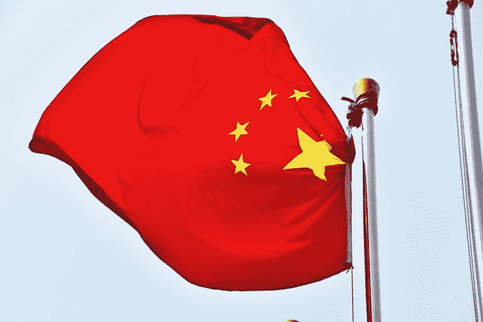

# 市场先生和美国投资者在中国和阿里巴巴——市场疯人院——上下了大赌注

> 原文：<https://medium.datadriveninvestor.com/mr-market-and-american-investors-bet-big-on-china-and-alibaba-market-mad-house-4df4a11e0102?source=collection_archive---------30----------------------->

奇怪的是，当反中国情绪因冠状病毒而增长时，美国投资者却在中国身上下大赌注。

在美国，政治家和知识分子对中国采取强硬态度。例如，美国参议员汤姆·科顿(阿肯色州共和党人)希望禁止中国药品在美国销售。

与此同时，政治学家安德鲁·米赫塔要求“T2”与中国“硬脱钩”。愚蠢的是，美国参议员乔希·霍利(密苏里州共和党人)将提出立法，允许美国公民就冠状病毒起诉中国政府。

相比之下，纽约证券交易所(NYSE)对**阿里巴巴(NYSE: BABA)** 的价格从 2020 年 3 月 16 日的 175.85 美元上涨到 2020 年 4 月 16 日的 211.24 美元，但在 2020 年 4 月 21 日跌至 207.34 美元。因此，随着美国冠状病毒危机失控，这家知名中国公司在纽交所的股价上涨了 35.39 美元。

# 华尔街对美国没有信心吗？

我认为阿里巴巴的股价表明华尔街对美国没有信心。然而，标准普尔 500 指数从 2020 年 3 月 16 日的 2，386.13 美元升至 2020 年 4 月 16 日的 2，797.53 美元，但在 2020 年 4 月 21 日跌至 2，736.56 美元。

因此，华尔街对美国和中国的未来都很乐观。然而，冠状病毒的统计数据讲述了一个不同的故事。2020 年 4 月 21 日，中华人民共和国报告了 82，758 例冠状病毒病例。

相比之下，美国当天报告了 794297 例冠状病毒病例。引人注目的是，2020 年 4 月 21 日，美国报告了 42，564 例冠状病毒死亡，而中国报告了 4，632 例冠状病毒死亡。

 [## 投资区块链前要问的三个简单问题(也是一个困难的问题)|数据…

### 现在是了解区块链的最佳时机。不同货币之间的增长率，比如…

www.datadriveninvestor.com](https://www.datadriveninvestor.com/2020/03/12/three-simple-questions-and-one-difficult-one-to-ask-before-investing-in-a-blockchain/) 

我认为冠状病毒的统计数据证明了看好阿里巴巴控股有限公司的理由。然而，同样的统计数据让人对美国股市的牛市产生了怀疑。

我不得不怀疑市场先生是否在关注疫情。特别是，我不得不怀疑市场先生是否低估了冠状病毒对经济的影响。

# 你应该在中国投资吗？

看空美国和愤世嫉俗的人会想，是否是时候在中国大举投资了。

令人震惊的是，一些经济学家估计美国在 2020 年 4 月 16 日的失业率为 15%。经济学家估计，超过 2100 万美国人因冠状病毒而失业。

此外，许多批评人士声称，美国在减轻冠状病毒的影响方面做得不够。例如，美国主要的疫情救济项目是向大多数美国人发放两笔 1200 美元的款项。

相比之下，英国政府将支付冠状病毒期间雇主保留的员工高达 80%的工资。具体来说，如果雇主继续给雇员发工资，女王陛下政府将支付每月高达 2 500 英镑(3 108.10 美元)的工资；即使他们的企业倒闭，英国广播公司。

因此，英国有保持经济运行的计划，而美国没有。因此，美国可能很快会面临类似上世纪 30 年代大萧条的经济崩溃。因此，看多中国的人看起来聪明，看多美国的人看起来愚蠢。

# 美国会挺过冠状病毒吗？

然而，美国国会的一些议员希望采用英国保障公民工资的计划。

美国参议员乔希·霍利(密苏里州共和党)和美国众议员普拉米拉·贾亚帕尔(华盛顿州民主党)希望国会支付失业工人的工资。贾亚帕尔想比霍利走得更远；她想让山姆大叔为 100，000 美元以下的失业雇主支付 100%的薪水。

相比之下，霍利希望支付工资的 80%，达到他所谓的全国工资中位数。美国人口普查局估计“全国工资中位数”为每年 3.1 万美元或每月 2583.33 美元。

因此，一些美国领导人正在考虑应对冠状病毒所需的重大步骤。不幸的是，美国高层领导人，如唐纳德·特朗普总统(佛罗里达州共和党)、美国众议院议长南希·佩洛西(加利福尼亚州民主党)、民主党总统候选人乔·拜登(特拉华州民主党)和美国参议员米奇·麦康奈尔(肯塔基州共和党)都没有讨论这些计划。

# 美国多头是对的吗？

因此，购买**阿里巴巴**的美国空头可能是明智的。美国可能在心理和政治上没有能力有效应对冠状病毒。

请记住，他们在 2019 年 12 月首次检测到冠状病毒，但直到 2020 年 3 月，美国主要政治领导人都没有讨论过疫情。因此，华盛顿没有人在这个问题上发挥领导作用。相比之下，中国的快速反应似乎遏制了冠状病毒。

与此同时，一些美国[理论家](https://www.theguardian.com/us-news/2020/apr/20/us-protests-lockdown-coronavirus-cases-surge-warning)似乎愿意让美国经济崩溃，让他们的邻居死去，而不是放弃他们的信仰。例如，美国众议员托马斯·马西(肯塔基州共和党)试图推迟对 NPR 冠状病毒救援的快速投票。

此外，美国参议员汤姆·科顿(阿肯色州共和党人)和唐纳德·j·特朗普总统(佛罗里达州共和党人)等民族主义者似乎对攻击中国比对应对冠状病毒更感兴趣。例如，川普试图终止美国对世界卫生组织(世卫组织)的资助。川普正在削减对世卫组织的资助，因为他认为该组织与中国关系过于密切。

因此，美国对冠状病毒的任何反应都可能是缓慢而无效的。鉴于这种潜力，投资中国公司看起来很明智。

# 阿里巴巴是一个好的投资吗？

总体而言，**阿里巴巴控股集团有限公司(NYSE: BABA)** 是一家盈利的公司。

例如，在截至 2019 年 12 月 31 日的季度，阿里巴巴的收入为 231.92 亿美元，毛利润为 110.78 亿美元。澄清一下，这些数字来自冠状病毒之前的最后一个季度。

令人印象深刻的是，2019 年最后一个季度，阿里巴巴的收入增长率为 35.97%，Stockrow。此外，阿里巴巴报告 2019 年 12 月 31 日的季度营业收入为 56.82 亿美元，共同净收入为 75.14 亿美元。

# 阿里巴巴是一家现金充裕的公司

2019 年底，阿里巴巴是一家现金充裕的公司。例如，阿里巴巴报告的运营现金流为 141.68 亿美元；融资现金流为 88.28 亿美元，截至 2019 年 12 月 31 日的期末现金流为 186.31 亿美元。

截至 2019 年 12 月 31 日，阿里巴巴拥有 543.19 亿美元的现金和短期投资。这一数字从 2019 年 9 月 30 日的 356.91 亿美元和 2018 年 12 月 31 日的 303.25 亿美元增长。

# 阿里巴巴是穷人的亚马逊吗？

因此，阿里巴巴积累了大量现金，足以与亚马逊匹敌。为了解释这一点，**亚马逊(NASDAQ: AMZN)** 在 2019 年 12 月 31 日拥有 550.21 亿美元的现金和短期投资。

我认为许多投资者将阿里巴巴视为穷人的亚马逊，因为它有现金。投资者购买阿里巴巴是因为它有着亚马逊的一些特征。例如，Stockrow 亚马逊在 2019 年最后一个季度的收入增长率为 20.8%。

然而，2020 年 4 月 16 日，市场先生为亚马逊支付了每股 2392.58 美元，为阿里巴巴支付了每股 210.94 美元。逢低吸纳的投资者购买阿里巴巴是因为它类似于亚马逊，但其股票价格不到亚马逊股票的 10%。

# 亚马逊与阿里巴巴

**阿里巴巴**和**亚马逊**都是大型电子商务平台。世界第二大经济体中国的阿里巴巴主导着在线市场，而亚马逊在世界最大经济体美国拥有电子商务。

值得注意的是，阿里巴巴在 2019 年第四季度拥有 7.11 亿活跃消费者。这一数字比 2018 年第四季度的 6.36 亿活跃客户有所增长。

2019 年底在美国拥有 1.12 亿活跃用户。*相比之下， *Fortune* Prime 在 2019 年底拥有超过 1 亿的订阅用户。此外，CIRP 声称，2019 年第四季度，65%的美国人订阅了 Prime。*

# 亚马逊和阿里巴巴有什么区别？

我认为亚马逊和阿里巴巴的区别在于，阿里巴巴是直营零售商，而亚马逊专注于平台搭建。因此，阿里巴巴比亚马逊更接近**沃尔玛(纽约证券交易所代码:WMT)** 。

解释一下，阿里巴巴的主要功能是卖东西。相反，亚马逊的主要目标是增长其平台。因此，阿里巴巴是一台销售机器，而亚马逊是一台会员生成器。

因此，阿里巴巴通过卖东西赚钱。相比之下，亚马逊通过向顾客出售商品和提供服务来赚钱。例如，亚马逊网络服务(AWS)在 2019 年创造了 350.26 亿美元的收入，Statista。此外，亚马逊还提供当日送达和流媒体视频等服务。

我认为阿里巴巴的商业模式更适合中国，这个国家拥有庞大的工人阶级和不断壮大的拥有一些现金的中产阶级。亚马逊的商业模式更适合美国，一个工人阶级不断萎缩、中产阶级停滞不前的大国。

有趣的是，阿里巴巴在挖掘印度和非洲国家等发展中国家方面可能处于更有利的地位。因此，阿里巴巴正大举投资印度赌博应用彭博。阿里巴巴正在投资印度次大陆的博彩业，因为彭博估计有 3 亿印度人在网上赌博。

# 阿里巴巴是好股票吗？

因此，对于那些对美国未来持怀疑态度的人来说，我认为**阿里巴巴**是一个不错的投资。解释一下，我认为阿里巴巴可以在美国以外的发展中国家赚钱。

然而，我认为市场先生在 2020 年 4 月 21 日高估了阿里巴巴 207.34 美元。我认为阿里巴巴定价过高，因为它不支付股息。

尽管如此，我认为美国的问题表明所有投资者都需要考虑购买一些中国股票。因此，环境可能会迫使美国投资者在爱国和赚钱之间做出选择。

*[https://files . constant contact . com/150 f 9 af 2201/9f9e 47 b 4-0d 66-4366-ad76-552 AE 3d a4 f 0 . pdf](https://files.constantcontact.com/150f9af2201/9f9e47b4-0d66-4366-ad76-552ae3daa4f0.pdf)

*原载于 2020 年 4 月 21 日 https://marketmadhouse.com**的* [*。*](https://marketmadhouse.com/mr-market-and-american-investors-bet-big-on-china-and-alibaba/)