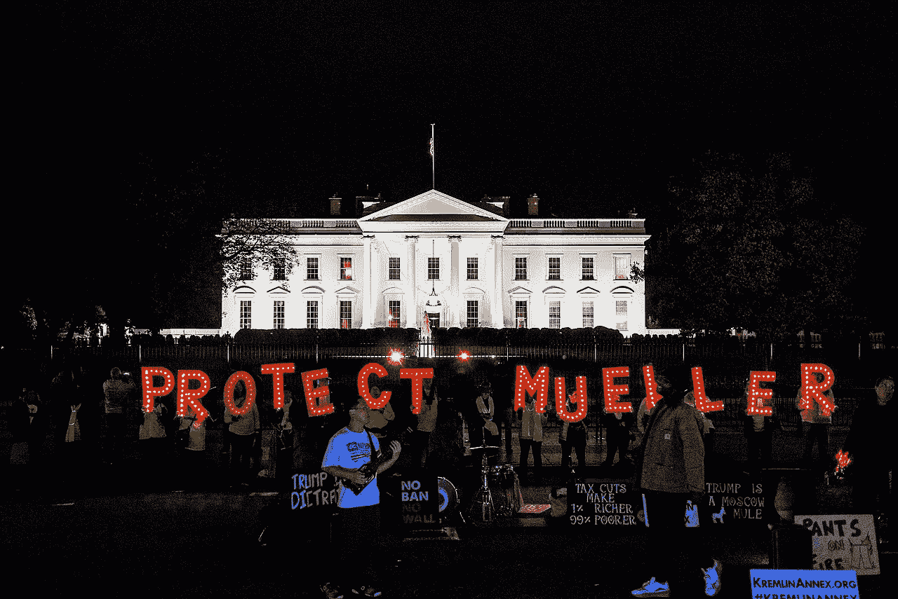

# 穆勒调查回来困扰民主党人

> 原文：<https://medium.datadriveninvestor.com/mueller-investigation-comes-back-to-haunt-democrats-232e79e7fe4e?source=collection_archive---------4----------------------->

穆勒团队的成员在将手机交给司法部之前不小心“擦拭”了手机，这看起来不妙。

A protest called “Nobody is Above the Law”, held on November 8, 2018 and organized by MoveOn. (Photo: [Wikiwand](https://www.wikiwand.com/en/Nobody_Is_Above_the_Law))

美国总统唐纳德·特朗普上周在推特上写道:“必须采取行动！”美国司法部记录显示，前特别顾问罗伯特·穆勒的检察官在通俄调查期间“删除”了他们的手机。

众议院情报委员会(House Intelligence Committee)资深成员、共和党众议员德文·努内斯(Devin Nunes)与特朗普一起呼吁采取行动，称“共和党必须优先考虑这件事——这些人被起诉并被追究责任。”

“所以这里的问题是:有调查吗？因为如果有的话，那可能是妨碍司法公正。但我认为不管这些，这是对联邦记录的破坏。我们不能有一个记录被销毁的司法系统，无论是在联邦一级、州一级还是地方一级。”[努内斯告诉福克斯新闻频道的《周日早间期货》](https://www.foxnews.com/politics/nunes-gop-should-make-sure-mueller-team-is-held-accountable-after-phones-deleted)

 [## 政客和 AI。国家战略能成功吗？数据驱动的投资者

### 政治家们越来越意识到与人工智能相关的技术发展的各种后果

www.datadriveninvestor.com](https://www.datadriveninvestor.com/2020/06/15/politicians-and-ai-can-national-strategies-succeed/) 

财政委员会主席查克·格拉斯利和国土安全委员会主席罗恩·约翰逊也向司法部官员施压，要求调查特别顾问罗伯特·穆勒的团队是否违反了联邦记录保存法。

在一封[写给司法部长威廉·巴尔和联邦调查局局长克里斯托弗·雷](https://www.grassley.senate.gov/news/news-releases/doj-foia-release-members-mueller-team-repeatedly-wiped-phones-watchdog-sought)的信中，参议员格拉斯利质疑穆勒的团队是否参与了“广泛的故意行为”。

“看来特别检察官穆勒的团队可能已经删除了联邦记录，这些记录可能是他们在进行调查和撰写报告时更好地了解决策过程的关键。事实上，在 DOJ 监察长开始调查该部门如何处理交叉火力飓风后，许多官员显然删除了记录。此外，根据这一新信息，删除的次数和原因令人怀疑这是否是一种广泛的故意行为，”格拉斯利在信中写道。

格拉斯利要求 DOJ 向委员会提供与手机相关的记录，包括任何恢复的短信，以及穆勒团队的每个成员对他们的电话数据和记录为何被删除的解释。格拉斯利还询问 DOJ 是否正在调查特别顾问穆勒的雇员是否违反联邦记录保存法的问题，以及该部门是否试图通过司法手段恢复任何被删除的数据。

参议员罗恩·约翰逊要求司法部监察长迈克尔·霍罗威兹调查这些新文件，并确定是否存在任何不当行为。

“这些报告令人不安，并引发了对记录保留和透明度的担忧，”约翰逊在给霍洛维茨的信中写道。“因此，我恭敬地请求你的办公室对此事展开调查，以确定信息被删除的内容、原因和方式，是否存在任何不当行为，以及这些设备属于谁。”

在这位爱荷华州参议员的信发出的前一天，根据《信息自由法案》( FOIA)发布的文件显示，在司法部监察长检查之前，属于特别检察官罗伯特·穆勒团队成员的二十多部手机的数据被“抹去”。

DOJ 的记录显示，在 DOJ 监察长办公室审查这些设备之前，由于忘记密码、不可修复的屏幕损坏、设备丢失、故意删除或其他原因，[据报道](https://www.foxnews.com/politics/doj-records-mueller-team-wiped-phones)。

特别法律顾问负责人安德鲁·魏斯曼(Andrew Weissmann)在 2018 年 3 月输入错误密码太多次后，“不小心擦了”他的 iPhone 两次。文件显示律师格雷格·安德烈斯的手机也因为忘记密码而被删除了。

文件显示，律师詹姆斯·夸尔斯的手机在没有他干预的情况下“自行清除”,穆勒的副手凯尔·弗里尼和拉什·阿特金森的手机在多次输入错误密码后被意外清除。

记录还显示，联邦调查局律师丽莎·佩奇(Lisa Page)的一部手机——此前她曾与联邦调查局特工彼得·斯特佐克(Peter Strzok)交换反特朗普的短信——在监察长办公室收到它时，被恢复到工厂设置。特朗普和共和党人指出，这些短信是该局反特朗普偏见的证据。

这些文件是在保守派监督组织司法观察提起诉讼后公布的。关于穆勒的调查报告没有发现特朗普竞选团队和俄罗斯官员勾结影响选举的证据，但它确实声称克里姆林宫“以全面和系统的方式干预了 2016 年总统选举”

不幸的是，在一个充满争议的选举年，这些披露支持了特朗普的说法，即穆勒调查是出于政治动机和毫无根据的。一篇关于这种销毁证据的文章，不管它可能是无辜的，都出现在今天的《执法》杂志上。当许多蓝领民主党人——包括警察在内的一群人——可能在乔·拜登身上摇摆不定的时候，这不是一个好兆头。

在左翼高度不信任执法的时候，这些[联邦执法官员销毁或管理不当他们活动的内部记录](https://www.politico.com/news/2020/09/11/johnson-ig-wiped-mueller-team-phones-412757)的事实也不太可能增强投票给民主党人的信心。

任何人都不能凌驾于法律之上——即使是法律的执行者——的观念以及对执法透明度的坚持已经成为左派的标志。有鉴于此，民主党 2018 年的准救世主罗伯特·穆勒成了 2020 年的竞选包袱。

(特约记者阿莱格拉·诺卡伊)(特约撰稿人布鲁克·贝尔)

**访问专家视图—** [**订阅 DDI 英特尔**](https://datadriveninvestor.com/ddi-intel)