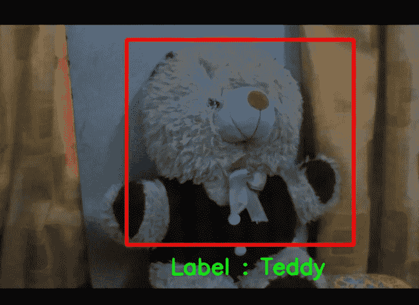

# 教学机中的多类图像分类及其 OpenCV Python 实时检测

> 原文：<https://medium.datadriveninvestor.com/multi-class-image-classification-in-teachable-machine-and-its-real-time-detection-with-opencv-282a1409006f?source=collection_archive---------2----------------------->

ML algorithm classifies the object(here Teddy 🧸)

在这个博客中，我们可以看到如何在教学机器上进行多类图像分类，以及如何用 OpenCV Python 进行实时检测。

首先去[可教机](https://teachablemachine.withgoogle.com/train)选择一个新的图像项目。根据需要在各种类别中添加图像样本，并选择训练模型。现在，使用预览功能来验证您的模型是否准确。选择导出模型→选择张量流。将模型转换类型检查为 Keras，并将模型下载到您的本地计算机中。下载一个名为`**converted_keras**`的 zip 文件。将文件内容解压缩到工作目录中。

工作目录现在包含`**labels.txt**`(包含我们拥有的班级的信息)和`**keras_model.h5**` (可教机器在 tensorflow 中训练的 ML 模型)。

 [## 如何用 Python |数据驱动投资者构建 Twitter 抓取应用

### 每秒发出约 6000 条推文，每天发布 5 亿条推文，普通人甚至不能…

www.datadriveninvestor.com](https://www.datadriveninvestor.com/2020/12/01/how-to-build-a-twitter-scraping-app-with-python/) 

现在，在工作目录中创建一个`**requirements.txt**`文件，包含以下内容来安装所需的依赖项。

requirements.txt

我们有在`**labels.txt**`分类的标签的名字。下面的函数`**gen_labels()**`生成一个字典，其中包含标签名称作为其值，对应的数字(由 ML 模型定义)作为键。

process_labels.py

下面的 python 文件`**main.py**` 包含由可示教机器和 OpenCV Python 训练的模型的集成，以实现实时检测。以下文件还包含来自[官方可示教机器 Tensorflow Keras 代码片段](https://github.com/googlecreativelab/teachablemachine-community/blob/master/snippets/markdown/image/tensorflow/keras.md)的代码行。

main.py

因此，我们成功地建立了我们的实时图像分类器。我希望这篇博客给你提供了一些价值。完整的代码可以在 GitHub 中找到。如果你觉得有用，就给它一个 star✨奖吧。

 [## harikrishnan 6336/图像分类器

### 一个模板的任何图像分类问题与教学机和它的实时检测与 OpenCV 在…

github.com](https://github.com/Harikrishnan6336/Image_Classifier) 

## 访问专家视图— [订阅 DDI 英特尔](https://datadriveninvestor.com/ddi-intel)