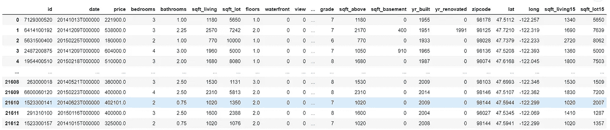
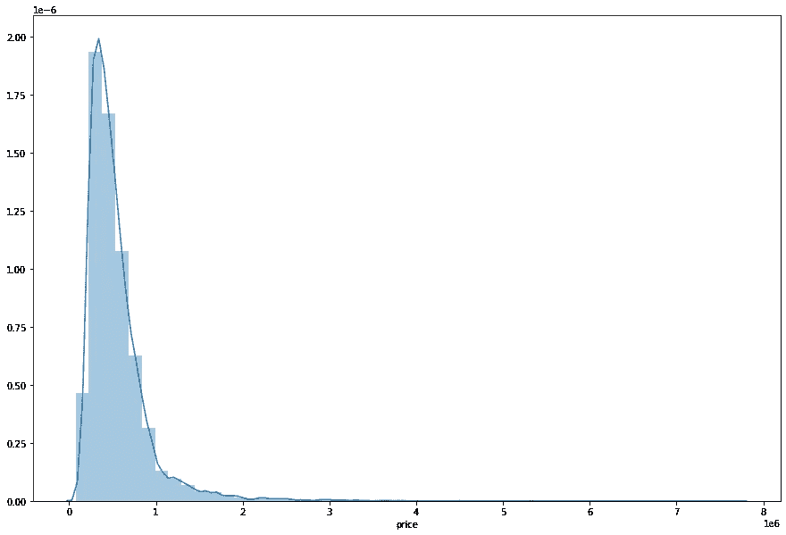
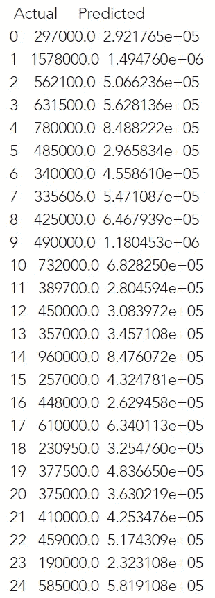
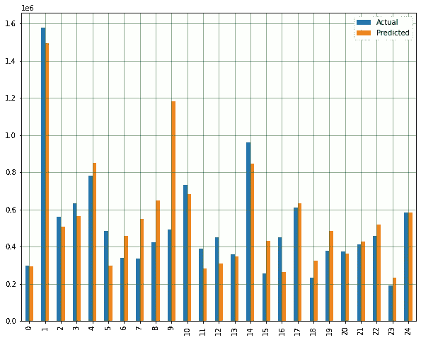

# 多变量线性回归:python 的实用方法

> 原文：<https://medium.datadriveninvestor.com/multivariable-linear-regression-a-practical-approach-with-python-f01f4e302221?source=collection_archive---------6----------------------->

在我之前的博客里，你可以了解到什么是线性回归，线性回归有多少种类型。点击[这里](https://medium.com/@mistrynirav123/linear-regression-a-practical-approach-with-python-e3f676361e07)阅读博客。我们将看到如何实现**多变量线性回归**。现在我们用一个简单的数据集来寻找多元变量之间的线性回归。你可以在给定的[链接](https://www.kaggle.com/harlfoxem/housesalesprediction)上找到数据集。



这是一个数据集，其中不同的变量代表可能影响房价预测的不同参数。

我们将首先使用 panda 加载 python 中的数据集，然后将数据绘制成散点图。然后我们将变量应用到 X 轴和 Y 轴。然后我们将从 scikit learn 导入线性回归模型。之后，我们会找到预测值和一个误差值。最后一步是找到线的截距和系数。

```
import pandas as pd  
import numpy as np  
import matplotlib.pyplot as plt  
import seaborn as seabornInstance 
from sklearn.model_selection import train_test_split 
from sklearn.linear_model import LinearRegression
from sklearn import metrics
%matplotlib inline
```

使用熊猫读取数据集。

```
dataset = pd.read_csv('../input/housesalesprediction/kc_house_data.csv')
dataset
```

现在我们将在每一列中找到空值。

```
dataset.isnull().any()
```

如果有任何空列，我们将使用 **ffill** 方法填充该列或单元格。

```
dataset = dataset.fillna(method='ffill')
```

现在我们将变量给 X 和 Y 轴。

```
X = dataset[['bedrooms', 'bathrooms', 'sqft_living', 'sqft_lot', 'floors', 'waterfront', 'view', 'condition', 'grade', 'sqft_above','sqft_basement','yr_built','yr_renovated','sqft_living15','sqft_lot15']].values
y = dataset['price'].values
```

在这里，如果我们对多个数据使用散点图，我们将有多个图形。

因此，这里我们将使用 distplot 可视化数据集的分布。

```
plt.figure(figsize=(15,10))
plt.tight_layout()
seabornInstance.distplot(dataset['price'])
```



现在我们将训练数据集。

```
X_train, X_test, y_train, y_test = train_test_split(X, y, test_size=0.2, random_state=0)
```

对定型数据集应用线性回归。

```
regressor = LinearRegression()  
regressor.fit(X_train, y_train)
```

**输出:**线性回归()

在这个定型数据集中，我们将找到 Y 轴的价格预测值。

```
y_pred = regressor.predict(X_test)
df = pd.DataFrame({'Actual': y_test, 'Predicted': y_pred})
df1 = df.head(25)
print(df1)
```

**输出:**



现在我们将绘制实际值与预测值的条形图。

```
df1.plot(kind='bar',figsize=(10,8))
plt.grid(which='major', linestyle='-', linewidth='0.5', color='green')
plt.grid(which='minor', linestyle=':', linewidth='0.5', color='black')
plt.show()
```



在这里，我们将找到误差，以找出模型预测值与实际值之间的差异。

```
print('Mean Absolute Error:', metrics.mean_absolute_error(y_test, y_pred))  
print('Mean Squared Error:', metrics.mean_squared_error(y_test, y_pred))  
print('Root Mean Squared Error:', np.sqrt(metrics.mean_squared_error(y_test, y_pred)))
```

**输出:**

平均绝对误差:13149575807
均方误差:4214957504.036904
均方根误差:20005

*原载于 2020 年 7 月 30 日*[*https://www.numpyninja.com*](https://www.numpyninja.com/post/multivariable-linear-regression-a-practical-approach-with-python)T22。