# 多元线性回归…还有？

> 原文：<https://medium.datadriveninvestor.com/multivariate-linear-regression-theres-more-2014d06c1f0a?source=collection_archive---------17----------------------->

嘿读者们！这是我中观趋势的延续——理解机器学习背后的理论/数学。由于我已经开始关注这个话题，我将写一些描述我的旅程的文章，请关注更多内容。现在，回到我的文章！

在之前的一篇文章中，我已经介绍了一元线性回归背后的数学原理以及用 Python 实现的 T2。现在你可能在看多元线性回归，想“好吧，我的脑子都要炸了”。虽然我们将建立在以前的概念上，但我向你保证这个主题比你想象的要容易理解得多。索赔有我的退款保证做后盾！(懂了吗？这篇文章是免费的😉)

在我们陷入疯狂之前，我将快速浏览一些背景知识。输入:**向量和矩阵**！(如果你只是为了解释，从**开始更新方程式**

# 数组

如果你以前写过代码，你可能熟悉一种叫做**数组**的数据类型。本质上，它是一种保存相同类型元素的数据类型，可以使用元素的索引自由访问这些元素。这是一个简单的图表:

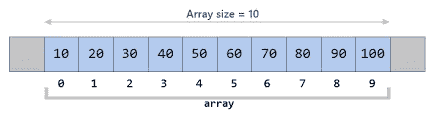

关于**数组**有一点很酷——它们可以相互嵌套。你可以有一维，二维，三维，一直到一个 **n 维数组**(前提是你的电脑能处理这样的命令)。同样，这些 n 维数组中的任何元素都可以通过适当的一系列索引来访问。以下是前三个:

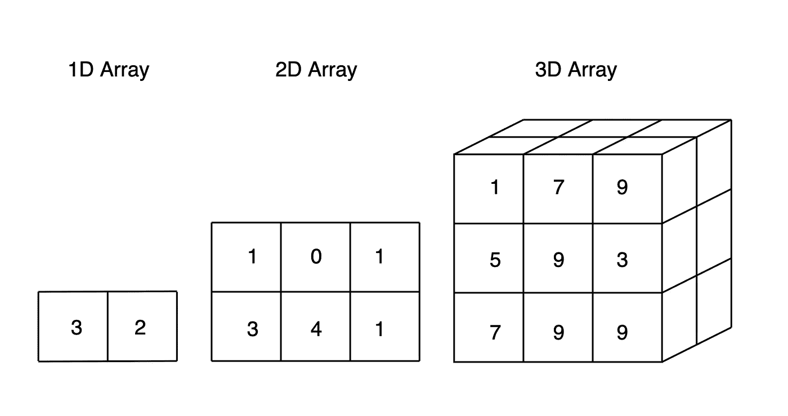

# 向量和矩阵

在机器学习方面，向量和矩阵都是数组，但它们有一个非常重要的区别。向量是任何**列/行**，而矩阵是任何**矩形阵列**。我举一个具体的例子:

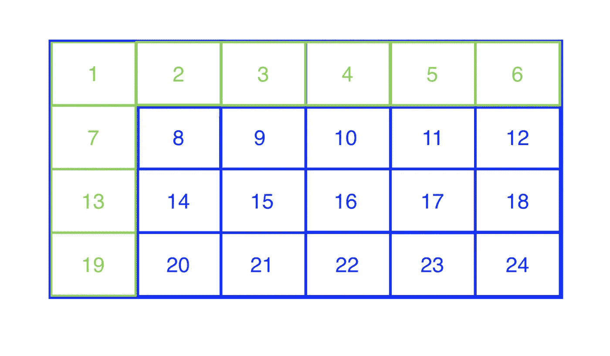

整个 4x6 矩形是一个矩阵，而一行(1，2，3，4，5，6)或一列(1，7，13，19)是一个向量。我记得是这样的:一个维数为 **"1"** 的数组是一个向量，一个维数为**两个数****不是" 1"** 的数组是一个矩阵。

# 向量和矩阵符号

在数组中，我们有一个简单的方法来处理每个元素。但是这在向量/矩阵中是如何工作的呢？向量/矩阵中保存的每个值被称为一个“**条目**”。引用一个条目可以通过下面的符号来完成:(矩阵名)(行，列)。让我们将刚才看到的矩阵命名为 a。要访问值“14”，我们将使用 A₃₂.

# 矩阵运算

既然我们已经熟悉了向量和矩阵的实际内容以及它们所使用的符号，我们就可以开始处理它们的值了。我将介绍这些操作的基础知识，但是由于它们不是本文的主题，我将链接一些额外的资源来更好地解释这些操作是如何工作的。

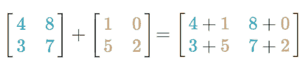

Each entry in the same position is added together

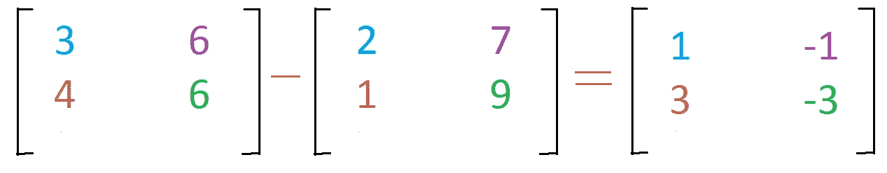

Similarly, entries in the same positions are subtracted

要将两个矩阵相加，它们需要有相同的维数。请注意我们是如何添加两个大小为 2x2 的矩阵的。具有相同位置的每个条目被加在一起以形成另一个值矩阵。减法和加法的工作原理是一样的；减去具有相同位置的条目。它与向量的工作方式相同，但是向量必须有相同的维数。

有了矩阵，我们还可以执行称为标量乘法和除法的运算。这意味着我们可以乘以或除以一个数字:

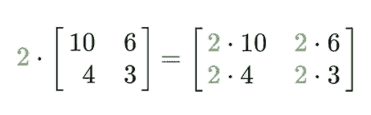

Hm…seems pretty straightforward to me!

不像加法和减法，我们可以乘或除一个矩阵和一个向量。这里有一个例子:

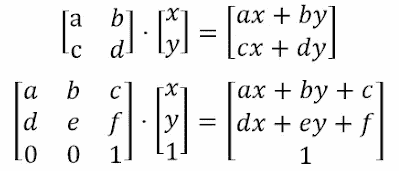

在我们执行这个操作之前，我们必须先看看**是否**可行。规则如下:矩阵中的列数必须等于向量中的条目数。在一个更加数学化的定义中，在一个具有 **m** 行和 **n** 列的 **m** x **n** 矩阵中，向量必须是一个具有 **n** 行的 **n** x1 矩阵。如果我们的矩阵和向量满足这些条件，我们可以继续。

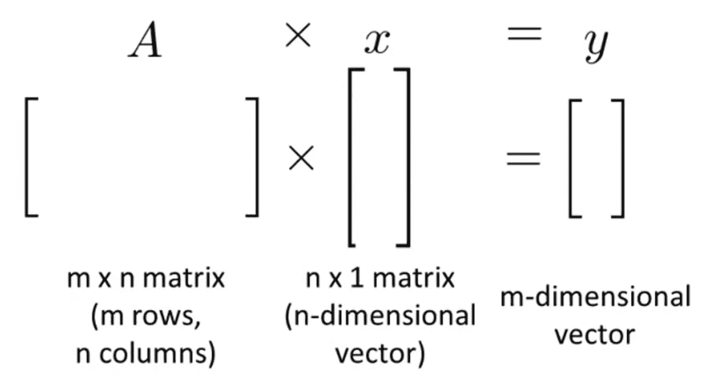

Visual Representation of Matrix and Vector multiplication, [Andrew Ng](https://www.youtube.com/watch?v=gPegoVYp64w)

为了使操作更简单，从矩阵中截出一行。从左到右，矩阵选中行的**第一项**将乘以向量的**第一项**(**a* x = ax**)。然后将矩阵同一行的**第二项**乘以向量的**第二项**(**b * x = bx**)。这种模式一直持续到矩阵的一行中的所有元素和向量中的所有元素相乘。同一行中相乘的所有值然后被**相加在一起** ( **ax + by** )。这种情况一直持续到矩阵的每一行都完成了这个过程。

那么，矩阵之间的乘法和除法呢？在我们回答这个问题之前，我们需要看看是否有可能执行这个操作。

规则如下，第一个矩阵的列数必须等于第二个矩阵的行数。一个更数学的定义是在一个有着 m 行和 t 列的矩阵中，我们需要把它乘以一个矩阵。如果满足了这些条件，我们就可以继续了。

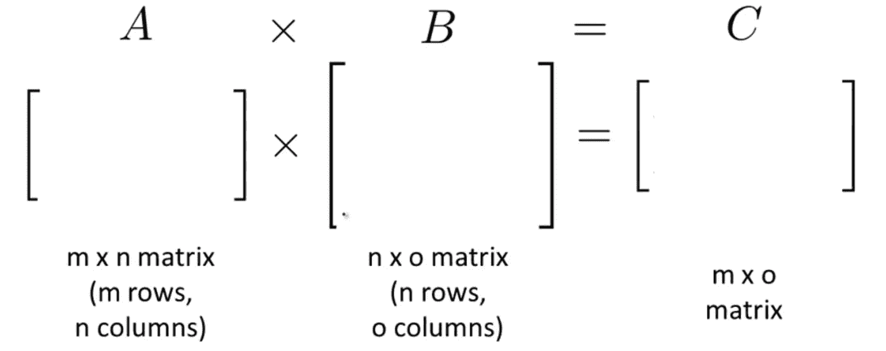

Visual Representation of multiplication between matrices, [Andrew Ng](https://www.youtube.com/watch?v=_lrHXJRukMw)

为了回答我们如何乘或除矩阵的问题，我们将应用相同的逻辑，但是，我们必须首先将其中一个矩阵分割成**个单独的向量**。

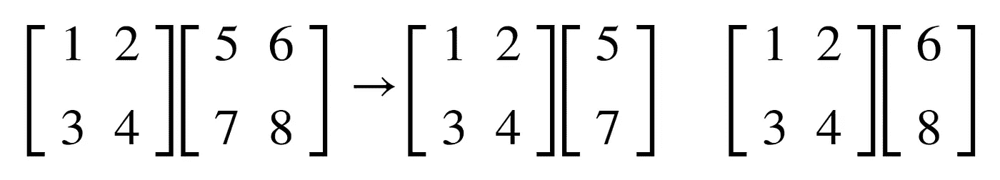

一旦我们有了两对矩阵和向量的乘法运算，我们就可以进行同样的运算来求出结果矩阵的值。找到这些值后，我们只需将它们插回构成矩阵。

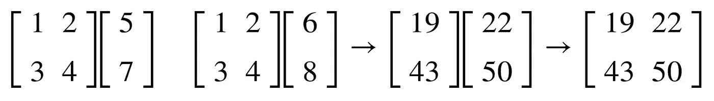

如果我们要分开，同样的步骤也适用。通过将两个值相除来替换我们将两个值相乘的位置。好了，现在我们完成了数学复习，我们需要继续这节课。

 [## 机器学习和人工智能如何改变电子商务的面貌？|数据驱动…

### 电子商务开发公司，现在，整合先进的客户体验到一个新的水平…

www.datadriveninvestor.com](https://www.datadriveninvestor.com/2020/11/19/how-machine-learning-and-artificial-intelligence-changing-the-face-of-ecommerce/) 

# 更新方程式

在关于一元线性回归的文章中，我们使用了等式:hᶿ(𝑥) = θ₀ + θ₁𝑥.这个等式假设我们只对寻找两个变量之间的关系感兴趣——但是如果你有超过 2，3，4，1，000，000 个变量呢？事实上，事件很少依赖于几个变量，为了容纳我们可以访问的大量数据，我们需要更新我们的方程，以根据需要纳入尽可能多的参数。

我之前提到的大量数据被称为**特性**。我们的方程需要考虑各种相关特征，因为它们都会影响线性回归的斜率。这是更新后的**假设方程**:

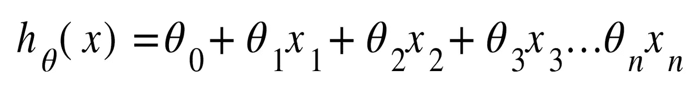

每个 **x** 代表一个独立特征的数据。就像一元线性回归一样，我们试图找出不同的 thetas，以便我们可以在不同的数据集中精确地拟合一条线。每个参数值决定了特定特征对结果的影响程度。让我举一个具体的例子来说明这一点:

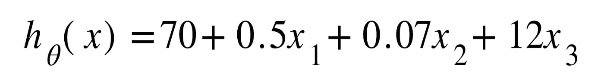

另外，为了便于记记，让我们假设𝒳₀ = 1。这允许我们对θ₀进行运算，否则，我们将有不同的矩阵维数，这不允许我们进行矩阵运算。请注意，与 X₂要素相比，X₃要素的变化对成本函数结果的影响更大。

我们实际上可以把假设方程简化为一个简单的表达式，把所有的θ和 x 值想象成两个不同的矩阵。但是在我介绍这个新方程之前，我将快速浏览一下矩阵的转置。转置所做的只是交换矩阵的列和行，使得维数适合于执行乘法运算。考虑这个概念的一个更简单的方法是，如果你有一个条目 A₂₃，在转置矩阵 a 之后，那个条目值将变成 A₃₂.

现在，让我介绍更新的成本函数或均方误差函数，它包含所有新的可能参数:

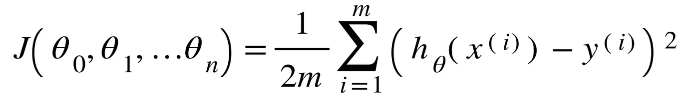

这里没有太多解释，除了这个函数得出每个数据点和我们预测线上的数据点之间的平均垂直距离。这个函数和一元线性回归函数唯一不同的是参数的数量和我们的假设函数的修改，以适应新的参数。另外，记住我们的 Xⁱ是一个包含我们的特征的**向量**，而不仅仅是一个值。

自然，成本函数中还包含梯度下降算法，用于调整所有不同的参数，以最小化误差:

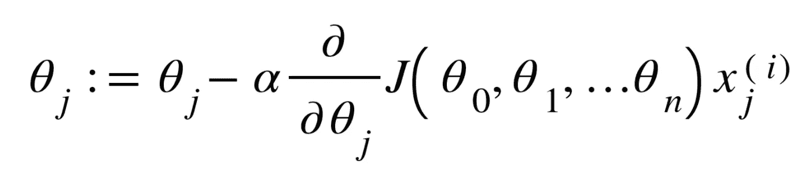

至于成本函数，没有任何重大的新修改。唯一的区别是导致成本函数稍微改变的参数的数量，以及在末端乘以 x 特征，这将代替特征矩阵的特定行的条目。(如果你不知道这个函数是做什么的，请参考我在顶部链接的关于一元线性回归的文章，我已经确保简单解释了！)

# 特征缩放

在实际应用多元线性回归时，会出现一个有趣的现象-对于不同的特征，您往往会得到各种不同的范围。这些变化的范围会使梯度下降算法的收敛效率更低。然而，通过应用**特征缩放**，我们可以解决这个问题。特征缩放的目标是获得-1 和 1 范围附近的所有特征值。通过将各种操作应用于特性的值，将极大地加速梯度下降过程。

有些人可能还会应用**均值归一化**，它基本上使用以下形式来满足:-0.5 ≤ x ≤ 0.5，其中 x 是我们的特征值。这是通过减去该特征的条目值和平均值，然后将结果除以该特征的最大条目来完成的。

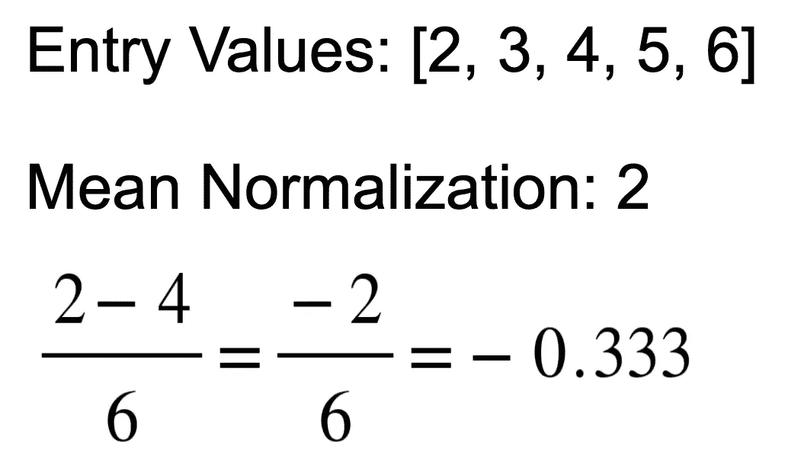

# 学习率

调整学习率时可能会出现各种问题。如果你设置的学习率太大，你可能会超过正确的值，最终偏离最小值。但是，如果您将学习率设置得太小，您的算法将需要更长的时间来找到最小参数值。简而言之，当你迭代你的输入值时，确保你的学习率导致成本函数的逐渐减少。(如果学习率仍然令人困惑，请参考我关于单变量梯度下降的文章，它涵盖了这个主题和我在文章中提到的其他主题)

# 正态方程

正态方程是另一种可用于线性回归的算法，它明确地告诉您最小成本的参数。

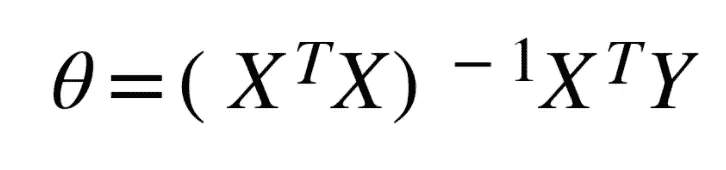

让我举一个更具体的例子，假设我有一个 2x2 的矩阵，叫做 X，里面填充了一些数字，还有一个向量 Y，里面有两个数字。我会计算矩阵 X 和它的转置的乘积。然后，我将取该乘积的倒数，并将其乘以向量 Y 和矩阵 X 的转置的乘积。得到的向量将包含一个方程的参数值，该方程在使用来自矩阵 X 和向量 Y 的数据绘制时将产生最低的成本。梯度下降将一次又一次地迭代以找到参数值，而普通方程只需一次即可完成。

现在你可能会想，当我们可以使用正规方程时，为什么我还要费心解释梯度下降。嗯……两种方法都有利弊。当使用正态方程时，你不需要选择学习率(⍺),这可能会有发散的风险，你也不需要迭代。然而，如果你有大量的数据，梯度下降成为更好的选择。因为您需要计算(X^T * X)^-1 值)，所以运行此计算的成本大约为 O(n)。(这个符号也被称为**大 O 符号**，查看[这个视频](https://www.youtube.com/watch?v=v4cd1O4zkGw)以获得澄清)无论如何，如果你有 10，000 个特征，这意味着用大约 10 个条目进行计算——即使以现代标准来看，这也是一个昂贵的计算。

好了，现在你知道了——多元线性回归。这当然是要涵盖的大量材料，我强烈建议您通读这篇文章，并探索我所建议的链接，以便更牢固地掌握不同的概念。如果你一直在关注我的系列文章，我可以自豪地说，当任何人提到机器学习时，你听起来会更有知识——相信我，这比你想象的要经常发生😁。我希望你喜欢这篇文章，以后的文章请关注我的账号！

关于我的更多信息——我的名字叫 Rohan，我是一名 16 岁的高中生，正在学习颠覆性技术，我选择从人工智能开始。要联系我，请通过我的[电子邮件](http://rohjag18@gmail.com/)或我的 [LinkedIn](https://www.linkedin.com/in/rohan-jagtap-1a07151b0/) 联系我。我非常乐意提供任何见解或了解你可能有的见解。另外，如果你能加入我的[月刊](https://rohanjagtap.substack.com/p/coming-soon?r=baakt&utm_campaign=post&utm_medium=web&utm_source=copy)，我将不胜感激。直到下一篇文章👋！

**访问专家视图—** [**订阅 DDI 英特尔**](https://datadriveninvestor.com/ddi-intel)