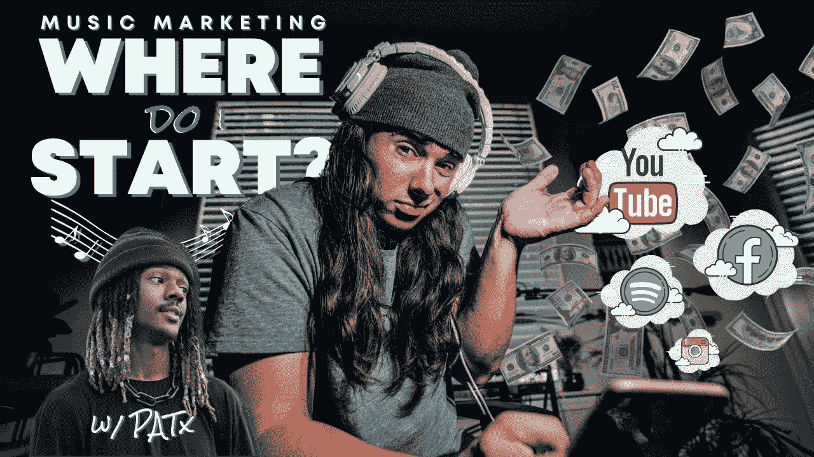

# 2021 年的音乐营销(独立艺术家细分)

> 原文：<https://medium.datadriveninvestor.com/music-marketing-in-2021-a-breakdown-for-indie-artists-w-patx-69cf4ef32427?source=collection_archive---------1----------------------->

在音乐行业待了大约 10 年，我尝试了一种海市蜃楼的营销策略，试图在这个世界上取得成功。

我看到不同的社交媒体和广告浪潮发生了巨大的变化。我从 MySpace 的信息人员开始，然后转向分发传单，联系博客等，这些天来，我一直在研究不断变化的广告机会，从脸书广告，播放列表，IG 推广，YouTube 广告，只是利用一般的内容/病毒。

我可以继续谈论这些年来所有的成功和失败，但今天，我想集中在一些策略上，这些策略可能对说唱歌手和音乐人在 2021 年真正有帮助。我坐下来和我的好朋友兼艺术家伙伴 PATx 讨论音乐营销的总体情况。我选择 Pat 是因为在过去的 4 年里，我看着他缓慢而稳定地成长，在稳定的压力下，他掌握了各种营销策略的脉搏。我们都用自己不断的努力激励着对方，所以是时候坐下来聊聊我们一直在做的一些事情了。我一直在纠结到底该如何打破这种总体概述。我不能告诉你所有要做的事情，但我希望这能成为一种资源，激励你采取行动，为自己的职业生涯打下基础，如果你还没有这样做的话。

**主要建议:在 2021 年，不要把你所有的音乐预算都花在流媒体和过度宣传、高风险的门面上，而是持续建立一个追随者和/或电子邮件的基础，通过粉丝搜索广告活动展示你在市场中的利基。好吧，话虽如此，你是怎么做到的？**

嗯，这篇文章不是要和你一步一步来的。相反，我给你一个选项的分解，稍后，我们会得到具体的。首先，我想谈谈这些年来帮助我了解营销是如何运作的一些事情。

# 音乐特定网站:

[聪明的说唱歌手](https://www.smartrapper.com/)

*   由说唱歌手 Rob Level 创建的 Smart Rapper 利用他们的网站和 YouTube 向崭露头角的说唱歌手教授大量的东西。里面有很多珠宝。如果你是一个有经验的艺术家，你可能要深入挖掘，但内容还在！

[企业家](https://www.youtube.com/channel/UC-4GdLK9HLyf6watiUMZX7Q)

*   我在 2019 年发现了 Indepreneur，但直到 2020 年隔离期间才投资他们的课程。我个人甚至没有机会去上我想上的所有课程，但是他们有一些非常好的东西。对基础建设的关注和他们教授的一切都是超级现实的。他们的创始人为启动这个项目所做的工作，以及他如何努力建设公司并同时做音乐，给了我极大的启发。他们还有一个播客，如果你花时间去听的话会很有帮助！

# 营销大师/ YouTube 大学:

[加里·维纳查克](https://www.garyvaynerchuk.com/)

*   这家伙会在很多方面启发你。谈动力。他的内容可以教会你很多关于商业和营销的知识。我花了很多天听和读他的东西。

通过各种直运营销商研究脸书广告

*   我在 2020 年也涉足了直运，实际上赚了一些钱。在花了一些时间后，我意识到我对我卖的产品感觉不好。所以我停下来了。但让我感觉良好的是我长期以来学到的疯狂的脸书广告课程。我变得非常擅长在脸书做广告。我真的很兴奋能够实施我在 2021 年学到的一些策略。我查过的一些渠道的例子有:斯科特希尔斯，加布里埃尔圣日耳曼，Verum Ecom 等。

YouTube 大学(不胜枚举)

*   从上面弹开。老实说，你可以在 YouTube 上学到任何你需要的东西。如果你现在不能，很快就会有人来填补空缺。利用这些免费资源。

# 其他资源:

[托尼登](https://www.toneden.io/)

*   帕特在上面的视频中谈到了这一点。检查时间戳。

[ClickUp](https://app.clickup.com/)

*   我使用 ClickUp 来组织我所有的内容。它救了我的命。

[坎瓦](https://www.canva.com/)

*   我在 photoshop 上还过得去，但是每天还是上 Canva，一天好几次。在照片和图形编辑方面，Canva 是一个强大的公司。将来我会在上面创建更多的资源，但是现在，我只看到了免费的版本。有趣的事实:缩略图是由 Canva。

如果你想成为一名成功的独立艺术家，我强烈推荐你查阅或者学习我刚才提到的所有东西。

# 不太出名的艺术家靠音乐/喧嚣生活的好例子:

如果你喜欢他们，不仅要支持他们，还要看看其他独立艺术家是如何独自生存和茁壮成长的，这很有帮助。

**所以说了这么多，这里是我们目前正在使用的或者在过去一年左右已经尝试过的，并且发现对我们的音乐事业有益的途径。尽管我已经在市场营销上投入了将近 10，000 个小时，但我不能说我是这些方面的专家。所以请对此有所保留。**

# **营销方式:**

*   **PlaylistBooker (Spotify 播放列表)**
*   **提交中心**
*   **IG 页面**
*   **脸书广告**
*   **谷歌广告**
*   **YouTube 广告**
*   **内容创作**
*   **播客**
*   **YouTube 频道**

**现在，作为总结，这是 PATx 和 Cole Connor 计划在 2021 年关注的问题。**

**科尔:“不断创造各种各样的内容，建立五位数的营销预算，发起粉丝寻找活动，开始重建受众。”**

****PATx** :“衡量我的合法性、影响力、数字、盈利能力和幸福感。”**

**要学的东西很多，要做的事情甚至更多，但请记住，就像任何职业一样，这是一个一生的旅程，一路上有起有落，有起有落，有调整。你能行的。享受旅程吧。我们只有一次生命。不后悔。**

**我将在未来详细介绍这些，但同时，如果你觉得这有帮助，请发表评论。让我知道我们下一步应该投入什么！**