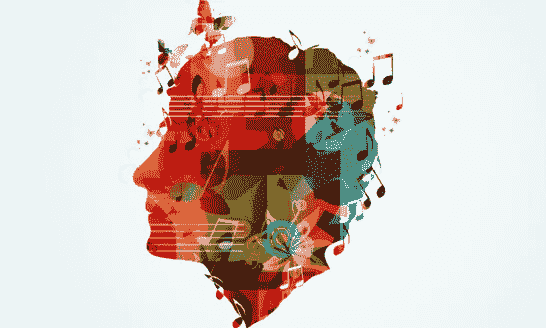

# 你听的音乐类型会影响你的思维方式

> 原文：<https://medium.datadriveninvestor.com/music-the-type-you-listen-to-decides-your-life-e621f85a2cb9?source=collection_archive---------10----------------------->

## 也可能是你渴望的生活的反映。

Image by GlamourTreat

音乐以一种非常有趣的方式为你工作。大约两周前，我在部队操作一台重型机器，我注意到自己处于一种沮丧、好斗的情绪中。

我不知道为什么会有这种感觉。就在我开始工作的前几分钟，我的心情真的非常开心！

然后我突然想到。我一直在听我在 Spotify 上找到的一个名为“他妈的问题”的播放列表，我正在听的音乐让我火上浇油，让我想打一个沙袋，像洛基或信条。

 [## 良好的生活是习惯的形成|数据驱动的投资者

### 过度思考是过度紧张。仅仅几个简单的习惯就会在一天中产生巨大的影响。那是…

www.datadriveninvestor.com](https://www.datadriveninvestor.com/2020/01/17/a-good-life-is-habit-forming/) 

我接下来做的是滚动浏览我的个人 Spotify 播放列表，并选择了一个我称之为“电子家庭”的列表。

## 这个播放列表包含了所有我最喜欢的 EDM 歌曲，在过去的四年里，我越来越喜欢这些歌曲。这改变了我一整天的生活，因为我又变得乐观和快乐了。

《积极心理学杂志》2013 年的一项研究发现，听乐观音乐的人可以在短短两周内改善情绪，提高幸福感。

# **电火花**

对我来说，电子音乐也叫“EDM ”,它带我去了一个充满快乐、友谊和自信的地方。它乐观积极的能量给我带来了灵感。这种风格的流派在短短几分钟内提升了我的情绪。时常，我会回忆起我去过的音乐节和我创造的美好回忆。

# **意识**

为了一个更好的术语，我会说我是“音乐意识”。和所有类型的消费一样:食物、媒体和产品…音乐也非常相似。音乐意识是当一个人明白他们允许什么类型的音乐进入他们的大脑，以及它会如何影响他们。

在一份新闻稿中，该研究的主要作者尤娜·费格森指出，幸福与更健康、更高收入和更大的关系满意度联系在一起”(*健康热线*)。

音乐可以为你工作，成为你的良药，如果你允许的话，它也可以成为你的敌人。

# **凹陷**

例如，当我感到沮丧的时候，我会经常沉浸在播放列表“F E E L S”或“Sad Boi Hours”中的一些悲伤歌曲中。

我试着承认那天晚上我的感受，只是感到悲伤。我很少尝试假装，直到我做到了，因为这可能会导致很多不满。

我的博美犬“宝贝女儿”上个月去世了，这深深地伤害了我。在她健康每况愈下的时候，我听着悲伤的歌曲，当我真正失去她的悲伤接近尾声时，我感到轻松了。

知道她过着充实的生活，我们每天都用爱珍惜她，我感到很安心。

# **创意**

对于那些摄影师、艺术家或视频制作者，我强烈建议你们去听 EDM。我强烈推荐的艺术家包括奥德萨、圣赫萝和马什梅洛。

谈论进入心流。这些艺术家发出的节拍、歌词和整体声音推动我进行创作。音乐是我 YouTube、写作和摄影之旅的关键解毒剂。

我希望更多的人通过测试来探索他们的个性，如迈尔斯-布里格斯测试或九型人格测验，以更好地了解他们是谁。

九型人格可以让你找到自己的性格类型(1-9 之间)，然后在 Spotify 上听一段与你最匹配的号码相关的播放列表。

如果你觉得自己一成不变，试着考虑你正在听的音乐，如果你觉得它不能激励你，调整火力。

> “音乐是一种不用语言表达的语言。它用情感说话”。—基思·理查兹

我的 Spotify 账号可以在这里找到:[**https://open.spotify.com/user/mendiol**](https://www.youtube.com/redirect?redir_token=uVsOvzpydGu7MBs7qGM71KyRUWl8MTU2OTk2OTc4MkAxNTY5ODgzMzgy&event=video_description&v=JzxgWDNZq_8&q=https%3A%2F%2Fopen.spotify.com%2Fuser%2Fmendiola1829%3Fsi%3D67ZwUL4vRpW8de_2IQtJIA)**a 1829**