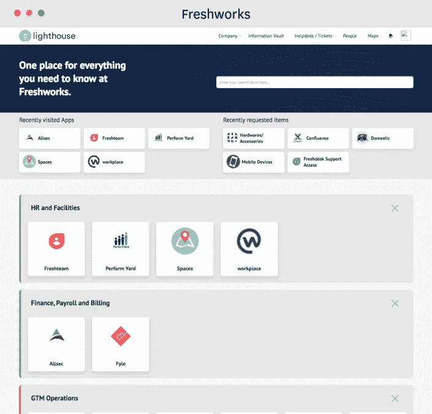

# 维护远程工作文化和战略的必备服务目录—以下是入门指南

> 原文：<https://medium.datadriveninvestor.com/must-have-service-catalogs-to-maintain-remote-working-culture-and-strategy-heres-how-to-get-f99902a5e55?source=collection_archive---------13----------------------->

现在是转向企业数字市场的最佳时机。

[来源](https://unsplash.com/photos/goFBjlQiZFU)

由于有如此多的专业人员在家工作，集中的市场让您的员工能够快速记录请求、跟踪进度、利用内部服务/产品，并最大限度地提高工作效率。他们不必四处奔走寻找合适的利益相关者。一个[企业数字市场](https://medium.com/@arvind_mehrotra/re-approaching-the-digital-supply-chain-are-we-ready-for-an-enterprise-digital-marketplace-and-cd5d9a0bd14f)将必要的服务、能力和产品(数字或实体)放在每个员工的手边，无论他们身在何处。

这个市场的核心是您的服务目录。

请这样想:您的员工将需要各种辅助支持服务来不间断地继续工作。他们需要的可能是**数字辅助**，以解决他们 WFH 网络的速度下降问题。他们甚至可能需要像标准办公椅这样的物理设施，以便长时间呆在家里。传统上，公司会有各自独立的部门，并指定 SPOC 来处理这些请求。

结果呢？*几天甚至几周的时间来请求履行，给公司带来巨大的管理负担*。

**服务目录通过引入商品化元素改变了这一点**。员工是你要求特定服务的内部客户，履行部门是价值提供者。由于服务目录固有的以客户为中心的特点，您的员工可能会比传统格式更喜欢服务目录。

这是 Freshworks 服务目录，它将人力资源、设施、工资和许多其他部门集中到一个员工可以随时随地访问的数字市场中。

[来源](https://freshservice.com/enterprise-service-management/list-of-service-catalog-examples-blog/)

它几乎就像一个电子商务网站，根据浏览历史提供产品类别和个性化推荐。唯一的区别是服务目录与您的后端 IT 系统紧密集成，以尽可能简化工作流。这不仅仅是表面上的数字化和易于访问的问题— **强大的目录减少了服务履行中的人力依赖，使您的 It 组织能够抵御危机**。

# 服务目录入门:不容错过的 5 个步骤

起初，向数字市场过渡可能会令人望而生畏，但长期回报绝对是值得的。以下是构建和优化服务目录时需要遵循的步骤:

# 1.预测客户需求，定义可搜索的产品类别

任何好的客户体验都以清晰和易于理解为标志。

这同样适用于服务目录——还记得 Freshworks 如何将其应用程序明确划分为人力资源、财务、GTM 等。？这是目录设计和交付的第一步。一旦你有了这些服务线，你就可以确定你的涉众(传统上，SPOC)。

你正在寻找两种利益相关者类型——a)每个业务线的**SPOC**，负责监督该类别中的服务履行，以及 b) **一个团队，与业务 SPOC 合作，负责目录维护**和界面更新。

# 2.制定一个涵盖业务和技术需求的模板

服务目录模板将塑造整个客户体验，决定工作流，产生集成，并实现可扩展性。您可以在网上搜索自己选择的服务目录模板，或者定制符合您确切规格的服务目录模板。我推荐第二条路——你可以**与服务设计/战略方面的专家合作，提出一个可行的目录模板**。

在此阶段查看业务和技术服务目录要求。客户应该能够查看所有相关信息来提出请求，如预期交付基准、服务成本等。技术细节将讨论底层组件，例如服务履行中涉及的**利益相关者**、服务所有者、**升级流程图**等等。

# 3.逐步发布以引起关注和兴趣

在您的服务目录在企业数字市场上线之前，最好在内部宣传其功能，以获得反馈和兴趣。发布可以像在云上共享文档一样简单，或者你可以全力以赴进行交互式演示，这取决于项目的规模。为您的交互式演示考虑**基于角色的访问**，以便客户只看到相关信息。

# 4.与 ITSM 集成，实现自动化主导的效率

正确的 API 可以让您的目录功能完全不同。目前可用的大多数服务目录平台将支持与现有 IT 服务管理(ITSM)系统的基于 API 的集成。您可以利用这种能力**引入有用的自动化**。例如，您可以根据客户的凭据，自动完成对共享文件夹/驱动器的访问请求。

此外，考虑从亚马逊获取灵感。**“推荐给您”、“最近查看的应用”、“新增服务”、**和其他亮点可以改善客户体验，并减少满足请求所需的工作量。

这两个因素都会显著减少您的服务单数量。

# 5.为可持续发展定义一个闭环反馈系统

在一个闭环系统中，客户的反馈被登记，及时采取行动，并再次检查以进行改进。这种方法降低了错过客户投诉或任何改进服务目录功能的机会的风险。

您可以使用几个指标来收集反馈。我建议将**客户努力评分(CES)** 作为一个基本指标——让您的客户为完成一项服务所需的努力打分，分值在 1 到 5 之间，1 表示需要的努力最少。建议**重新配置服务交付工作流程，以防您的业务线平均 CES 达到 3.5 或更高**。

这是因为 81%经历高水平努力的客户很可能会损害你的服务交付机制的声誉。相比之下，根据《哈佛商业评论》, 94%的人表示努力程度较低，会成为回头客, 88%的人会花更多的钱。

[来源](https://unsplash.com/photos/ZEZ_eWnLyUs)

*虽然前四步都是关于实施的，但第五步(我认为这是最关键的一步)涉及维护。*

*服务目录不是一个一次性项目，公司可以一劳永逸。鉴于技术发展(和淘汰)的快速步伐，不断完善服务目录的内容、表面体验和后端效率势在必行。*

*如果做得好，这将被证明是一个面向未来的系统，即使远程工作不是像现在这样的关键任务状态，它也能为您的员工提供良好的帮助。*

要了解更多这些想法并分享您的反馈，请给我发电子邮件至 Arvind@AM-PMAssociates.com。