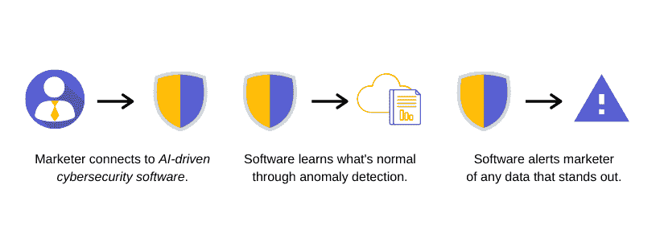
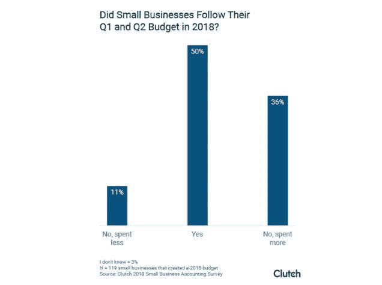
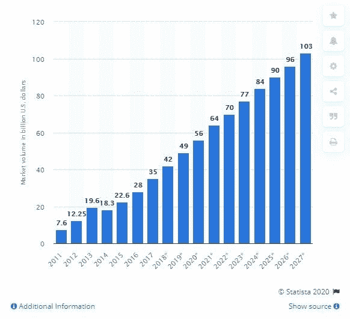
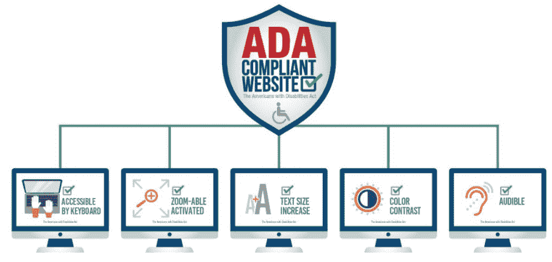
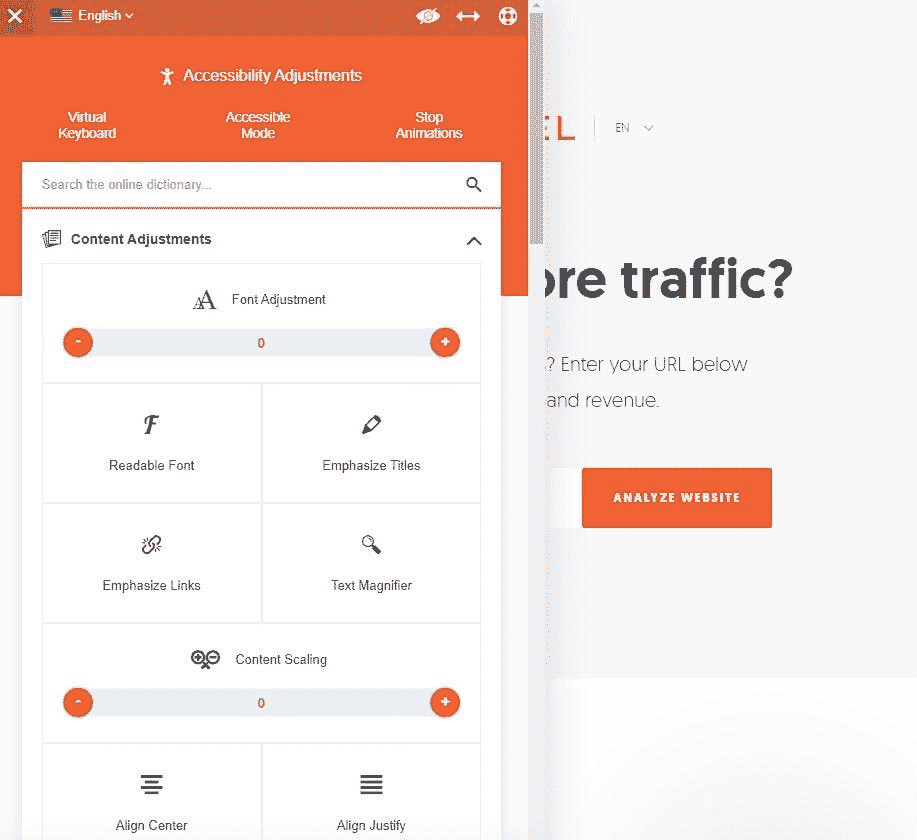
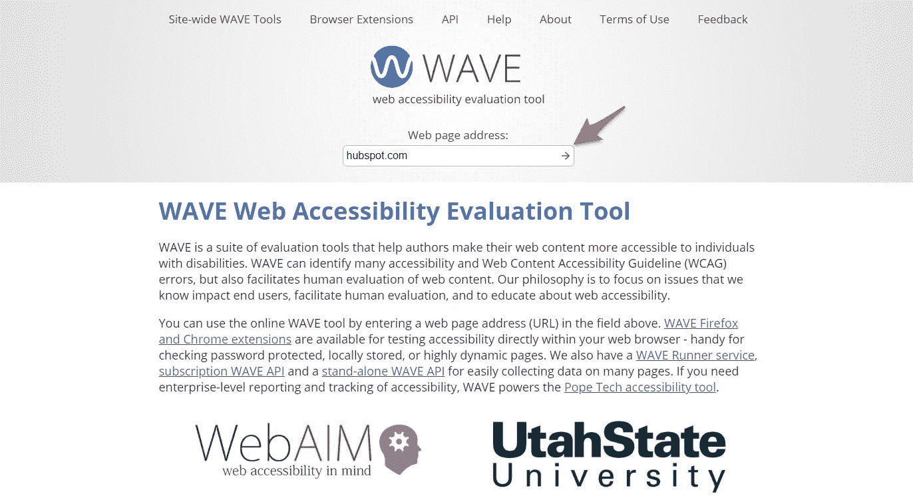
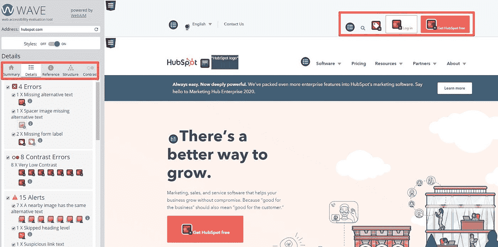
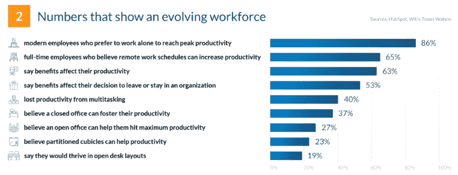

# 2020 年必读的营销安全趋势

> 原文：<https://medium.datadriveninvestor.com/must-read-marketing-security-trends-in-2020-4600faaa9268?source=collection_archive---------16----------------------->

我相信你听说过营销技术，或简称为 MarTech，但你的企业知道 [*营销安全*](https://morphio.ai/blog/blog/the-bulletproof-digital-agency-security-checklist) 吗？这是一种新的垂直变革，通过保护预算、集成、客户数据和其他敏感项目来改变现代业务。

因为，毕竟，你的网站和相关的财产是你最有价值的资产。事情也会从缝隙中溜走。你忘记了一些事情，匆忙地去解决它，然后不得不为客户想出一个为什么会发生的借口。

 [## 今年值得关注的 5 大人工智能趋势|数据驱动的投资者

### 预计 2019 年人工智能将取得广泛的重大进展。从谷歌搜索到处理复杂的工作，如…

www.datadriveninvestor.com](https://www.datadriveninvestor.com/2019/02/19/artificial-intelligence-trends-to-watch-this-year/) 

及时了解这七种营销安全趋势将防止这种情况发生，同时最大限度地提高营销绩效和财务。

看看这个。

# 1.人工智能驱动的网络安全

恶意软件、流氓用户和易受攻击的页面只是一些常见的网络安全问题。从一开始就防止这些问题的发生不是很好吗？此外，考虑到 [90%的首席运营官人承认](https://www.venafi.com/assets/pdf/wp/Venafi_2016CIO_SurveyReport.pdf)他们在不充分的网络安全上浪费了*数百万*。

这就是为什么人工智能支持的网络安全解决方案正在兴起。他们分析公司的属性和行为，以确定任何可疑的活动。然后可以解决这些问题，修补漏洞或防止真正的威胁升级。

最重要的是，这项技术还你*时间*。当软件可以自动处理问题时，不需要坐在显示器前等待解决问题。

# 2.通过异常检测优化财务

我们大多数人会做 A/B 分割测试和冗长的实验来优化像 PPC 活动这样的事情的预算。我们测试不同的受众、行动号召、复制，这样的例子不胜枚举。然而，时代在变。

[在 Q1 和 Q2，50%的小企业](https://smallbiztrends.com/2018/11/small-business-budget-statistics.html)遵循了 2018 年的预算，但高达 36%的企业超额完成了预算。听起来熟悉吗？你不必绞尽脑汁，召开会议，开始运行电子表格来解决这个问题。

营销安全解决方案能够通过*异常检测*找到[最有利可图的客户档案](https://morphio.ai/blog/blog/3-ways-to-use-segmentation-techniques-in-marketing-analytics)、创意和其他组件。

让我们想象一下，你正在运行几个谷歌广告活动。营销安全平台将发现异常([数据突出](https://morphio.ai/data-anomalies))，在这种情况下，这些异常将是转换高于预期的广告集或关键词。然后，您可以专注于这些，提高投资回报率，同时减少在表现不佳的活动上的支出。

我相信我们会看到更多的公司因为这个原因选择[财务自动化](https://morphio.ai/budget-protection)。当然，你可以卷起袖子几个小时地计算数字，但为什么不让计算机(它要快得多)替你做呢？

# 3.预防和修复人为错误(因为它们会发生)

意外时有发生。研究表明[公司中 25%的数据丢失是人为错误造成的](https://www.steadfast.net/blog/human-error-leading-cause-business-data-loss)。但是，没有理由为打翻的牛奶哭泣。

数字监控解决方案能够发现我们营销人员经常面临的所有小问题:不启动广告活动、忘记在社交网站上发布、预算计算错误等。这就像早上喝一杯浓缩咖啡一样——它让你保持敏锐，工作效率更高。

毕竟，这些都不是真正的问题。是他们在之后引发*的问题，比如拖延策略、错过期限、[和让客户失望](https://morphio.ai/blog/blog/how-to-onboard-new-agency-clients-quickly-and-easily)。*

这就是为什么在 2020 年，监控软件将被更多地用来了解一家公司的日常运营情况。什么是正常？什么不是？当营销人员犯了一个小错误时，这些数据被用来提醒他们改正错误并回到重要的工作中。

# 4.利用实时数据做出更好的决策

无论您是在确保营销活动的投资回报率，还是在研究客户行为，数据越新越好。因为一个小小的延迟会对决策和业务表现产生巨大的影响。

实时数据是解决这个问题的一种方法。

传统上，大多数公司依赖批量分析。[谷歌分析是一个很好的例子](https://morphio.ai/blog/blog/google-analytics-vs-hotjar-in-depth-comparison)。它们是很棒的工具，需要使用，但是营销人员完全依赖它们。

这可能会延迟客户报告、营销策略或利用有利可图的机会。

另一方面，实时数据可以让您实时了解您或客户的业务情况。这可以用来进行更快的优化，更快地清除 bug。

这也是大数据快速增长的原因之一；到 2027 年，市场规模预计将达到 1030 亿美元。

越来越多的公司意识到新数据及其正确应用的重要性。这就引出了我的下一点。

# 5.使用预测分析进行预测

你曾经担心过你生意的未来吗？你并不孤单。

大卫·史蒂文斯，德勤私人咨询公司的高级顾问，[评论了典型的创业公司的长寿问题，他说“创始人都是了不起的远见卓识者。他们可以看到自己产品或服务的未来，但他们经常在经营企业的现实中挣扎。他们对可能的艺术的关注可能会忽略世俗，他们可能没有意识到他们将面临的监管。”](https://www2.deloitte.com/ca/en/pages/deloitte-private/articles/top-three-challenges-early-stage-company.html)

关注短期和小的成功是很容易的——这是你需要的——但是有一个植根于具体的长期计划对成功是至关重要的。这就是*预测分析*进入我们的营销安全趋势列表的原因。

实时数据告诉你现在发生了什么。但是，预测分析让你看到未来。您可以预防安全事故，并提前开展宣传活动。

这种机器学习驱动的技术根据以前的数据分析您的公司，以创建关于客户终身价值、细分市场、风险建模等的准确预测。

例如，营销人员可以使用技术来防止客户流失，并分析客户何时会离开。是一个月后吗？观看演示后？[预测分析](https://morphio.ai/blog/blog/5-real-examples-of-predictive-analytics-in-marketing)将预测不满意的迹象、退出点，并创造改善客户体验的机会。

# 6.合规不会有任何进展

还记得 GDPR 合规的繁荣吗？似乎今天你不能访问一个网站而不被询问你是否接受你的 cookies 被收集。然而，那只是冰山一角。

公司需要意识到他们在 2020 年必须保持合规的其他方式，以提高网站的可用性，同时使互联网成为一个更好的地方。其中之一是 [ADA 兼容](https://newmedia.agency/making-your-website-ada-compliant/)。

《美国残疾人法案》制定于 1999 年，旨在帮助提高残疾人设施的可用性。例如，想想自动门和轮椅坡道。许多公司没有意识到他们的*网站*也需要合规。

幸运的是，ADA 和类似的机构没有让我们无所适从。他们提供了你可以采取的[步骤的完整列表，以变得顺从](https://www.w3.org/WAI/standards-guidelines/wcag/)。其中包括:

1.  屏幕键盘
2.  可增加的字体大小
3.  可缩放页面
4.  内容的音频版本
5.  替代文本
6.  对比色
7.  视线运动

世界顶级数字营销者之一的尼尔·帕特尔(Neil Patel)就是一个很好的例子。只需点击一个按钮，他的用户就可以调整字体大小、文本对齐、防止动画等等。

但是，您不需要投资开发这样的功能，因为您可以通过下面的步骤来检查网站的合规性。

# 测试您网站的合规性

使用免费的 [WAVE 网页可访问性工具](https://wave.webaim.org/)来确定你的网站的可访问性。

首先在搜索栏中输入你网站的 URL。

这将为您提供网站可访问性的深入分析，包括对比错误、缺少替代文本等。其中许多也是权宜之计。

单击“详细信息”选项卡，查看该工具所发现内容的完整明细。网站预览屏幕上也有视觉提示，直接向您显示可以改进的地方。

# 7.更加优化的工具堆栈

更多的工具，更多的问题。营销人员通常会针对不同的任务使用几种不同的解决方案。这意味着他们要支付更多的钱，改变平台，并花费额外的时间来管理这些工具。事实上， [40%的员工说他们因为一心多用而降低了工作效率。](https://financesonline.com/productivity-statistics/)

这就是为什么更多的公司需要选择一体化解决方案，或者至少通过使用更少的软件来削减开支。仔细看看你使用的所有工具。我肯定他们有很多重叠的地方。你能移除一个并在另一个中使用相似的功能吗？

例如，也许你正在使用像 HubSpot 这样的客户关系管理软件，但是投资了另一个电子邮件营销软件。从技术上来说，你可以通过将一切转移到 HubSpot 来让你的团队生活更轻松，因为它能够进行电子邮件活动、跟进以及你从电子邮件解决方案中获得的东西。

# 结论

营销安全是最新的垂直领域，它将永远改变我们的经营方式。它将营销人员的日常任务和问题自动化，同时帮助他们在未来取得成功。谁不想这样呢？

让您的公司安心平稳地运营和扩展是无价之宝。这就是为什么你应该今天就免费试用吗啡。我们的人工智能营销安全平台将定期扫描改进和问题，以保护您的营销堆栈。