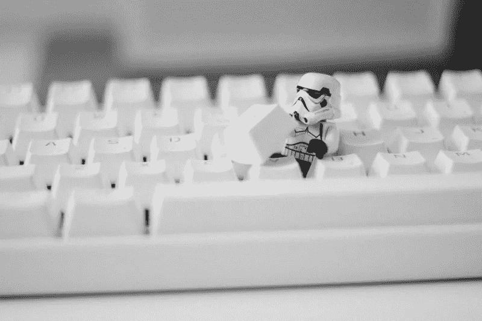

# MVC vs . MVP vs . MVVM:Android 应用开发选择哪种模式？

> 原文：<https://medium.datadriveninvestor.com/mvc-vs-mvp-vs-mvvm-which-pattern-to-choose-for-android-app-development-a26fd75bcb40?source=collection_archive---------8----------------------->

Android 是现代设备最受欢迎的操作系统之一。智能手机、平板电脑、电子书、游戏机、上网本、电视都在它的基础上工作。还有可穿戴设备，如基于 Android Wear 的手表、步数追踪器、健身手环和眼镜。然而，Android 移动应用程序开发是一项复杂而耗时的任务。这就是为什么公司首先选择构建模式来简化他们的工作。

[设计模式](https://www.androiddesignpatterns.com/)适用于解决最常见的问题，其主要目的是描述应用程序中对象的交互。模式不是完整的设计，不能直接转换成代码。这只是任务的辅助框架，可以显著简化 app 的创建。

当今大多数开发人员在从事大型项目时使用面向对象的编程方法，或者至少熟悉它的基本概念。如果不在代码中或者至少在设计中使用模式，从头开始严肃的工作是困难的，有时甚至是不可能的。在这方面，程序员需要从每个项目中为自己突出重点。从任何特定的任务中抽象出来，他们为未来的开发建立了一个移动应用程序框架。

 [## 2019 年移动应用开发之路|数据驱动的投资者

### 任何在移动应用程序开发行业工作的人，无论他们是专注于在伦敦开发 iOS 应用程序还是…

www.datadriveninvestor.com](https://www.datadriveninvestor.com/2019/01/15/the-path-of-mobile-app-development-in-2019/) 

让我们考虑一下 android 应用程序创建中最广泛使用的三种模式:MVC、MVP 和 MVVM。

# 模型-视图-控制器设计模式

模型-视图-控制器设计模式构成了第一个具有图形用户界面的编程环境——small talk-80 的架构解决方案的基础。MVC 最初是由 Trygve Reenskaug 在 1978 年描述的，他在施乐 PARC 实验室工作了一段时间。

模型-视图-控制器的架构允许您将数据模型、用户界面和控制逻辑分成三个独立的组件。此外，一个组件的变化不会影响其余组件的工作。使用这种架构对于大型[移动应用开发](https://swagsoft.com.sg/mobile-app-development/)项目的团队合作来说尤其方便。比如开发一个应用，可以把网站负责数据处理的部分分开开发，绝对不用担心这些数据会如何呈现。为什么？因为应用程序界面的布局和设计可以完全独立地创建。

至于程序员，也可以分享自己的作品。例如，一些开发人员可以专注于开发程序逻辑，而另一些则专注于设计数据库结构。当使用 MVC 时，就有可能分配团队的工作，从而提高整体性能。

# MVC 由以下实体组成:

**模型**通常被理解为数据管理的一个组件。在大多数情况下，这指的是与数据库的通信:选择特定的数据、添加新数据和更改现有数据。该模型不知道必须以什么形式向用户呈现它所请求的数据；它只对“原始”数据执行操作。它应该有一个标准化的通用接口，这样一个模型可以使用任何数量的其他子系统任何次数。

**视图**描述了输出给用户的数据格式，即从模型中提取的数据的可视化表示。它在输入端接收一组必须传输给用户的原始数据，并按照用户的要求对其进行格式化。

**控制器**管理/处理所有应用程序进程。它处理外部请求并满足这些请求中包含的需求。之后，对模型给出相关说明。然后，它将从模型接收的信息传输到视图的适当位置。这样做是为了正确地表示必要的信息。

# 模型-视图-演示者

MVP 是一个源自 MVC 的设计模板，主要用于构建用户界面。该模板最早出现在 IBM，然后在 20 世纪 90 年代用于 Taligent。与 MVC 不同，MVP 有一个稍微不同的方法。

MVP 方案同样由三个部分组成。演示者不需要遵守模型变化。现在主持人(持票人)给出了修改的想法。这种方法允许您创建一个表示抽象。您可以通过呈现视图界面来实现该模板。每个演示文稿都将有接口，这些接口具有特定的方法集和所需的承载属性。反过来，用该接口初始化的承载订阅性能的事件，并且如果必要的话，数据被抑制。

# 模型-视图-视图模型

MVVM 是一个模板，它的出现规避了 MVC 和 MVP 模式的限制，并集合了它们的一些优点。它在设计应用程序架构时使用。它最初是由 John Gossman 在 2005 年作为 MVP 模板的修改引入到社区中的。MVVM 专注于现代开发平台，有三个主要组成部分:

模型:就像在经典的 MVC 中一样，模型代表了运行应用程序所需的基本数据(类、结构)。

**视图**:图形界面，即窗口、按钮等。

一方面，ViewModel 是视图的抽象，另一方面，它提供了要链接的模型数据的包装。也就是说，它包含一个被转换成视图的模型，并且它还包含视图可以用来影响模型的命令。

# 一锤定音

模型-视图-控制器是在 web 开发中成功实现的经典模式。据说 MVP/MVVM 比 MVC 架构更好。但是首先，有少量的资料解释了移动应用程序开发中的 MVP 和 MVVM 架构。第二，没有实证和细致的分析来支持这个观点。因此，开发人员仍然怀疑从 MVC 转移到新的架构是否值得。因为这样的决策需要对整个方案进行重构，这需要从创建到测试的大量努力。此外，对于那些使用过 MVP 的人来说，减少 MVVM 编码可能很有吸引力。但是，这也会引发新的问题。

因此，特定模式的选择取决于开发人员，他们为每个特定的情况确定更合适的模板。

*原载于 2020 年 2 月 16 日*[*【https://hackernoon.com】*](https://hackernoon.com/mvc-vs-mvp-vs-mvvm-which-pattern-to-choose-for-android-application-development-8u493ay1)*。*