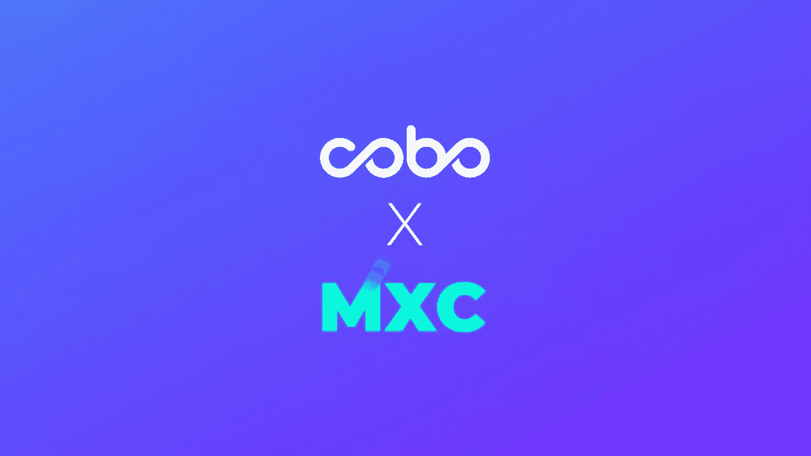
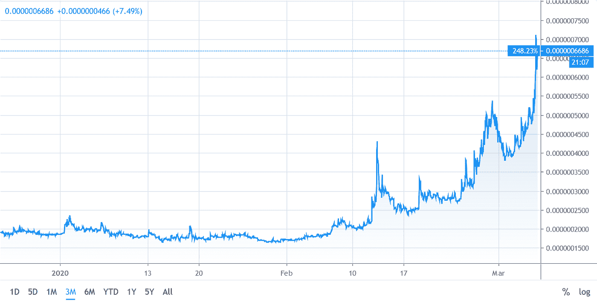
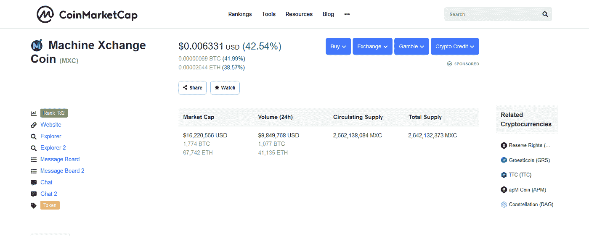

# MXC 与 COBO 签署监护协议:Token 股价飙升 245%后，新闻接踵而至

> 原文：<https://medium.datadriveninvestor.com/mxc-signs-deal-with-cobo-custody-news-arrives-following-meteoric-245-rise-for-token-904067d889c5?source=collection_archive---------12----------------------->



Source: [MXC](https://www.mxc.org/)

XC 基金会最近与一家量身定制的托管服务提供商 COBO 托管公司签署了一项渐进协议。这笔交易提高了 MXC 赌注登记功能的安全性。该平台的用户可以放心，由于这笔交易，他们的资产将更加安全。

# **什么是 COBO 抚养权？**

在他们的[网站](https://support.cobo.com/hc/en-us/articles/360014677033-What-is-Cobo-Custody-Why-Should-I-Use-Cobo-Custody-)上，COBO 拘留所声明他们:

> *“…提供针对机构优化的全面数字资产托管。我们定制的保管解决方案包括 24 小时客户支持、全面和可定制的风险管理政策，以及私钥的全球分发。Cobo 托管公司的客户包括交易所、代币基金、项目、数字资产管理平台等。*

同时:

> *“Cobo 托管利用银行级 HSM 硬件来管理客户私钥，确保它们在交易签名过程中不会被暴露，而我们的安全 API、地址白名单/黑名单和可定制的交易速度限制可防止可疑交易通过。”*

# **COBO 托管交易利用溢价证券**

与 COBO 托管公司签署协议有助于 MXC 实现其使命。自成立以来，该平台一直致力于通过区块链技术使数据更易于访问，从而为数据行业提供现实世界的解决方案。

为了增加数据的可访问性， [MXC 引入了 Staking](https://blog.mxc.org/mxc-staking-mechanism-explained/) 。该平台认为，跑马圈地将改变、分散和增加对数据行业的参与。与跑马圈地相关的好处也鼓励更多的人参与到数据行业中来。

[](https://www.datadriveninvestor.com/2019/03/10/swiss-based-etp-enters-the-crypto-trading-market/) [## 总部位于瑞士的 ETP 进入加密交易市场|数据驱动的投资者

### 虽然金融市场几乎没有沉闷的时刻，特别是在引入…

www.datadriveninvestor.com](https://www.datadriveninvestor.com/2019/03/10/swiss-based-etp-enters-the-crypto-trading-market/) 

它的最新交易将看到更多的人选择 MXC 赌注，因为增加了资产的安全性。

COBO 托管公司海外业务发展主管亚伦·克鲁斯对 MXC 的合作给予了积极评价，他说:

> “我们在 Cobo 的使命是让拥有和使用数字资产变得更容易，我们对安全性和可用性的关注与这一使命相关。我们有三条业务线——硬件钱包、移动钱包和托管服务。我们很高兴能够支持 MXC 基金会和社区。Cobo 拥有完整的数字资产生态系统，在安全的各个方面都有丰富的经验，包括为 F2Pool 和 OceanEx 等众多知名客户提供机构托管服务。”

# **赌注取得了巨大的成功**

根据目前的下注金额，MXC 已经看到了用户群非常积极的回应。由于回报前景看好，越来越多的人开始押注代币。赌注在超级节点中特别受欢迎，该集团目前在流通中下注总代币供应量的 8%!随着越来越多的超级节点选择入股，预计这一比例将上升至 10%左右。

赌注的增加是促使 MXC 与 COBO 监护权达成协议的部分因素。越来越多的资产通过私钥存储和保护，随着每一项新资产的增加，私钥的风险越来越大。此外，因为这些私钥是由 C 级管理人员持有的，所以它们总是有被黑客攻击的风险。

随着 COBO 的羁押，MXC 是安全的未来赌注。安全性的提高意味着更多的人现在可以下注，而不用担心任何黑客攻击。

另一个对这笔交易产生重大影响的因素是 MXC 平台用户数量的增加。

在 2019 年的大部分时间里，MXC 致力于提高他们在全球的影响力。他们的[智慧城市](https://blog.mxc.org/smart-cities-today-and-tomorrow/)倡议极大地帮助了 MXC 的知名度。现在，随着越来越多的人加入这个平台，尤其是来自韩国的人，这个举动被证明是值得的。

MXC 一直在该地区开展营销活动，因此韩国的注册人数高于平均水平。该平台还继续巩固其在中国等之前已建立的市场中的地位，在中国举办了 AMA，吸引了超过 11，000 名参与者。

一旦 MXC 与 COBO 监护公司合作的消息传开，MXC 预计会有更多的人加入这个平台。

# **$ 950 万美元回购= 200%+价格上涨**



Source: [TradingView](https://www.tradingview.com/symbols/MXCBTC/?exchange=HUOBI)

在过去的三个月里，MXC 的市值增长了超过 245%。价值大幅上升的因素之一是平台发起的回购计划。MXC 基金会致力于从市场上购买价值高达 950 万美元的 MXC。此举表明该平台相信其产品和服务，并愿意押注近 950 万美元来表明他们的信念。

上升轨迹的另一个关键因素是赌注。跑马圈地已经成为 MXC 生态系统不可或缺的一部分。这是他们最重要的服务之一。从 MXC[发布的推文](https://mobile.twitter.com/MXCfoundation/status/1154337453098094593)来看，自发布以来，赌注一直是该平台的主要焦点。随着对加密货币的需求增加，赌注的预期收益导致 MXC 的价值每天都在增加。

超级节点也对价值增值负责，因为他们中的大多数人选择赌上赢得的 MXC。这减少了 MXC 的流通量，使得潜在买家更难以更低的价格找到愿意出售的买家。

导致这一增长的另一个因素是该平台的潜力。MXC 完全有能力成为未来城市的领先技术之一。它的智慧城市计划是一项创新计划，已经引起了全球各个城市的关注。它可能是希望数字化和连接日常运营的城市的首选平台。

# **CoinMarketCap 最终给予 MXC 正确的认可**

随着业绩的改善，MXC 的统计数据最终被 Coinmarketcap 更新。最新的统计数据显示，MXC 进入了 Coinmarketcap 列出的前 200 种加密货币之列。MXC 精确的循环供给最终在平台上呈现，这导致了观察到的积极运动。



Source: [CoinMarketCap](https://coinmarketcap.com/currencies/machine-xchange-coin/)

最初的效果是 MXC 跻身[400 强](https://www.youtube.com/watch?v=zNSVAmgsbZg)；然而，加密货币的表现甚至更好，导致其排名前 200。MXC 的增长是该平台运营多年来巨大发展和卓越服务交付的累积效应。

随着它与 COBO 托管公司合作的最新进展，我们可能很快就会看到更多排名的提高。

赌注越来越受欢迎的原因之一是它能够帮助交易者增加他们的投资组合，而不需要投资太多。

赌注不那么复杂，因为你的资产为你工作。交易者根据下注的数量和下注的时间赚取他们资产的利息。这是赚取加密货币和增加投资组合最简单、最安全的方法之一。

通过携手 COBO 保管，MXC 正在履行他们的用户的愿望；有一个更安全，更可靠的打桩设备。这种伙伴关系将加强该平台已经发挥作用的功能。

更多关于 MXC 和 COBO 合作的信息，请点击此链接。

```
***Disclaimer:*** *Please only take this information as my* ***OWN*** *opinion and should not be regarded as financial advice in any situation. Please remember to* ***DYOR*** *before making any decisions.*
```

♂️你好，我叫萨尔。*如果你觉得这篇文章很有用，并想看我的其他作品，请务必鼓掌并关注我的* [*中型*](https://medium.com/@salmanmiah) *和* [*LinkedIn！*](https://linkedin.com/in/salman-miah-57aa90a0/) *😎*