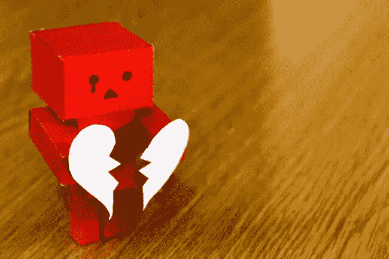

# 我和我的男朋友在理论上是完美的…但却是糟糕的一对

> 原文：<https://medium.datadriveninvestor.com/my-boyfriend-and-i-were-perfect-on-paper-but-a-terrible-match-49bc42ba7663?source=collection_archive---------2----------------------->

*这就是“只是朋友”真正有意义的时候*

早在一月份，我遇到了我的梦中情人。至少我是这么认为的。他英俊、善良、风趣，像我一样重视努力工作和节俭。六个月后，我们已经计划同居，领养一两只狗，并在一年内结婚。

*虽然在我们的朋友看来，我们就像是从霍尔马克电影中走出来的那对夫妇，但我们都淹没在自我施加的压力和怨恨中。*

从一开始，我就把他视为完美的人。我以为他希望我和他一样完美。我一点也不知道他一直都在想我。然后在今年夏末和秋天，我开始看到我们关系中真正的致命弱点。我们都是非常热情的人，在 covid 期间，我非正式地搬进去住了几个月，这暴露了我们都无法妥协。

然而，在我们相当糟糕的分手后不到一周，他成了我最好的朋友之一。这时，你的“差点先生”可能会变成你最好的朋友和犯罪伙伴:

**你们太像了，一直斗嘴**

事后看来，我和我前妻进展得太快了。我们当时并没有意识到这一点，因为我们很兴奋地找到了彼此。过去，我们都在努力寻找与我们有着共同核心价值观和未来愿景的合作伙伴。这种匮乏的心态让我们不惜一切代价来维持我们的关系。最终，我们如此兴奋地在彼此身上发现的相似之处最终注定了我们的关系。

我很感激我遇到了我认为是我的完美伴侣，但却有一段失败的感情。它告诉我，虽然共同的价值观是必须的，但谚语“异性相吸”还是有一定道理的。妥协是任何长期关系成功的关键。拥有双重人格使得这几乎不可能。

如果你们的关系充满了关于同样几个问题的争论，妥协很少，考虑追求友谊。和前任成为最好的朋友让我能够在没有太多冲突的情况下，从我们关系的蜜月阶段中汲取所有的乐趣和兴奋。

 [## 健身房 10 年的 10 条人生经验|数据驱动的投资者

### 走错一步，他们就会掉下去。两位登山者优雅地回到了地面。他们在那里…

www.datadriveninvestor.com](https://www.datadriveninvestor.com/2020/02/03/10-life-lessons-from-10-years-in-the-gym/) 

**你仍然尊重他们**

虽然我的关系以一种有点戏剧性的方式结束，但我们的友谊仍然有效，因为我们从未失去对彼此的尊重。

> 如果你发现自己想念前任，或者为了留住共同的朋友，觉得有必要继续做朋友，停下来考虑一下你对前任的总体看法。

如果你仍然对过去的轻视耿耿于怀，或者觉得有必要向任何愿意倾听的人说你前任伴侣的坏话，在这个阶段保持朋友关系不是一个成功的策略。虽然分手往往在一定程度上需要重新开始，但仅仅是想避免结交其他朋友的不便并不足以成为与你不尊重的人保持友谊的理由。

**你们从彼此身上学到了很多东西**

我坚信应该寻找并保持与那些挑战我变得更好的人的关系。碰巧我的前任也是这样的人。尽管我们的关系没有结果，但从我的生活中去掉一个能让我成为更好的人的人似乎很愚蠢。

除了前任的任何危险信号(例如，糟糕的待遇或失去尊重)，我强烈建议将它们保留在你的生活中，这样你们仍然可以一起成长，而没有浪漫关系中固有的压力。

**你想给他们最好的**

如果我对我的前任有任何恶意，和他的友谊根本就不会起作用。我们希望彼此都是最好的，并乐于看到彼此成功。因此，我们帮助彼此成功，而不觉得需要保持分数。奇怪的是，我们觉得现在比作为夫妻时更像是在一个团队里。

如果你仍然对前任心存怨恨，确定这件事你是否可以合理地忘掉。就我而言，在我们分手的时候，我因为一些更大的事情对我的前任感到不安。然而，我打电话让友谊向前发展，因为那些挥之不去的问题是可以讨论的，而不是突出的根本分歧或我被前伴侣严重虐待的情况。

**你觉得消除误会很舒服**

分手后挥之不去的摩擦是很自然的。如果你能有礼貌地和前任谈完，然后认为事情已经结束了，你们可能已经准备好成为朋友了。如果不是这样，我也不一定有一天会把友谊这个概念一笔勾销。但我会给它一些时间。

你谈到了和其他人约会

我和我的前任仍然很爱对方。虽然我们对今天的关系感到满意，但我们也知道，未来当新的浪漫伴侣加入竞争时，我们将不得不调整我们的关系。虽然我们对这种可能性没有一个可靠的计划，甚至不知道我们的友谊在几年后会是什么样子，但尽可能坦诚地进行对话是必须的。

## 访问专家视图— [订阅 DDI 英特尔](https://datadriveninvestor.com/ddi-intel)