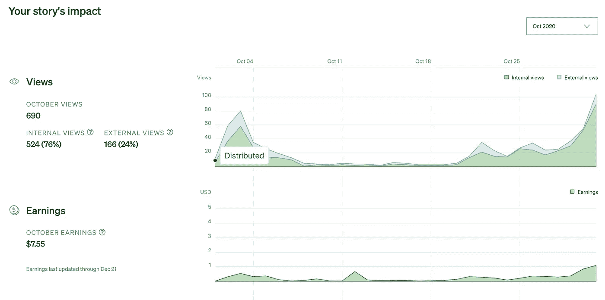
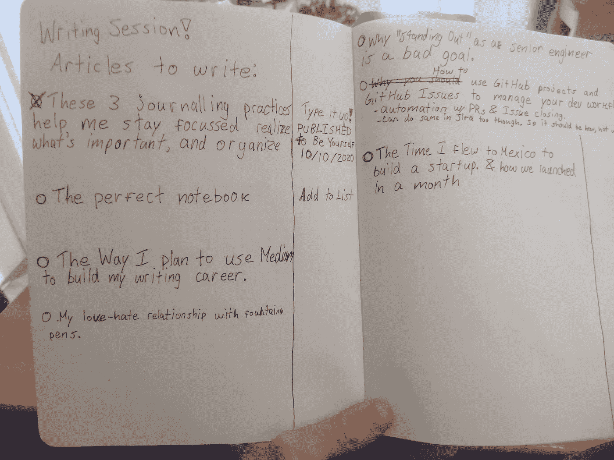
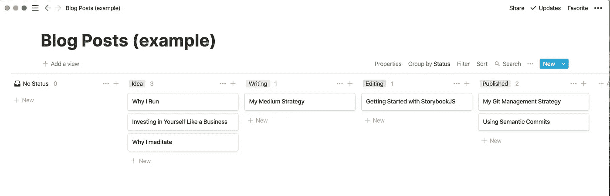
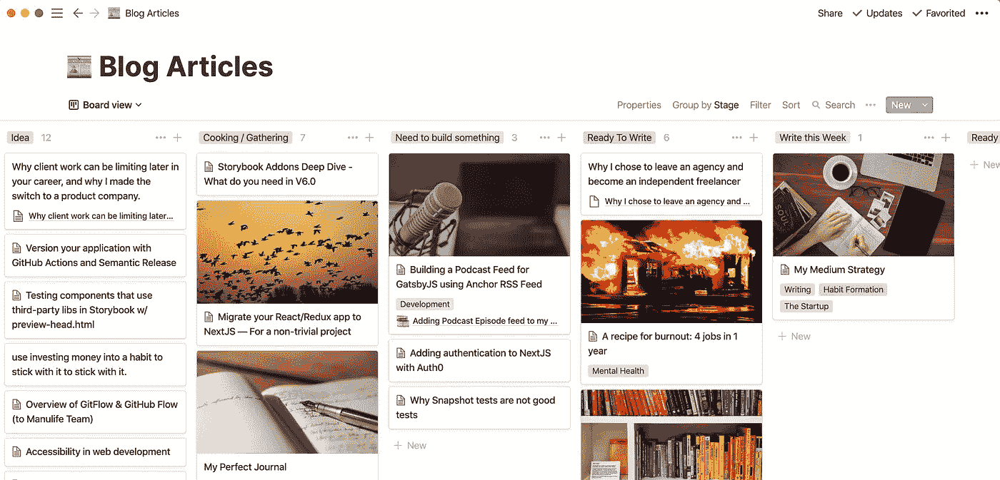

# 利用媒体使写作和出版游戏化

> 原文：<https://medium.datadriveninvestor.com/my-content-strategy-using-medium-to-gamify-writing-and-publishing-b59bfd92ddb8?source=collection_archive---------26----------------------->

## 我使用 Medium Partner 计划将发布内容游戏化，让它变得有趣。它帮助我保持了 3 个月的习惯，并在我做的时候赚钱。

Photo by [Green Chameleon](https://unsplash.com/@craftedbygc?utm_source=medium&utm_medium=referral) on [Unsplash](https://unsplash.com?utm_source=medium&utm_medium=referral)

从我记事起，我就喜欢写作。在公立学校，我经常在学校提供的日程表上给自己写诗或笔记。我已经坚持每天写日记 6 年了。把事情写下来一直是我思考和理解一个话题最简单的方式。但是，我从来不认为自己是作家。

在某些情况下，我甚至在日记中写下整篇文章。事实上，我读得最多的文章([用语义提交写得更好](https://medium.com/swlh/write-better-commits-with-semantic-commits-3316c68763f6))是直接从我 2018 年的笔记本的一页中抽出来的，经过润色，在短短几个小时内就发表了。幸运的是，我保留了所有的日记。

因此，虽然我可能从未认为自己是一名作家，但写作从来都不是我的问题。我的问题是我不会发表我的作品。我会集思广益，写下想法，详细阐述想法，甚至将一个主题分解成一篇完整的文章，但我永远不会对自己或我的想法有足够的信心来实际发表它们。我担心发表一些完全错误的，或不完整的，或纯粹愚蠢的东西。

基本上，我想说的是写作很难。也很吓人。有时还很尴尬。

写作需要很大的努力，这就是为什么尽可能多的使用小技巧来激励自己是有帮助的。

今天，我将谈论把**变成一个游戏。**具体来说，我将谈论 Medium 的合作伙伴计划是如何将写作游戏化并使整个体验更加有趣的完美方式。

游戏化可能被许多营销大师用来欺骗人们，让他们一天中更多的时间粘在他们的应用上。我不是这么用的。

通过**将写作与 Medium 的合作项目**游戏化，我的意思是我们可以将复杂、恐怖、困难的写作过程变成一个游戏。这样做，我们让它变得有趣！

制作好游戏的关键是:

*   衡量成败的某种方式(分)。
*   竞争与合作游戏。
*   帮助你更好地竞争的策略。
*   活动的内在个人利益。

# 为什么我开始出版我的作品

今年早些时候，在六月，我受到启发，开始发表我的一些想法。不是为了一些宏伟的愿景，而是出于自私的原因:我的女朋友已经开始在 Medium 上发布她的一些文章，有一天她自豪地向我展示了她的分析。她通过当天早些时候发表的一篇文章赚了钱。

> *“等等，在介质上写作也能赚钱？”*

我因嫉妒而被迫采取行动。

我决定(不严格地)承诺出版周刊。目标并不绝对重要，但它给了我一个选择和目标。这是用文字构建游戏的开始。

为了使事情更容易，我从一些我已经写好并在其他地方发表的文章开始，只是为了测试这些文章。我拿了一篇我写的关于我如何在我的大多数项目中使用 git 的文章，稍微润色了一下，然后重新发布到 Medium。

这不是什么病毒式的点击，但在最初的几天里确实有几十次浏览！

# 行业协会(或媒体出版物)的好处

第二周，我决定再次放松自己，慢慢适应。在此之前，我花了几天时间来写和重写这篇文章，最终没有成功地在 Dev TO 上重新发布。我把文章抄了一遍，花了一天时间在媒体编辑器里编辑它，发布，然后就收工了。

第二天，我收到了一份来自大型刊物“The Startup”的消息，要求我在他们的刊物上发表这篇文章。我立即接受了，它得到策划。在最初的几天里，有几十个人观看它，从那时起，我就知道它被吸引住了！

# 有时候，游戏包括研磨

看到我的数字波动的冲动让我继续出版。几天后，我写了我的第一篇非技术性文章，讲述了每天早上做朱莉娅·卡梅伦的晨练如何改变了我的生活。我自助发布到几乎零浏览量。

接下来的一周，我写了一篇类似的关于我的日常日志的文章，发表在一个更小的出版物上，得到了类似的结果。然后另一篇关于 [StorybookJS](https://medium.com/better-programming/how-and-why-to-add-a-storybook-js-design-system-to-your-existing-react-application-fece8afb0d00) 的编程文章也得到了相同的回应。

我一直在追求它，我经历了高潮和低谷，但这确实很困难。我在磨牙。

为了真正擅长任何游戏，你必须练习，但你也需要在真正的比赛中测试你的技能。就写作而言，这意味着不仅仅是写作(正如我多年来在日记中所做的那样)，而是发表你的作品并接受反馈(或者，在我的情况下，没有反馈)。

> 精通是一种心态:它要求你有能力看到自己的能力不是有限的，而是可以无限提高的。精通是一种痛苦:它需要努力、勇气和刻意的练习。掌握是渐近线:完全实现是不可能的，这使得它既令人沮丧又充满诱惑。"
> ― **丹尼尔·H·平克，** [**驱动力:关于什么能激励我们的惊人真相**](https://www.goodreads.com/work/quotes/6643001)

然而，在一个好的游戏中，磨砺会给玩家带来巨大的回报。尤其是当你制定一个更复杂的策略时，研磨可以派上用场。

# 意外回报的力量

每个游戏都有同样的问题:你如何激励玩家继续玩足够长的时间来投入到游戏中，并最终获得一些好东西？

随机提供意想不到的奖励。

老实说，在失望了几个月后，我开始变得没有动力了。磨砺有点累，失败很糟糕。

然后，神奇的事情不知从哪里发生了！我前面提到的写语义提交的博客文章又开始获得动力，并保持了一周，然后突然，当我认为它可能会逐渐减弱时，它突然又以指数形式上升，以结束这个月。

大约一个月后，我现在是一名自豪的职业作家，每月有一位数的固定收入😎

尽管玩笑归玩笑，虽然我不会完全放弃我的日常工作，但继续为我已经创造的一项资产获得报酬是令人难以置信的激励。虽然这是唯一一个能让我持续获得收入的项目，但这是我的目标。

所以，每隔一段时间奖励一次是有帮助的。

## 这也有助于在那些随机的时间间隔里有可变的奖励。

Medium 的合作伙伴计划恰好在这方面做得非常好，因为偶尔一篇文章会收到意想不到的流量高峰——来自任何地方:谷歌搜索、twitter、magic——Medium 似乎将此作为更频繁地推荐它的指标。

有时(但不总是)，这可能导致一连串的事件，从而导致更大的峰值——指数级的更大！

然后有时(但不总是)这种尖峰可以在长尾中继续，继续赚更长的时间。

当秒杀又持续了一个月，我又傻眼了。我最终从之前看似失败的尝试中赚了 100 美元。

这种一次性的随机奖励让我不断回到谈判桌前，用另一篇文章来掷骰子。

# 友好的竞争使它更有趣

通过与我的女朋友“竞争”,我更加坚持出版。我们经常互相跳跃——我们每个人都完成了不同的里程碑，然后另一个人试图保持下去。这很有趣，因为没有人想一个人玩！

# Medium 的合作伙伴计划让您保持得分

事实是，每天都有我写了 30 分钟的绿色复选框，或者每周发表的满足感是很棒的，但还缺少一些东西来使写作成为一个真正的游戏。

没错，分。

你知道最棒的是什么吗？

没错。美元。因为它们是你可以消费的积分。

随着你的工作越来越受欢迎，拥有一个股票和赚钱的能力是令人难以置信的激励。即使只有几分钱，看到自己的收入一天天增加，也是一种上瘾的感觉。真正有意思的是当你定期发帖时，因为当你开始发布更多内容时，你开始看到更多的吸引力，你的旧帖子变得越来越受欢迎。

我在 Medium 上看到了足够多的文章，将一个人每周写多少文章与一个月赚多少钱进行比较，好像增加数量是增长的唯一途径，但这只是游戏的一小部分。这就像根据你一天饲养的老鼠数量来衡量 MMO 的成功。真正的好处是从击败这些老鼠中获得足够的经验，你现在可以击败下一个地牢。

> 一个游戏的真正目标不是简单地磨砺它，而是享受逐渐变得越来越好的复合效应，并能够量化它。

随着我写得越来越多，我开始受到关注。

随着人们发现我的个人资料，我写的那篇语义提交文章变得越来越受欢迎。Medium 开始更多地推广我的内容，我开始赚真金白银。事实上，上个月我赚了 100 多美元。不是从新的文章，而是从我已经发表的文章，已经得到了一些牵引。

# 游戏化真的管用吗？

简而言之:是的。

长回答:看情况…

你看，游戏化有很多不同的会议。如果你看看现在几乎所有的消费应用程序，你会发现无数的游戏化尝试，从电子邮件、健身、饮食到冥想。大多数开发者都想让他们的应用游戏化，以增加人们的使用。

老实说，大多数游戏化都是扯淡。我真的不在乎我的待办事项应用程序记录了我一天中所有待办事项的“因果”分数。老实说，我宁愿几乎所有的应用程序都少收到通知。

除非这对我的生活有积极的影响。我最喜欢的例子是健身和健康应用程序。

MyFitnessPal 保持连续计数。它没有侵犯性，也没有过度的目标导向。如果你简单地登录，你就可以连续一天。一旦你到了那里，如果你记录了当天的食物，那就是你的奖励！

我最喜欢这个功能的一点是，它不需要我发送垃圾邮件通知。我天生是一个高度焦虑的人，所以我个人[屏蔽了我手机上的所有通知，以减少被 ping 的焦虑](https://www.notion.so/block-all-notifications-on-my-phone-to-reduce-the-anxiety-of-being-pinged-ef6e00249b9e480eb73c9d030d63a426)。除了我真正想要的通知，比如我的每日 Readwise 评论，我的日历事件，也许还有一些我添加的其他提醒。

在这种情况下，游戏化真的非常有效。我在 2014 年保持了超过 365 天登录 MyFitnessPal，结果[我把体脂降到了 5%，每天都觉得不可思议——直到我没有](https://www.notion.so/I-got-my-body-fat-down-to-5-and-felt-incredible-every-day-until-I-didn-t-087abd6d13fa4fdba48c1427821c10e2)(不过那是后话了)。我没有必要每天记录我的卡路里，但是有一次我记录了一个月左右，我发现自己每天都继续登录这个应用程序，以保持我的连胜。因此，我会在 50-60%的时间里保持这种状态(比其他情况下多得多)。

那么，游戏化真的管用吗？是啊，有时候。

# 创建游戏策略

每一个好的游戏都需要一个好的策略才能真正提高。无论是连续几天折磨低级老鼠，还是完成核心故事任务，还是建造地下城并最大化你的装备效率，关键是要有一个策略。这可以是简单的，也可以是复杂的，这有助于慢慢开始，并随着你的成长而适应。

当你想有竞争力时，你需要一个与之竞争的策略。就这么简单。

在介质上书写也是如此。每个人都有一个策略，无论是隐性的(想写就写)，还是显性的(下面我会给你看)。就我个人而言，我认为你应该花一些时间明确地定义你的战略(当然，不要花太多时间以至于你没有开始！).

## 保持简单——追踪我的想法

一旦涉及到钱，我就开始有灵感了(这很有趣，是吧？).我开始写下更多我认为我可以写的主题。

我开始把它们写在我每天写的日记里。这对于想出新的想法很有用，因为我总是把它放在手边，当一个想法出现时，我可以很快地把它扔进去！

Brainstorming and tracking article ideas worked very well in my notebook at the start

纸和笔的伟大之处在于它是自由的，短暂的。它让你自然更有创造力。重复你自己是没问题的，因为这并不重要。

我仍然定期用我的日记来进行头脑风暴，甚至在我每天写日记的过程中，我也经常会有新的想法。

然而，当我继续这段旅程时，我很快意识到我永远也不会完成任何给定的想法列表。在我坚持写了几个星期之后，我的清单已经增长到了好几页，最终甚至扩展到了多个笔记本上。我决定是时候组织起来，并开始建立一个系统，使写作更容易。

## 在一个简单的系统中跟踪它

今年早些时候，当我开始在一家新机构工作时，我开始使用 ideal，这家机构保存了他们所有的文档、项目规划、员工手册和标准操作程序。

我开始了我的第一个真正的数据库，并创建了一个看板视图！起初它只有三个栏目:想法、写作、编辑、提交、发表。大概是这样的:

My Notion Kanban board with Idea, Writing, Editing, Published made tracking many ideas easier

这是最好的看板。简单易行。目标是跟踪:做，进行中，完成。

当然，对于写作，你需要把写作和编辑分开。写作是一个生成的过程，在这个过程中你想简单地放下尽可能多的东西。编辑是一个完全独立的步骤，在这里你可以润色你的文字，去掉多余的内容，并充实真正重要的部分。之后，它应该准备好发布，并开始与人们分享。

我给你看这个的原因是为了清楚地表明，最理想的是一开始就保持简单。你爬，然后走，然后跑。没有人开始冲刺。

但是当然，一旦你能走或跑，你就不会再爬来爬去了。就是效率不高。

## 根据新信息调整我的策略

当我继续写的时候，我意识到还有很多我最初没有考虑到的步骤。因此，我在看板上添加了一些类别，甚至添加了一些漂亮的图片来激励我:

As my content pipeline started to become more complex, I started to add to the kanban board

我现在的阶段是:想法，烹饪/收集，需要建立一些东西，准备写作，本周写作，准备编辑，提交/排队，发表第一，我意识到有些想法只是想法，其他人准备接下来采取行动，但他们中的许多人需要更多的东西，无论是更多的研究，还是只是一些思考时间。我决定将这些归类为**烹饪/收集**——这意味着我正在收集最终食谱的配料。

因为我有时也写技术文章，我意识到我的几篇文章会被屏蔽，直到我有时间坐下来编码，所以我创建了**需要构建东西**类别。

我意识到的另一件事是媒体出版物是一个好的媒体策略的关键部分。我很早就收到了一些优秀出版物的邀请，比如《创业》,我已经看到了他们的读者对 T4 的巨大推动。因此，我为**提交/排队**添加了另一个步骤来跟踪事情，直到它们可以实际发布。

# 试试吧！

如果你正在读这篇文章，我敢打赌你会喜欢开始写更多。因此，尝试使用 Medium 的合作伙伴程序来游戏化它，并获得写作。从简单开始，不要过分审查自己。就写点东西，发表，看看效果如何。如果你想遵循我上面概述的一些过程，随着时间的推移开始添加一些东西。

如果你想看更多关于我写作过程的建议，请随时回复这篇文章！

要查看我的所有文章，请关注我😉

很期待看到你的一些内容！