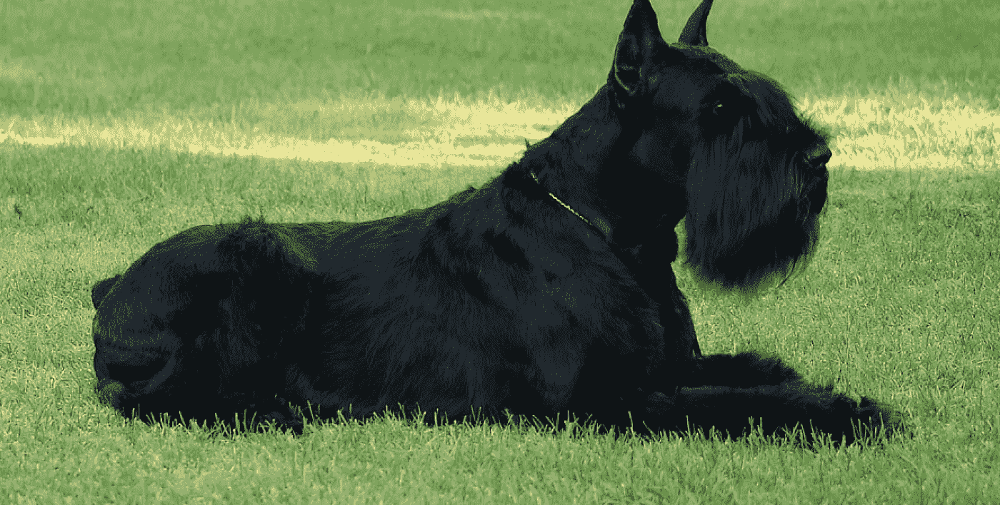

# 我的狗，我的“生活主人”

> 原文：<https://medium.datadriveninvestor.com/my-dog-my-life-master-3745aab4537b?source=collection_archive---------7----------------------->

我从他身上学到的 4 个重要价值观和 7 个重要行为

“My Dog” — photo by Author

# 我喜欢狗。

是的，从小时候开始，不知道为什么，我就开始关注这些物种了。

我很烦我爸妈，最后他们放弃了，给了我一个。这是一只美丽的德国牧羊犬，我非常喜欢。

> 从那以后，我就一直和狗接触，并对训练它们产生了兴趣。

那些训练有素的警犬总是吸引着我。令人惊讶的是，我能感受到“警察”和“警犬”之间的融洽和共鸣。

现在，我有一只巨大的雪纳瑞，一只我已经训练了很长时间的狗。

还记得早上 6 点起床训练他，晚上 10 点做第二节，下班回来。

我花了两年的时间才达到这个目标，因为我是个新手，而且我不得不说，一只巨大的雪纳瑞并不属于*“最容易的”*。

但是生活一定是一个挑战，这就是我决定去争取的。我不后悔。通过这次难忘的经历，我学到了很多东西。

# 我了解了狗，但更重要的是，我了解了生活。

现在，我要和你分享一个人可以从最好的人类朋友那里学到的所有要点，以及为什么它们在我实现的道路上是必不可少的。

## 1.耐心

如果训练一只狗时你需要的是耐心。这只狗永远不会着急。

这是我们这些愚蠢的人类的事情，他们每天都在看手表和手机。

> 时间的概念对狗来说完全不同。

如果你想得到结果，你必须训练你的耐心。如果你开始给自己和你的狗施加压力，那么什么都不会起作用。确保你会在下一个项目中结束:**挫折* *。

 [## 吃饭是为了活着，而不是活着为了吃饭|数据驱动的投资者

### 对于很多在社交上认识我的人来说，我是一个贪吃的人。在派对上，我是挑大牛排的人，双份…

www.datadriveninvestor.com](https://www.datadriveninvestor.com/2020/09/09/eat-to-live-not-live-to-eat/) 

## 2.挫折

这是你在训练过程中的任何时候都会发现的。事情不会如你所愿。

> 这里不存在正义，无论你奉献多少时间。

如果你做了错误的过程，结果将是一场彻底的灾难。这时候**挫折**敲响了你的门。

这是总会发生的事情，尤其是如果你是这个话题的新手。

**管理挫折是生活中的关键**克服所有那些结果与时间、动机、精力和所有那些你将要做出的积极努力不同的情况，寻找成功。

## 3.毅力

完善一个过程并使之有效的唯一方法是坚持不懈。重复，重复，再重复。而且，每当你完成它，重复一遍。

如果你想在训练中前进，当然，在你开始的任何项目中，毅力和 T2 的一致性是你需要的价值观。它们是大多数失败项目所遗漏的关键部分。因为很难做到。真的很难。

完成它的最好方法是练习和训练它。你练习得越多，你的大脑就越习惯。

## 4.非语言交流

如果有一点大家都同意的话，那就是狗不会说话。他们能听懂话(准确地说是声音)，但不会说话。这对人类来说是一个重要的障碍。

> 如果我们不能理解我们之间的谈话，我们不说话又怎么能理解“某人”呢？

这时候能量就出现了。这时你才明白它有多重要。

# 世界是能量，所以我们也是能量。

没有什么比这更关键的了:能量。正是它让这个星球得以继续旋转。它让我们进步。

狗会感觉到你的能量，并据此决定它们的行动。

你可以隐藏你的话。

你可以撒谎。

但是你不能逃避能量。

它总是在那里。狗会察觉到的。不耍花招。不作弊。没有陷阱。只有“赤裸裸的真相”。

以上是我从狗身上学到的四个主要价值观，但我会向前迈一步。

**我的狗不仅教会了我价值观**。他教了我一些其他的**行为**，这让我非常嫉妒。这些是我想成为 a 的行为。这些是我想在我遇到的每个人身上发现的行为。

我们去找他们吧！

## 1.例行公事

狗喜欢常规，因为世界本身就是常规。就这么简单:太阳总是在同一边升起，每天都在同一边落下。

> 生命的循环没有改变，不管它已经工作了多长时间。

你越坚持一个常规，你就越接近生命的自然循环。你会感觉越好。

狗喜欢在同一时间吃饭，在同一时间出去散步，在同一时间睡觉。

那不是无聊的生活。这是自然的生活。

## 2.永远快乐

狗总是很开心，心情很好。

只要满足它们的基本(非常基本)需求，你就会看到一只快乐的狗。

不管外面是冷是热。

不管是晴天还是阴天。

不管你喜欢的球队是赢是输。

对狗来说，生活总是充满阳光，它们的大部分日子都是有“+”标记的日子。

## 3.充满活力

狗总是精力充沛，随时准备做事情:

*   步行
*   运转
*   在找什么吗
*   (演奏等的)表现，风格；(乐曲)演奏
*   …

我就更进一步:正能量。

他们不生气，不悲伤，也不沮丧(你可以找到最小的例子)。

## 4.不知疲倦的支持者

他们会永远在你身边。你将永远感受到他们的支持。不管你做什么，你总是可以依靠他们。

如果你累了，你可以靠近他们，感受他们给你的能量。

如果你生气了，他们会让你平静下来。

如果你快乐，他们会和你分享快乐的感觉。

他们从不失败。

## 5.始终尊重(领导)

他们会永远尊重你。不尊重的态度不适合狗。这不是他们的风格。他们互相尊重。而你在他们的“信任圈”里。

> 我会说更多。他们从不对他们的领导(你)有不尊重的态度。

他们关注他们的领导对他们说了什么，他是如何移动的，他的能量是什么。只是为了配合他，帮助他，继续他的路。

## 6.他们不会评判

**狗永远不会评判你**。

他们不在乎你做得对还是错。

无论你成功还是失败。

如果你的行为是好是坏。

他们只是不评判任何人。他们没有偏见。他们不会寻找奇怪的想法，也不会认为你会欺骗他们。

这是一种简单但愉快的生活。

## 7.活在(并享受)当下

狗不后悔它的过去。他不担心他的未来。他只是在享受当下。因为生活是当下的。

> 有一次，温斯顿·丘吉尔说过这样的话:“我一生都在担心从未发生的问题”。

我们很多人就是这样度过一生的。对过去的错误感到愤怒，对不确定的未来感到不安全。

你可以(应该)利用你的过去，从中吸取教训。

你应该计划一下你的未来。但只有一点点，而且集中在伟大的线条上，因为我们的未来每天都更加不稳定。

但是，这是我们生活和享受现在所必须的。这是获得满足感的唯一途径。

我家狗狗现在(2020)快 10 岁了。

他已经走到了生命的尽头，但我希望我们仍然会在一起度过美好的时光。他必须在生活中教给我更多的东西，尽管我什么也没教给他。

# 这是一种不平衡的关系。

他是我最优秀的老师之一，这些知识深深地印在我的心里，我永远不会忘记。

我也永远不会忘记他。

我的狗，我的朋友，我的“生活主人”。

**访问专家视图—** [**订阅 DDI 英特尔**](https://datadriveninvestor.com/ddi-intel)