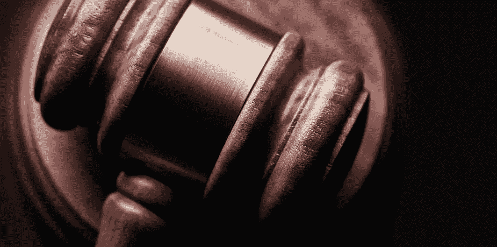

# 我在大陪审团的经历

> 原文：<https://medium.datadriveninvestor.com/my-experience-on-a-grand-jury-25ab12184a4a?source=collection_archive---------12----------------------->

## 生活课程

## "法庭应该以公正、良心和最好的证据为指导."——霍布豪斯勋爵，*摩西诉帕克案(1896)*

Photo by [Bill Oxford](https://unsplash.com/@bill_oxford?utm_source=unsplash&utm_medium=referral&utm_content=creditCopyText) on [Unsplash](https://unsplash.com/s/photos/courtroom?utm_source=unsplash&utm_medium=referral&utm_content=creditCopyText)

T2:当我们在电影中看到陪审团审判时，通常是“一个由同龄人组成的陪审团”为了一个特定的目的聚集在法庭上。通常会有一屋子的观众，他们对当下发生的事件的结果有既得利益。一些被传唤的人被要求出席。根据案件的重要性，这个房间可能会人口稀少或拥挤不堪。

这和大陪审团不一样。陪审团审判是一项公共活动，陪审团成员在整个审判过程中决定是否有罪。大陪审团是一群在 T4 宣誓就职的公民，任期六个月，目标完全不同。大陪审团的目的是决定是否有足够的证据起诉。也就是说，有足够的证据将一个人送上法庭。

FindLaw.com 是这样说的:

> 大陪审团帮助决定是否应该对嫌疑人提出指控，而审判陪审团则在刑事审判中做出裁决。换句话说，大陪审团在案件开始时宣布起诉书，而审判陪审团在最后决定有罪或无罪(不包括上诉过程)。
> 
> 大陪审团的诉讼程序是严格保密的，以鼓励证人畅所欲言，并在大陪审团决定不起诉的情况下保护嫌疑人。

在明尼苏达州，有两种类型的案件需要提交到大陪审团面前，谋杀案(1)和涉及知名人士的案件(2)。例如市长、地方检察官或市议员。后一件事的原因是声誉受到威胁。如果高知名度的人涉及到一个事件，这不是他或她的错，这应该在隐私处理。不像电影或《梅森探案集》中的审判，大陪审团的审议没有媒体，没有观众。大陪审团法庭只有一名法官、陪审团、法庭记录员和带来证据的律师，以及一个接一个的证人。

 [## 如何管理优秀的团队和你自己|数据驱动的投资者

### Janice Presser 博士是团队科学及其基础理论的先驱实践者。老生常谈就是说她…

www.datadriveninvestor.com](https://www.datadriveninvestor.com/2020/05/26/how-to-manage-great-teams-and-yourself/) 

在我为大陪审团服务的六个月里，我们只负责一个案子。该案涉及一名公众人物，他无意中对他人造成了身体伤害。

陪审团里有 23 个人。这不是一个 12 人陪审团。

决定是否起诉这位公众人物是我们的责任。如果我们决定这个人可能有罪，检察官的下一步将是提出指控，并准备案件进行审判，这是一个公共事件。

大陪审团的职责之一是永远不要分享在大陪审团办公室发生的事情或我们听到的和看到的。“永不”这个词的意思是永远。尽管我从头到尾做了大量的笔记，但我不会在这里透露细节，除了我们决定不起诉的过程。

代表受害者的律师首先出庭。这位律师向我们展示了所发生事件的后果。我们看到了医疗记录，听到了从受害者的角度对细节的陈述。没多久我们就得出结论，“高调者”做了坏事，有罪。

然后轮到辩方了。

事件发生在公共场所，有许多目击者。警方做了一项彻底的工作，从在场的每个人那里获取姓名和联系方式，我们听着每个人讲述他们所看到的情况。

我们头脑中已经形成的原始画面一点也不准确。故事远不止如此。在听到 15 到 20 名证人讲述他们的所见所闻后，陪审团必须做出决定。

有人被指派担任我们小组的首席发言人。当我们独自思考时，他给了我们一张小纸片，让我们在这些纸片上写下我们的结论。在他看来，我们都同意，如果我们已经达成一致意见，那么长时间的讨论是没有意义的。

我相信这个决定必须是一致的，在第一轮投票中，我们有 22 人“无罪”, 1 人持观望态度。

接着是一场讨论，现在回想起来，我觉得接下来发生的事情是错误的。我们必须做出决定，或者第二天再来解决问题。陪审团的一名成员对此颇有微词，认为我们第二天没有必要再来。事实上，没有人想再失去一天的工作。(如果我没记错的话，我们的服务报酬是每天 35 美元。)因此，心存疑虑的人被迫附和，因为不附和会给其他 22 个人带来不便。

正义得到伸张了吗？有人可能会说，拥有财富和权力的人逍遥法外，而另一个人却终身残疾，这是不公平的。然而，犯罪者也是环境的受害者。他并没有“逍遥法外”他不得不处理所发生事情的后果，并为此后悔终生。

这个故事还有更多的内容，但我们发过誓要保密，我不能分享任何可能提供线索的东西。

当我看到对 Breonna Taylor 判决的愤怒时，我想起了大陪审团的经历，在该判决中，大陪审团审判警官，以确定起诉谁和多少人。

我们不知道提交的所有证据。我所知道的是，各种各样的信息在 Twitter 和媒体上传播，可能没有一丝一毫的真实性。我不在那里，我不知道所有的事实是什么。我所相信的是，陪审员们自己意识到他们肩负着庄严的责任，并没有掉以轻心。

许多人并不总是对刑事司法系统有信心，这是有充分理由的。对媒体缺乏信心也有很多合理的理由。不言而喻，社交媒体可能更不可靠。我确信对这些陪审员来说这是他们做过的最艰难的决定。

或许引用奥斯卡·王尔德的话可以作为这一点的总结。"真理很少是纯粹的，也从来不简单。"

*最初发表于*[*【https://pioneerproductions.blogspot.com】*](https://pioneerproductions.blogspot.com/2020/09/my-experience-on-grand-jury.html)*。*

## 访问专家视图— [订阅 DDI 英特尔](https://datadriveninvestor.com/ddi-intel)