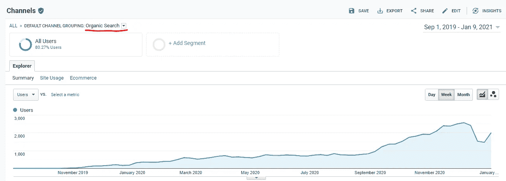
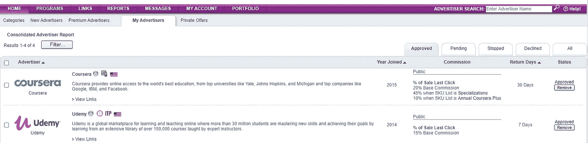
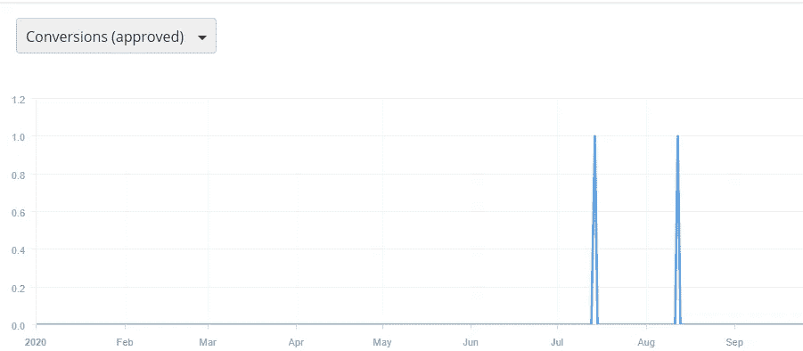

# 我的经验与附属链接

> 原文：<https://medium.datadriveninvestor.com/my-experience-with-affiliate-links-7af8eb411b50?source=collection_archive---------17----------------------->

## 我从使用我的数据科学博客上的附属链接中学到了什么

> 免责声明:这篇文章包含附属链接

 [## 用我的推荐链接加入媒体-乔治皮皮斯

### 阅读乔治·皮皮斯(以及媒体上成千上万的其他作家)的每一个故事。您的会员费直接支持…

jorgepit-14189.medium.com](https://jorgepit-14189.medium.com/membership) 

# 给点背景知识

2019 年 8 月，我发布了我的[数据科学博客预测黑客](https://predictivehacks.com/)。我还在媒体上分享了我作为数据科学博主的[之旅。这个博客是关于数据科学的，主要用 R 和 Python 提供了一些技巧和教程。一开始，我决定保持我的博客“干净”,没有任何广告。渐渐地，博客的流量开始持续增长。更具体地说，2020 年 1 月每周有机用户为 **350** ，2020 年 6 月为 **750** ，2020 年 9 月为 **1400** ，2020 年 12 月为 **2600。**因此，2020 年 12 月，10K 有**名有机用户。最后，在 Alexa 的排名中，这个博客排在第 100 万以下，这对一个新博客来说应该是好的。**](https://medium.com/swlh/my-journey-as-a-data-science-blogger-fed130885635)

Weekly Organic Users of Predictive Hacks

# 💲需要赚钱我的博客

由于博客的流量不可忽略，我开始想办法赚钱。我不想添加谷歌广告，经过一些研究，我决定尝试“附属链接”。因为这个博客是关于数据科学的，重点是 R 和 Python，所以我认为添加相关的附属链接是个好主意。于是，在**6 月**期间，我选择尝试 **Coursera** 、 **DataCamp** 、 **Udemy** 和 **Udacity** 的加盟链接

## 成为代销商的过程

每个公司都有自己的程序来接受你成为联盟营销人员，他们使用不同的平台。这些公司检查你的博客的背景，如果他们认为这是一个很好的适合他们的广告，他们接受你作为联盟营销商。就我而言，他们都接受了我。

# 会员链接、优惠和平台

Coursera 和 Udemy 与乐天**合作。我发现这个过程有点困难，但最终，我做到了🙂。**

我的广告客户可以显示如下，报价如下:

Coursera :持续时间 30 天

> 上次点击销售额的百分比
> 20%基本佣金
> 45%当 SKU 列表是专业化的
> 10%当 SKU 列表是年度 Coursera Plus

持续时间 7 天

> 销售的百分比最后点击
> 15%的基本佣金

Coursera 和 Udemy 附属链接的一些例子:

[**Coursera 附属链接**](https://click.linksynergy.com/fs-bin/click?id=ZHrx*LMoSUs&offerid=759505.563&subid=0&type=4)

[**Udemy 附属链接**](https://click.linksynergy.com/fs-bin/click?id=ZHrx*LMoSUs&offerid=507388.14529&subid=0&type=4)

**数据营**与 T **附属机构一起工作。**程序的工作原理如下:

推荐窗口 **45 天**，**年订阅的 30%**，**月订阅第一个月的 100%**。

[T22【数据营】附属链接 ](https://www.datacamp.com?tap_a=5644-dce66f&tap_s=974059-415f43&utm_medium=affiliate&utm_source=georgepipis)

最后， **Udacity** 配合**冲击工作。**程序的工作原理如下:

推荐窗口**基于最后一次点击的 30 天**，每份订单**250 美元**。

[**Udacity 关联链接**](https://imp.i115008.net/c/2371814/962102/11298)

 [## 一瞬间学会数据科学！？数据驱动的投资者

### 在我之前的职业生涯中，我是一名训练有素的古典钢琴家。还记得那些声称你可以…

www.datadriveninvestor.com](https://www.datadriveninvestor.com/2020/07/23/learn-data-science-in-a-flash/) 

# 我对附属链接/横幅的策略

在六月份，我开始在我的博客上提供会员横幅。我跳过了 Udacity，专注于 Coursera、Udemy 和 DataCamp。我在顶部和侧面有一个横幅。还有，我在旋转横幅。

以下是**数据营**6-9 月的**点击**和**转换**:

不幸的是，我不能分享 Coursera 和 Udemy 的相同报告，因为它们记录了过去 30 天的情况。

# 我的代销商链接/横幅广告结果

从六月底到九月底，我保持了大约 3 个月的会员链接。除了一些点击，我没有任何销售。**于是我 3 个月赚了 0 美元**！！！甚至，来自 DataCamp 的两次转换最终都没有为节目买单。我感到失望，我决定摆脱从属链接，因为预期的回报非常低。我相信这主要是因为我的大多数观众已经注册了这些网站，所以没有机会通过我的附属链接注册这些节目。

# 附属链接与谷歌广告

因为我在联盟链接上失败了，所以我决定尝试谷歌广告。由于新冠肺炎的情况，我花了大约几个月的时间让谷歌审查并接受我的博客。在谷歌，我每个月赚大约 40-50 美元，比从联盟链接赚 0 美元要好得多。我仍然有附属链接，也许我会在未来尝试它们，尽管我认为这不太可能。

**访问专家视图—** [**订阅 DDI 英特尔**](https://datadriveninvestor.com/ddi-intel)